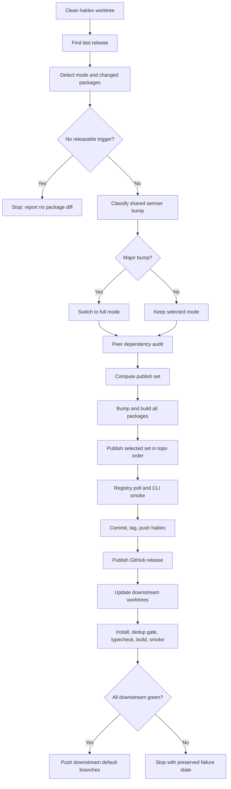

# Release Orchestrator

End-to-end release procedure for the shared-version `@haklex/*` package family. This skill supersedes `.claude/commands/release.md`.

## Operating Contract

| Rule                | Requirement                                                                                                                                                      |
| ------------------- | ---------------------------------------------------------------------------------------------------------------------------------------------------------------- |
| Autonomy            | Infer release metadata from repository state. Do not ask for package lists, semver level, downstream branch, or confirmation unless a stop condition is reached. |
| Versioning          | All `@haklex/*` packages share one version, read from `packages/rich-editor/package.json`.                                                                       |
| Default mode        | Use `incremental` unless invocation text contains `full`, `全量`, or standalone `all`, or unless semver classification reaches `major`.                          |
| Publish set         | In `incremental`, publish the tri-directional closure of changed packages, not merely `CHANGED_PKGS`.                                                            |
| Peer safety         | Treat duplicate runtime copies of `lexical`, React, `lucide-react`, `shiki`, and `@lexical/*` as release-blocking defects.                                       |
| Downstream          | Update downstream default branches directly after validation. Do not open PRs unless direct push is blocked and the user confirms the fallback.                  |
| Destructive actions | Do not discard, reset, restore, force-remove, or silently overwrite user-owned changes. Preserve state and ask before destructive recovery.                      |

## Required Reading Order

Read the relevant reference files before acting. If performing a full release, read all of them.

| Stage                                                                               | Reference                                                                                |
| ----------------------------------------------------------------------------------- | ---------------------------------------------------------------------------------------- |
| Repository and downstream layout                                                    | [references/repo-layout.md](references/repo-layout.md)                                   |
| Release mode, change detection, semver, peer audit                                  | [references/release-analysis.md](references/release-analysis.md)                         |
| Publish-set closure, build, publish, registry polling, CLI smoke                    | [references/publish-pipeline.md](references/publish-pipeline.md)                         |
| GitHub release, downstream propagation, third-party pin reconciliation, smoke tests | [references/downstream-propagation.md](references/downstream-propagation.md)             |
| Stop conditions, safe recovery, common mistakes, real-world anchors                 | [references/failure-recovery-and-anchors.md](references/failure-recovery-and-anchors.md) |

## Execution Flow

## Helper Scripts

Scripts are advisory automation for repeatable checks. They do not replace judgment, and they do not edit files destructively.

| Script                                                                           | Purpose                                                                                                                                       |
| -------------------------------------------------------------------------------- | --------------------------------------------------------------------------------------------------------------------------------------------- |
| [scripts/release-context.sh](scripts/release-context.sh)                         | Derive `LAST`, local version, source changes, peer-drift triggers, catch-up triggers, and `CHANGED_PKGS`.                                     |
| [scripts/peer-audit.sh](scripts/peer-audit.sh)                                   | Detect always-peer libraries under `dependencies`, internal `@haklex/*` peer pins using `workspace:*`, and divergent third-party peer floors. |
| [scripts/publish-set.sh](scripts/publish-set.sh)                                 | Compute `PUBLISH_SET` for `full` or tri-directional `incremental` mode.                                                                       |
| [scripts/registry-peer-floors.sh](scripts/registry-peer-floors.sh)               | Aggregate non-`@haklex/*` peer floors from published registry manifests.                                                                      |
| [scripts/downstream-dispatch.sh](scripts/downstream-dispatch.sh)                 | Emit downstream manifest rewrite rows for `@haklex/*` pins and third-party peer-floor reconciliation.                                         |
| [scripts/duplicate-runtime-invariant.sh](scripts/duplicate-runtime-invariant.sh) | Assert a single resolved version for runtime-anchored libraries in a downstream worktree.                                                     |

## Phase Index

| Phase | Action                                                            | Primary Reference                                                             |
| ----- | ----------------------------------------------------------------- | ----------------------------------------------------------------------------- |
| 0.5   | Detect `incremental` vs `full` mode                               | [release-analysis.md](references/release-analysis.md)                         |
| 1     | Pre-flight and releasable trigger detection                       | [release-analysis.md](references/release-analysis.md)                         |
| 2     | Shared semver classification                                      | [release-analysis.md](references/release-analysis.md)                         |
| 3     | Peer dependency audit                                             | [release-analysis.md](references/release-analysis.md)                         |
| 4     | Build, publish-set closure, topological publish, registry polling | [publish-pipeline.md](references/publish-pipeline.md)                         |
| 4.5   | `@haklex/rich-litexml-cli` binary smoke                           | [publish-pipeline.md](references/publish-pipeline.md)                         |
| 5     | Commit, tag, and push haklex release commit                       | [publish-pipeline.md](references/publish-pipeline.md)                         |
| 5.5   | Publish GitHub release                                            | [downstream-propagation.md](references/downstream-propagation.md)             |
| 6     | Downstream worktrees, pin rewrites, peer-floor reconciliation     | [downstream-propagation.md](references/downstream-propagation.md)             |
| 7     | Downstream smoke tests and duplicate-runtime invariant            | [downstream-propagation.md](references/downstream-propagation.md)             |
| 8     | Failure handling or direct downstream push                        | [failure-recovery-and-anchors.md](references/failure-recovery-and-anchors.md) |
| 9     | Final summary                                                     | [failure-recovery-and-anchors.md](references/failure-recovery-and-anchors.md) |

## Non-Negotiable Checks

| Check                  | Command / Script                                                                              |
| ---------------------- | --------------------------------------------------------------------------------------------- |
| Last release SHA       | `git log --grep='^release: v' -n1 --format=%H`                                                |
| Context detection      | `./.claude/skills/release-orchestrator/scripts/release-context.sh`                            |
| Peer audit             | `./.claude/skills/release-orchestrator/scripts/peer-audit.sh "$LAST"`                         |
| Publish set            | `./.claude/skills/release-orchestrator/scripts/publish-set.sh "$MODE" "$LAST" $CHANGED_PKGS`  |
| Bump                   | `pnpm bumpp -r <patch\|minor\|major> --no-git --no-tag`                                       |
| Build                  | `pnpm run build:packages`                                                                     |
| Publish one package    | `pnpm --filter @haklex/<pkg> publish --no-git-checks`                                         |
| Registry poll          | `until npm view @haklex/<pkg>@$NEW_VERSION version; do sleep 5; done`                         |
| CLI smoke              | `npx --yes -p @haklex/rich-litexml-cli@$CLI_VER litexml '
x
' --format json --compact`   |
| GitHub release         | `gh release create "v$NEW_VERSION" --title "v$NEW_VERSION" --notes-file "$NOTE" --verify-tag` |
| Duplicate-runtime gate | `./.claude/skills/release-orchestrator/scripts/duplicate-runtime-invariant.sh`                |

## Stop Conditions

- Haklex worktree is dirty before release mutation.
- `MODE=incremental` but `CHANGED_PKGS` is empty.
- No `src/**` change, no non-`@haklex/*` peer-range advance, and no registry catch-up trigger.
- `gh` is missing or unauthenticated before Phase 5.5.
- Any package remains unavailable from npm after the registry-poll window.
- Phase 3 detects internal `@haklex/*` `peerDependencies` using `workspace:*`.
- Phase 3 detects divergent third-party peer floors across sibling packages.
- Downstream default branch cannot be derived from `origin/HEAD`.
- Downstream rebase conflicts or direct push is rejected.
- Duplicate-runtime invariant reports more than one resolved version for any runtime-anchored library.
- Any recovery path would discard, overwrite, reset, restore, or force-delete user-owned changes.
