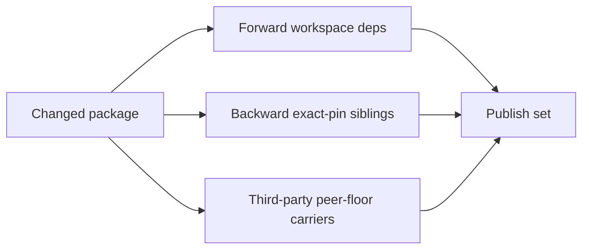

# Publish Pipeline

## Phase 4: Build and Publish

Do not use `pnpm run release:rich`. That script combines bump, build, and publish, but this skill requires ordered publish with registry polling.

Bump and build always run over the whole workspace:

```bash
pnpm bumpp -r < patch | minor | major > --no-git --no-tag
pnpm run build:packages
```

The publish step is mode-dependent:

| Mode          | `PUBLISH_SET`                                                |
| ------------- | ------------------------------------------------------------ |
| `full`        | Every `@haklex/*` package except `@haklex/rich-editor-demo`. |
| `incremental` | Tri-directional closure of `CHANGED_PKGS`.                   |

Use [../scripts/publish-set.sh](../scripts/publish-set.sh) to compute the set.

## Tri-Directional Closure



| Direction              | Rule                                                                                                                                      | Failure prevented                                                           |
| ---------------------- | ----------------------------------------------------------------------------------------------------------------------------------------- | --------------------------------------------------------------------------- |
| Forward                | Include any `@haklex/*` referenced under `dependencies`, `peerDependencies`, or `optionalDependencies` with any `workspace:` prefix.      | Published tarball points at an unpublished dependency version.              |
| Backward               | Include any sibling that exact-pins an in-set package via `workspace:*` in `dependencies`, `optionalDependencies`, or `peerDependencies`. | Stale sibling tarball forces an old duplicate copy downstream.              |
| Third-party peer drift | Include every sibling that peers a drifted non-`@haklex/*` library at a stricter or different old floor.                                  | Downstream installs two versions of runtime-anchored third-party libraries. |

Forward follows any `workspace:` prefix. Backward fires only on `workspace:*`, because `workspace:^` publishes as a caret range and tolerates minor/patch sibling bumps.

## Incremental Reality Check

Many packages still use `dependencies: workspace:*`. A renderer or extension change can pull in `rich-compose`, which can then pull in most of the workspace. This convergence toward `full` is expected and is safer than publishing a broken install graph.

## Topological Publish

Compute workspace order with:

```bash
pnpm -r ls --depth -1 --json
```

Publish only packages in `PUBLISH_SET`, but keep leaf-first order:

```bash
for pkg in $PUBLISH_SET_TOPO; do
  pnpm --filter "$pkg" publish --no-git-checks
  until npm view "$pkg@$NEW_VERSION" version > /dev/null 2>&1; do
    sleep 5
  done
done
```

Do not proceed to downstream updates until every published package is resolvable from npm.

## Phase 4.5: CLI Binary Smoke

Run only when `@haklex/rich-litexml-cli` or `@haklex/rich-compose` is in `PUBLISH_SET`.

```bash
if grep -qxF '@haklex/rich-litexml-cli' <<< "$PUBLISH_SET"; then
  CLI_VER="$NEW_VERSION"
else
  CLI_VER=$(npm view @haklex/rich-litexml-cli version)
fi

npx --yes -p "@haklex/rich-litexml-cli@$CLI_VER" \
  litexml '<p>release smoke</p>' --format json --compact \
  | jq -e '.root.children[0].type == "paragraph"' > /dev/null
```

If neither package is published, print:

```text
CLI smoke skipped (neither rich-litexml-cli nor rich-compose in PUBLISH_SET)
```

## Phase 5: Commit, Tag, Push Haklex

Stage only bumped package manifests and lockfile:

```bash
git add packages/*/package.json pnpm-lock.yaml
git commit -m "release: v$NEW_VERSION"
git tag "v$NEW_VERSION"
git push
git push origin "v$NEW_VERSION"
```

If unrelated edits exist, stop and ask. Do not stage broad changes.

`bumpp` must use `--no-tag` so the final tag points at the release commit, not at the pre-publish state.
