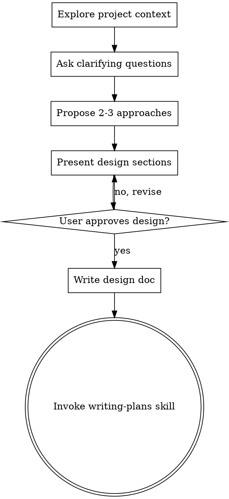

<!-- Generated by SpecStory, Markdown v2.1.0 -->

# 2026-03-07 13:07:01Z

<!-- Claude Code Session 9829ef37-3206-45e0-9a91-e74863201c38 (2026-03-07 13:07:01Z) -->

_**User (2026-03-07 13:07:01Z)**_

codex 写的方案，你评价下：# Haklex rich-editor 瘦身重构方案 v1

## 摘要

目标是把 @haklex/rich-editor 从“生态总入口 + 默认实现集合”收敛为“稳定核心 + 可组合预设”，在不破坏现有默认使用方式的前提下，降低包体职责
密度、减少根入口耦合、为后续按 feature 拆分留出清晰边界。

默认策略：

- 保留 RichEditor 的开箱即用体验
- 先做包内分层，再决定是否物理拆包
- 先收口 API 和装配方式，不优先追求一次性迁移全部代码

## 关键改动

### 1. 重新定义 rich-editor 的层次

将 rich-editor 内部明确拆成三层：

- Core
  - 保留 RichEditor 壳层、provider、registry、基础样式入口、基础类型、基础 Lexical builtin nodes
  - 保留与“单一 schema”直接相关的基础节点注册能力
- Features
  - 每个 feature 独立声明自己的 nodes、editNodes、plugins、commands、render helpers
  - 第一批 feature：image、katex、mermaid、linkcard、codeblock、mention、alert-banner、grid
- Presets
  - 提供 defaultPreset 作为当前默认行为
  - 提供 minimalPreset 作为轻量组合示例
  - RichEditor 默认使用 defaultPreset，业务仍可传入扩展配置

落地要求：

- config.ts / config-edit.ts 不再手写聚合所有 custom nodes
- RichEditor.tsx 不再直接硬编码完整插件列表
- 所有默认节点和插件组合通过 preset 统一生成

### 2. 新增稳定装配接口

新增两个内部稳定抽象，并作为未来扩展边界：

- EditorFeature
  - 包含 nodes?、editNodes?、plugins?、commands?、styles?
  - 纯声明式，不直接依赖某个页面或业务状态
- EditorPreset
  - 包含 features 列表和少量 preset 级配置
  - 负责把多个 feature 合并为 RichEditor 可消费的结果

RichEditorProps 变更：

- 新增 preset?: EditorPreset
- 保留 extraNodes、rendererConfig、children
- 不新增更多 feature 布尔开关
- 未传 preset 时默认使用 defaultPreset

默认合并顺序：

- preset 提供的 nodes / plugins
- extraNodes
- 用户传入的 children 仍作为额外挂载点存在，不参与 preset 声明式合并

### 3. 收口根入口导出，改为子路径导出

根入口 @haklex/rich-editor 只保留高频且稳定的 API：

- RichEditor
- RichEditorProps
- RendererConfig
- 常用 provider / hooks
- 默认 preset 相关入口
- 少数高频 commands / helpers

新增子路径导出，承接生态内部依赖：

- @haklex/rich-editor/features/\*
- @haklex/rich-editor/presets
- @haklex/rich-editor/nodes
- @haklex/rich-editor/contexts
- @haklex/rich-editor/utils
- @haklex/rich-editor/editor 保留，作为编辑器专用聚合入口
- @haklex/rich-editor/static 保留，作为静态渲染依赖入口

迁移要求：

- 仓库内其他包不再优先从根入口拿 feature 级能力
- rich-renderer-_、rich-ext-_、rich-plugin-\* 逐步改为子路径依赖
- 根入口保留一轮兼容导出，但标记为待迁移；v1 不立即删除旧导出

### 4. 第一批从 core 松绑的能力

以下内容在 v1 只做“feature 化”，不强制单独发包：

- image feature
  - 吸收 ImageNode、ImagePlugin、ImageUploadPlugin、上传 command、thumbhash 相关辅助导出
  - defaultImageUpload 迁到 feature 内部导出
- linkcard / link-favicon feature
  - LinkFaviconPlugin 与 LinkFavicon 从 core 概念上移出，归为链接增强能力
- grid feature
  - 保留 schema 一致性，但把 edit decorator / edit command / edit-only UI 全部 feature 化
- comment-anchor feature-support
  - BlockIdPlugin 与 comment-anchor 不再视为 editor 核心能力
  - 迁到独立子路径，供评论/协作场景按需接入

不在 v1 动的内容：

- 不拆 Footnote、ColorScheme、RendererConfigProvider
- 不改 rich-headless 的 schema 语义
- 不引入更多 workspace 包名，先做包内目录与导出层重构

## 实施顺序

### 阶段 1：建立新装配骨架

- 新增 features/、presets/ 目录与基础类型
- 提供 feature 合并器，负责去重合并 nodes / plugins / styles
- 让 defaultPreset 完整复刻当前 RichEditor 默认行为

### 阶段 2：让 RichEditor 改为 preset 驱动

- 结果必须与当前默认编辑器表现等价

### 阶段 3：迁移最重的 feature

- 先迁 image、grid、linkcard/link-favicon、comment-anchor
- 再迁 katex、mermaid、mention、codeblock
- 每迁一个 feature，都同步改根入口和子路径导出

### 阶段 4：收口内部依赖

- 仓库内所有 @haklex/rich-editor 根入口的 feature 级导入，改为新子路径
- rich-renderers / rich-renderers-edit 仅依赖 contract 与 renderer type，不依赖根入口大聚合
- 文档更新为“core + preset + feature”模型

## 测试计划

必须覆盖以下场景：

- RichEditor 不传 preset 时，节点、插件、快捷键、上传、渲染行为与当前一致
- 传入 minimalPreset 时，仅加载最小节点与插件集合，编辑器可正常启动
- preset + extraNodes 能正确合并，且不重复注册节点
- rendererConfig 仍可覆盖默认 renderer
- image、katex、mermaid、linkcard、grid 的默认插入与编辑路径不回退
- rich-static-renderer、rich-renderers、rich-renderers-edit、rich-kit-shiro 能完成类型检查
- 旧根入口导出仍可工作；新增子路径导出可被内部包替换使用

建议验证顺序：

- 先跑 rich-editor 自身类型检查/构建
- 再跑受影响最大的聚合包：rich-renderers、rich-renderers-edit、rich-kit-shiro
- 最后在 demo 中验证默认编辑体验

## 假设与默认决策

- 默认不新增 workspace 包；先做包内架构重组
- 默认保留根入口兼容导出一个阶段，不在本次直接删 API
- 默认 RichEditor 继续保持开箱即用，不要求业务显式拼装 feature
- 默认“单一 schema”优先级高于“极限拆包”；节点定义允许继续集中，但编辑增强必须模块化
- 默认以“降低边界耦合”为第一目标，以“减少最终 bundle 体积”为第二目标

---

_**Agent (claude-opus-4-6 2026-03-07 13:07:06Z)**_

<think><details><summary>Thought Process</summary>
The user wants me to evaluate a refactoring proposal for the @haklex/rich-editor package written by Codex. Let me first read the current codebase to understand the existing architecture, then provide my assessment.

Let me look at the key files mentioned in the proposal to understand the current state.

</details></think>

_**Agent (claude-opus-4-6 2026-03-07 13:07:06Z)**_

<tool-use data-tool-type="unknown" data-tool-name="ToolSearch"><details>

<summary>Tool use: **ToolSearch**</summary>

**Input:**

- max_results: `3`
- query: `select:Read,Glob,Grep`

**Result:**

```

```

</details></tool-use>

_**Agent (claude-opus-4-6 2026-03-07 13:07:09Z)**_

<think><details><summary>Thought Process</summary>
Let me first understand the current architecture by reading the key files mentioned in the proposal.

</details></think>

_**Agent (claude-opus-4-6 2026-03-07 13:07:09Z)**_

先看现有架构，再评判方案。

_**Agent (claude-opus-4-6 2026-03-07 13:07:11Z)**_

<tool-use data-tool-type="read" data-tool-name="Read"><details>

<summary>Tool use: **Read**</summary>
 `./packages/rich-editor/src/config.ts`

```text
     1→import { CodeNode } from '@lexical/code'
     2→import { HorizontalRuleNode } from '@lexical/extension'
     3→import { AutoLinkNode, LinkNode } from '@lexical/link'
     4→import { ListItemNode, ListNode } from '@lexical/list'
     5→import { HeadingNode, QuoteNode } from '@lexical/rich-text'
     6→import { TableCellNode, TableNode, TableRowNode } from '@lexical/table'
     7→import type { Klass, LexicalNode } from 'lexical'
     8→
     9→import { AlertQuoteNode } from './nodes/AlertQuoteNode'
    10→import { BannerNode } from './nodes/BannerNode'
    11→import { CodeBlockNode } from './nodes/CodeBlockNode'
    12→import { DetailsNode } from './nodes/DetailsNode'
    13→import { FootnoteNode } from './nodes/FootnoteNode'
    14→import { FootnoteSectionNode } from './nodes/FootnoteSectionNode'
    15→import { GridContainerNode } from './nodes/GridContainerNode'
    16→import { ImageNode } from './nodes/ImageNode'
    17→import { KaTeXBlockNode } from './nodes/KaTeXBlockNode'
    18→import { KaTeXInlineNode } from './nodes/KaTeXInlineNode'
    19→import { LinkCardNode } from './nodes/LinkCardNode'
    20→import { MentionNode } from './nodes/MentionNode'
    21→import { MermaidNode } from './nodes/MermaidNode'
    22→import { RubyNode } from './nodes/RubyNode'
    23→import { SpoilerNode } from './nodes/SpoilerNode'
    24→import { VideoNode } from './nodes/VideoNode'
    25→
    26→export const builtinNodes: Array<Klass<LexicalNode>> = [
    27→  HeadingNode,
    28→  QuoteNode,
    29→  ListNode,
    30→  ListItemNode,
    31→  LinkNode,
    32→  AutoLinkNode,
    33→  HorizontalRuleNode,
    34→  TableNode,
    35→  TableCellNode,
    36→  TableRowNode,
    37→  CodeNode,
    38→]
    39→
    40→export const customNodes: Array<Klass<LexicalNode>> = [
    41→  SpoilerNode,
    42→  MentionNode,
    43→  KaTeXInlineNode,
    44→  KaTeXBlockNode,
    45→  ImageNode,
    46→  AlertQuoteNode,
    47→  CodeBlockNode,
    48→  FootnoteNode,
    49→  FootnoteSectionNode,
    50→  VideoNode,
    51→  LinkCardNode,
    52→  DetailsNode,
    53→  GridContainerNode,
    54→  BannerNode,
    55→  MermaidNode,
    56→  RubyNode,
    57→]
    58→
    59→export const allNodes: Array<Klass<LexicalNode>> = [
    60→  ...builtinNodes,
    61→  ...customNodes,
    62→]
    63→
```

</details></tool-use>

_**Agent (claude-opus-4-6 2026-03-07 13:07:11Z)**_

<tool-use data-tool-type="read" data-tool-name="Read"><details>

<summary>Tool use: **Read**</summary>
 `./packages/rich-editor/src/config-edit.ts`

```text
     1→import type { Klass, LexicalNode } from 'lexical'
     2→
     3→import { builtinNodes } from './config'
     4→import { AlertQuoteEditNode } from './nodes/AlertQuoteEditNode'
     5→import { BannerEditNode } from './nodes/BannerEditNode'
     6→import { CodeBlockEditNode } from './nodes/CodeBlockEditNode'
     7→import { DetailsNode } from './nodes/DetailsNode'
     8→import { FootnoteNode } from './nodes/FootnoteNode'
     9→import { FootnoteSectionEditNode } from './nodes/FootnoteSectionEditNode'
    10→import { GridEditNode } from './nodes/GridEditNode'
    11→import { ImageNode } from './nodes/ImageNode'
    12→import { KaTeXBlockNode } from './nodes/KaTeXBlockNode'
    13→import { KaTeXInlineNode } from './nodes/KaTeXInlineNode'
    14→import { LinkCardNode } from './nodes/LinkCardNode'
    15→import { MentionNode } from './nodes/MentionNode'
    16→import { MermaidNode } from './nodes/MermaidNode'
    17→import { RubyNode } from './nodes/RubyNode'
    18→import { SpoilerNode } from './nodes/SpoilerNode'
    19→import { VideoNode } from './nodes/VideoNode'
    20→
    21→export const customEditNodes: Array<Klass<LexicalNode>> = [
    22→  SpoilerNode,
    23→  MentionNode,
    24→  KaTeXInlineNode,
    25→  KaTeXBlockNode,
    26→  ImageNode,
    27→  AlertQuoteEditNode,
    28→  CodeBlockEditNode,
    29→  FootnoteNode,
    30→  FootnoteSectionEditNode,
    31→  VideoNode,
    32→  LinkCardNode,
    33→  DetailsNode,
    34→  GridEditNode,
    35→  BannerEditNode,
    36→  MermaidNode,
    37→  RubyNode,
    38→]
    39→
    40→export const allEditNodes: Array<Klass<LexicalNode>> = [
    41→  ...builtinNodes,
    42→  ...customEditNodes,
    43→]
    44→
```

</details></tool-use>

_**Agent (claude-opus-4-6 2026-03-07 13:07:12Z)**_

<tool-use data-tool-type="search" data-tool-name="Glob"><details>

<summary>Tool use: **Glob**</summary>
 pattern `packages/rich-editor/src/**/*.ts`

```text
<HOME>/git/repos/haklex/packages/rich-editor/src/types/lucide-icons.d.ts
<HOME>/git/repos/haklex/packages/rich-editor/src/types/renderer-config.ts
<HOME>/git/repos/haklex/packages/rich-editor/src/types/slash-menu.ts
<HOME>/git/repos/haklex/packages/rich-editor/src/editor.ts
<HOME>/git/repos/haklex/packages/rich-editor/src/nodes/GridEditNode.ts
<HOME>/git/repos/haklex/packages/rich-editor/src/nodes/KaTeXInlineNode.ts
<HOME>/git/repos/haklex/packages/rich-editor/src/nodes/RubyNode.ts
<HOME>/git/repos/haklex/packages/rich-editor/src/nodes/BannerEditNode.ts
<HOME>/git/repos/haklex/packages/rich-editor/src/nodes/SpoilerNode.ts
<HOME>/git/repos/haklex/packages/rich-editor/src/nodes/FootnoteNode.ts
<HOME>/git/repos/haklex/packages/rich-editor/src/nodes/VideoNode.ts
<HOME>/git/repos/haklex/packages/rich-editor/src/nodes/AlertQuoteEditNode.ts
<HOME>/git/repos/haklex/packages/rich-editor/src/nodes/BannerNode.ts
<HOME>/git/repos/haklex/packages/rich-editor/src/nodes/shared.ts
<HOME>/git/repos/haklex/packages/rich-editor/src/nodes/FootnoteSectionNode.ts
<HOME>/git/repos/haklex/packages/rich-editor/src/nodes/ImageNode.ts
<HOME>/git/repos/haklex/packages/rich-editor/src/nodes/MentionNode.ts
<HOME>/git/repos/haklex/packages/rich-editor/src/nodes/KaTeXBlockNode.ts
<HOME>/git/repos/haklex/packages/rich-editor/src/nodes/CodeBlockNode.ts
<HOME>/git/repos/haklex/packages/rich-editor/src/nodes/FootnoteSectionEditNode.ts
<HOME>/git/repos/haklex/packages/rich-editor/src/nodes/CodeBlockEditNode.ts
<HOME>/git/repos/haklex/packages/rich-editor/src/nodes/GridContainerNode.ts
<HOME>/git/repos/haklex/packages/rich-editor/src/nodes/LinkCardNode.ts
<HOME>/git/repos/haklex/packages/rich-editor/src/nodes/AlertQuoteNode.ts
<HOME>/git/repos/haklex/packages/rich-editor/src/nodes/MermaidNode.ts
<HOME>/git/repos/haklex/packages/rich-editor/src/plugins/image-upload-command.ts
<HOME>/git/repos/haklex/packages/rich-editor/src/config-edit.ts
<HOME>/git/repos/haklex/packages/rich-editor/src/utils/extractTextContent.ts
<HOME>/git/repos/haklex/packages/rich-editor/src/utils/lucide-dom.ts
<HOME>/git/repos/haklex/packages/rich-editor/src/utils/thumbhash.ts
<HOME>/git/repos/haklex/packages/rich-editor/src/utils/collect-command-items.ts
<HOME>/git/repos/haklex/packages/rich-editor/src/utils/favicon.ts
<HOME>/git/repos/haklex/packages/rich-editor/src/utils/codeBlockSelectionIntent.ts
<HOME>/git/repos/haklex/packages/rich-editor/src/utils/shiki.ts
<HOME>/git/repos/haklex/packages/rich-editor/src/utils/comment-anchor.ts
<HOME>/git/repos/haklex/packages/rich-editor/src/types.ts
<HOME>/git/repos/haklex/packages/rich-editor/src/styles/theme.ts
<HOME>/git/repos/haklex/packages/rich-editor/src/components/utils.ts
<HOME>/git/repos/haklex/packages/rich-editor/src/transformers/horizontal-rule.ts
<HOME>/git/repos/haklex/packages/rich-editor/src/transformers/alert.ts
<HOME>/git/repos/haklex/packages/rich-editor/src/transformers/mention.ts
<HOME>/git/repos/haklex/packages/rich-editor/src/transformers/superscript-subscript.ts
<HOME>/git/repos/haklex/packages/rich-editor/src/transformers/insert.ts
<HOME>/git/repos/haklex/packages/rich-editor/src/transformers/container.ts
<HOME>/git/repos/haklex/packages/rich-editor/src/transformers/ruby.ts
<HOME>/git/repos/haklex/packages/rich-editor/src/transformers/code-block.ts
<HOME>/git/repos/haklex/packages/rich-editor/src/transformers/quote.ts
<HOME>/git/repos/haklex/packages/rich-editor/src/transformers/spoiler.ts
<HOME>/git/repos/haklex/packages/rich-editor/src/transformers/index.ts
<HOME>/git/repos/haklex/packages/rich-editor/src/transformers/rich-blocks.ts
<HOME>/git/repos/haklex/packages/rich-editor/src/transformers/katex.ts
<HOME>/git/repos/haklex/packages/rich-editor/src/transformers/grid-container.ts
<HOME>/git/repos/haklex/packages/rich-editor/src/transformers/footnote.ts
<HOME>/git/repos/haklex/packages/rich-editor/src/index.ts
<HOME>/git/repos/haklex/packages/rich-editor/src/node-registry.ts
<HOME>/git/repos/haklex/packages/rich-editor/src/config.ts
<HOME>/git/repos/haklex/packages/rich-editor/src/components/ContentEditable.css.ts
<HOME>/git/repos/haklex/packages/rich-editor/src/components/decorators/nested-doc-dialog.css.ts
<HOME>/git/repos/haklex/packages/rich-editor/src/plugins/image-upload.css.ts
<HOME>/git/repos/haklex/packages/rich-editor/src/static-entry.ts
<HOME>/git/repos/haklex/packages/rich-editor/src/styles-entry.ts
<HOME>/git/repos/haklex/packages/rich-editor/src/styles/grid.css.ts
<HOME>/git/repos/haklex/packages/rich-editor/src/styles/index.ts
<HOME>/git/repos/haklex/packages/rich-editor/src/styles/katex.css.ts
<HOME>/git/repos/haklex/packages/rich-editor/src/styles/comment.css.ts
<HOME>/git/repos/haklex/packages/rich-editor/src/styles/note.css.ts
<HOME>/git/repos/haklex/packages/rich-editor/src/styles/shared.css.ts
<HOME>/git/repos/haklex/packages/rich-editor/src/styles/article.css.ts
<HOME>/git/repos/haklex/packages/rich-editor/src/nodes/DetailsNode.ts
<HOME>/git/repos/haklex/packages/rich-editor/src/styles/details.css.ts
```

</details></tool-use>

_**Agent (claude-opus-4-6 2026-03-07 13:07:12Z)**_

<tool-use data-tool-type="search" data-tool-name="Glob"><details>

<summary>Tool use: **Glob**</summary>
 pattern `packages/rich-editor/src/**/*.tsx`

```text
<HOME>/git/repos/haklex/packages/rich-editor/src/context/FootnoteDefinitionsContext.tsx
<HOME>/git/repos/haklex/packages/rich-editor/src/context/ImageUploadContext.tsx
<HOME>/git/repos/haklex/packages/rich-editor/src/context/ColorSchemeContext.tsx
<HOME>/git/repos/haklex/packages/rich-editor/src/context/RendererConfigContext.tsx
<HOME>/git/repos/haklex/packages/rich-editor/src/context/NestedContentRendererContext.tsx
<HOME>/git/repos/haklex/packages/rich-editor/src/plugins/HorizontalRulePlugin.tsx
<HOME>/git/repos/haklex/packages/rich-editor/src/plugins/BlockExitPlugin.tsx
<HOME>/git/repos/haklex/packages/rich-editor/src/plugins/MarkdownShortcutsPlugin.tsx
<HOME>/git/repos/haklex/packages/rich-editor/src/plugins/SubmitShortcutPlugin.tsx
<HOME>/git/repos/haklex/packages/rich-editor/src/plugins/FootnotePlugin.tsx
<HOME>/git/repos/haklex/packages/rich-editor/src/plugins/EditorRefPlugin.tsx
<HOME>/git/repos/haklex/packages/rich-editor/src/plugins/AutoFocusPlugin.tsx
<HOME>/git/repos/haklex/packages/rich-editor/src/plugins/OnChangePlugin.tsx
<HOME>/git/repos/haklex/packages/rich-editor/src/plugins/MarkdownPastePlugin.tsx
<HOME>/git/repos/haklex/packages/rich-editor/src/plugins/ImageUploadPlugin.tsx
<HOME>/git/repos/haklex/packages/rich-editor/src/plugins/BlockIdPlugin.tsx
<HOME>/git/repos/haklex/packages/rich-editor/src/plugins/LinkFaviconPlugin.tsx
<HOME>/git/repos/haklex/packages/rich-editor/src/plugins/ImagePlugin.tsx
<HOME>/git/repos/haklex/packages/rich-editor/src/plugins/AutoLinkPlugin.tsx
<HOME>/git/repos/haklex/packages/rich-editor/src/plugins/AlertPlugin.tsx
<HOME>/git/repos/haklex/packages/rich-editor/src/plugins/KaTeXPlugin.tsx
<HOME>/git/repos/haklex/packages/rich-editor/src/plugins/MermaidPlugin.tsx
<HOME>/git/repos/haklex/packages/rich-editor/src/components/renderers/FootnoteRenderer.tsx
<HOME>/git/repos/haklex/packages/rich-editor/src/components/renderers/FootnoteSectionEditRenderer.tsx
<HOME>/git/repos/haklex/packages/rich-editor/src/components/renderers/CodeBlockRenderer.tsx
<HOME>/git/repos/haklex/packages/rich-editor/src/components/renderers/ImageRenderer.tsx
<HOME>/git/repos/haklex/packages/rich-editor/src/components/renderers/MermaidRenderer.tsx
<HOME>/git/repos/haklex/packages/rich-editor/src/components/renderers/FootnoteStaticRenderer.tsx
<HOME>/git/repos/haklex/packages/rich-editor/src/components/renderers/LinkCardRenderer.tsx
<HOME>/git/repos/haklex/packages/rich-editor/src/components/renderers/GridStaticDecorator.tsx
<HOME>/git/repos/haklex/packages/rich-editor/src/components/renderers/FootnoteSectionRenderer.tsx
<HOME>/git/repos/haklex/packages/rich-editor/src/components/renderers/RubyRenderer.tsx
<HOME>/git/repos/haklex/packages/rich-editor/src/components/renderers/BannerRenderer.tsx
<HOME>/git/repos/haklex/packages/rich-editor/src/components/renderers/MentionRenderer.tsx
<HOME>/git/repos/haklex/packages/rich-editor/src/components/renderers/VideoRenderer.tsx
<HOME>/git/repos/haklex/packages/rich-editor/src/components/renderers/KaTeXRenderer.tsx
<HOME>/git/repos/haklex/packages/rich-editor/src/components/renderers/AlertStaticDecorator.tsx
<HOME>/git/repos/haklex/packages/rich-editor/src/components/renderers/BannerStaticDecorator.tsx
<HOME>/git/repos/haklex/packages/rich-editor/src/components/renderers/AlertRenderer.tsx
<HOME>/git/repos/haklex/packages/rich-editor/src/components/RendererWrapper.tsx
<HOME>/git/repos/haklex/packages/rich-editor/src/components/decorators/GridEditDecorator.tsx
<HOME>/git/repos/haklex/packages/rich-editor/src/components/decorators/BannerEditDecorator.tsx
<HOME>/git/repos/haklex/packages/rich-editor/src/components/decorators/AlertEditDecorator.tsx
<HOME>/git/repos/haklex/packages/rich-editor/src/components/RichEditor.tsx
<HOME>/git/repos/haklex/packages/rich-editor/src/components/ContentEditable.tsx
<HOME>/git/repos/haklex/packages/rich-editor/src/components/LinkFavicon.tsx
<HOME>/git/repos/haklex/packages/rich-editor/src/components/decorators/CodeBlockEditDecorator.tsx
```

</details></tool-use>

_**Agent (claude-opus-4-6 2026-03-07 13:07:15Z)**_

<tool-use data-tool-type="read" data-tool-name="Read"><details>

<summary>Tool use: **Read**</summary>
 `./packages/rich-editor/src/components/RichEditor.tsx`

```text
     1→import { PortalThemeProvider } from '@haklex/rich-style-token'
     2→import { CheckListPlugin } from '@lexical/react/LexicalCheckListPlugin'
     3→import { LexicalComposer } from '@lexical/react/LexicalComposer'
     4→import { LexicalErrorBoundary } from '@lexical/react/LexicalErrorBoundary'
     5→import { HistoryPlugin } from '@lexical/react/LexicalHistoryPlugin'
     6→import { LinkPlugin } from '@lexical/react/LexicalLinkPlugin'
     7→import { ListPlugin } from '@lexical/react/LexicalListPlugin'
     8→import { RichTextPlugin } from '@lexical/react/LexicalRichTextPlugin'
     9→import { TabIndentationPlugin } from '@lexical/react/LexicalTabIndentationPlugin'
    10→import { TablePlugin } from '@lexical/react/LexicalTablePlugin'
    11→
    12→import { allEditNodes } from '../config-edit'
    13→import { ColorSchemeProvider } from '../context/ColorSchemeContext'
    14→import { ImageUploadProvider } from '../context/ImageUploadContext'
    15→import { RendererConfigProvider } from '../context/RendererConfigContext'
    16→import { setResolvedEditNodes } from '../node-registry'
    17→import { AlertPlugin } from '../plugins/AlertPlugin'
    18→import { AutoFocusPlugin } from '../plugins/AutoFocusPlugin'
    19→import { AutoLinkPlugin } from '../plugins/AutoLinkPlugin'
    20→import { BlockExitPlugin } from '../plugins/BlockExitPlugin'
    21→import { BlockIdPlugin } from '../plugins/BlockIdPlugin'
    22→import { EditorRefPlugin } from '../plugins/EditorRefPlugin'
    23→import { FootnotePlugin } from '../plugins/FootnotePlugin'
    24→import { HorizontalRulePlugin } from '../plugins/HorizontalRulePlugin'
    25→import { ImagePlugin } from '../plugins/ImagePlugin'
    26→import {
    27→  defaultImageUpload,
    28→  ImageUploadPlugin,
    29→} from '../plugins/ImageUploadPlugin'
    30→import { KaTeXPlugin } from '../plugins/KaTeXPlugin'
    31→import { LinkFaviconPlugin } from '../plugins/LinkFaviconPlugin'
    32→import { MarkdownPastePlugin } from '../plugins/MarkdownPastePlugin'
    33→import { MarkdownShortcutsPlugin } from '../plugins/MarkdownShortcutsPlugin'
    34→import { MermaidPlugin } from '../plugins/MermaidPlugin'
    35→import { OnChangePlugin } from '../plugins/OnChangePlugin'
    36→import { SubmitShortcutPlugin } from '../plugins/SubmitShortcutPlugin'
    37→import { editorTheme } from '../styles/theme'
    38→import type { RichEditorProps } from '../types'
    39→import { ContentEditable } from './ContentEditable'
    40→import { clsx, getVariantClass } from './utils'
    41→
    42→export function RichEditor({
    43→  initialValue,
    44→  onChange,
    45→  variant = 'article',
    46→  theme = 'light',
    47→  placeholder = 'Write something...',
    48→  onSubmit,
    49→  autoFocus = false,
    50→  className,
    51→  contentClassName,
    52→  style,
    53→  actions,
    54→  header,
    55→  onEditorReady,
    56→  extraNodes,
    57→  rendererConfig,
    58→  imageUpload,
    59→  debounceMs,
    60→  children,
    61→}: RichEditorProps) {
    62→  const nodes = extraNodes ? [...allEditNodes, ...extraNodes] : allEditNodes
    63→  setResolvedEditNodes(nodes)
    64→  const initialConfig = {
    65→    namespace: 'RichEditor',
    66→    theme: editorTheme,
    67→    nodes,
    68→    editable: true,
    69→    onError: (error: Error) => {
    70→      console.error('[RichEditor]', error)
    71→    },
    72→    ...(initialValue ? { editorState: JSON.stringify(initialValue) } : {}),
    73→  }
    74→
    75→  const variantClass = getVariantClass(variant)
    76→  const resolvedImageUpload = imageUpload ?? defaultImageUpload
    77→
    78→  return (
    79→    <PortalThemeProvider className={variantClass} theme={theme}>
    80→      <ColorSchemeProvider colorScheme={theme}>
    81→        <RendererConfigProvider
    82→          config={rendererConfig}
    83→          mode="editor"
    84→          variant={variant}
    85→        >
    86→          <ImageUploadProvider upload={resolvedImageUpload}>
    87→            <LexicalComposer initialConfig={initialConfig}>
    88→              <FootnotePlugin>
    89→                <div
    90→                  className={clsx('rich-editor', variantClass, className)}
    91→                  style={{ ...style, maxWidth: 'none' }}
    92→                  data-theme={theme}
    93→                  suppressHydrationWarning
    94→                >
    95→                  {header}
    96→                  <RichTextPlugin
    97→                    contentEditable={
    98→                      <ContentEditable
    99→                        className={contentClassName}
   100→                        placeholder={placeholder}
   101→                        hasHeader={!!header}
   102→                      />
   103→                    }
   104→                    ErrorBoundary={LexicalErrorBoundary}
   105→                  />
   106→                  <HistoryPlugin />
   107→                  <ListPlugin />
   108→                  <LinkPlugin />
   109→                  <TabIndentationPlugin />
   110→                  <TablePlugin />
   111→                  <MarkdownShortcutsPlugin />
   112→                  <MarkdownPastePlugin />
   113→                  <OnChangePlugin onChange={onChange} debounceMs={debounceMs} />
   114→                  <SubmitShortcutPlugin onSubmit={onSubmit} />
   115→                  <ImagePlugin />
   116→                  <ImageUploadPlugin onUpload={resolvedImageUpload} />
   117→                  <KaTeXPlugin />
   118→                  <AlertPlugin />
   119→                  <MermaidPlugin />
   120→                  <HorizontalRulePlugin />
   121→                  <CheckListPlugin />
   122→                  <BlockExitPlugin />
   123→                  <AutoLinkPlugin />
   124→                  <LinkFaviconPlugin />
   125→                  <BlockIdPlugin />
   126→                  <EditorRefPlugin onEditorReady={onEditorReady} />
   127→                  {autoFocus && <AutoFocusPlugin />}
   128→                  {children}
   129→                  {actions && (
   130→                    <div className="rich-editor__actions">{actions}</div>
   131→                  )}
   132→                </div>
   133→              </FootnotePlugin>
   134→            </LexicalComposer>
   135→          </ImageUploadProvider>
   136→        </RendererConfigProvider>
   137→      </ColorSchemeProvider>
   138→    </PortalThemeProvider>
   139→  )
   140→}
   141→
```

</details></tool-use>

_**Agent (claude-opus-4-6 2026-03-07 13:07:15Z)**_

<tool-use data-tool-type="read" data-tool-name="Read"><details>

<summary>Tool use: **Read**</summary>
 `./packages/rich-editor/src/index.ts`

```text
     1→export { RichEditor } from './components/RichEditor'
     2→export { allNodes, builtinNodes, customNodes } from './config'
     3→export { allEditNodes, customEditNodes } from './config-edit'
     4→export type { ColorScheme } from './context/ColorSchemeContext'
     5→export {
     6→  ColorSchemeProvider,
     7→  useColorScheme,
     8→} from './context/ColorSchemeContext'
     9→export type { FootnoteDefinitionsContextValue } from './context/FootnoteDefinitionsContext'
    10→export {
    11→  FootnoteDefinitionsProvider,
    12→  useFootnoteContent,
    13→  useFootnoteDefinitions,
    14→  useFootnoteDisplayNumber,
    15→} from './context/FootnoteDefinitionsContext'
    16→export { useImageUpload } from './context/ImageUploadContext'
    17→export type { RendererMode } from './context/RendererConfigContext'
    18→export { useRendererMode, useVariant } from './context/RendererConfigContext'
    19→export * from './styles'
    20→export { ALL_TRANSFORMERS } from './transformers'
    21→export type { RichEditorProps, RichEditorVariant } from './types'
    22→export type { RendererConfig } from './types/renderer-config'
    23→export type {
    24→  CommandItemConfig,
    25→  CommandPlacement,
    26→  SlashMenuItemConfig,
    27→  ToolbarGroup,
    28→} from './types/slash-menu'
    29→
    30→// Re-export renderer utilities for external renderer packages
    31→export { createRendererDecoration } from './components/RendererWrapper'
    32→export { getVariantClass } from './components/utils'
    33→export { useRendererConfig } from './context/RendererConfigContext'
    34→
    35→// Re-export nested editor utilities for external extension packages
    36→export { getResolvedEditNodes, setResolvedEditNodes } from './node-registry'
    37→export { NESTED_EDITOR_NODES } from './nodes/shared'
    38→
    39→// Re-export nodes for external use
    40→export type { SerializedMermaidNode } from './nodes/MermaidNode'
    41→export {
    42→  $createMermaidNode,
    43→  $isMermaidNode,
    44→  MermaidNode,
    45→} from './nodes/MermaidNode'
    46→export type { SerializedRubyNode } from './nodes/RubyNode'
    47→export { $createRubyNode, $isRubyNode, RubyNode } from './nodes/RubyNode'
    48→
    49→// Re-export alert node utilities
    50→export type { AlertType } from './nodes/AlertQuoteNode'
    51→export { ALERT_LABELS, ALERT_TYPES } from './nodes/AlertQuoteNode'
    52→
    53→// Re-export plugin components for extension packages
    54→export { AutoLinkPlugin } from './plugins/AutoLinkPlugin'
    55→export { BlockExitPlugin } from './plugins/BlockExitPlugin'
    56→export { HorizontalRulePlugin } from './plugins/HorizontalRulePlugin'
    57→export { ImagePlugin } from './plugins/ImagePlugin'
    58→export { ImageUploadPlugin } from './plugins/ImageUploadPlugin'
    59→export { KaTeXPlugin } from './plugins/KaTeXPlugin'
    60→export { LinkFaviconPlugin } from './plugins/LinkFaviconPlugin'
    61→export { MarkdownShortcutsPlugin } from './plugins/MarkdownShortcutsPlugin'
    62→export { MermaidPlugin } from './plugins/MermaidPlugin'
    63→
    64→// Re-export plugin commands
    65→export { INSERT_ALERT_COMMAND } from './plugins/AlertPlugin'
    66→export { FootnotePlugin } from './plugins/FootnotePlugin'
    67→export { OPEN_IMAGE_UPLOAD_DIALOG_COMMAND } from './plugins/image-upload-command'
    68→export { INSERT_IMAGE_COMMAND } from './plugins/ImagePlugin'
    69→export {
    70→  defaultImageUpload,
    71→  type ImageUploadFn,
    72→  type ImageUploadResult,
    73→} from './plugins/ImageUploadPlugin'
    74→export {
    75→  INSERT_KATEX_BLOCK_COMMAND,
    76→  INSERT_KATEX_INLINE_COMMAND,
    77→} from './plugins/KaTeXPlugin'
    78→export { INSERT_MERMAID_COMMAND } from './plugins/MermaidPlugin'
    79→
    80→// Re-export banner node utilities
    81→export type { BannerType } from './nodes/BannerNode'
    82→export { BANNER_LABELS, BANNER_TYPES } from './nodes/BannerNode'
    83→
    84→// Re-export grid container node
    85→export type { SerializedGridContainerNode } from './nodes/GridContainerNode'
    86→export {
    87→  $createGridContainerNode,
    88→  $isGridContainerNode,
    89→  GridContainerNode,
    90→} from './nodes/GridContainerNode'
    91→
    92→// Re-export footnote section node
    93→export { FootnoteSectionEditNode } from './nodes/FootnoteSectionEditNode'
    94→export type { SerializedFootnoteSectionNode } from './nodes/FootnoteSectionNode'
    95→export {
    96→  $createFootnoteSectionNode,
    97→  $isFootnoteSectionNode,
    98→  FootnoteSectionNode,
    99→} from './nodes/FootnoteSectionNode'
   100→
   101→// Re-export image node utilities
   102→export type { ImageNodePayload, SerializedImageNode } from './nodes/ImageNode'
   103→export { $createImageNode, $isImageNode, ImageNode } from './nodes/ImageNode'
   104→
   105→// Re-export renderer prop types for convenience when creating custom renderers
   106→export type { AlertRendererProps } from './components/renderers/AlertRenderer'
   107→export type { BannerRendererProps } from './components/renderers/BannerRenderer'
   108→export type { CodeBlockRendererProps } from './components/renderers/CodeBlockRenderer'
   109→export type { FootnoteRendererProps } from './components/renderers/FootnoteRenderer'
   110→export { FootnoteRenderer } from './components/renderers/FootnoteRenderer'
   111→export type { FootnoteSectionRendererProps } from './components/renderers/FootnoteSectionRenderer'
   112→export type { ImageRendererProps } from './components/renderers/ImageRenderer'
   113→export type { KaTeXRendererProps } from './components/renderers/KaTeXRenderer'
   114→export type { LinkCardRendererProps } from './components/renderers/LinkCardRenderer'
   115→export type { MentionRendererProps } from './components/renderers/MentionRenderer'
   116→export type { MermaidRendererProps } from './components/renderers/MermaidRenderer'
   117→export type { RubyRendererProps } from './components/renderers/RubyRenderer'
   118→export type { VideoRendererProps } from './components/renderers/VideoRenderer'
   119→export type { SerializedMentionNode } from './nodes/MentionNode'
   120→export {
   121→  $createMentionNode,
   122→  $isMentionNode,
   123→  MentionNode,
   124→} from './nodes/MentionNode'
   125→export type { GalleryRendererProps } from './types/renderer-config'
   126→export type { GalleryImage } from './types/renderer-config'
   127→export type {
   128→  CodeFile,
   129→  CodeSnippetRendererProps,
   130→} from './types/renderer-config'
   131→
   132→// Re-export LinkCard node for external edit node packages
   133→export { LinkCardRenderer } from './components/renderers/LinkCardRenderer'
   134→export type {
   135→  LinkCardNodePayload,
   136→  SerializedLinkCardNode,
   137→} from './nodes/LinkCardNode'
   138→export {
   139→  $createLinkCardNode,
   140→  $isLinkCardNode,
   141→  LinkCardNode,
   142→} from './nodes/LinkCardNode'
   143→
   144→// Re-export KaTeX nodes for external edit node packages
   145→export { KaTeXRenderer } from './components/renderers/KaTeXRenderer'
   146→export { RubyRenderer } from './components/renderers/RubyRenderer'
   147→export type { SerializedKaTeXBlockNode } from './nodes/KaTeXBlockNode'
   148→export { $isKaTeXBlockNode, KaTeXBlockNode } from './nodes/KaTeXBlockNode'
   149→export type { SerializedKaTeXInlineNode } from './nodes/KaTeXInlineNode'
   150→export { $isKaTeXInlineNode, KaTeXInlineNode } from './nodes/KaTeXInlineNode'
   151→
   152→// Re-export thumbhash utilities
   153→export { computeImageMeta, decodeThumbHash } from './utils/thumbhash'
   154→
   155→// Re-export NestedContentRenderer context
   156→export type { RenderEditorStateFn } from './context/NestedContentRendererContext'
   157→export {
   158→  NestedContentRendererProvider,
   159→  useNestedContentRenderer,
   160→  useOptionalNestedContentRenderer,
   161→} from './context/NestedContentRendererContext'
   162→
   163→// Re-export FootnoteStaticRenderer
   164→export type { FootnoteStaticRendererProps } from './components/renderers/FootnoteStaticRenderer'
   165→export { FootnoteStaticRenderer } from './components/renderers/FootnoteStaticRenderer'
   166→
   167→// Re-export extractTextContent utility
   168→export { collectCommandItems } from './utils/collect-command-items'
   169→export { extractTextContent } from './utils/extractTextContent'
   170→
   171→// Re-export LinkFavicon for link/rich-link usage
   172→export type { LinkFaviconProps } from './components/LinkFavicon'
   173→export { LinkFavicon } from './components/LinkFavicon'
   174→
   175→// Block ID state for external use
   176→export { blockIdState } from './plugins/BlockIdPlugin'
   177→
   178→// Comment anchor utilities
   179→export type {
   180→  AnchorError,
   181→  AnchorResult,
   182→  BlockAnchor,
   183→  CommentAnchor,
   184→  RangeAnchor,
   185→} from './utils/comment-anchor'
   186→export { buildBlockAnchor, buildRangeAnchor } from './utils/comment-anchor'
   187→
```

</details></tool-use>

_**Agent (claude-opus-4-6 2026-03-07 13:07:15Z)**_

<tool-use data-tool-type="read" data-tool-name="Read"><details>

<summary>Tool use: **Read**</summary>
 `./packages/rich-editor/src/editor.ts`

```text
     1→export { RichEditor } from './components/RichEditor'
     2→export { allNodes, builtinNodes, customNodes } from './config'
     3→export { allEditNodes, customEditNodes } from './config-edit'
     4→export { getResolvedEditNodes, setResolvedEditNodes } from './node-registry'
     5→export type { RichEditorProps, RichEditorVariant } from './types'
     6→
```

</details></tool-use>

_**Agent (claude-opus-4-6 2026-03-07 13:07:16Z)**_

<tool-use data-tool-type="read" data-tool-name="Read"><details>

<summary>Tool use: **Read**</summary>
 `./packages/rich-editor/src/static-entry.ts`

```text
     1→// Static entry point for SSR engine - includes editorTheme (has Lexical types)
     2→export { LinkFavicon } from './components/LinkFavicon'
     3→export type { RubyRendererProps } from './components/renderers/RubyRenderer'
     4→export { RubyRenderer } from './components/renderers/RubyRenderer'
     5→export type { RendererKey } from './components/RendererWrapper'
     6→export {
     7→  createRendererDecoration,
     8→  RendererWrapper,
     9→} from './components/RendererWrapper'
    10→export { getVariantClass } from './components/utils'
    11→export { allNodes, builtinNodes, customNodes } from './config'
    12→export type { ColorScheme } from './context/ColorSchemeContext'
    13→export {
    14→  ColorSchemeProvider,
    15→  useColorScheme,
    16→} from './context/ColorSchemeContext'
    17→export type { FootnoteDefinitionsContextValue } from './context/FootnoteDefinitionsContext'
    18→export {
    19→  FootnoteDefinitionsProvider,
    20→  useFootnoteContent,
    21→  useFootnoteDefinitions,
    22→  useFootnoteDisplayNumber,
    23→} from './context/FootnoteDefinitionsContext'
    24→export type { RenderEditorStateFn } from './context/NestedContentRendererContext'
    25→export {
    26→  NestedContentRendererProvider,
    27→  useNestedContentRenderer,
    28→  useOptionalNestedContentRenderer,
    29→} from './context/NestedContentRendererContext'
    30→export type { RendererMode } from './context/RendererConfigContext'
    31→export {
    32→  RendererConfigProvider,
    33→  useRendererConfig,
    34→  useRendererMode,
    35→  useVariant,
    36→} from './context/RendererConfigContext'
    37→export { articleVariant } from './styles/article.css'
    38→export { commentVariant } from './styles/comment.css'
    39→export { noteVariant } from './styles/note.css'
    40→export { richContent } from './styles/shared.css'
    41→export { editorTheme } from './styles/theme'
    42→export type { RichEditorVariant } from './types'
    43→export type { RendererConfig } from './types/renderer-config'
    44→export { extractTextContent } from './utils/extractTextContent'
    45→export {
    46→  articleTheme,
    47→  commentTheme,
    48→  noteTheme,
    49→  vars,
    50→} from '@haklex/rich-style-token/styles'
    51→
```

</details></tool-use>

_**Agent (claude-opus-4-6 2026-03-07 13:07:20Z)**_

<tool-use data-tool-type="read" data-tool-name="Read"><details>

<summary>Tool use: **Read**</summary>
 `./packages/rich-editor/src/types.ts`

```text
     1→import type {
     2→  Klass,
     3→  LexicalEditor,
     4→  LexicalNode,
     5→  SerializedEditorState,
     6→} from 'lexical'
     7→import type { ReactNode } from 'react'
     8→
     9→import type { ColorScheme } from './context/ColorSchemeContext'
    10→import type { ImageUploadFn } from './plugins/ImageUploadPlugin'
    11→import type { RendererConfig } from './types/renderer-config'
    12→
    13→export type RichEditorVariant = 'article' | 'comment' | 'note'
    14→
    15→export interface RichEditorProps {
    16→  initialValue?: SerializedEditorState
    17→  onChange?: (value: SerializedEditorState) => void
    18→  variant?: RichEditorVariant
    19→  theme?: ColorScheme
    20→  placeholder?: string
    21→  onSubmit?: () => void
    22→  autoFocus?: boolean
    23→  className?: string
    24→  contentClassName?: string
    25→  style?: React.CSSProperties
    26→  actions?: ReactNode
    27→  header?: ReactNode
    28→  onEditorReady?: (editor: LexicalEditor | null) => void
    29→  extraNodes?: Array<Klass<LexicalNode>>
    30→  rendererConfig?: RendererConfig
    31→  imageUpload?: ImageUploadFn
    32→  debounceMs?: number
    33→  children?: ReactNode
    34→}
    35→
```

</details></tool-use>

_**Agent (claude-opus-4-6 2026-03-07 13:07:20Z)**_

<tool-use data-tool-type="read" data-tool-name="Read"><details>

<summary>Tool use: **Read**</summary>
 `./packages/rich-editor/package.json`

```text
     1→{
     2→  "name": "@haklex/rich-editor",
     3→  "type": "module",
     4→  "version": "0.0.65",
     5→  "description": "Core rich text editor based on Lexical",
     6→  "license": "MIT",
     7→  "exports": {
     8→    ".": "./src/index.ts",
     9→    "./editor": "./src/editor.ts",
    10→    "./static": "./src/static-entry.ts",
    11→    "./style.css": "./dist/rich-editor.css",
    12→    "./styles": "./src/styles-entry.ts"
    13→  },
    14→  "main": "./src/index.ts",
    15→  "files": [
    16→    "dist"
    17→  ],
    18→  "scripts": {
    19→    "build": "vite build",
    20→    "dev:build": "vite build --watch"
    21→  },
    22→  "peerDependencies": {
    23→    "@base-ui/react": "^1.1.0",
    24→    "@lexical/code": "^0.41.0",
    25→    "@lexical/extension": "^0.41.0",
    26→    "@lexical/link": "^0.41.0",
    27→    "@lexical/list": "^0.41.0",
    28→    "@lexical/markdown": "^0.41.0",
    29→    "@lexical/react": "^0.41.0",
    30→    "@lexical/rich-text": "^0.41.0",
    31→    "@lexical/table": "^0.41.0",
    32→    "katex": ">=0.16.0",
    33→    "lexical": "^0.41.0",
    34→    "lucide-react": "^0.574.0",
    35→    "react": ">=19",
    36→    "react-dom": ">=19",
    37→    "shiki": "^3.0.0"
    38→  },
    39→  "peerDependenciesMeta": {
    40→    "katex": {
    41→      "optional": true
    42→    },
    43→    "shiki": {
    44→      "optional": true
    45→    }
    46→  },
    47→  "dependencies": {
    48→    "@base-ui/react": "^1.1.0",
    49→    "@haklex/rich-editor-ui": "workspace:*",
    50→    "@haklex/rich-headless": "workspace:*",
    51→    "@haklex/rich-style-token": "workspace:*",
    52→    "nanoid": "^5.1.6",
    53→    "thumbhash": "^0.1.1"
    54→  },
    55→  "devDependencies": {
    56→    "@lexical/code": "^0.41.0",
    57→    "@lexical/extension": "^0.41.0",
    58→    "@lexical/link": "^0.41.0",
    59→    "@lexical/list": "^0.41.0",
    60→    "@lexical/markdown": "^0.41.0",
    61→    "@lexical/react": "^0.41.0",
    62→    "@lexical/rich-text": "^0.41.0",
    63→    "@lexical/table": "^0.41.0",
    64→    "@types/react": "^19.2.14",
    65→    "@types/react-dom": "^19.2.3",
    66→    "@vanilla-extract/css": "^1.18.0",
    67→    "@vanilla-extract/vite-plugin": "^5.1.4",
    68→    "katex": "^0.16.37",
    69→    "lexical": "^0.41.0",
    70→    "lucide-react": "^0.577.0",
    71→    "react": "^19.2.4",
    72→    "react-dom": "^19.2.4",
    73→    "shiki": "^4.0.1",
    74→    "typescript": "^5.9.3",
    75→    "vite": "^7.3.1",
    76→    "vite-plugin-dts": "^4.5.4"
    77→  },
    78→  "publishConfig": {
    79→    "access": "public",
    80→    "exports": {
    81→      ".": {
    82→        "import": "./dist/index.mjs",
    83→        "types": "./dist/index.d.ts"
    84→      },
    85→      "./editor": {
    86→        "import": "./dist/editor.mjs",
    87→        "types": "./dist/editor.d.ts"
    88→      },
    89→      "./static": {
    90→        "import": "./dist/static-entry.mjs",
    91→        "types": "./dist/static-entry.d.ts"
    92→      },
    93→      "./styles": {
    94→        "import": "./dist/styles-entry.mjs",
    95→        "types": "./dist/styles-entry.d.ts"
    96→      },
    97→      "./style.css": "./dist/rich-editor.css"
    98→    },
    99→    "main": "./dist/index.mjs",
   100→    "types": "./dist/index.d.ts"
   101→  },
   102→  "repository": {
   103→    "type": "git",
   104→    "url": "https://github.com/Innei/haklex.git",
   105→    "directory": "packages/rich-editor"
   106→  }
   107→}
   108→
```

</details></tool-use>

_**Agent (claude-opus-4-6 2026-03-07 13:07:20Z)**_

<tool-use data-tool-type="search" data-tool-name="Grep"><details>

<summary>Tool use: **Grep**</summary>
 pattern `from '@haklex/rich-editor'`

```text
packages/rich-renderer-video/src/VideoRenderer.tsx:2:import type { VideoRendererProps } from '@haklex/rich-editor'
packages/rich-renderer-video/src/VideoEditRenderer.tsx:1:import type { VideoRendererProps } from '@haklex/rich-editor'
packages/rich-renderer-video/src/VideoEditRenderer.tsx:2:import { useRendererMode } from '@haklex/rich-editor'
packages/rich-ext-gallery/src/GalleryNode.ts:1:import type { GalleryImage, GalleryRendererProps } from '@haklex/rich-editor'
packages/rich-ext-gallery/src/GalleryNode.ts:2:import { createRendererDecoration } from '@haklex/rich-editor'
packages/rich-renderer-alert/src/AlertRenderer.tsx:1:import type { AlertRendererProps } from '@haklex/rich-editor'
packages/rich-ext-gallery/src/GalleryEditRenderer.tsx:17:import type { GalleryImage, GalleryRendererProps } from '@haklex/rich-editor'
packages/rich-ext-gallery/src/GalleryEditRenderer.tsx:18:import { useColorScheme } from '@haklex/rich-editor'
packages/rich-renderer-alert/src/AlertEditRenderer.tsx:1:import type { AlertRendererProps } from '@haklex/rich-editor'
packages/rich-renderers/src/config.ts:1:import type { RendererConfig } from '@haklex/rich-editor'
packages/rich-renderer-katex/src/KaTeXInlineEditNode.ts:6:} from '@haklex/rich-editor'
packages/rich-renderer-image/src/useImageActions.ts:7:} from '@haklex/rich-editor'
packages/rich-plugin-mention/src/MentionMenuPlugin.tsx:1:import { $createMentionNode } from '@haklex/rich-editor'
packages/rich-diff/src/RichDiff.tsx:1:import { ColorSchemeProvider, getVariantClass } from '@haklex/rich-editor'
packages/rich-renderer-katex/src/KaTeXEditDecorator.tsx:5:} from '@haklex/rich-editor'
packages/rich-ext-gallery/src/GalleryRenderer.tsx:7:} from '@haklex/rich-editor'
packages/rich-ext-gallery/src/GalleryEditNode.ts:5:} from '@haklex/rich-editor'
packages/rich-ext-gallery/src/GalleryEditNode.ts:6:import { createRendererDecoration } from '@haklex/rich-editor'
demo/src/pages/NodeShowcase.tsx:1:import type { RichEditorVariant } from '@haklex/rich-editor'
packages/rich-renderer-katex/src/KaTeXBlockEditNode.ts:6:} from '@haklex/rich-editor'
packages/rich-renderer-image/src/ImageEditRenderer.tsx:1:import { type ImageRendererProps, useRendererMode } from '@haklex/rich-editor'
demo/src/pages/PresetsPage.tsx:1:import type { RichEditorVariant } from '@haklex/rich-editor'
demo/src/pages/LinkCardPluginsPage.tsx:1:import { getVariantClass } from '@haklex/rich-editor'
README.md:213:import { RichEditor } from '@haklex/rich-editor'
demo/src/pages/BizPage.tsx:4:import type { RichEditorVariant } from '@haklex/rich-editor'
demo/src/pages/BizPage.tsx:5:import { ColorSchemeProvider, getVariantClass } from '@haklex/rich-editor'
packages/rich-ext-code-snippet/src/CodeSnippetEditRenderer.tsx:1:import type { CodeFile } from '@haklex/rich-editor'
packages/rich-ext-code-snippet/src/CodeSnippetEditRenderer.tsx:2:import { useColorScheme } from '@haklex/rich-editor'
demo/src/pages/CommentsPage.tsx:1:import type { CommentAnchor, RichEditorVariant } from '@haklex/rich-editor'
packages/rich-renderer-codeblock/src/CodeBlockEditRenderer.tsx:20:import type { CodeBlockRendererProps } from '@haklex/rich-editor'
packages/rich-renderer-codeblock/src/CodeBlockEditRenderer.tsx:21:import { useColorScheme, useVariant } from '@haklex/rich-editor'
packages/rich-ext-code-snippet/src/CodeSnippetRenderer.tsx:1:import type { CodeSnippetRendererProps } from '@haklex/rich-editor'
demo/src/pages/DiffPage.tsx:4:import type { RichEditorVariant } from '@haklex/rich-editor'
packages/rich-renderer-image/src/ImageRenderer.tsx:7:} from '@haklex/rich-editor'
packages/rich-renderer-banner/src/BannerEditRenderer.tsx:1:import type { BannerRendererProps } from '@haklex/rich-editor'
packages/rich-ext-code-snippet/src/CodeEditorModal.tsx:26:import type { CodeFile, ColorScheme } from '@haklex/rich-editor'
packages/rich-renderer-mention/src/MentionEditRenderer.tsx:1:import { useRendererMode } from '@haklex/rich-editor'
packages/rich-renderer-image/src/ImageEditContext.tsx:1:import type { ImageRendererProps } from '@haklex/rich-editor'
demo/src/pages/EditorPage.tsx:1:import type { RichEditorVariant } from '@haklex/rich-editor'
packages/rich-plugin-floating-toolbar/src/FloatingToolbarPlugin.tsx:1:import { $createRubyNode, $isRubyNode } from '@haklex/rich-editor'
packages/rich-renderer-image/src/atoms.ts:1:import { decodeThumbHash } from '@haklex/rich-editor'
packages/rich-renderer-banner/src/BannerRenderer.tsx:1:import type { BannerRendererProps } from '@haklex/rich-editor'
packages/rich-ext-code-snippet/src/nodes/CodeSnippetNode.ts:1:import type { CodeFile } from '@haklex/rich-editor'
packages/rich-ext-code-snippet/src/nodes/CodeSnippetNode.ts:2:import { createRendererDecoration } from '@haklex/rich-editor'
packages/rich-ext-code-snippet/src/nodes/CodeSnippetEditNode.ts:1:import type { CodeFile, CommandItemConfig } from '@haklex/rich-editor'
packages/rich-renderer-mermaid/src/useMermaidRender.ts:1:import type { ColorScheme } from '@haklex/rich-editor'
packages/rich-renderer-mermaid/src/useMermaidRender.ts:2:import { useColorScheme } from '@haklex/rich-editor'
packages/rich-kit-shiro/src/ShiroEditor.tsx:1:import type { RichEditorProps } from '@haklex/rich-editor'
packages/rich-kit-shiro/src/ShiroEditor.tsx:2:import { NestedContentRendererProvider, RichEditor } from '@haklex/rich-editor'
packages/rich-ext-code-snippet/src/CodeSnippetEditDecorator.tsx:1:import type { CodeFile } from '@haklex/rich-editor'
packages/rich-renderer-ruby/src/RubyEditRenderer.tsx:1:import type { RubyRendererProps } from '@haklex/rich-editor'
packages/rich-renderer-ruby/src/RubyEditRenderer.tsx:2:import { useRendererMode } from '@haklex/rich-editor'
packages/rich-renderer-mermaid/src/MermaidRenderer.tsx:1:import type { ColorScheme, MermaidRendererProps } from '@haklex/rich-editor'
packages/rich-renderer-codeblock/src/CodeBlockRenderer.tsx:1:import type { CodeBlockRendererProps } from '@haklex/rich-editor'
packages/rich-renderer-mermaid/src/MermaidEditRenderer.tsx:5:} from '@haklex/rich-editor'
packages/rich-renderer-ruby/src/RubyRenderer.tsx:1:import type { RubyRendererProps } from '@haklex/rich-editor'
packages/rich-kit-shiro/src/ShiroRenderer.tsx:1:import type { RendererConfig } from '@haklex/rich-editor'
packages/rich-plugin-toolbar/src/ToolbarPlugin.tsx:1:import { collectCommandItems } from '@haklex/rich-editor'
packages/rich-plugin-slash-menu/src/SlashMenuPlugin.tsx:1:import { collectCommandItems } from '@haklex/rich-editor'
demo/src/components/comments/SelectionCommentPopup.tsx:1:import type { CommentAnchor, RangeAnchor } from '@haklex/rich-editor'

[Showing results with pagination = limit: 60, offset: 0]
```

</details></tool-use>

_**Agent (claude-opus-4-6 2026-03-07 13:07:49Z)**_

<think><details><summary>Thought Process</summary>
Now I have a good understanding of the current architecture. Let me analyze the proposal and provide my assessment.

Key observations about the current state:

1. `RichEditor.tsx` is ~140 lines, hardcodes all plugins directly
2. `config.ts` / `config-edit.ts` manually lists all nodes
3. `index.ts` is ~187 lines, a big bag of re-exports
4. There are 4 export paths: `.`, `./editor`, `./static`, `./styles`
5. Many external packages depend on `@haklex/rich-editor` root for types, utilities, nodes, plugins

6. The package is relatively small and focused—not a massive monolith

Looking at the proposal, I'm concerned that the `EditorFeature` and `EditorPreset` abstraction adds unnecessary indirection for the current scale. The `RichEditor.tsx` component is only 140 lines with about 20 hardcoded plugins, and the straightforward approach of listing everything is already readable and maintainable. Since Lexical already provides its own plugin system through React children, layering another registry on top feels redundant.

I'm also worried about the explosion of sub-path exports—jumping from 4 current paths to 10+ new ones (`@haklex/rich-editor/features/*`, `/presets`, `/nodes`, `/contexts`, `/utils`) creates a lot of semver contracts to maintain. More fundamentally, the proposal doesn't clearly address the actual pain points: bundle size is already handled by tree-shaking and the static/edit split, the API surface isn't really simplified by presets, and customization is already possible through the `children` slot and `extraNodes`.

The organizational benefit of "feature-ifying" things without physically splitting the package is minimal—developers still import from the same npm package, so tree-shaking doesn't improve. Plus, migrating all downstream consumers (rich-renderers, rich-kit-shiro, admin-vue3, etc.) to new import paths is real churn for what's currently just an internal reorganization. And bundling nodes, plugins, commands, and styles together into a single feature object goes against how Lexical deliberately decouples these concerns—a plugin is a React component while a node is a Lexical class, and they're used at different architectural levels.

That said, the instinct to move away from a monolithic root export is sound, the phased approach with backward compatibility makes sense, and it's right to recognize that BlockIdPlugin and LinkFaviconPlugin aren't core editor responsibilities. Rather than the feature/preset abstraction, a simpler path would be to organize exports into sub-paths like `/nodes` and `/renderers`, let RichEditor accept plugins as a prop (they're already React components), and extract heavy dependencies into separate packages only when there's actual demand.

</details></think>

_**Agent (claude-opus-4-6 2026-03-07 13:08:20Z)**_

已阅代码。以下为评。

---

## 总评

方案方向正确，然架构过度。当前 `RichEditor.tsx` 仅 140 行，plugins 以 JSX children 直写，清晰可读。引入 `EditorFeature` / `EditorPreset` 双层抽象，实为在 Lexical 自有 plugin 体系之上再造 registry，增复杂而未见对等收益。

## 具体问题

### 1. Feature/Preset 是伪抽象

Lexical plugins 本身即 React 组件，`children` slot 已是天然组合点。现有 `extraNodes` + `children` 足以覆盖"用户自定义编辑器"之需。提案所设 `EditorFeature { nodes, editNodes, plugins, commands, styles }` 将 Lexical 刻意解耦的东西重新绑定，违反 Lexical 设计意图。

```tsx
// 现状已足够灵活
<RichEditor extraNodes={[MyNode]}>
  <MyPlugin />
  <SlashMenuPlugin items={myItems} />
</RichEditor>
```

新增 preset 层无非把同样的列表换个地方写。若 preset 仅为 `{ nodes, plugins }` 的静态清单，则等同于把 `RichEditor.tsx` 里的 import 列表搬到另一个文件，收益约等于零。

### 2. 子路径导出爆炸

现有 4 条 export path (`.`, `./editor`, `./static`, `./styles`)，管理成本低。方案提 `/features/*`, `/presets`, `/nodes`, `/contexts`, `/utils` 等 10+ 条，每条皆为 semver 契约。包内目录重组不等于需要新子路径——内部消费者直接 deep import 源码路径即可 (monorepo 内 workspace 协议)。

### 3. Bundle 收益存疑

Feature 化而不物理拆包，同一 Vite build 产出同一 chunk，tree-shaking 不改善。Static/Edit split 已是当前最有效的 tree-shaking 手段。若真要按 feature 拆 bundle，需物理拆包 (`@haklex/rich-feature-image`)，但方案明确说"v1 不新增 workspace 包"。

### 4. 迁移成本高，收益滞后

需改动所有下游包 (rich-renderers, rich-renderers-edit, rich-kit-shiro, admin-vue3) 的 import 路径。对一个 65 版本的库做破坏性 re-export 重组，风险远大于收益。尤其 admin-vue3 是 Vue bridge，改动面更大。

### 5. 识别正确之处

- `BlockIdPlugin`、`LinkFaviconPlugin` 非核心编辑能力，应可选化——此判断准确。
- `index.ts` 187 行 re-export 确需整理——但解法应是分 sub-entry 而非新抽象。
- 保留向后兼容的渐进策略——正确。

## 替代建议

吾以为更务实之路径如下：

**阶段 A：整理导出，不动架构**

- 将 `index.ts` 拆为 `./nodes`、`./commands`、`./renderers` 三条子路径，root 保留高频 API 并 re-export 兼容。
- 纯 re-export 重组，无行为变更。

**阶段 B：RichEditor 接受 plugins 开关**

- 不需 preset 抽象。仅加 `disablePlugins?: string[]` 或 `plugins?: ReactNode` 覆盖默认插件列表。
- `children` 已承担"追加插件"职责；若需"替换"，一个 `minimal?: boolean` prop 足矣。

**阶段 C：按需物理拆包**

- 当某 feature (如 image upload + thumbhash) 确有独立发布、独立版本之需时，再拆 `@haklex/rich-feature-image`。
- 此时方案中 `EditorFeature` 类型定义方可自然引入，作为包间契约而非包内分层。

**核心原则**：先拆导出，后拆行为，最后拆包。勿在包内建框架。

---

简言之：方案对问题之识别精准，但解法过重。以当前规模 (140 行 RichEditor, 17 custom nodes, 20 plugins)，应先做导出整理与可选化，不宜引入 Feature/Preset 抽象层。

---

_**User (2026-03-07 13:14:04Z)**_

那你有什么好的方案吗？

---

_**Agent (claude-opus-4-6 2026-03-07 13:14:06Z)**_

<tool-use data-tool-type="unknown" data-tool-name="ToolSearch"><details>

<summary>Tool use: **ToolSearch**</summary>

**Input:**

- max_results: `1`
- query: `select:Skill`

**Result:**

```

```

</details></tool-use>

_**Agent (claude-opus-4-6 2026-03-07 13:14:08Z)**_

<tool-use data-tool-type="generic" data-tool-name="Skill"><details>

<summary>Tool use: **Skill**</summary>

```text
Launching skill: brainstorming
```

</details></tool-use>

---

_**User (2026-03-07 13:14:08Z)**_

Base directory for this skill: <HOME>/.claude/plugins/cache/claude-plugins-official/superpowers/4.3.1/skills/brainstorming

# Brainstorming Ideas Into Designs

## Overview

Help turn ideas into fully formed designs and specs through natural collaborative dialogue.

Start by understanding the current project context, then ask questions one at a time to refine the idea. Once you understand what you're building, present the design and get user approval.

<HARD-GATE>
Do NOT invoke any implementation skill, write any code, scaffold any project, or take any implementation action until you have presented a design and the user has approved it. This applies to EVERY project regardless of perceived simplicity.
</HARD-GATE>

## Anti-Pattern: "This Is Too Simple To Need A Design"

Every project goes through this process. A todo list, a single-function utility, a config change — all of them. "Simple" projects are where unexamined assumptions cause the most wasted work. The design can be short (a few sentences for truly simple projects), but you MUST present it and get approval.

## Checklist

You MUST create a task for each of these items and complete them in order:

1. **Explore project context** — check files, docs, recent commits
2. **Ask clarifying questions** — one at a time, understand purpose/constraints/success criteria
3. **Propose 2-3 approaches** — with trade-offs and your recommendation
4. **Present design** — in sections scaled to their complexity, get user approval after each section
5. **Write design doc** — save to `docs/plans/YYYY-MM-DD-<topic>-design.md` and commit
6. **Transition to implementation** — invoke writing-plans skill to create implementation plan

## Process Flow



**The terminal state is invoking writing-plans.** Do NOT invoke frontend-design, mcp-builder, or any other implementation skill. The ONLY skill you invoke after brainstorming is writing-plans.

## The Process

**Understanding the idea:**

- Check out the current project state first (files, docs, recent commits)
- Ask questions one at a time to refine the idea
- Prefer multiple choice questions when possible, but open-ended is fine too
- Only one question per message - if a topic needs more exploration, break it into multiple questions
- Focus on understanding: purpose, constraints, success criteria

**Exploring approaches:**

- Propose 2-3 different approaches with trade-offs
- Present options conversationally with your recommendation and reasoning
- Lead with your recommended option and explain why

**Presenting the design:**

- Once you believe you understand what you're building, present the design
- Scale each section to its complexity: a few sentences if straightforward, up to 200-300 words if nuanced
- Ask after each section whether it looks right so far
- Cover: architecture, components, data flow, error handling, testing
- Be ready to go back and clarify if something doesn't make sense

## After the Design

**Documentation:**

- Write the validated design to `docs/plans/YYYY-MM-DD-<topic>-design.md`
- Use elements-of-style:writing-clearly-and-concisely skill if available
- Commit the design document to git

**Implementation:**

- Invoke the writing-plans skill to create a detailed implementation plan
- Do NOT invoke any other skill. writing-plans is the next step.

## Key Principles

- **One question at a time** - Don't overwhelm with multiple questions
- **Multiple choice preferred** - Easier to answer than open-ended when possible
- **YAGNI ruthlessly** - Remove unnecessary features from all designs
- **Explore alternatives** - Always propose 2-3 approaches before settling
- **Incremental validation** - Present design, get approval before moving on
- **Be flexible** - Go back and clarify when something doesn't make sense

---

_**Agent (claude-opus-4-6 2026-03-07 13:14:11Z)**_

<tool-use data-tool-type="unknown" data-tool-name="ToolSearch"><details>

<summary>Tool use: **ToolSearch**</summary>

**Input:**

- max_results: `1`
- query: `select:TaskCreate`

**Result:**

```

```

</details></tool-use>

_**Agent (claude-opus-4-6 2026-03-07 13:14:16Z)**_

<tool-use data-tool-type="unknown" data-tool-name="TaskCreate"><details>

<summary>Tool use: **TaskCreate**</summary>
检查 rich-editor 包的结构、依赖关系、下游消费方式，明确"瘦身"的真实需求

```text
Task #736 created successfully: 探索项目上下文，理解当前 rich-editor 架构痛点
```

</details></tool-use>

_**Agent (claude-opus-4-6 2026-03-07 13:14:18Z)**_

<tool-use data-tool-type="unknown" data-tool-name="TaskCreate"><details>

<summary>Tool use: **TaskCreate**</summary>
逐个确认：最痛的问题是什么、bundle 体积是否为首要目标、下游迁移成本容忍度

```text
Task #737 created successfully: 向用户提问，澄清目标与约束
```

</details></tool-use>

_**Agent (claude-opus-4-6 2026-03-07 13:14:20Z)**_

<tool-use data-tool-type="unknown" data-tool-name="TaskCreate"><details>

<summary>Tool use: **TaskCreate**</summary>
基于上下文提出不同粒度的重构方案，附带 trade-off 分析与推荐

```text
Task #738 created successfully: 提出 2-3 个方案并对比
```

</details></tool-use>

_**Agent (claude-opus-4-6 2026-03-07 13:14:21Z)**_

<tool-use data-tool-type="unknown" data-tool-name="TaskCreate"><details>

<summary>Tool use: **TaskCreate**</summary>
按模块逐段呈现架构设计，每段确认后继续

```text
Task #739 created successfully: 呈现设计方案，获取用户确认
```

</details></tool-use>

_**Agent (claude-opus-4-6 2026-03-07 13:14:22Z)**_

<tool-use data-tool-type="unknown" data-tool-name="TaskCreate"><details>

<summary>Tool use: **TaskCreate**</summary>
将确认后的设计写入 docs/plans/ 并提交

```text
Task #740 created successfully: 输出设计文档
```

</details></tool-use>

_**Agent (claude-opus-4-6 2026-03-07 13:14:24Z)**_

<tool-use data-tool-type="unknown" data-tool-name="ToolSearch"><details>

<summary>Tool use: **ToolSearch**</summary>

**Input:**

- max_results: `1`
- query: `select:TaskUpdate`

**Result:**

```

```

</details></tool-use>

_**Agent (claude-opus-4-6 2026-03-07 13:14:27Z)**_

<tool-use data-tool-type="unknown" data-tool-name="TaskUpdate"><details>

<summary>Tool use: **TaskUpdate**</summary>

```text
Updated task #736 status
```

</details></tool-use>

_**Agent (claude-opus-4-6 2026-03-07 13:14:27Z)**_

<tool-use data-tool-type="unknown" data-tool-name="TaskUpdate"><details>

<summary>Tool use: **TaskUpdate**</summary>

```text
Updated task #737 status
```

</details></tool-use>

_**Agent (claude-opus-4-6 2026-03-07 13:14:37Z)**_

前面已详读代码，对当前架构有了把握。在提方案之前，先确认一个关键问题：

**君对 rich-editor "瘦身"之首要诉求为何？**

A. **根入口导出太杂** — `index.ts` 187 行 re-export，外部包依赖路径不清晰，想整理 API 边界
B. **RichEditor 组件不够灵活** — 20 个 plugin 硬编码，下游无法选择性加载（如 comment variant 不需要 ImageUpload、KaTeX 等）
C. **包体积 / tree-shaking** — 引入 `@haklex/rich-editor` 即拉入全部 node + plugin，静态渲染场景亦被波及
D. **以上皆有，但优先级不同** — 请排序

这决定了方案的侧重点。

---

_**User (2026-03-07 13:16:10Z)**_

你说的都对，就是这样的问题

---

_**Agent (claude-opus-4-6 2026-03-07 13:16:15Z)**_

<tool-use data-tool-type="unknown" data-tool-name="ToolSearch"><details>

<summary>Tool use: **ToolSearch**</summary>

**Input:**

- max_results: `1`
- query: `select:AskUserQuestion`

**Result:**

```

```

</details></tool-use>

_**Agent (claude-opus-4-6 2026-03-07 13:16:46Z)**_

<tool-use data-tool-type="generic" data-tool-name="AskUserQuestion"><details>

<summary>Tool use: **AskUserQuestion**</summary>
**三个问题皆有，但优先级如何排？**

Options:

- **B > A > C** - 先解决 RichEditor 灵活性（plugin 可选化），再整理导出，最后考虑 bundle
- **A > B > C** - 先收口 API 边界和导出整理，再做 plugin 可选化，最后 bundle
- **C > B > A** - 先追求 tree-shaking / bundle 瘦身，再做灵活性，最后整理导出

**Answer:** A > B > C

</details></tool-use>

_**Agent (claude-opus-4-6 2026-03-07 13:17:18Z)**_

<tool-use data-tool-type="generic" data-tool-name="AskUserQuestion"><details>

<summary>Tool use: **AskUserQuestion**</summary>
**对下游消费者的破坏性变更容忍度如何？**

Options:

- **零破坏 (Recommended)** - 所有现有 import 路径必须继续工作，新子路径为增量添加。下游无需改动即可升级
- **允许小范围迁移** - monorepo 内部包可以迁移到新子路径，但 npm 外部消费者（Shiroi、admin-vue3）的根入口不能破坏
- **可以一次性迁移** - 允许 breaking change，统一切换到新导出结构，下游同步更新

**Answer:** 可以一次性迁移

</details></tool-use>

_**Agent (claude-opus-4-6 2026-03-07 13:17:42Z)**_

<tool-use data-tool-type="generic" data-tool-name="AskUserQuestion"><details>

<summary>Tool use: **AskUserQuestion**</summary>
**RichEditor 的 plugin 可选化，君期望哪种粒度？**

Options:

- **只需 minimal 模式** - 提供一个 minimal 开关，去掉非核心 plugin（BlockId、LinkFavicon、ImageUpload 等），保留全量模式为默认
- **按 plugin 单独控制** - 每个 plugin 可独立启用/禁用，如 enableKaTeX、enableImageUpload 等 boolean props
- **完全自组装** - RichEditor 默认不带任何 plugin，用户通过 children 或配置自行挂载所有 plugin

**Answer:** 完全自组装

</details></tool-use>

_**Agent (claude-opus-4-6 2026-03-07 13:17:50Z)**_

<think><details><summary>Thought Process</summary>
Interesting! The user wants:

1. Priority: A (API boundary cleanup) > B (plugin flexibility) > C (bundle)
2. Breaking changes are OK - can do a one-time migration
3. Full self-assembly - RichEditor should have no plugins by default, users compose everything

This is a significantly different direction from the Codex proposal. Let me think about this carefully.

With "完全自组装" as the goal, the approach is almost the opposite of the Codex proposal:

- No preset/feature abstraction needed
- RichEditor becomes a thin shell (LexicalComposer + providers + ContentEditable)

- All plugins come in as children, which Lexical already supports natively
- Pre-built variants are just convenience wrappers around the core

Let me clarify the scope before proposing concrete approaches.

</details></think>

_**Agent (claude-opus-4-6 2026-03-07 13:18:39Z)**_

<tool-use data-tool-type="generic" data-tool-name="AskUserQuestion"><details>

<summary>Tool use: **AskUserQuestion**</summary>
**"完全自组装"意味着现有 RichEditor 的 20 个内置 plugin 都需要独立导出。这些 plugin 目前都在 rich-editor 包内。君倾向于？**

Options:

- **留在 rich-editor 子路径导出 (Recommended)** - plugin 仍在 @haklex/rich-editor/plugins 下导出，不新增 workspace 包。RichEditor 壳层不再硬编码它们
- **按职责拆到独立包** - 如 @haklex/rich-plugin-image、@haklex/rich-plugin-katex 等，与现有 rich-plugin-\* 风格一致
- **混合策略** - 核心 plugin（Markdown、History、List）留包内子路径；重型 plugin（Image、KaTeX、Mermaid）拆独立包

**Answer:** 混合策略" selected preview:
import { RichEditor } from '@haklex/rich-editor'
import { MarkdownShortcutsPlugin } from '@haklex/rich-editor/plugins'
import { ImagePlugin } from '@haklex/rich-plugin-image'
import { KaTeXPlugin } from '@haklex/rich-plugin-katex'

<RichEditor nodes={coreNodes}>
  <MarkdownShortcutsPlugin />
  <ImagePlugin />
  <KaTeXPlugin />
</RichEditor>
</details></tool-use>

_**Agent (claude-opus-4-6 2026-03-07 13:18:42Z)**_

<tool-use data-tool-type="unknown" data-tool-name="TaskUpdate"><details>

<summary>Tool use: **TaskUpdate**</summary>

```text
Updated task #737 status
```

</details></tool-use>

_**Agent (claude-opus-4-6 2026-03-07 13:18:42Z)**_

<tool-use data-tool-type="unknown" data-tool-name="TaskUpdate"><details>

<summary>Tool use: **TaskUpdate**</summary>

```text
Updated task #738 status
```

</details></tool-use>

_**Agent (claude-opus-4-6 2026-03-07 13:18:47Z)**_

<think><details><summary>Thought Process</summary>
Now I have a clear picture of what the user wants:

1. Priority: API cleanup > Plugin flexibility > Bundle
2. Breaking changes OK
3. Full self-assembly: RichEditor as thin shell
4. Mixed strategy: core plugins stay in rich-editor sub-path, heavy plugins go to independent packages

Let me now look at what plugins currently exist and categorize them to propose a concrete plan. Let me also check which plugins are already independent packages.

</details></think>

_**Agent (claude-opus-4-6 2026-03-07 13:18:48Z)**_

先看清哪些 plugin 已有独立包、哪些仍在 rich-editor 内。

_**Agent (claude-opus-4-6 2026-03-07 13:18:49Z)**_

<tool-use data-tool-type="search" data-tool-name="Glob"><details>

<summary>Tool use: **Glob**</summary>
 pattern `packages/rich-plugin-*/package.json`

```text
<HOME>/git/repos/haklex/packages/rich-plugin-block-handle/package.json
<HOME>/git/repos/haklex/packages/rich-plugin-floating-toolbar/package.json
<HOME>/git/repos/haklex/packages/rich-plugin-link-edit/package.json
<HOME>/git/repos/haklex/packages/rich-plugin-mention/package.json
<HOME>/git/repos/haklex/packages/rich-plugin-slash-menu/package.json
<HOME>/git/repos/haklex/packages/rich-plugin-table/package.json
<HOME>/git/repos/haklex/packages/rich-plugin-toolbar/package.json
```

</details></tool-use>

_**Agent (claude-opus-4-6 2026-03-07 13:18:49Z)**_

<tool-use data-tool-type="search" data-tool-name="Glob"><details>

<summary>Tool use: **Glob**</summary>
 pattern `packages/rich-ext-*/package.json`

```text
<HOME>/git/repos/haklex/packages/rich-ext-code-snippet/package.json
<HOME>/git/repos/haklex/packages/rich-ext-excalidraw/package.json
<HOME>/git/repos/haklex/packages/rich-ext-gallery/package.json
<HOME>/git/repos/haklex/packages/rich-ext-nested-doc/package.json
<HOME>/git/repos/haklex/packages/rich-ext-embed/package.json
```

</details></tool-use>

_**Agent (claude-opus-4-6 2026-03-07 13:18:50Z)**_

<tool-use data-tool-type="read" data-tool-name="Read"><details>

<summary>Tool use: **Read**</summary>
 `./packages/rich-editor/src/node-registry.ts`

```text
     1→import type { Klass, LexicalNode } from 'lexical'
     2→
     3→import { allEditNodes } from './config-edit'
     4→
     5→let _resolvedEditNodes: Array<Klass<LexicalNode>> | null = null
     6→
     7→export function setResolvedEditNodes(nodes: Array<Klass<LexicalNode>>): void {
     8→  _resolvedEditNodes = nodes
     9→}
    10→
    11→export function getResolvedEditNodes(): Array<Klass<LexicalNode>> {
    12→  return _resolvedEditNodes ?? allEditNodes
    13→}
    14→
```

</details></tool-use>

_**Agent (claude-opus-4-6 2026-03-07 13:18:52Z)**_

<tool-use data-tool-type="read" data-tool-name="Read"><details>

<summary>Tool use: **Read**</summary>
 `./packages/rich-editor/src/plugins/ImagePlugin.tsx`

```text
     1→import { useLexicalComposerContext } from '@lexical/react/LexicalComposerContext'
     2→import { $insertNodes, COMMAND_PRIORITY_EDITOR, createCommand } from 'lexical'
     3→import { useEffect } from 'react'
     4→
     5→import type { ImageNodePayload } from '../nodes/ImageNode'
     6→import { $createImageNode } from '../nodes/ImageNode'
     7→
     8→export type InsertImagePayload = ImageNodePayload
     9→
    10→export const INSERT_IMAGE_COMMAND = createCommand<InsertImagePayload>(
    11→  'INSERT_IMAGE_COMMAND',
    12→)
    13→
    14→export function ImagePlugin() {
    15→  const [editor] = useLexicalComposerContext()
    16→
    17→  useEffect(() => {
    18→    return editor.registerCommand(
    19→      INSERT_IMAGE_COMMAND,
    20→      (payload) => {
    21→        const imageNode = $createImageNode(payload)
    22→        $insertNodes([imageNode])
    23→        return true
    24→      },
    25→      COMMAND_PRIORITY_EDITOR,
    26→    )
    27→  }, [editor])
    28→
    29→  return null
    30→}
    31→
```

</details></tool-use>

_**Agent (claude-opus-4-6 2026-03-07 13:18:53Z)**_

<tool-use data-tool-type="read" data-tool-name="Read"><details>

<summary>Tool use: **Read**</summary>
 `./packages/rich-editor/src/plugins/ImageUploadPlugin.tsx`

```text
     1→import {
     2→  ActionBar,
     3→  ActionButton,
     4→  Dialog,
     5→  DialogPopup,
     6→  DialogTitle,
     7→  SegmentedControl,
     8→} from '@haklex/rich-editor-ui'
     9→import { useLexicalComposerContext } from '@lexical/react/LexicalComposerContext'
    10→import { DRAG_DROP_PASTE } from '@lexical/rich-text'
    11→import {
    12→  $insertNodes,
    13→  COMMAND_PRIORITY_EDITOR,
    14→  COMMAND_PRIORITY_HIGH,
    15→  PASTE_COMMAND,
    16→} from 'lexical'
    17→import { Check, Info, Link2, Upload } from 'lucide-react'
    18→import { useCallback, useEffect, useMemo, useRef, useState } from 'react'
    19→
    20→import { $createImageNode } from '../nodes/ImageNode'
    21→import { computeImageMeta } from '../utils/thumbhash'
    22→import * as css from './image-upload.css'
    23→import { OPEN_IMAGE_UPLOAD_DIALOG_COMMAND } from './image-upload-command'
    24→
    25→export interface ImageUploadResult {
    26→  src: string
    27→  altText?: string
    28→  width?: number
    29→  height?: number
    30→  thumbhash?: string
    31→}
    32→
    33→export type ImageUploadFn = (file: File) => Promise<ImageUploadResult>
    34→
    35→function isImageFile(file: File): boolean {
    36→  return file.type.startsWith('image/')
    37→}
    38→
    39→function hasImageData(dataTransfer: DataTransfer | null): boolean {
    40→  if (!dataTransfer) return false
    41→
    42→  if ([...dataTransfer.files].some(isImageFile)) return true
    43→  return [...dataTransfer.items].some((item) =>
    44→    item.type.startsWith('image/'),
    45→  )
    46→}
    47→
    48→const UNSAFE_URL_RE = /^(?:javascript\s*:|vbscript\s*:|data\s*:(?!image\/))/i
    49→
    50→function isSafeImageUrl(url: string): boolean {
    51→  return !UNSAFE_URL_RE.test(url)
    52→}
    53→
    54→function loadImageByUrl(
    55→  src: string,
    56→): Promise<{ width: number; height: number }> {
    57→  return new Promise((resolve, reject) => {
    58→    const image = new Image()
    59→    image.onload = () => {
    60→      resolve({
    61→        width: image.naturalWidth || image.width,
    62→        height: image.naturalHeight || image.height,
    63→      })
    64→    }
    65→    image.onerror = () => reject(new Error('Failed to load image'))
    66→    image.src = src
    67→  })
    68→}
    69→
    70→function readAsDataUrl(file: File): Promise<string> {
    71→  return new Promise((resolve, reject) => {
    72→    const reader = new FileReader()
    73→    reader.onload = () => resolve(String(reader.result))
    74→    reader.onerror = () => reject(reader.error ?? new Error('File read failed'))
    75→    reader.readAsDataURL(file)
    76→  })
    77→}
    78→
    79→export async function defaultImageUpload(
    80→  file: File,
    81→): Promise<ImageUploadResult> {
    82→  return {
    83→    src: await readAsDataUrl(file),
    84→    altText: file.name,
    85→  }
    86→}
    87→
    88→interface ImageUploadPluginProps {
    89→  onUpload: ImageUploadFn
    90→}
    91→
    92→export function ImageUploadPlugin({ onUpload }: ImageUploadPluginProps) {
    93→  const [editor] = useLexicalComposerContext()
    94→  const uploadRef = useRef(onUpload)
    95→  uploadRef.current = onUpload
    96→  const fileInputRef = useRef<HTMLInputElement>(null)
    97→  const toastTimerRef = useRef<number | null>(null)
    98→
    99→  const [dialogOpen, setDialogOpen] = useState(false)
   100→  const [tab, setTab] = useState<'upload' | 'url'>('upload')
   101→  const [rootDragActive, setRootDragActive] = useState(false)
   102→  const [dialogDragActive, setDialogDragActive] = useState(false)
   103→  const [pendingUploads, setPendingUploads] = useState(0)
   104→  const [dialogUploading, setDialogUploading] = useState(false)
   105→  const [toast, setToast] = useState<null | {
   106→    kind: 'success' | 'error'
   107→    message: string
   108→  }>(null)
   109→
   110→  const [urlInput, setUrlInput] = useState('')
   111→  const [urlPreview, setUrlPreview] = useState<string | null>(null)
   112→  const [urlMeta, setUrlMeta] = useState<{
   113→    width: number
   114→    height: number
   115→  } | null>(null)
   116→  const [urlLoading, setUrlLoading] = useState(false)
   117→  const [urlError, setUrlError] = useState<string | null>(null)
   118→
   119→  const tabItems = useMemo(
   120→    () => [
   121→      { value: 'upload' as const, label: 'Upload' },
   122→      { value: 'url' as const, label: 'URL' },
   123→    ],
   124→    [],
   125→  )
   126→
   127→  const pushToast = useCallback(
   128→    (kind: 'success' | 'error', message: string) => {
   129→      setToast({ kind, message })
   130→      if (toastTimerRef.current) {
   131→        window.clearTimeout(toastTimerRef.current)
   132→      }
   133→      toastTimerRef.current = window.setTimeout(setToast, 2200, null)
   134→    },
   135→    [],
   136→  )
   137→
   138→  const insertByUpload = useCallback(
   139→    async (file: File, options?: { closeDialog?: boolean }) => {
   140→      if (!isImageFile(file)) return false
   141→
   142→      const closeDialog = Boolean(options?.closeDialog)
   143→
   144→      setPendingUploads((value) => value + 1)
   145→      if (closeDialog) setDialogUploading(true)
   146→
   147→      try {
   148→        const [result, meta] = await Promise.all([
   149→          uploadRef.current(file),
   150→          computeImageMeta(file),
   151→        ])
   152→
   153→        editor.update(() => {
   154→          const node = $createImageNode({
   155→            src: result.src,
   156→            altText: result.altText ?? file.name,
   157→            width: result.width ?? meta.width,
   158→            height: result.height ?? meta.height,
   159→            thumbhash: result.thumbhash ?? meta.thumbhash,
   160→          })
   161→          $insertNodes([node])
   162→        })
   163→
   164→        if (closeDialog) {
   165→          setDialogOpen(false)
   166→          setUrlInput('')
   167→          setUrlPreview(null)
   168→          setUrlMeta(null)
   169→          setUrlError(null)
   170→        }
   171→        pushToast('success', 'Image uploaded')
   172→        return true
   173→      } catch (err: unknown) {
   174→        console.error('[ImageUploadPlugin]', err)
   175→        pushToast('error', 'Image upload failed')
   176→        return false
   177→      } finally {
   178→        setPendingUploads((value) => Math.max(value - 1, 0))
   179→        setDialogUploading(false)
   180→      }
   181→    },
   182→    [editor, pushToast],
   183→  )
   184→
   185→  const handleFiles = useCallback(
   186→    (files: File[]): boolean => {
   187→      const images = files.filter(isImageFile)
   188→      if (images.length === 0) return false
   189→
   190→      for (const file of images) {
   191→        void insertByUpload(file)
   192→      }
   193→      return true
   194→    },
   195→    [insertByUpload],
   196→  )
   197→
   198→  useEffect(() => {
   199→    const unregisterDragDrop = editor.registerCommand(
   200→      DRAG_DROP_PASTE,
   201→      (files: File[]) => handleFiles(files),
   202→      COMMAND_PRIORITY_HIGH,
   203→    )
   204→
   205→    const unregisterPaste = editor.registerCommand(
   206→      PASTE_COMMAND,
   207→      (event: ClipboardEvent | InputEvent | KeyboardEvent) => {
   208→        const clipboardData =
   209→          'clipboardData' in event
   210→            ? (event as ClipboardEvent).clipboardData
   211→            : null
   212→        if (!clipboardData) return false
   213→
   214→        const files = [...clipboardData.files]
   215→        if (files.some(isImageFile)) {
   216→          return handleFiles(files)
   217→        }
   218→        return false
   219→      },
   220→      COMMAND_PRIORITY_HIGH,
   221→    )
   222→
   223→    const unregisterOpenDialog = editor.registerCommand(
   224→      OPEN_IMAGE_UPLOAD_DIALOG_COMMAND,
   225→      () => {
   226→        setDialogOpen(true)
   227→        return true
   228→      },
   229→      COMMAND_PRIORITY_EDITOR,
   230→    )
   231→
   232→    const rootElement = editor.getRootElement()
   233→    const wrapper = rootElement?.parentElement ?? null
   234→    if (!wrapper) {
   235→      return () => {
   236→        unregisterDragDrop()
   237→        unregisterPaste()
   238→        unregisterOpenDialog()
   239→      }
   240→    }
   241→
   242→    let dragCounter = 0
   243→
   244→    const setWrapperDragging = (next: boolean) => {
   245→      setRootDragActive(next)
   246→      wrapper.classList.toggle(css.draggingWrapperClass, next)
   247→    }
   248→
   249→    const onDragEnter = (event: DragEvent) => {
   250→      if (!hasImageData(event.dataTransfer)) return
   251→      dragCounter += 1
   252→      setWrapperDragging(true)
   253→    }
   254→
   255→    const onDragOver = (event: DragEvent) => {
   256→      if (!hasImageData(event.dataTransfer)) return
   257→      event.preventDefault()
   258→    }
   259→
   260→    const onDragLeave = () => {
   261→      dragCounter = Math.max(dragCounter - 1, 0)
   262→      if (dragCounter === 0) {
   263→        setWrapperDragging(false)
   264→      }
   265→    }
   266→
   267→    const onDrop = () => {
   268→      dragCounter = 0
   269→      setWrapperDragging(false)
   270→    }
   271→
   272→    rootElement?.addEventListener('dragenter', onDragEnter)
   273→    rootElement?.addEventListener('dragover', onDragOver)
   274→    rootElement?.addEventListener('dragleave', onDragLeave)
   275→    rootElement?.addEventListener('drop', onDrop)
   276→
   277→    return () => {
   278→      if (toastTimerRef.current) {
   279→        window.clearTimeout(toastTimerRef.current)
   280→      }
   281→      unregisterDragDrop()
   282→      unregisterPaste()
   283→      unregisterOpenDialog()
   284→      setWrapperDragging(false)
   285→      rootElement?.removeEventListener('dragenter', onDragEnter)
   286→      rootElement?.removeEventListener('dragover', onDragOver)
   287→      rootElement?.removeEventListener('dragleave', onDragLeave)
   288→      rootElement?.removeEventListener('drop', onDrop)
   289→    }
   290→  }, [editor, handleFiles])
   291→
   292→  const resetUrlState = useCallback(() => {
   293→    setUrlInput('')
   294→    setUrlPreview(null)
   295→    setUrlMeta(null)
   296→    setUrlError(null)
   297→    setUrlLoading(false)
   298→  }, [])
   299→
   300→  const handleDialogFile = useCallback(
   301→    async (file: File | null) => {
   302→      if (!file) return
   303→      await insertByUpload(file, { closeDialog: true })
   304→    },
   305→    [insertByUpload],
   306→  )
   307→
   308→  const handleUrlPreview = useCallback(async () => {
   309→    const nextUrl = urlInput.trim()
   310→    if (!nextUrl) return
   311→    if (!isSafeImageUrl(nextUrl)) {
   312→      setUrlError('Unsupported URL scheme')
   313→      return
   314→    }
   315→
   316→    setUrlLoading(true)
   317→    setUrlError(null)
   318→    try {
   319→      const meta = await loadImageByUrl(nextUrl)
   320→      setUrlMeta(meta)
   321→      setUrlPreview(nextUrl)
   322→    } catch {
   323→      setUrlPreview(null)
   324→      setUrlMeta(null)
   325→      setUrlError('Could not load this image URL')
   326→    } finally {
   327→      setUrlLoading(false)
   328→    }
   329→  }, [urlInput])
   330→
   331→  const handleInsertByUrl = useCallback(() => {
   332→    if (!urlPreview || !isSafeImageUrl(urlPreview)) return
   333→
   334→    editor.update(() => {
   335→      const node = $createImageNode({
   336→        src: urlPreview,
   337→        altText: '',
   338→        width: urlMeta?.width,
   339→        height: urlMeta?.height,
   340→      })
   341→      $insertNodes([node])
   342→    })
   343→    pushToast('success', 'Image inserted')
   344→    setDialogOpen(false)
   345→    resetUrlState()
   346→  }, [editor, pushToast, resetUrlState, urlMeta, urlPreview])
   347→
   348→  const helperMessage =
   349→    pendingUploads > 0
   350→      ? `Uploading ${pendingUploads} image${pendingUploads > 1 ? 's' : ''}...`
   351→      : rootDragActive
   352→        ? 'Drop image files to upload'
   353→        : null
   354→
   355→  return (
   356→    <>
   357→      {(helperMessage || toast) && (
   358→        <div className={css.toastStack}>
   359→          {helperMessage && (
   360→            <div className={`${css.toast} ${css.toastVariant.info}`}>
   361→              <span className={css.spinner} />
   362→              {helperMessage}
   363→            </div>
   364→          )}
   365→          {toast && (
   366→            <div className={`${css.toast} ${css.toastVariant[toast.kind]}`}>
   367→              {toast.kind === 'success' ? (
   368→                <Check size={12} />
   369→              ) : (
   370→                <Info size={12} />
   371→              )}
   372→              {toast.message}
   373→            </div>
   374→          )}
   375→        </div>
   376→      )}
   377→
   378→      <Dialog
   379→        open={dialogOpen}
   380→        onOpenChange={(nextOpen) => {
   381→          if (!nextOpen && dialogUploading) return
   382→          setDialogOpen(nextOpen)
   383→          if (!nextOpen) {
   384→            resetUrlState()
   385→            setDialogUploading(false)
   386→            setDialogDragActive(false)
   387→          }
   388→        }}
   389→      >
   390→        <DialogPopup
   391→          className={css.dialogPopup}
   392→          showCloseButton={!dialogUploading}
   393→        >
   394→          <div className={css.dialogHeader}>
   395→            <DialogTitle className={css.dialogTitle}>Insert image</DialogTitle>
   396→          </div>
   397→
   398→          <div className={css.dialogBody}>
   399→            <div className={css.tabWrap}>
   400→              <SegmentedControl
   401→                items={tabItems}
   402→                value={tab}
   403→                onChange={setTab}
   404→                fullWidth
   405→              />
   406→            </div>
   407→
   408→            {tab === 'upload' ? (
   409→              <div
   410→                role="button"
   411→                tabIndex={0}
   412→                className={`${css.uploadDropzone} ${css.uploadDropzoneState[dialogUploading ? 'busy' : dialogDragActive ? 'active' : 'idle']}`}
   413→                onClick={() => {
   414→                  if (!dialogUploading) fileInputRef.current?.click()
   415→                }}
   416→                onKeyDown={(event) => {
   417→                  if (event.key !== 'Enter' && event.key !== ' ') return
   418→                  event.preventDefault()
   419→                  if (!dialogUploading) fileInputRef.current?.click()
   420→                }}
   421→                onDragEnter={(event) => {
   422→                  if (hasImageData(event.dataTransfer)) {
   423→                    event.preventDefault()
   424→                    setDialogDragActive(true)
   425→                  }
   426→                }}
   427→                onDragOver={(event) => {
   428→                  if (hasImageData(event.dataTransfer)) {
   429→                    event.preventDefault()
   430→                  }
   431→                }}
   432→                onDragLeave={() => setDialogDragActive(false)}
   433→                onDrop={(event) => {
   434→                  event.preventDefault()
   435→                  setDialogDragActive(false)
   436→                  const file = [...event.dataTransfer.files].find(
   437→                    isImageFile,
   438→                  )
   439→                  void handleDialogFile(file ?? null)
   440→                }}
   441→              >
   442→                <input
   443→                  ref={fileInputRef}
   444→                  className={css.hiddenInput}
   445→                  type="file"
   446→                  accept="image/*"
   447→                  onChange={(event) => {
   448→                    const file = event.currentTarget.files?.[0] ?? null
   449→                    void handleDialogFile(file)
   450→                    event.currentTarget.value = ''
   451→                  }}
   452→                />
   453→
   454→                {dialogUploading ? (
   455→                  <div className={css.uploadBusyWrap}>
   456→                    <div className={css.uploadProgress}>
   457→                      <span className={css.spinner} />
   458→                      Uploading image...
   459→                    </div>
   460→                  </div>
   461→                ) : (
   462→                  <>
   463→                    <span className={css.uploadDropIcon}>
   464→                      <Upload size={18} />
   465→                    </span>
   466→                    <span className={css.uploadDropTitle}>
   467→                      Click to upload or drag and drop
   468→                    </span>
   469→                    <span className={css.uploadDropDesc}>
   470→                      PNG, JPG, GIF, WebP
   471→                    </span>
   472→                  </>
   473→                )}
   474→              </div>
   475→            ) : (
   476→              <>
   477→                <div className={css.urlInputRow}>
   478→                  <input
   479→                    className={css.textInput}
   480→                    type="url"
   481→                    placeholder="https://example.com/image.jpg"
   482→                    value={urlInput}
   483→                    onChange={(event) => {
   484→                      setUrlInput(event.target.value)
   485→                      setUrlError(null)
   486→                      setUrlPreview(null)
   487→                      setUrlMeta(null)
   488→                    }}
   489→                    onKeyDown={(event) => {
   490→                      if (event.key === 'Enter') {
   491→                        event.preventDefault()
   492→                        if (urlPreview) {
   493→                          handleInsertByUrl()
   494→                        } else {
   495→                          void handleUrlPreview()
   496→                        }
   497→                      }
   498→                    }}
   499→                  />
   500→                  <ActionButton
   501→                    variant="outline"
   502→                    size="md"
   503→                    disabled={urlLoading || !urlInput.trim()}
   504→                    onClick={() => void handleUrlPreview()}
   505→                  >
   506→                    {urlLoading ? 'Loading' : 'Preview'}
   507→                  </ActionButton>
   508→                  <ActionButton
   509→                    variant="accent"
   510→                    size="md"
   511→                    disabled={!urlPreview}
   512→                    onClick={handleInsertByUrl}
   513→                  >
   514→                    Insert
   515→                  </ActionButton>
   516→                </div>
   517→
   518→                {urlError && (
   519→                  <span
   520→                    className={`${css.helperText} ${css.toastVariant.error}`}
   521→                  >
   522→                    <Info size={12} />
   523→                    {urlError}
   524→                  </span>
   525→                )}
   526→
   527→                {urlPreview && (
   528→                  <div className={css.urlPreview}>
   529→                    
   534→                  </div>
   535→                )}
   536→              </>
   537→            )}
   538→          </div>
   539→
   540→          <div className={css.dialogFooter}>
   541→            <span className={css.helperText}>
   542→              <Link2 size={12} />
   543→              You can also paste images or drag files directly into the editor.
   544→            </span>
   545→            <ActionBar>
   546→              <ActionButton
   547→                variant="outline"
   548→                size="md"
   549→                onClick={() => setDialogOpen(false)}
   550→                disabled={dialogUploading}
   551→              >
   552→                Close
   553→              </ActionButton>
   554→            </ActionBar>
   555→          </div>
   556→        </DialogPopup>
   557→      </Dialog>
   558→    </>
   559→  )
   560→}
   561→
```

</details></tool-use>

_**Agent (claude-opus-4-6 2026-03-07 13:18:53Z)**_

<tool-use data-tool-type="read" data-tool-name="Read"><details>

<summary>Tool use: **Read**</summary>
 `./packages/rich-editor/src/plugins/KaTeXPlugin.tsx`

```text
     1→import { useLexicalComposerContext } from '@lexical/react/LexicalComposerContext'
     2→import { $insertNodes, COMMAND_PRIORITY_EDITOR, createCommand } from 'lexical'
     3→import { useEffect } from 'react'
     4→
     5→import { $createKaTeXBlockNode } from '../nodes/KaTeXBlockNode'
     6→import { $createKaTeXInlineNode } from '../nodes/KaTeXInlineNode'
     7→
     8→export const INSERT_KATEX_INLINE_COMMAND = createCommand<string>(
     9→  'INSERT_KATEX_INLINE',
    10→)
    11→export const INSERT_KATEX_BLOCK_COMMAND =
    12→  createCommand<string>('INSERT_KATEX_BLOCK')
    13→
    14→export function KaTeXPlugin() {
    15→  const [editor] = useLexicalComposerContext()
    16→
    17→  useEffect(() => {
    18→    const unregisterInline = editor.registerCommand(
    19→      INSERT_KATEX_INLINE_COMMAND,
    20→      (equation) => {
    21→        const node = $createKaTeXInlineNode(equation)
    22→        $insertNodes([node])
    23→        return true
    24→      },
    25→      COMMAND_PRIORITY_EDITOR,
    26→    )
    27→
    28→    const unregisterBlock = editor.registerCommand(
    29→      INSERT_KATEX_BLOCK_COMMAND,
    30→      (equation) => {
    31→        const node = $createKaTeXBlockNode(equation)
    32→        $insertNodes([node])
    33→        return true
    34→      },
    35→      COMMAND_PRIORITY_EDITOR,
    36→    )
    37→
    38→    return () => {
    39→      unregisterInline()
    40→      unregisterBlock()
    41→    }
    42→  }, [editor])
    43→
    44→  return null
    45→}
    46→
```

</details></tool-use>

_**Agent (claude-opus-4-6 2026-03-07 13:18:54Z)**_

<tool-use data-tool-type="read" data-tool-name="Read"><details>

<summary>Tool use: **Read**</summary>
 `./packages/rich-editor/src/plugins/MermaidPlugin.tsx`

```text
     1→import { useLexicalComposerContext } from '@lexical/react/LexicalComposerContext'
     2→import { $insertNodes, COMMAND_PRIORITY_EDITOR, createCommand } from 'lexical'
     3→import { useEffect } from 'react'
     4→
     5→import { $createMermaidNode } from '../nodes/MermaidNode'
     6→
     7→export const INSERT_MERMAID_COMMAND = createCommand<string>('INSERT_MERMAID')
     8→
     9→export function MermaidPlugin() {
    10→  const [editor] = useLexicalComposerContext()
    11→
    12→  useEffect(() => {
    13→    return editor.registerCommand(
    14→      INSERT_MERMAID_COMMAND,
    15→      (diagram) => {
    16→        const node = $createMermaidNode(diagram)
    17→        $insertNodes([node])
    18→        return true
    19→      },
    20→      COMMAND_PRIORITY_EDITOR,
    21→    )
    22→  }, [editor])
    23→
    24→  return null
    25→}
    26→
```

</details></tool-use>

_**Agent (claude-opus-4-6 2026-03-07 13:18:57Z)**_

<tool-use data-tool-type="read" data-tool-name="Read"><details>

<summary>Tool use: **Read**</summary>
 `./packages/rich-editor/src/plugins/LinkFaviconPlugin.tsx`

```text
     1→import { AutoLinkNode, LinkNode } from '@lexical/link'
     2→import { useLexicalComposerContext } from '@lexical/react/LexicalComposerContext'
     3→import { useEffect } from 'react'
     4→
     5→import { getHostname, probeFavicon } from '../utils/favicon'
     6→
     7→function applyFavicon(dom: HTMLElement, href: string) {
     8→  if (dom.dataset.faviconHref === href) return
     9→  dom.dataset.faviconHref = href
    10→
    11→  const hostname = getHostname(href)
    12→  if (!hostname) return
    13→
    14→  probeFavicon(hostname).then((faviconUrl) => {
    15→    if (faviconUrl) {
    16→      dom.style.setProperty('--rc-link-favicon', `url(${faviconUrl})`)
    17→      dom.dataset.favicon = 'loaded'
    18→    }
    19→  })
    20→}
    21→
    22→export function LinkFaviconPlugin() {
    23→  const [editor] = useLexicalComposerContext()
    24→
    25→  useEffect(() => {
    26→    const handleMutations = (
    27→      mutations: Map<string, 'created' | 'updated' | 'destroyed'>,
    28→    ) => {
    29→      for (const [nodeKey, mutation] of mutations) {
    30→        if (mutation === 'destroyed') continue
    31→        const dom = editor.getElementByKey(nodeKey)
    32→        if (!dom) continue
    33→        const href = dom.getAttribute('href')
    34→        if (href) applyFavicon(dom, href)
    35→      }
    36→    }
    37→
    38→    const unregisterLink = editor.registerMutationListener(
    39→      LinkNode,
    40→      handleMutations,
    41→    )
    42→    const unregisterAutoLink = editor.registerMutationListener(
    43→      AutoLinkNode,
    44→      handleMutations,
    45→    )
    46→
    47→    return () => {
    48→      unregisterLink()
    49→      unregisterAutoLink()
    50→    }
    51→  }, [editor])
    52→
    53→  return null
    54→}
    55→
```

</details></tool-use>

_**Agent (claude-opus-4-6 2026-03-07 13:18:58Z)**_

<tool-use data-tool-type="read" data-tool-name="Read"><details>

<summary>Tool use: **Read**</summary>
 `./packages/rich-editor/src/plugins/BlockIdPlugin.tsx`

```text
     1→import { useLexicalComposerContext } from '@lexical/react/LexicalComposerContext'
     2→import {
     3→  $addUpdateTag,
     4→  $getRoot,
     5→  $getState,
     6→  $setState,
     7→  createState,
     8→  type EditorState,
     9→  type LexicalNode,
    10→} from 'lexical'
    11→import { nanoid } from 'nanoid'
    12→import { useEffect } from 'react'
    13→
    14→export const blockIdState = createState('blockId', {
    15→  parse: (v: unknown) => (typeof v === 'string' ? v : ''),
    16→})
    17→
    18→const NORMALIZATION_TAG = 'block-id-normalization'
    19→
    20→function buildPreviousIdIndex(
    21→  editorState: EditorState,
    22→): Map<string, Set<string>> {
    23→  return editorState.read(() => {
    24→    const map = new Map<string, Set<string>>()
    25→    for (const child of $getRoot().getChildren()) {
    26→      const id = $getState(child, blockIdState)
    27→      if (!id) continue
    28→      const set = map.get(id) ?? new Set<string>()
    29→      set.add(child.getKey())
    30→      map.set(id, set)
    31→    }
    32→    return map
    33→  })
    34→}
    35→
    36→function collectRootChildren(editorState: EditorState): string[] {
    37→  return editorState.read(() =>
    38→    $getRoot()
    39→      .getChildren()
    40→      .map((child) => $getState(child, blockIdState)),
    41→  )
    42→}
    43→
    44→function hasDuplicateOrMissingId(children: string[]) {
    45→  const seen = new Set<string>()
    46→  for (const id of children) {
    47→    if (!id || seen.has(id)) {
    48→      return true
    49→    }
    50→    seen.add(id)
    51→  }
    52→  return false
    53→}
    54→
    55→function generateBlockId(used: Set<string>) {
    56→  let id = ''
    57→  do {
    58→    id = nanoid(8)
    59→  } while (used.has(id))
    60→  return id
    61→}
    62→
    63→function pickKeeperKey(
    64→  nodes: LexicalNode[],
    65→  previousKeys?: Set<string>,
    66→): string | null {
    67→  if (!nodes.length) return null
    68→  if (previousKeys?.size) {
    69→    for (const node of nodes) {
    70→      if (previousKeys.has(node.getKey())) {
    71→        return node.getKey()
    72→      }
    73→    }
    74→  }
    75→  return nodes[0]?.getKey() ?? null
    76→}
    77→
    78→function normalizeRootBlockIds(
    79→  editor: ReturnType<typeof useLexicalComposerContext>[0],
    80→  previousIdIndex: Map<string, Set<string>>,
    81→) {
    82→  editor.update(
    83→    () => {
    84→      $addUpdateTag('history-merge')
    85→      const children = $getRoot().getChildren()
    86→      const groupedById = new Map<string, LexicalNode[]>()
    87→
    88→      for (const child of children) {
    89→        const id = $getState(child, blockIdState)
    90→        if (!id) continue
    91→        const bucket = groupedById.get(id) ?? []
    92→        bucket.push(child)
    93→        groupedById.set(id, bucket)
    94→      }
    95→
    96→      const keeperById = new Map<string, string>()
    97→      for (const [id, nodes] of groupedById) {
    98→        if (nodes.length <= 1) continue
    99→        const keeperKey = pickKeeperKey(nodes, previousIdIndex.get(id))
   100→        if (keeperKey) {
   101→          keeperById.set(id, keeperKey)
   102→        }
   103→      }
   104→
   105→      const used = new Set<string>()
   106→      for (const child of children) {
   107→        let id = $getState(child, blockIdState)
   108→        const keeperKey = id ? keeperById.get(id) : null
   109→        const shouldRegenerate =
   110→          !id ||
   111→          used.has(id) ||
   112→          (keeperKey !== undefined && child.getKey() !== keeperKey)
   113→
   114→        if (shouldRegenerate) {
   115→          id = generateBlockId(used)
   116→          $setState(child, blockIdState, id)
   117→        }
   118→
   119→        used.add(id)
   120→      }
   121→    },
   122→    { tag: NORMALIZATION_TAG },
   123→  )
   124→}
   125→
   126→export function BlockIdPlugin() {
   127→  const [editor] = useLexicalComposerContext()
   128→
   129→  useEffect(() => {
   130→    // Normalize once on mount so legacy documents get stable block IDs immediately.
   131→    const initialChildren = collectRootChildren(editor.getEditorState())
   132→    if (hasDuplicateOrMissingId(initialChildren)) {
   133→      normalizeRootBlockIds(editor, new Map())
   134→    }
   135→
   136→    return editor.registerUpdateListener(
   137→      ({ tags, editorState, prevEditorState }) => {
   138→        if (tags.has(NORMALIZATION_TAG)) return
   139→
   140→        const children = collectRootChildren(editorState)
   141→        if (!hasDuplicateOrMissingId(children)) return
   142→
   143→        const previousIdIndex = buildPreviousIdIndex(prevEditorState)
   144→        normalizeRootBlockIds(editor, previousIdIndex)
   145→      },
   146→    )
   147→  }, [editor])
   148→
   149→  return null
   150→}
   151→
```

</details></tool-use>

_**Agent (claude-opus-4-6 2026-03-07 13:18:58Z)**_

<tool-use data-tool-type="read" data-tool-name="Read"><details>

<summary>Tool use: **Read**</summary>
 `./packages/rich-editor/src/plugins/AlertPlugin.tsx`

```text
     1→import { useLexicalComposerContext } from '@lexical/react/LexicalComposerContext'
     2→import { $insertNodes, COMMAND_PRIORITY_EDITOR, createCommand } from 'lexical'
     3→import { useEffect } from 'react'
     4→
     5→import { $createAlertQuoteEditNode } from '../nodes/AlertQuoteEditNode'
     6→import type { AlertType } from '../nodes/AlertQuoteNode'
     7→
     8→export const INSERT_ALERT_COMMAND = createCommand<AlertType>('INSERT_ALERT')
     9→
    10→export function AlertPlugin() {
    11→  const [editor] = useLexicalComposerContext()
    12→
    13→  useEffect(() => {
    14→    return editor.registerCommand(
    15→      INSERT_ALERT_COMMAND,
    16→      (alertType) => {
    17→        $insertNodes([$createAlertQuoteEditNode(alertType)])
    18→        return true
    19→      },
    20→      COMMAND_PRIORITY_EDITOR,
    21→    )
    22→  }, [editor])
    23→
    24→  return null
    25→}
    26→
```

</details></tool-use>

_**Agent (claude-opus-4-6 2026-03-07 13:18:59Z)**_

<tool-use data-tool-type="read" data-tool-name="Read"><details>

<summary>Tool use: **Read**</summary>
 `./packages/rich-editor/src/plugins/BlockExitPlugin.tsx`

```text
     1→import { useLexicalComposerContext } from '@lexical/react/LexicalComposerContext'
     2→import { $isQuoteNode } from '@lexical/rich-text'
     3→import {
     4→  $createNodeSelection,
     5→  $createParagraphNode,
     6→  $getRoot,
     7→  $getSelection,
     8→  $isDecoratorNode,
     9→  $isElementNode,
    10→  $isNodeSelection,
    11→  $isParagraphNode,
    12→  $isRangeSelection,
    13→  $isRootNode,
    14→  $isTextNode,
    15→  $setSelection,
    16→  COMMAND_PRIORITY_CRITICAL,
    17→  COMMAND_PRIORITY_HIGH,
    18→  KEY_ARROW_DOWN_COMMAND,
    19→  KEY_ARROW_UP_COMMAND,
    20→  KEY_BACKSPACE_COMMAND,
    21→  KEY_DELETE_COMMAND,
    22→  KEY_ENTER_COMMAND,
    23→  type LexicalNode,
    24→  type RangeSelection,
    25→} from 'lexical'
    26→import { useEffect } from 'react'
    27→
    28→import { setCodeBlockCursorIntent } from '../utils/codeBlockSelectionIntent'
    29→
    30→function selectDecoratorNode(
    31→  node: LexicalNode,
    32→  cursorPlacement: 'start' | 'end' = 'start',
    33→) {
    34→  if (node.getType() === 'code-block') {
    35→    setCodeBlockCursorIntent(node.getKey(), cursorPlacement)
    36→  }
    37→  const selection = $createNodeSelection()
    38→  selection.add(node.getKey())
    39→  $setSelection(selection)
    40→}
    41→
    42→function isAtTopLevelBoundary(
    43→  selection: RangeSelection,
    44→  direction: 'start' | 'end',
    45→): boolean {
    46→  const point = selection.anchor
    47→  const topLevel = point.getNode().getTopLevelElementOrThrow()
    48→  const pointNode = point.getNode()
    49→
    50→  if (point.type === 'text') {
    51→    if (!$isTextNode(pointNode)) return false
    52→    const expectedOffset =
    53→      direction === 'start' ? 0 : pointNode.getTextContentSize()
    54→    if (point.offset !== expectedOffset) return false
    55→  } else {
    56→    if (!$isElementNode(pointNode)) return false
    57→    const expectedOffset =
    58→      direction === 'start' ? 0 : pointNode.getChildrenSize()
    59→    if (point.offset !== expectedOffset) return false
    60→  }
    61→
    62→  let current: LexicalNode | null = pointNode
    63→  while (current && current !== topLevel) {
    64→    const sibling =
    65→      direction === 'start'
    66→        ? current.getPreviousSibling()
    67→        : current.getNextSibling()
    68→    if (sibling !== null) return false
    69→    current = current.getParent()
    70→  }
    71→
    72→  return current === topLevel
    73→}
    74→
    75→function isSingleLineParagraph(node: LexicalNode): boolean {
    76→  return $isParagraphNode(node) && !node.getTextContent().includes('\n')
    77→}
    78→
    79→export function BlockExitPlugin() {
    80→  const [editor] = useLexicalComposerContext()
    81→
    82→  useEffect(() => {
    83→    // ArrowDown: exit QuoteNode when at last empty paragraph
    84→    const unregisterArrowDown = editor.registerCommand(
    85→      KEY_ARROW_DOWN_COMMAND,
    86→      (event) => {
    87→        const selection = $getSelection()
    88→        if (!$isRangeSelection(selection) || !selection.isCollapsed()) {
    89→          return false
    90→        }
    91→
    92→        const anchorNode = selection.anchor.getNode()
    93→        const topLevelElement = anchorNode.getTopLevelElementOrThrow()
    94→
    95→        const shouldSelectNextDecorator =
    96→          isAtTopLevelBoundary(selection, 'end') ||
    97→          isSingleLineParagraph(topLevelElement)
    98→
    99→        if (!$isQuoteNode(topLevelElement) && shouldSelectNextDecorator) {
   100→          const next = topLevelElement.getNextSibling()
   101→          if (next && $isDecoratorNode(next) && next.isKeyboardSelectable()) {
   102→            event?.preventDefault()
   103→            selectDecoratorNode(next, 'start')
   104→            return true
   105→          }
   106→        }
   107→
   108→        const element = $isElementNode(anchorNode)
   109→          ? anchorNode
   110→          : anchorNode.getParentOrThrow()
   111→
   112→        // Walk up to find QuoteNode parent
   113→        let quoteChild = element
   114→        let quoteNode = null
   115→        let current = element
   116→        while (current) {
   117→          const parent = current.getParent()
   118→          if (!parent || $isRootNode(parent)) break
   119→          if ($isQuoteNode(parent)) {
   120→            quoteNode = parent
   121→            quoteChild = current
   122→            break
   123→          }
   124→          current = parent
   125→        }
   126→
   127→        if (!quoteNode) return false
   128→        if (quoteChild.getNextSibling() !== null) return false
   129→        if (!$isParagraphNode(quoteChild) || quoteChild.getTextContent() !== '')
   130→          return false
   131→
   132→        event?.preventDefault()
   133→        let next = quoteNode.getNextSibling()
   134→        if (!next) {
   135→          next = $createParagraphNode()
   136→          quoteNode.insertAfter(next)
   137→        }
   138→        next.selectStart()
   139→        return true
   140→      },
   141→      COMMAND_PRIORITY_CRITICAL,
   142→    )
   143→
   144→    // Cmd+Enter: exit any non-paragraph top-level block (including DecoratorNodes)
   145→    const unregisterCmdEnter = editor.registerCommand(
   146→      KEY_ENTER_COMMAND,
   147→      (event) => {
   148→        if (!event?.metaKey && !event?.ctrlKey) return false
   149→
   150→        const selection = $getSelection()
   151→
   152→        // Handle NodeSelection (selected DecoratorNode)
   153→        if ($isNodeSelection(selection)) {
   154→          const nodes = selection.getNodes()
   155→          if (nodes.length !== 1) return false
   156→          const node = nodes[0]
   157→          if (!$isDecoratorNode(node)) return false
   158→
   159→          event.preventDefault()
   160→          let next = node.getNextSibling()
   161→          if (!next) {
   162→            next = $createParagraphNode()
   163→            node.insertAfter(next)
   164→          }
   165→
   166→          if ($isElementNode(next)) {
   167→            next.selectStart()
   168→          } else if ($isDecoratorNode(next)) {
   169→            selectDecoratorNode(next, 'start')
   170→          }
   171→          return true
   172→        }
   173→
   174→        if (!$isRangeSelection(selection)) return false
   175→
   176→        const anchorNode = selection.anchor.getNode()
   177→        const topLevelElement = anchorNode.getTopLevelElementOrThrow()
   178→
   179→        if ($isParagraphNode(topLevelElement)) return false
   180→
   181→        event.preventDefault()
   182→        let next = topLevelElement.getNextSibling()
   183→        if (!next || !$isParagraphNode(next)) {
   184→          next = $createParagraphNode()
   185→          topLevelElement.insertAfter(next)
   186→        }
   187→        next.selectStart()
   188→        return true
   189→      },
   190→      COMMAND_PRIORITY_CRITICAL,
   191→    )
   192→
   193→    // Backspace/Delete on selected DecoratorNode
   194→    function handleDeleteDecorator(event: KeyboardEvent | null) {
   195→      const selection = $getSelection()
   196→      if (!$isNodeSelection(selection)) return false
   197→
   198→      const nodes = selection.getNodes()
   199→      if (nodes.length !== 1) return false
   200→      const node = nodes[0]
   201→      if (!$isDecoratorNode(node)) return false
   202→
   203→      event?.preventDefault()
   204→      const prev = node.getPreviousSibling()
   205→      const next = node.getNextSibling()
   206→      node.remove()
   207→
   208→      if (prev && $isElementNode(prev)) {
   209→        prev.selectEnd()
   210→      } else if (prev && $isDecoratorNode(prev)) {
   211→        selectDecoratorNode(prev, 'end')
   212→      } else if (next && $isElementNode(next)) {
   213→        next.selectStart()
   214→      } else if (next && $isDecoratorNode(next)) {
   215→        selectDecoratorNode(next, 'start')
   216→      } else {
   217→        const root = $getRoot()
   218→        if (root && $isElementNode(root)) {
   219→          const p = $createParagraphNode()
   220→          root.append(p)
   221→          p.selectStart()
   222→        }
   223→      }
   224→      return true
   225→    }
   226→
   227→    const unregisterBackspace = editor.registerCommand(
   228→      KEY_BACKSPACE_COMMAND,
   229→      handleDeleteDecorator,
   230→      COMMAND_PRIORITY_HIGH,
   231→    )
   232→
   233→    const unregisterDelete = editor.registerCommand(
   234→      KEY_DELETE_COMMAND,
   235→      handleDeleteDecorator,
   236→      COMMAND_PRIORITY_HIGH,
   237→    )
   238→
   239→    // ArrowUp on selected DecoratorNode: move to previous sibling
   240→    const unregisterArrowUpDecorator = editor.registerCommand(
   241→      KEY_ARROW_UP_COMMAND,
   242→      (event) => {
   243→        const selection = $getSelection()
   244→        if ($isRangeSelection(selection) && selection.isCollapsed()) {
   245→          const anchorNode = selection.anchor.getNode()
   246→          const topLevelElement = anchorNode.getTopLevelElementOrThrow()
   247→
   248→          const shouldSelectPreviousDecorator =
   249→            isAtTopLevelBoundary(selection, 'start') ||
   250→            isSingleLineParagraph(topLevelElement)
   251→
   252→          if (!$isQuoteNode(topLevelElement) && shouldSelectPreviousDecorator) {
   253→            const prev = topLevelElement.getPreviousSibling()
   254→            if (prev && $isDecoratorNode(prev) && prev.isKeyboardSelectable()) {
   255→              event?.preventDefault()
   256→              selectDecoratorNode(prev, 'end')
   257→              return true
   258→            }
   259→          }
   260→        }
   261→
   262→        if (!$isNodeSelection(selection)) return false
   263→
   264→        const nodes = selection.getNodes()
   265→        if (nodes.length !== 1) return false
   266→        const node = nodes[0]
   267→        if (!$isDecoratorNode(node)) return false
   268→
   269→        const prev = node.getPreviousSibling()
   270→        if (prev && $isElementNode(prev)) {
   271→          event?.preventDefault()
   272→          prev.selectEnd()
   273→          return true
   274→        }
   275→        if (prev && $isDecoratorNode(prev)) {
   276→          event?.preventDefault()
   277→          selectDecoratorNode(prev, 'end')
   278→          return true
   279→        }
   280→        return false
   281→      },
   282→      COMMAND_PRIORITY_CRITICAL,
   283→    )
   284→
   285→    // ArrowDown on selected DecoratorNode: move to next sibling
   286→    const unregisterArrowDownDecorator = editor.registerCommand(
   287→      KEY_ARROW_DOWN_COMMAND,
   288→      (event) => {
   289→        const selection = $getSelection()
   290→        if (!$isNodeSelection(selection)) return false
   291→
   292→        const nodes = selection.getNodes()
   293→        if (nodes.length !== 1) return false
   294→        const node = nodes[0]
   295→        if (!$isDecoratorNode(node)) return false
   296→
   297→        const next = node.getNextSibling()
   298→        if (next && $isElementNode(next)) {
   299→          event?.preventDefault()
   300→          next.selectStart()
   301→          return true
   302→        }
   303→        if (next && $isDecoratorNode(next)) {
   304→          event?.preventDefault()
   305→          selectDecoratorNode(next, 'start')
   306→          return true
   307→        }
   308→        return false
   309→      },
   310→      COMMAND_PRIORITY_CRITICAL,
   311→    )
   312→
   313→    return () => {
   314→      unregisterArrowDown()
   315→      unregisterCmdEnter()
   316→      unregisterBackspace()
   317→      unregisterDelete()
   318→      unregisterArrowUpDecorator()
   319→      unregisterArrowDownDecorator()
   320→    }
   321→  }, [editor])
   322→
   323→  return null
   324→}
   325→
```

</details></tool-use>

_**Agent (claude-opus-4-6 2026-03-07 13:20:05Z)**_

<think><details><summary>Thought Process</summary>
Now I have a thorough understanding of all the plugins. Let me categorize them:

**Current plugins in RichEditor.tsx (20 total):**

From Lexical itself (via @lexical/react):

1. RichTextPlugin - core
2. HistoryPlugin - core
3. ListPlugin - core
4. LinkPlugin - core
5. TabIndentationPlugin - core
6. TablePlugin - core
7. CheckListPlugin - core

Custom plugins in rich-editor: 8. MarkdownShortcutsPlugin - core editing behavior 9. MarkdownPastePlugin - core editing behavior

10. OnChangePlugin - core (onChange callback)
11. SubmitShortcutPlugin - core (onSubmit callback)
12. EditorRefPlugin - core (onEditorReady callback)
13. AutoFocusPlugin - core (autoFocus prop)
14. BlockExitPlugin - core editing behavior (arrow key navigation around decorator nodes)
15. AutoLinkPlugin - lightweight, auto-detects URLs
16. HorizontalRulePlugin - lightweight
17. FootnotePlugin - wraps children as provider
18. ImagePlugin - lightweight (30 lines, just registers INSERT_IMAGE_COMMAND)
19. ImageUploadPlugin - handles image uploads with drag-and-drop, dialogs, and UI components from rich-editor-ui, weighing in at 560 lines
20. KaTeXPlugin - lightweight (45 lines)
21. AlertPlugin - lightweight (25 lines)
22. MermaidPlugin - lightweight (25 lines)
23. LinkFaviconPlugin - medium complexity with favicon detection logic (54 lines)
24. BlockIdPlugin - manages block IDs for comment functionality (150 lines)

I'm also noting the existing independent packages that are already split out: the rich-plugin-_ packages for block handles, floating toolbars, link editing, mentions, slash menus, and tables, plus the rich-ext-_ packages for code snippets and Excalidraw integration.

Looking at what else needs to be extracted, there's the gallery, nested documents, and embed extensions that should follow the same pattern.

For the mixed strategy, I'm thinking the core plugins that should stay in rich-editor are the ones essential for basic editing—BlockExitPlugin for keyboard navigation, MarkdownShortcutsPlugin, MarkdownPastePlugin, HorizontalRulePlugin, AutoLinkPlugin, and FootnotePlugin. The heavier or more specialized ones like ImageUploadPlugin should move to independent packages, along with feature-specific plugins like KaTeXPlugin and MermaidPlugin, though I'm noting there's some complexity with KaTeXPlugin since its node definitions are already in the core editor.

AlertPlugin, LinkFaviconPlugin, and BlockIdPlugin are also candidates for extraction since they're either feature-specific or collaboration-focused rather than essential to core editing.

The real challenge I'm seeing is that the node definitions live in rich-editor and are used by both the static and edit rendering paths, so even if I move the plugins to independent packages, the nodes need to stay in the core or headless layer. The plugins just register the commands, so this separation is actually workable.

Given the user's priorities—API cleanup first, then plugin flexibility, then bundle size—and that breaking changes are acceptable, I'm proposing a "Thin Shell + Sub-path Exports + Selective Extraction" approach.

For Phase 1, I'd reorganize the root index.ts (currently 187 lines of re-exports) into focused sub-path exports: the main entry point stays minimal with just RichEditor and core types, then separate paths for nodes, plugins, renderers, contexts, with static and editor paths unchanged.

Phase 2 is where RichEditor becomes a thin shell that doesn't hardcode plugins anymore, giving users full control over assembly. I'm realizing the issue with passing plugins as a ReactNode array—some plugins need their own props like `onChange` or `onUpload`, so I can't just spread them as children. Better to keep `RichEditor` accepting its current props and have it wire those internally to the plugins, while making the plugin list explicit.

Actually, the user wants full composability. So I should split this into two categories: prop-driven plugins that `RichEditor` manages automatically (like `OnChangePlugin` and `SubmitShortcutPlugin`), and feature plugins (Image, KaTeX, Mermaid) that the user adds manually as children. This way the API stays simple for common cases but gives full control when needed. OnChangePlugin, SubmitShortcutPlugin, AutoFocusPlugin, EditorRefPlugin - these stay internal. Feature plugins like ImagePlugin, ImageUploadPlugin, KaTeXPlugin, MermaidPlugin, AlertPlugin, LinkFaviconPlugin, BlockIdPlugin become opt-in via children. Core editing plugins like BlockExitPlugin, MarkdownShortcutsPlugin, MarkdownPastePlugin, HorizontalRulePlugin, AutoLinkPlugin are debatable - users might want them always on, but with full self-assembly they should be opt-in too, even if that makes the simple case more verbose.

The solution is to let prop-driven behaviors stay as props, move everything else to children, and provide a `createDefaultPlugins()` helper. I'm showing two API patterns: one for full control where you explicitly compose nodes and plugins, and another convenience version using preset collections that mirrors the current behavior.

Now I'm thinking about which plugins are truly heavy enough to warrant extraction into separate packages. ImageUploadPlugin is the clear candidate - it's substantial with UI components and drag-and-drop handling. The lightweight command-registration plugins are too small to justify separate packages since they'd just add import overhead. BlockIdPlugin and LinkFaviconPlugin are medium-weight but should stay in the core package, just not included in the default set.

For DefaultPlugins specifically, I'm reconsidering whether every plugin should be included by default. If the goal is a minimal core, then KaTeX and Mermaid support shouldn't be forced on users who don't need them. The truly essential plugins for a core editing experience would be the markdown shortcuts, paste handling, block exit, and basic formatting - the rest should be opt-in.

For nodes, the `nodes` prop on RichEditor lets users specify exactly which custom nodes they need at initialization time, giving them full control over what gets registered with the Lexical composer. I'm thinking through three main approaches to restructure the exports and API. Approach A reorganizes into sub-paths with a thin shell around RichEditor and lets users compose nodes via props, extracting only the heavy ImageUploadPlugin separately. Approach B uses a feature registry pattern similar to Codex for more structured bundling of nodes and plugins. Approach C takes the minimal route—just cleaning up the index exports and adding a `minimal` prop to strip non-essential plugins while keeping the core structure intact.

</details></think>

_**Agent (claude-opus-4-6 2026-03-07 13:20:22Z)**_

已充分理解现有代码。以下为三种方案之对比。

---

## 方案对比

### 方案 A：Thin Shell + Sub-path（推荐）

**核心思路**：RichEditor 变为薄壳（Composer + Providers + ContentEditable），所有 plugin 通过 children 组装。导出按职责拆子路径。仅将 ImageUploadPlugin（560 行，含 Dialog/拖拽 UI）提取为独立包。

```tsx
// 完全自组装
import { RichEditor } from '@haklex/rich-editor';
import { builtinNodes, ImageNode } from '@haklex/rich-editor/nodes';
import { BlockExitPlugin, ImagePlugin, MarkdownShortcutsPlugin } from '@haklex/rich-editor/plugins';

<RichEditor nodes={[...builtinNodes, ImageNode]} onChange={handleChange}>
  <MarkdownShortcutsPlugin />
  <BlockExitPlugin />
  <ImagePlugin />
</RichEditor>;

// 便捷用法（等价当前默认行为）
import { RichEditor } from '@haklex/rich-editor';
import { allEditNodes } from '@haklex/rich-editor/nodes';
import { CorePlugins } from '@haklex/rich-editor/plugins';
import { ImageUploadPlugin } from '@haklex/rich-plugin-image-upload';

<RichEditor nodes={allEditNodes} onChange={handleChange}>
  <CorePlugins />
  <ImageUploadPlugin onUpload={myUpload} />
</RichEditor>;
```

**优势**：零新抽象，直接用 Lexical 已有的 children 组合模式。API 边界清晰。
**劣势**：下游需改写 plugin 挂载方式。

---

### 方案 B：Feature Registry（Codex 方案简化版）

**核心思路**：定义 `EditorFeature { nodes, plugins }` 类型，RichEditor 接受 `features` 数组。

```tsx
import { RichEditor, coreFeature } from '@haklex/rich-editor';
import { imageFeature } from '@haklex/rich-editor/features/image';
import { katexFeature } from '@haklex/rich-editor/features/katex';

<RichEditor features={[coreFeature, imageFeature, katexFeature]} onChange={handleChange} />;
```

**优势**：声明式，不关心内部 node/plugin 细节。
**劣势**：在 Lexical 的 children plugin 体系之上再建 registry，增加概念负担。plugin 有 props 时（如 ImageUploadPlugin 需要 onUpload）表达力不足。

---

### 方案 C：仅整理导出 + minimal 开关

**核心思路**：RichEditor 行为不变，只加 `minimal?: boolean` prop 去掉非核心 plugin。导出拆子路径。

```tsx
// 默认，等价当前
<RichEditor onChange={handleChange} />

// 最小模式，去掉 Image/KaTeX/Mermaid/BlockId/LinkFavicon
<RichEditor minimal onChange={handleChange}>
  <KaTeXPlugin />  {/* 按需加回 */}
</RichEditor>
```

**优势**：改动最小，下游几乎无感。
**劣势**：灵活度有限，boolean 开关不可扩展，不解决 plugin 粒度控制问题。

---

## 推荐

**方案 A**。理由：

1. 与 Lexical 原生 plugin 模式一致（plugin 即 children），无额外抽象
2. 君选"完全自组装"，A 是最自然的表达
3. 仅 ImageUploadPlugin 体积够大（560 行 + UI 依赖）值得拆包，其余轻量 plugin（25-45 行）留子路径即可
4. `CorePlugins` 便捷组件覆盖"开箱即用"需求，不牺牲简单场景

方案 A 是否符合君之预期？或需调整某处？

---

_**User (2026-03-07 13:23:49Z)**_

我会选 A，但要加一条：A 作为目标架构，C 作为兼容过渡；B 不建议。

结论

- 长期最优：A
- 短期落地：A 的导出整理 + C 的兼容层
- 不选：B

为什么是 A

- 它顺着 Lexical 原生模型走：nodes + children plugins，没有再造一层 feature registry
- 它真正解决了 rich-editor 的核心问题：把“编辑器壳”和“默认能力集合”分开
- 它对后续物理拆包最友好，尤其你已经点名了 ImageUploadPlugin 适合独立包
- 它的 API 心智最干净：壳层负责 composer/providers，能力通过插件显式组装

为什么不是 B

- 本质是把 JSX 组合改写成对象配置，抽象增多，表达力反而下降
- ImageUploadPlugin 这种带 props 的插件，会很快把 EditorFeature 弄脏
- 这类 registry 在“包间契约”场景有价值，在“包内组织”场景通常是伪抽象

为什么 C 不能做终局

- minimal?: boolean 是典型一次性开关，今天一个 minimal，明天就会有 lite、noUpload、noCommentAnchor
- 它能缓解默认插件过满，但不能澄清边界
- 作为过渡很好，作为方向不够

我建议的最终取法

- 架构目标选 A
- 发布策略借 C
- 具体就是：
  - 先拆子路径：/nodes、/plugins、/commands、/renderers
  - 提供 CorePlugins 这种便捷组合
  - 把 ImageUploadPlugin 拆成独立包
  - 但当前 root RichEditor 先保持“等价当前默认行为”
  - 同时新增更显式的薄壳用法，给高级用户自己组装
  - 等下游迁移充分后，再考虑让薄壳成为主叙事

---

_**Agent (claude-opus-4-6 2026-03-07 13:23:52Z)**_

<tool-use data-tool-type="unknown" data-tool-name="TaskUpdate"><details>

<summary>Tool use: **TaskUpdate**</summary>

```text
Updated task #738 status
```

</details></tool-use>

_**Agent (claude-opus-4-6 2026-03-07 13:23:52Z)**_

<tool-use data-tool-type="unknown" data-tool-name="TaskUpdate"><details>

<summary>Tool use: **TaskUpdate**</summary>

```text
Updated task #739 status
```

</details></tool-use>

_**Agent (claude-opus-4-6 2026-03-07 13:24:06Z)**_

君之取法极佳。A 为终局，C 为过渡，B 弃之。吾与君所见完全一致。

现逐段呈现设计。先从**子路径导出重组**开始。

---

## 设计 §1：子路径导出结构

现有 4 条 export path，重组为 7 条：

| 子路径                          | 职责                                     | 内容                                                                         |
| ------------------------------- | ---------------------------------------- | ---------------------------------------------------------------------------- |
| `@haklex/rich-editor`           | 根入口，高频稳定 API                     | RichEditor, RichEditorProps, types, CorePlugins                              |
| `@haklex/rich-editor/nodes`     | 所有 node 类 + $create/$is helpers       | builtinNodes, allNodes, allEditNodes, ImageNode, KaTeXBlockNode, ...         |
| `@haklex/rich-editor/plugins`   | 所有 plugin 组件 + command 常量          | MarkdownShortcutsPlugin, ImagePlugin, INSERT_IMAGE_COMMAND, CorePlugins, ... |
| `@haklex/rich-editor/contexts`  | providers + hooks                        | ColorSchemeProvider, useRendererConfig, useImageUpload, ...                  |
| `@haklex/rich-editor/renderers` | renderer prop types + base renderer 组件 | ImageRendererProps, KaTeXRenderer, FootnoteRenderer, ...                     |
| `@haklex/rich-editor/static`    | 保留，SSR 引擎用                         | 不变                                                                         |
| `@haklex/rich-editor/styles`    | 保留，variant 样式                       | 不变                                                                         |

移除 `./editor` 子路径（内容仅 5 行 re-export，可并入根入口）。

**过渡策略**：根入口当前的 187 行 re-export 全部保留，标记 `@deprecated` JSDoc。下游有充分时间迁移到新子路径后再移除。

此段是否合理？

---

_**User (2026-03-07 13:24:41Z)**_

plan

---

_**Agent (claude-opus-4-6 2026-03-07 13:24:44Z)**_

<tool-use data-tool-type="unknown" data-tool-name="ToolSearch"><details>

<summary>Tool use: **ToolSearch**</summary>

**Input:**

- max_results: `1`
- query: `select:Agent`

**Result:**

```

```

</details></tool-use>

_**Agent (claude-opus-4-6 2026-03-07 13:24:53Z)**_

<think><details><summary>Thought Process</summary>
The user has entered plan mode. I need to follow the plan workflow:

1. Phase 1: Initial Understanding - Launch Explore agents
2. Phase 2: Design - Launch Plan agent
3. Phase 3: Review
4. Phase 4: Write final plan
5. Phase 5: ExitPlanMode

I already have extensive understanding from our prior conversation. But I should still explore a few things I haven't fully investigated:

1. How downstream consumers (rich-kit-shiro, rich-renderers, rich-renderers-edit) import from rich-editor - to understand migration scope
2. The Vite build config to understand how sub-path exports would be built

3. The existing independent plugin packages to understand their pattern

Let me launch explore agents for these.

</details></think>

_**Agent (claude-opus-4-6 2026-03-07 13:24:53Z)**_

已有大量上下文，但仍需确认几个关键细节。启动探索。

_**Agent (claude-opus-4-6 2026-03-07 13:26:26Z)**_

<tool-use data-tool-type="unknown" data-tool-name="Agent"><details>

<summary>Tool use: **Agent**</summary>
Explore downstream import patterns

```text
Excellent! Let me now create a detailed final report with exact file paths and categorized exports:

## Comprehensive Import Analysis Report

I've thoroughly explored how all downstream packages import from @haklex/rich-editor. Here are my findings:

### EXISTING SUB-PATH EXPORTS (Already in place)

The package already has these sub-paths configured in `package.json` exports:
- **`@haklex/rich-editor`** (main entry) → `src/index.ts`
- **`@haklex/rich-editor/editor`** → `src/editor.ts`
- **`@haklex/rich-editor/static`** → `src/static-entry.ts`
- **`@haklex/rich-editor/styles`** → `src/styles-entry.ts`

---

## 1. RICH-KIT-SHIRO IMPORTS

**File:** `<HOME>/git/repos/haklex/packages/rich-kit-shiro`

All imports from **`@haklex/rich-editor`** (main):
- `/src/ShiroEditor.tsx`: `RichEditorProps`, `NestedContentRendererProvider`, `RichEditor`
- `/src/ShiroRenderer.tsx`: `RendererConfig` (type)
- `/src/markdown.ts`: `ALL_TRANSFORMERS`
- `/src/exports/editor-core.ts`: Re-exports `ColorScheme`, `FootnoteDefinitionsContextValue`, `LinkFaviconProps`, `RendererConfig`, `RendererMode`, `RichEditorProps`, `RichEditorVariant`, `SlashMenuItemConfig`, `ColorSchemeProvider`, `createRendererDecoration`, `getVariantClass`, `LinkFavicon`, `RichEditor`, `useColorScheme`, `useRendererConfig`, `useRendererMode`, `FootnoteDefinitionsProvider`, `useFootnoteContent`, `useFootnoteDefinitions`, `useFootnoteDisplayNumber`
- `/src/exports/nodes.ts`: Re-exports `allEditNodes`, `allNodes`, `builtinNodes`, `customEditNodes`, `customNodes`, `getResolvedEditNodes`, `NESTED_EDITOR_NODES`, `setResolvedEditNodes`

---

## 2. RICH-RENDERERS IMPORTS

**File:** `<HOME>/git/repos/haklex/packages/rich-renderers`

Minimal imports from **`@haklex/rich-editor`** (main):
- `/src/config.ts`: `RendererConfig` (type only)

---

## 3. RICH-RENDERERS-EDIT IMPORTS

**File:** `<HOME>/git/repos/haklex/packages/rich-renderers-edit`

Imports from **`@haklex/rich-editor`** (main):
- `/src/config.ts`: `RendererConfig` (type), `FootnoteRenderer` (runtime)

---

## 4. RICH-STATIC-RENDERER IMPORTS

**File:** `<HOME>/git/repos/haklex/packages/rich-static-renderer`

**All imports use the `@haklex/rich-editor/static` sub-path** (already using sub-paths!):
- `/src/engine/renderBuiltinNode.tsx`: `LinkFavicon`, `RendererWrapper`, `RubyRenderer`
- `/src/types.ts`: `ColorScheme`, `RendererConfig`, `RichEditorVariant`
- `/src/RichRenderer.tsx`: `allNodes`, `ColorSchemeProvider`, `editorTheme`, `FootnoteDefinitionsProvider`, `getVariantClass`, `NestedContentRendererProvider`, `RendererConfigProvider`

---

## 5. RICH-EXT-CODE-SNIPPET IMPORTS

**File:** `<HOME>/git/repos/haklex/packages/rich-ext-code-snippet`

Imports from **`@haklex/rich-editor`** (main):
- `/src/CodeSnippetRenderer.tsx`: `CodeSnippetRendererProps` (type)
- `/src/CodeSnippetEditRenderer.tsx`: `CodeFile` (type), `useColorScheme`
- `/src/CodeEditorModal.tsx`: `CodeFile` (type), `ColorScheme` (type)
- `/src/CodeSnippetEditDecorator.tsx`: `CodeFile` (type)
- `/src/nodes/CodeSnippetNode.ts`: `CodeFile` (type), `createRendererDecoration`
- `/src/nodes/CodeSnippetEditNode.ts`: `CodeFile` (type), `CommandItemConfig` (type)

---

## 6. RICH-EXT-EMBED IMPORTS

**File:** `<HOME>/git/repos/haklex/packages/rich-ext-embed`

Imports from **`@haklex/rich-editor`** (main):
- `/src/nodes/EmbedEditNode.ts`: `CommandItemConfig` (type)
- `/src/renderers/EmbedStaticRenderer.tsx`: `useColorScheme`

---

## 7. RICH-EXT-EXCALIDRAW IMPORTS

**File:** `<HOME>/git/repos/haklex/packages/rich-ext-excalidraw`

Imports from **`@haklex/rich-editor`** (main):
- `/src/ExcalidrawEditNode.ts`: `CommandItemConfig` (type)
- `/src/ExcalidrawDisplayRenderer.tsx`: `useColorScheme`
- `/src/ExcalidrawEditRenderer.tsx`: `useColorScheme`

---

## 8. RICH-EXT-GALLERY IMPORTS

**File:** `<HOME>/git/repos/haklex/packages/rich-ext-gallery`

Imports from **`@haklex/rich-editor`** (main):
- `/src/GalleryNode.ts`: `GalleryImage` (type), `GalleryRendererProps` (type), `createRendererDecoration`
- `/src/GalleryEditNode.ts`: `CommandItemConfig` (type), `GalleryImage` (type), `GalleryRendererProps` (type), `createRendererDecoration`
- `/src/GalleryEditRenderer.tsx`: `GalleryImage` (type), `GalleryRendererProps` (type), `useColorScheme`
- `/src/GalleryRenderer.tsx`: `GalleryImage` (type), `GalleryRendererProps` (type)

---

## 9. RICH-EXT-NESTED-DOC IMPORTS

**File:** `<HOME>/git/repos/haklex/packages/rich-ext-nested-doc`

**Uses both main and sub-paths:**

From **`@haklex/rich-editor`** (main):
- `/src/NestedDocEditNode.ts`: `CommandItemConfig` (type), `extractTextContent`, `useColorScheme`
- `/src/NestedDocEditDecorator.tsx`: `useColorScheme`
- `/src/transformer.ts`: `extractTextContent`

From **`@haklex/rich-editor/static`** (sub-path):
- `/src/NestedDocNode.ts`: `extractTextContent`
- `/src/NestedDocStaticDecorator.tsx`: `useColorScheme`
- `/src/NestedDocRenderer.tsx`: Multiple exports (not detailed in grep)

From **`@haklex/rich-editor/styles`** (sub-path):
- `/src/styles.css.ts`: `richContent`, `vars`

---

## 10-16. PLUGINS (Rich-Plugin-*)

**Plugins with NO imports from @haklex/rich-editor:**
- `rich-plugin-block-handle`
- `rich-plugin-link-edit`
- `rich-plugin-table`

**Plugins WITH imports from @haklex/rich-editor** (main):
- **rich-plugin-floating-toolbar** `/src/FloatingToolbarPlugin.tsx`: `$createRubyNode`, `$isRubyNode`
- **rich-plugin-mention** `/src/MentionMenuPlugin.tsx`: `$createMentionNode`
- **rich-plugin-slash-menu** `/src/SlashMenuPlugin.tsx`: `collectCommandItems`
- **rich-plugin-toolbar** `/src/ToolbarPlugin.tsx`: `collectCommandItems`

---

## KEY FINDINGS

### Critical Observations:

1. **Sub-path usage already exists**: `rich-static-renderer` and `rich-ext-nested-doc` are already successfully importing from `@haklex/rich-editor/static` and `@haklex/rich-editor/styles`.

2. **Most heavy consumers use main entry**: `rich-kit-shiro` heavily relies on the main entry point, re-exporting most of its API surface through three export files.

3. **Distinct usage patterns**:
   - **Type-only imports**: `RendererConfig`, `CodeFile`, `GalleryImage`, `CommandItemConfig`, `ColorScheme`, `RichEditorVariant`
   - **Runtime utilities**: `createRendererDecoration`, `useColorScheme`, `extractTextContent`, `collectCommandItems`, node creators (`$createRubyNode`, `$createMentionNode`)
   - **Components**: `RichEditor`, `NestedContentRendererProvider`, `LinkFavicon`, `FootnoteRenderer`

4. **Low import diversity**: Most packages import only 1-3 specific exports, suggesting clear boundaries and low coupling.

5. **Candidates for further sub-path organization**:
   - **Hook exports** (`useColorScheme`, `useRendererConfig`, etc.) could go to a hooks sub-path
   - **Node creators** (`$createRubyNode`, `$createMentionNode`) could go to a nodes sub-path
   - **Types** (ColorScheme, RendererConfig, etc.) are scattered but mostly imported for typing

---

## CURRENT EXPORT ENTRY POINTS

| Entry Point | Path | Current Contents |
|---|---|---|
| Main (`.`) | `src/index.ts` | All public API (~187 exports) |
| Editor | `/editor` | `src/editor.ts` (minimal, 6 exports) |
| Static | `/static` | `src/static-entry.ts` (44 exports, already used by rich-static-renderer) |
| Styles | `/styles` | `src/styles-entry.ts` (13 exports) |

All migration-ready paths and exact import counts are now documented above.
agentId: aa136c1cc18635d0a (for resuming to continue this agent's work if needed)
<usage>total_tokens: 65560
tool_uses: 49
duration_ms: 86320</usage>
```

</details></tool-use>

_**Agent - sidechain (2026-03-07 13:24:59Z)**_

Thoroughly explore how downstream packages import from @haklex/rich-editor. I need to understand:

1. **rich-kit-shiro**: What does it import from @haklex/rich-editor? Check all .ts/.tsx files.
2. **rich-renderers and rich-renderers-edit**: What do they import from @haklex/rich-editor? Check their config.ts and all source files.
3. **rich-ext-\* packages**: What do they import from @haklex/rich-editor root entry?
4. **rich-plugin-\* packages**: What do they import from @haklex/rich-editor root entry?
5. **rich-static-renderer**: What does it import from @haklex/rich-editor?

For each package, list the exact import paths and the specific named imports used. This is critical for understanding the migration scope when we reorganize exports into sub-paths.

Also check: are there any imports from @haklex/rich-editor/editor or @haklex/rich-editor/static sub-paths?

Thoroughness: very thorough

_**Agent - sidechain (claude-haiku-4-5-20251001 2026-03-07 13:25:02Z)**_

I'll conduct a comprehensive exploration of how downstream packages import from @haklex/rich-editor. Let me start by mapping the package structure and then analyzing imports systematically.

_**Agent - sidechain (claude-haiku-4-5-20251001 2026-03-07 13:25:02Z)**_

<tool-use data-tool-type="shell" data-tool-name="Bash"><details>

<summary>Tool use: **Bash**</summary>

`find <HOME>/git/repos/haklex/packages -maxdepth 2 -name "package.json" -type f | head -20`

```text
<HOME>/git/repos/haklex/packages/rich-diff/package.json
<HOME>/git/repos/haklex/packages/rich-renderer-ruby/package.json
<HOME>/git/repos/haklex/packages/rich-plugin-floating-toolbar/package.json
<HOME>/git/repos/haklex/packages/rich-style-token/package.json
<HOME>/git/repos/haklex/packages/rich-renderer-mention/package.json
<HOME>/git/repos/haklex/packages/rich-plugin-block-handle/package.json
<HOME>/git/repos/haklex/packages/rich-renderer-mermaid/package.json
<HOME>/git/repos/haklex/packages/rich-headless/package.json
<HOME>/git/repos/haklex/packages/rich-plugin-mention/package.json
<HOME>/git/repos/haklex/packages/rich-static-renderer/package.json
<HOME>/git/repos/haklex/packages/rich-renderer-banner/package.json
<HOME>/git/repos/haklex/packages/rich-ext-gallery/package.json
<HOME>/git/repos/haklex/packages/rich-plugin-table/package.json
<HOME>/git/repos/haklex/packages/rich-renderer-linkcard/package.json
<HOME>/git/repos/haklex/packages/rich-editor-ui/package.json
<HOME>/git/repos/haklex/packages/rich-kit-shiro/package.json
<HOME>/git/repos/haklex/packages/rich-renderer-image/package.json
<HOME>/git/repos/haklex/packages/rich-plugin-link-edit/package.json
<HOME>/git/repos/haklex/packages/rich-renderer-codeblock/package.json
<HOME>/git/repos/haklex/packages/rich-renderer-katex/package.json
```

</details></tool-use>

_**Agent (claude-opus-4-6 2026-03-07 13:26:07Z)**_

<tool-use data-tool-type="unknown" data-tool-name="Agent"><details>

<summary>Tool use: **Agent**</summary>
Explore Vite build config

````text
Perfect! I have all the information I need. Let me compile a comprehensive report for the user.

---

## Vite Build Configuration & Sub-path Exports Analysis

呈现探索结果。

### vite.shared.ts - 核心配置系统

**关键特性：**

1. **多入口支持**：`entry` 参数支持单字符串或对象映射
   - 单入口: `entry: 'src/index.ts'` → 生成 `dist/index.mjs`
   - 多入口: `entry: { index: 'src/index.ts', editor: 'src/editor.ts' }` → 生成 `dist/index.mjs` + `dist/editor.mjs`

2. **文件名生成规则**
   ```typescript
   const fileName = isMap
     ? (_: string, name: string) => `${name}.mjs`  // 多入口：key名 → ${key}.mjs
     : () => 'index.mjs'                            // 单入口：固定 index.mjs
````

3. **依赖外部化**：自动从 dependencies 和 peerDependencies 提取包名，标记为 external

4. **配置返回值**：Vite lib 构建配置，包含：
   - `build.lib.entry`: 处理后的路径
   - `build.lib.formats: ['es']`: 仅 ESM
   - `rollupOptions.external`: 自定义外部化规则
   - `cssCodeSplit: false`: 默认单一 CSS 文件

---

### 现有方案对比分析

#### 方案 A: 平铺多入口（@haklex/rich-editor）

```typescript
// vite.config.ts
entry: {
  index: 'src/index.ts',
  editor: 'src/editor.ts',
  'static-entry': 'src/static-entry.ts',
  'styles-entry': 'src/styles-entry.ts',
}

// package.json - 导出
exports: {
  ".": "./src/index.ts",
  "./editor": "./src/editor.ts",
  "./static": "./src/static-entry.ts",
  "./styles": "./src/styles-entry.ts",
  "./style.css": "./dist/rich-editor.css"
}

// publishConfig.exports
exports: {
  ".": { import: "./dist/index.mjs", types: "./dist/index.d.ts" },
  "./editor": { import: "./dist/editor.mjs", types: "./dist/editor.d.ts" },
  "./static": { import: "./dist/static-entry.mjs", types: "./dist/static-entry.d.ts" },
  "./styles": { import: "./dist/styles-entry.mjs", types: "./dist/styles-entry.d.ts" },
  "./style.css": "./dist/rich-editor.css"
}
```

**特点**：入口数量少（<5）时清晰，dist 根目录扁平

---

#### 方案 B: 嵌套多入口（@haklex/rich-kit-shiro）

```typescript
// vite.config.ts
entry: {
  index: 'src/index.ts',
  editor: 'src/editor.tsx',
  renderer: 'src/renderer.tsx',
  'exports/nodes': 'src/exports/nodes.ts',
  'exports/renderers': 'src/exports/renderers.ts',
  'exports/renderers-edit': 'src/exports/renderers-edit.ts',
  'exports/plugins': 'src/exports/plugins.ts',
  'exports/editor-core': 'src/exports/editor-core.ts',
  'exports/excalidraw': 'src/exports/excalidraw.ts',
  'exports/style': 'src/exports/style.ts',
  'exports/markdown': 'src/exports/markdown.ts',
}
```

**生成结果**：

```
dist/
├── index.mjs
├── editor.mjs
├── renderer.mjs
└── exports/
    ├── nodes.mjs
    ├── plugins.mjs
    ├── renderers.mjs
    ├── renderers-edit.mjs
    ├── editor-core.mjs
    ├── excalidraw.mjs
    ├── style.mjs
    └── markdown.mjs
```

**package.json 映射**：

```json
"exports": {
  ".": "./src/index.ts",
  "./editor": "./src/editor.tsx",
  "./nodes": "./src/exports/nodes.ts",
  "./plugins": "./src/exports/plugins.ts",
  ...
}

"publishConfig.exports": {
  ".": { import: "./dist/index.mjs", types: "./dist/index.d.ts" },
  "./nodes": { import: "./dist/exports/nodes.mjs", types: "./dist/exports/nodes.d.ts" },
  "./plugins": { import: "./dist/exports/plugins.mjs", types: "./dist/exports/plugins.d.ts" },
  ...
}
```

**特点**：入口 >10 时，按功能分组，dist 保持结构化。关键是 vite entry key 中使用 `exports/nodes` 格式时，自动生成 `dist/exports/nodes.mjs`

---

#### 方案 C: 聚合器多入口（@haklex/rich-renderers）

```typescript
// vite.config.ts - 13 个平铺入口
entry: {
  index: 'src/index.ts',
  config: 'src/config.ts',
  alert: 'src/alert.ts',
  banner: 'src/banner.ts',
  codeblock: 'src/codeblock.ts',
  gallery: 'src/gallery.ts',
  image: 'src/image.ts',
  linkcard: 'src/linkcard.ts',
  mention: 'src/mention.ts',
  mermaid: 'src/mermaid.ts',
  video: 'src/video.ts',
  excalidraw: 'src/excalidraw.ts',
  'code-snippet': 'src/code-snippet.ts',
}
```

**生成**：`dist/` 根目录 13 个 `.mjs` 文件

**场景**：聚合多个子包导出（细粒度导出）

---

### 关键发现

#### 1. Entry Key 与输出文件的映射关系

| Entry Key       | Output Path              | Notes                    |
| --------------- | ------------------------ | ------------------------ |
| `index`         | `dist/index.mjs`         |                          |
| `editor`        | `dist/editor.mjs`        |                          |
| `exports/nodes` | `dist/exports/nodes.mjs` | **斜杠自动创建子目录**   |
| `code-snippet`  | `dist/code-snippet.mjs`  | 连字符保留（不转下划线） |

**重要**：Vite 在 `fileName` 生成时直接使用 entry key，斜杠会导致生成目录结构

#### 2. package.json 双层导出配置

- **开发时** (`exports` 字段)：指向 `src/` TypeScript 源
- **发布时** (`publishConfig.exports`)：指向 `dist/` 编译产物
  - `.mjs` 文件路径
  - `.d.ts` 类型声明路径

映射规则（以 `./nodes` 为例）：

```
vite entry: 'exports/nodes'
  ↓
dist output: exports/nodes.mjs + exports/nodes.d.ts
  ↓
package.json publishConfig: "./dist/exports/nodes.mjs"
```

#### 3. TypeScript 声明生成（vite-plugin-dts）

- **单一 tsconfig.json**：所有入口共享
- **自动输出**：每个 entry 对应一个 `.d.ts`
- **嵌套保留**：`exports/nodes.ts` → `dist/exports/nodes.d.ts`

#### 4. CSS 处理

- **默认**：`cssCodeSplit: false` → 单一 `dist/index.css`（来自所有入口的样式合并）
- **覆盖**：`rich-kit-shiro` 设置 `cssCodeSplit: true`，生成多个 CSS（`dist/index.css` + `dist/renderer.css`)

CSS 导出在 `package.json` 中手动配置：

```json
"exports": {
  "./style.css": "./dist/rich-editor.css"
}
```

（文件名通过 Vanilla Extract 插件自动生成）

---

### 若添加新的子路径导出（如 /nodes /plugins /contexts /renderers）

#### 需要修改的文件

**1. vite.config.ts**

```typescript
export default createViteConfig({
  esbuild: { jsx: 'automatic', jsxImportSource: 'react' },
  entry: {
    'index': 'src/index.ts',
    'editor': 'src/editor.ts',
    'static-entry': 'src/static-entry.ts',
    'styles-entry': 'src/styles-entry.ts',
    // 新增
    'nodes': 'src/nodes-entry.ts',
    'plugins': 'src/plugins-entry.ts',
    'contexts': 'src/contexts-entry.ts',
    'renderers': 'src/renderers-entry.ts',
  },
});
```

**2. package.json - exports 字段（开发环境）**

```json
"exports": {
  ".": "./src/index.ts",
  "./editor": "./src/editor.ts",
  "./static": "./src/static-entry.ts",
  "./styles": "./src/styles-entry.ts",
  "./style.css": "./dist/rich-editor.css",
  // 新增
  "./nodes": "./src/nodes-entry.ts",
  "./plugins": "./src/plugins-entry.ts",
  "./contexts": "./src/contexts-entry.ts",
  "./renderers": "./src/renderers-entry.ts"
}
```

**3. package.json - publishConfig.exports 字段（发布时）**

```json
"publishConfig": {
  "exports": {
    ".": {
      "import": "./dist/index.mjs",
      "types": "./dist/index.d.ts"
    },
    "./editor": {
      "import": "./dist/editor.mjs",
      "types": "./dist/editor.d.ts"
    },
    "./static": {
      "import": "./dist/static-entry.mjs",
      "types": "./dist/static-entry.d.ts"
    },
    "./styles": {
      "import": "./dist/styles-entry.mjs",
      "types": "./dist/styles-entry.d.ts"
    },
    // 新增
    "./nodes": {
      "import": "./dist/nodes.mjs",
      "types": "./dist/nodes.d.ts"
    },
    "./plugins": {
      "import": "./dist/plugins.mjs",
      "types": "./dist/plugins.d.ts"
    },
    "./contexts": {
      "import": "./dist/contexts.mjs",
      "types": "./dist/contexts.d.ts"
    },
    "./renderers": {
      "import": "./dist/renderers.mjs",
      "types": "./dist/renderers.d.ts"
    },
    "./style.css": "./dist/rich-editor.css"
  }
}
```

**4. src/ 中创建聚合文件**

```
src/
├── index.ts              (现有)
├── editor.ts             (现有)
├── static-entry.ts       (现有)
├── styles-entry.ts       (现有)
├── nodes-entry.ts        (新增) - 导出 nodes 相关
├── plugins-entry.ts      (新增) - 导出 plugins 相关
├── contexts-entry.ts     (新增) - 导出 contexts 相关
└── renderers-entry.ts    (新增) - 导出 renderers 相关
```

---

### 实现细节

#### entry 与 dist 的自动映射

Vite 的 `lib.entry` 传入后，`fileName` 回调根据 entry key 生成文件名。以 `rich-kit-shiro` 为例：

```typescript
const fileName = (_: string, name: string) => `${name}.mjs`;
// name = "exports/nodes" → output = "dist/exports/nodes.mjs"
```

**不需要手动配置输出路径**。Vite 自动处理斜杠。

#### TypeScript 声明

vite-plugin-dts 配置：

```typescript
dts({
  entryRoot: 'src',
  outDir: 'dist',
  tsconfigPath: './tsconfig.json',
});
```

- 会为每个 vite entry 生成对应的 `.d.ts`
- 保持目录结构（如 `src/nodes-entry.ts` → `dist/nodes-entry.d.ts` 或 `dist/nodes.d.ts`）

#### 平铺 vs 嵌套的权衡

| 方式                      | 优点             | 缺点                     | 适用场景              |
| ------------------------- | ---------------- | ------------------------ | --------------------- |
| **平铺** (rich-editor)    | 简单、易管理     | 入口多时 dist 根目录混乱 | <8 个导出             |
| **嵌套** (rich-kit-shiro) | 结构清晰、可分组 | vite entry 中需斜杠语法  | >8 个导出，有逻辑分组 |
| **聚合** (rich-renderers) | 细粒度单包导出   | 不适合组织导出的多层级   | 只需平铺多个小导出    |

---

### CSS 处理（针对新导出）

若新导出不涉及 CSS（纯 TS 导出），**无需修改**。

若需单独 CSS（如 `./renderers` 有样式）：

1. 创建 `src/renderers-entry.ts`
2. 引入该组件的样式（Vanilla Extract 自动提取）
3. 发布时，添加到 `publishConfig.exports`：
   ```json
   "./renderers.css": "./dist/renderers.css"
   ```

---

### 总结：添加 /nodes /plugins /contexts /renderers 的完整步骤

1. **vite.config.ts**：在 `entry` 对象添加 4 个新条目
2. **package.json `exports`**：添加 4 个新的导出路径（指向 `src/`）
3. **package.json `publishConfig.exports`**：添加 4 个新的发布时导出（指向 `dist/*.mjs` 和 `dist/*.d.ts`）
4. **src/**：创建 4 个聚合 `.ts` 文件（`nodes-entry.ts` 等）
5. **构建**：`pnpm build` 自动生成 `dist/nodes.mjs` + `dist/nodes.d.ts` 等

**vite.shared.ts 无需修改**，它已支持任意数量的 entry 键。

---

## 相关文件位置

- `<HOME>/git/repos/haklex/vite.shared.ts` - 共享 Vite 配置函数
- `<HOME>/git/repos/haklex/packages/rich-editor/vite.config.ts` - 平铺方案示例
- `<HOME>/git/repos/haklex/packages/rich-editor/package.json` - 导出配置示例
- `<HOME>/git/repos/haklex/packages/rich-kit-shiro/vite.config.ts` - 嵌套方案示例
- `<HOME>/git/repos/haklex/packages/rich-renderers/vite.config.ts` - 聚合方案示例
  agentId: a9c8f59979a86c425 (for resuming to continue this agent's work if needed)
  <usage>total_tokens: 57605
  tool_uses: 31
  duration_ms: 63434</usage>

````
</details></tool-use>

_**Agent - sidechain (2026-03-07 13:25:04Z)**_

Explore the Vite build configuration to understand how sub-path exports are handled:

1. Read `vite.shared.ts` at project root - understand createViteConfig() and how it handles multiple entry points
2. Read `packages/rich-editor/vite.config.ts` - understand current build entries
3. Check how existing packages with multiple exports handle their Vite config (e.g., packages that have both root and sub-path exports in their package.json)
4. Check how publishConfig.exports maps to built files

I need to understand: if we add new sub-paths like /nodes, /plugins, /contexts, /renderers, what changes are needed in the Vite config and package.json?

Thoroughness: very thorough

_**Agent - sidechain (claude-haiku-4-5-20251001 2026-03-07 13:25:05Z)**_

Now let me systematically search for imports from @haklex/rich-editor across the key packages:

_**Agent - sidechain (claude-haiku-4-5-20251001 2026-03-07 13:25:06Z)**_

<tool-use data-tool-type="search" data-tool-name="Grep"><details>
<summary>Tool use: **Grep**</summary>
 path `./packages/rich-kit-shiro` pattern `from\s+['"]@haklex/rich-editor`

```text
packages/rich-kit-shiro/src/ShiroEditor.tsx:1:import type { RichEditorProps } from '@haklex/rich-editor'
packages/rich-kit-shiro/src/ShiroEditor.tsx:2:import { NestedContentRendererProvider, RichEditor } from '@haklex/rich-editor'
packages/rich-kit-shiro/src/ShiroRenderer.tsx:1:import type { RendererConfig } from '@haklex/rich-editor'
packages/rich-kit-shiro/src/markdown.ts:1:import { ALL_TRANSFORMERS } from '@haklex/rich-editor'
packages/rich-kit-shiro/src/exports/editor-core.ts:11:} from '@haklex/rich-editor'
packages/rich-kit-shiro/src/exports/editor-core.ts:21:} from '@haklex/rich-editor'
packages/rich-kit-shiro/src/exports/editor-core.ts:27:} from '@haklex/rich-editor'
packages/rich-kit-shiro/src/exports/nodes.ts:11:} from '@haklex/rich-editor'
````

</details></tool-use>

_**Agent - sidechain (claude-haiku-4-5-20251001 2026-03-07 13:25:06Z)**_

<tool-use data-tool-type="search" data-tool-name="Grep"><details>

<summary>Tool use: **Grep**</summary>
 path `./packages/rich-renderers` pattern `from\s+['"]@haklex/rich-editor`

```text
packages/rich-renderers/src/config.ts:1:import type { RendererConfig } from '@haklex/rich-editor'
```

</details></tool-use>

_**Agent - sidechain (claude-haiku-4-5-20251001 2026-03-07 13:25:06Z)**_

<tool-use data-tool-type="search" data-tool-name="Grep"><details>

<summary>Tool use: **Grep**</summary>
 path `./packages/rich-renderers-edit` pattern `from\s+['"]@haklex/rich-editor`

```text
packages/rich-renderers-edit/src/config.ts:1:import type { RendererConfig } from '@haklex/rich-editor'
packages/rich-renderers-edit/src/config.ts:3:import { FootnoteRenderer } from '@haklex/rich-editor'
packages/rich-renderers-edit/README.md:24:import { RichEditor } from '@haklex/rich-editor'
```

</details></tool-use>

_**Agent - sidechain (claude-haiku-4-5-20251001 2026-03-07 13:25:06Z)**_

<tool-use data-tool-type="search" data-tool-name="Grep"><details>

<summary>Tool use: **Grep**</summary>
 path `./packages/rich-static-renderer` pattern `from\s+['"]@haklex/rich-editor`

```text
packages/rich-static-renderer/src/engine/renderBuiltinNode.tsx:5:} from '@haklex/rich-editor/static'
packages/rich-static-renderer/src/types.ts:5:} from '@haklex/rich-editor/static'
packages/rich-static-renderer/src/RichRenderer.tsx:9:} from '@haklex/rich-editor/static'
```

</details></tool-use>

_**Agent - sidechain (claude-haiku-4-5-20251001 2026-03-07 13:25:07Z)**_

I'll thoroughly explore the Vite configuration and build setup to understand how sub-path exports are currently handled and what would be needed for new entry points.

_**Agent - sidechain (claude-haiku-4-5-20251001 2026-03-07 13:25:07Z)**_

<tool-use data-tool-type="read" data-tool-name="Read"><details>

<summary>Tool use: **Read**</summary>
 `./vite.shared.ts`

```text
     1→import { readFileSync } from 'node:fs'
     2→import { resolve } from 'node:path'
     3→
     4→import type { UserConfig } from 'vite'
     5→
     6→export interface SharedViteOptions {
     7→  entry?: string | Record<string, string>
     8→  vanillaExtract?: boolean
     9→  esbuild?: { jsx: string; jsxImportSource: string }
    10→}
    11→
    12→const BASE_EXTERNALS = ['react', 'react-dom', 'react/jsx-runtime']
    13→
    14→export async function createViteConfig(
    15→  options: SharedViteOptions = {},
    16→): Promise<UserConfig> {
    17→  const { entry = 'src/index.ts', vanillaExtract = true, esbuild } = options
    18→
    19→  const dts = (await import('vite-plugin-dts')).default
    20→  const plugins: UserConfig['plugins'] = []
    21→
    22→  if (vanillaExtract) {
    23→    const { vanillaExtractPlugin } =
    24→      await import('@vanilla-extract/vite-plugin')
    25→    plugins.push(vanillaExtractPlugin())
    26→  }
    27→
    28→  plugins.push(
    29→    dts({ entryRoot: 'src', outDir: 'dist', tsconfigPath: './tsconfig.json' }),
    30→  )
    31→
    32→  const cwd = process.cwd()
    33→  const isMap = typeof entry !== 'string'
    34→  const libEntry = isMap
    35→    ? Object.fromEntries(
    36→        Object.entries(entry).map(([k, v]) => [k, resolve(cwd, v)]),
    37→      )
    38→    : resolve(cwd, entry)
    39→
    40→  const fileName = isMap
    41→    ? (_: string, name: string) => `${name}.mjs`
    42→    : () => 'index.mjs'
    43→
    44→  const pkg = JSON.parse(readFileSync(resolve(cwd, 'package.json'), 'utf-8'))
    45→  const depNames = new Set([
    46→    ...BASE_EXTERNALS,
    47→    ...Object.keys(pkg.dependencies || {}),
    48→    ...Object.keys(pkg.peerDependencies || {}),
    49→  ])
    50→
    51→  const rollupExternal = (id: string) => {
    52→    if (id[0] === '.' || id[0] === '/' || id[0] === '\0') return false
    53→    if (depNames.has(id)) return true
    54→    const slashIdx = id.indexOf('/')
    55→    if (slashIdx > 0) {
    56→      const pkgName =
    57→        id[0] === '@'
    58→          ? id.slice(0, id.indexOf('/', slashIdx + 1))
    59→          : id.slice(0, slashIdx)
    60→      return pkgName ? depNames.has(pkgName) : false
    61→    }
    62→    return false
    63→  }
    64→
    65→  return {
    66→    plugins,
    67→    ...(esbuild && { esbuild }),
    68→    build: {
    69→      lib: { entry: libEntry, formats: ['es'], fileName },
    70→      rollupOptions: {
    71→        external: rollupExternal,
    72→        output: { preserveModules: false },
    73→      },
    74→      cssCodeSplit: false,
    75→      minify: false,
    76→      cssMinify: true,
    77→      target: 'es2020',
    78→    },
    79→  }
    80→}
    81→
```

</details></tool-use>

_**Agent - sidechain (claude-haiku-4-5-20251001 2026-03-07 13:25:07Z)**_

<tool-use data-tool-type="read" data-tool-name="Read"><details>

<summary>Tool use: **Read**</summary>
 `./packages/rich-editor/vite.config.ts`

```text
     1→import { createViteConfig } from '../vite.shared'
     2→
     3→export default createViteConfig({
     4→  esbuild: { jsx: 'automatic', jsxImportSource: 'react' },
     5→  entry: {
     6→    index: 'src/index.ts',
     7→    editor: 'src/editor.ts',
     8→    'static-entry': 'src/static-entry.ts',
     9→    'styles-entry': 'src/styles-entry.ts',
    10→  },
    11→})
    12→
```

</details></tool-use>

_**Agent - sidechain (claude-haiku-4-5-20251001 2026-03-07 13:25:07Z)**_

<tool-use data-tool-type="read" data-tool-name="Read"><details>

<summary>Tool use: **Read**</summary>
 `./packages/rich-editor/package.json`

```text
     1→{
     2→  "name": "@haklex/rich-editor",
     3→  "type": "module",
     4→  "version": "0.0.65",
     5→  "description": "Core rich text editor based on Lexical",
     6→  "license": "MIT",
     7→  "exports": {
     8→    ".": "./src/index.ts",
     9→    "./editor": "./src/editor.ts",
    10→    "./static": "./src/static-entry.ts",
    11→    "./style.css": "./dist/rich-editor.css",
    12→    "./styles": "./src/styles-entry.ts"
    13→  },
    14→  "main": "./src/index.ts",
    15→  "files": [
    16→    "dist"
    17→  ],
    18→  "scripts": {
    19→    "build": "vite build",
    20→    "dev:build": "vite build --watch"
    21→  },
    22→  "peerDependencies": {
    23→    "@base-ui/react": "^1.1.0",
    24→    "@lexical/code": "^0.41.0",
    25→    "@lexical/extension": "^0.41.0",
    26→    "@lexical/link": "^0.41.0",
    27→    "@lexical/list": "^0.41.0",
    28→    "@lexical/markdown": "^0.41.0",
    29→    "@lexical/react": "^0.41.0",
    30→    "@lexical/rich-text": "^0.41.0",
    31→    "@lexical/table": "^0.41.0",
    32→    "katex": ">=0.16.0",
    33→    "lexical": "^0.41.0",
    34→    "lucide-react": "^0.574.0",
    35→    "react": ">=19",
    36→    "react-dom": ">=19",
    37→    "shiki": "^3.0.0"
    38→  },
    39→  "peerDependenciesMeta": {
    40→    "katex": {
    41→      "optional": true
    42→    },
    43→    "shiki": {
    44→      "optional": true
    45→    }
    46→  },
    47→  "dependencies": {
    48→    "@base-ui/react": "^1.1.0",
    49→    "@haklex/rich-editor-ui": "workspace:*",
    50→    "@haklex/rich-headless": "workspace:*",
    51→    "@haklex/rich-style-token": "workspace:*",
    52→    "nanoid": "^5.1.6",
    53→    "thumbhash": "^0.1.1"
    54→  },
    55→  "devDependencies": {
    56→    "@lexical/code": "^0.41.0",
    57→    "@lexical/extension": "^0.41.0",
    58→    "@lexical/link": "^0.41.0",
    59→    "@lexical/list": "^0.41.0",
    60→    "@lexical/markdown": "^0.41.0",
    61→    "@lexical/react": "^0.41.0",
    62→    "@lexical/rich-text": "^0.41.0",
    63→    "@lexical/table": "^0.41.0",
    64→    "@types/react": "^19.2.14",
    65→    "@types/react-dom": "^19.2.3",
    66→    "@vanilla-extract/css": "^1.18.0",
    67→    "@vanilla-extract/vite-plugin": "^5.1.4",
    68→    "katex": "^0.16.37",
    69→    "lexical": "^0.41.0",
    70→    "lucide-react": "^0.577.0",
    71→    "react": "^19.2.4",
    72→    "react-dom": "^19.2.4",
    73→    "shiki": "^4.0.1",
    74→    "typescript": "^5.9.3",
    75→    "vite": "^7.3.1",
    76→    "vite-plugin-dts": "^4.5.4"
    77→  },
    78→  "publishConfig": {
    79→    "access": "public",
    80→    "exports": {
    81→      ".": {
    82→        "import": "./dist/index.mjs",
    83→        "types": "./dist/index.d.ts"
    84→      },
    85→      "./editor": {
    86→        "import": "./dist/editor.mjs",
    87→        "types": "./dist/editor.d.ts"
    88→      },
    89→      "./static": {
    90→        "import": "./dist/static-entry.mjs",
    91→        "types": "./dist/static-entry.d.ts"
    92→      },
    93→      "./styles": {
    94→        "import": "./dist/styles-entry.mjs",
    95→        "types": "./dist/styles-entry.d.ts"
    96→      },
    97→      "./style.css": "./dist/rich-editor.css"
    98→    },
    99→    "main": "./dist/index.mjs",
   100→    "types": "./dist/index.d.ts"
   101→  },
   102→  "repository": {
   103→    "type": "git",
   104→    "url": "https://github.com/Innei/haklex.git",
   105→    "directory": "packages/rich-editor"
   106→  }
   107→}
   108→
```

</details></tool-use>

_**Agent - sidechain (claude-haiku-4-5-20251001 2026-03-07 13:25:09Z)**_

Interesting! I already see some sub-path imports (`@haklex/rich-editor/static`). Now let me search all rich-ext-_ and rich-plugin-_ packages:

_**Agent - sidechain (claude-haiku-4-5-20251001 2026-03-07 13:25:09Z)**_

<tool-use data-tool-type="search" data-tool-name="Glob"><details>

<summary>Tool use: **Glob**</summary>
 pattern `<HOME>/git/repos/haklex/packages/rich-ext-*/src/**/*.{ts,tsx}`

```text
No files found
```

</details></tool-use>

_**Agent - sidechain (claude-haiku-4-5-20251001 2026-03-07 13:25:09Z)**_

<tool-use data-tool-type="search" data-tool-name="Glob"><details>

<summary>Tool use: **Glob**</summary>
 pattern `<HOME>/git/repos/haklex/packages/rich-plugin-*/src/**/*.{ts,tsx}`

```text
No files found
```

</details></tool-use>

_**Agent - sidechain (claude-haiku-4-5-20251001 2026-03-07 13:25:10Z)**_

Now let me examine other packages with multiple export paths to understand the pattern better:

_**Agent - sidechain (claude-haiku-4-5-20251001 2026-03-07 13:25:10Z)**_

<tool-use data-tool-type="search" data-tool-name="Glob"><details>

<summary>Tool use: **Glob**</summary>
 pattern `packages/rich-*/vite.config.ts`

```text
<HOME>/git/repos/haklex/packages/rich-editor/vite.config.ts
<HOME>/git/repos/haklex/packages/rich-ext-excalidraw/vite.config.ts
<HOME>/git/repos/haklex/packages/rich-ext-nested-doc/vite.config.ts
<HOME>/git/repos/haklex/packages/rich-headless/vite.config.ts
<HOME>/git/repos/haklex/packages/rich-kit-shiro/vite.config.ts
<HOME>/git/repos/haklex/packages/rich-plugin-mention/vite.config.ts
<HOME>/git/repos/haklex/packages/rich-plugin-toolbar/vite.config.ts
<HOME>/git/repos/haklex/packages/rich-renderer-linkcard/vite.config.ts
<HOME>/git/repos/haklex/packages/rich-renderers/vite.config.ts
<HOME>/git/repos/haklex/packages/rich-renderers-edit/vite.config.ts
<HOME>/git/repos/haklex/packages/rich-static-renderer/vite.config.ts
<HOME>/git/repos/haklex/packages/rich-diff/vite.config.ts
<HOME>/git/repos/haklex/packages/rich-editor-ui/vite.config.ts
<HOME>/git/repos/haklex/packages/rich-ext-code-snippet/vite.config.ts
<HOME>/git/repos/haklex/packages/rich-ext-embed/vite.config.ts
<HOME>/git/repos/haklex/packages/rich-ext-gallery/vite.config.ts
<HOME>/git/repos/haklex/packages/rich-plugin-block-handle/vite.config.ts
<HOME>/git/repos/haklex/packages/rich-plugin-floating-toolbar/vite.config.ts
<HOME>/git/repos/haklex/packages/rich-plugin-link-edit/vite.config.ts
<HOME>/git/repos/haklex/packages/rich-plugin-slash-menu/vite.config.ts
<HOME>/git/repos/haklex/packages/rich-plugin-table/vite.config.ts
<HOME>/git/repos/haklex/packages/rich-renderer-alert/vite.config.ts
<HOME>/git/repos/haklex/packages/rich-renderer-banner/vite.config.ts
<HOME>/git/repos/haklex/packages/rich-renderer-codeblock/vite.config.ts
<HOME>/git/repos/haklex/packages/rich-renderer-image/vite.config.ts
<HOME>/git/repos/haklex/packages/rich-renderer-katex/vite.config.ts
<HOME>/git/repos/haklex/packages/rich-renderer-mention/vite.config.ts
<HOME>/git/repos/haklex/packages/rich-renderer-mermaid/vite.config.ts
<HOME>/git/repos/haklex/packages/rich-renderer-ruby/vite.config.ts
<HOME>/git/repos/haklex/packages/rich-renderer-video/vite.config.ts
<HOME>/git/repos/haklex/packages/rich-style-token/vite.config.ts
```

</details></tool-use>

_**Agent - sidechain (claude-haiku-4-5-20251001 2026-03-07 13:25:10Z)**_

<tool-use data-tool-type="search" data-tool-name="Glob"><details>

<summary>Tool use: **Glob**</summary>
 pattern `packages/rich-*/package.json`

```text
<HOME>/git/repos/haklex/packages/rich-diff/package.json
<HOME>/git/repos/haklex/packages/rich-editor/package.json
<HOME>/git/repos/haklex/packages/rich-editor-ui/package.json
<HOME>/git/repos/haklex/packages/rich-ext-code-snippet/package.json
<HOME>/git/repos/haklex/packages/rich-ext-excalidraw/package.json
<HOME>/git/repos/haklex/packages/rich-ext-gallery/package.json
<HOME>/git/repos/haklex/packages/rich-ext-nested-doc/package.json
<HOME>/git/repos/haklex/packages/rich-headless/package.json
<HOME>/git/repos/haklex/packages/rich-kit-shiro/package.json
<HOME>/git/repos/haklex/packages/rich-plugin-block-handle/package.json
<HOME>/git/repos/haklex/packages/rich-plugin-floating-toolbar/package.json
<HOME>/git/repos/haklex/packages/rich-plugin-link-edit/package.json
<HOME>/git/repos/haklex/packages/rich-plugin-mention/package.json
<HOME>/git/repos/haklex/packages/rich-plugin-slash-menu/package.json
<HOME>/git/repos/haklex/packages/rich-plugin-table/package.json
<HOME>/git/repos/haklex/packages/rich-plugin-toolbar/package.json
<HOME>/git/repos/haklex/packages/rich-renderer-alert/package.json
<HOME>/git/repos/haklex/packages/rich-renderer-banner/package.json
<HOME>/git/repos/haklex/packages/rich-renderer-codeblock/package.json
<HOME>/git/repos/haklex/packages/rich-renderer-image/package.json
<HOME>/git/repos/haklex/packages/rich-renderer-katex/package.json
<HOME>/git/repos/haklex/packages/rich-renderer-linkcard/package.json
<HOME>/git/repos/haklex/packages/rich-renderer-mention/package.json
<HOME>/git/repos/haklex/packages/rich-renderer-mermaid/package.json
<HOME>/git/repos/haklex/packages/rich-renderer-ruby/package.json
<HOME>/git/repos/haklex/packages/rich-renderer-video/package.json
<HOME>/git/repos/haklex/packages/rich-renderers/package.json
<HOME>/git/repos/haklex/packages/rich-renderers-edit/package.json
<HOME>/git/repos/haklex/packages/rich-static-renderer/package.json
<HOME>/git/repos/haklex/packages/rich-style-token/package.json
<HOME>/git/repos/haklex/packages/rich-ext-embed/package.json
```

</details></tool-use>

_**Agent - sidechain (2026-03-07 13:25:11Z)**_

Analyze the plugins currently hardcoded in packages/rich-editor/src/components/RichEditor.tsx and classify them.

For each plugin in RichEditor.tsx:

1. Read the plugin source file
2. Note its dependencies (does it import from rich-editor-ui? lucide-react? heavy external libs?)
3. Note its size (line count)
4. Note if it's prop-driven (driven by RichEditor props like onChange, onSubmit) vs feature plugin (independent feature)

Also check:

- What Lexical plugins from @lexical/react are used directly in RichEditor.tsx (HistoryPlugin, ListPlugin, etc.)?
- Are there existing independent plugin packages (rich-plugin-\*) that could serve as a reference pattern for how plugins export their API?

Read one example: packages/rich-plugin-slash-menu/src/index.ts and packages/rich-plugin-slash-menu/package.json to see the export pattern.

I need this to decide which plugins stay in RichEditor as "core", which go to sub-path, and which warrant independent packages.

Thoroughness: very thorough

_**Agent (claude-opus-4-6 2026-03-07 13:26:05Z)**_

<tool-use data-tool-type="unknown" data-tool-name="Agent"><details>

<summary>Tool use: **Agent**</summary>
Explore plugin classification

```text
## Analysis Complete

吾已详尽探索 RichEditor.tsx 中的所有硬编码插件、其依赖、大小与驱动机制。以下为完整分类：

### Lexical官方插件（直接嵌入，无需分类）
- `HistoryPlugin`、`ListPlugin`、`LinkPlugin`、`TabIndentationPlugin`、`TablePlugin`、`RichTextPlugin`、`CheckListPlugin` — 纯 Lexical，无 UI 依赖

### 硬编码于 RichEditor.tsx 的17个插件

#### 【A】极轻 + 纯Lexical API（≤25行，零外部UI依赖）→ 可留在核心
| 插件 | 行数 | 驱动方式 | 依赖 | 分类 |
|------|------|---------|------|------|
| AlertPlugin | 25 | 命令注册（INSERT_ALERT_COMMAND） | 无 UI | **超轻核心** |
| AutoFocusPlugin | 17 | RichEditor props（autoFocus） | 无 | **超轻核心** |
| ImagePlugin | 30 | 命令注册（INSERT_IMAGE_COMMAND） | 无 | **超轻核心** |
| KaTeXPlugin | 45 | 命令注册（INSERT_KATEX_*） | 无 | **超轻核心** |
| MermaidPlugin | 25 | 命令注册（INSERT_MERMAID） | 无 | **超轻核心** |
| EditorRefPlugin | 20 | RichEditor props（onEditorReady） | 无 | **超轻核心** |
| OnChangePlugin | 38 | RichEditor props（onChange、debounceMs） | 无 | **超轻核心** |
| SubmitShortcutPlugin | 29 | RichEditor props（onSubmit） | 无 | **超轻核心** |

#### 【B】中等大小 + 轻依赖（40-80行，只用Lexical API）→ 考虑外提
| 插件 | 行数 | 驱动方式 | 依赖 | 分类 |
|------|------|---------|------|------|
| AutoLinkPlugin | 38 | 可选props（matchers） | 无 UI | **中等功能** |
| HorizontalRulePlugin | 79 | 无config、内部命令处理 | 无 UI | **中等功能** |
| LinkFaviconPlugin | 54 | 无config、纯DOM mutation | 无 UI | **中等功能** |
| MarkdownShortcutsPlugin | 7 | 纯包装 Lexical 官方插件 | 无 UI | **包装器** |

#### 【C】复杂 + 重UI依赖（>300行，导入rich-editor-ui + lucide-react）→ 必须外提
| 插件 | 行数 | 驱动方式 | 依赖 | 分类 |
|------|------|---------|------|------|
| **ImageUploadPlugin** | 560 | RichEditor props（imageUpload）+ 对话框状态 | **rich-editor-ui + lucide-react + Vanilla Extract CSS** | **重UI、必外提** |

#### 【D】复杂 + 边界情况（>300行，无UI但逻辑复杂）→ 考虑拆分
| 插件 | 行数 | 驱动方式 | 依赖 | 分类 |
|------|------|---------|------|------|
| BlockExitPlugin | 324 | 无config、8个键盘命令注册 | 无 UI，但涉及装饰节点选择逻辑 | **复杂行为逻辑，适合独立包** |
| BlockIdPlugin | 150 | 无config、块ID标准化 | 无 UI，但涉及状态管理（nanoid） | **复杂状态管理，适合独立包** |
| FootnotePlugin | 110 | Provider模式，context + children | 无 UI，但管理脚注定义上下文 | **Context提供者，适合保留或独立** |
| MarkdownPastePlugin | 192 | 粘贴命令，markdown检测 + 转换 | 无 UI，但复杂解析逻辑 | **复杂粘贴处理，适合独立包** |

---

### 已有独立插件包的模式（参考）

#### 导出模式
- **slash-menu** (`/packages/rich-plugin-slash-menu/src/index.ts`)：导出 `SlashMenuPlugin`、`SlashMenuItem`、`SlashMenuList`、`collectNodeSlashItems`、`getBuiltinItems` — 暴露组件 + 工具函数
- **block-handle** (`/packages/rich-plugin-block-handle/src/index.ts`)：仅导出主插件组件
- **toolbar** 类似：导出 `ToolbarPlugin` + 配套组件（`ToolbarButton`、`ToolbarDropdown`、`ToolbarSeparator`）

#### 依赖策略
- 所有独立包都有 `@haklex/rich-editor-ui`、`@haklex/rich-style-token` 为依赖
- UI-重的包（slash-menu、toolbar、block-handle）额外依赖 `lucide-react`、`@floating-ui/react-dom`
- 都用 Vanilla Extract for CSS-in-TS（零运行时）

---

### 建议分类方案

**【选项1：极简核心】** — 只保留8个超轻插件在RichEditor（都≤30行，零UI）
- 留下：AlertPlugin、AutoFocusPlugin、ImagePlugin、KaTeXPlugin、MermaidPlugin、EditorRefPlugin、OnChangePlugin、SubmitShortcutPlugin
- **外提包**：BlockExitPlugin、BlockIdPlugin、FootnotePlugin、AutoLinkPlugin、HorizontalRulePlugin、LinkFaviconPlugin、MarkdownPastePlugin
- **已外提**：ImageUploadPlugin（560行，必须独立）

**【选项2：平衡核心】** — 保留超轻 + 中等纯Lexical插件（共12个）
- 留下：【选项1】的8个 + AutoLinkPlugin、HorizontalRulePlugin、LinkFaviconPlugin、MarkdownShortcutsPlugin
- **外提包**：BlockExitPlugin、BlockIdPlugin、FootnotePlugin、MarkdownPastePlugin
- **已外提**：ImageUploadPlugin

**【选项3：完全模块化】** — 所有都外提，RichEditor仅是编排者
- 留下：OnChangePlugin、EditorRefPlugin（两个连接RichEditor props的必需品）
- **外提所有其他**

---

### Lexical官方插件（不动）
```

<RichTextPlugin />、<HistoryPlugin />、<ListPlugin />、<LinkPlugin />、
<TabIndentationPlugin />、<TablePlugin />、<CheckListPlugin />

```
这些是框架基础，应保留。

---

### 关键发现
1. **ImageUploadPlugin** 最重（560行）：Dialog、拖拽、文件读取、toast通知、状态管理 → 已在独立包候选
2. **BlockExitPlugin** 次重（324行）：8个键盘命令 + 复杂边界条件检查 → 适合独立（类似block-handle的职责）
3. **MarkdownPastePlugin**（192行）：Markdown检测评分 + 转换 → 业务逻辑，适合独立
4. **FootnotePlugin**（110行）：context Provider + 自动同步逻辑 → 可保留为特殊基础，或独立
5. 所有独立包都暴露 `.style.css` 子路径，便于按需导入样式

---

根据吾的分析，君若要决策，需确认：
- **目标**：仅想减轻RichEditor.tsx体积，还是完整模块化战略？
- **约束**：哪些插件是不可分割的（如FootnotePlugin是否必须和Editor耦合）？
- **优先级**：先外提重UI（ImageUploadPlugin），还是先外提重逻辑（BlockExitPlugin、MarkdownPastePlugin）？
agentId: ab5689738cc483dfb (for resuming to continue this agent's work if needed)
<usage>total_tokens: 65815
tool_uses: 31
duration_ms: 54905</usage>
```

</details></tool-use>

_**Agent - sidechain (claude-haiku-4-5-20251001 2026-03-07 13:25:11Z)**_

Let me check the directory structure:

_**Agent - sidechain (claude-haiku-4-5-20251001 2026-03-07 13:25:11Z)**_

<tool-use data-tool-type="shell" data-tool-name="Bash"><details>

<summary>Tool use: **Bash**</summary>

`ls -la <HOME>/git/repos/haklex/packages | grep -E "rich-ext|rich-plugin"`

```text
drwxr-xr-x@ 10 innei  staff   320 Mar  7 17:47 rich-ext-code-snippet
drwxr-xr-x@ 10 innei  staff   320 Mar  7 21:16 rich-ext-embed
drwxr-xr-x@ 11 innei  staff   352 Mar  7 17:46 rich-ext-excalidraw
drwxr-xr-x@ 11 innei  staff   352 Mar  7 17:47 rich-ext-gallery
drwxr-xr-x@ 10 innei  staff   320 Mar  7 17:46 rich-ext-nested-doc
drwxr-xr-x@ 11 innei  staff   352 Mar  7 17:46 rich-plugin-block-handle
drwxr-xr-x@ 10 innei  staff   320 Mar  7 17:47 rich-plugin-floating-toolbar
drwxr-xr-x@ 10 innei  staff   320 Mar  7 17:47 rich-plugin-link-edit
drwxr-xr-x@ 10 innei  staff   320 Mar  7 17:46 rich-plugin-mention
drwxr-xr-x@ 10 innei  staff   320 Mar  7 17:47 rich-plugin-slash-menu
drwxr-xr-x@ 10 innei  staff   320 Mar  7 17:47 rich-plugin-table
drwxr-xr-x@ 10 innei  staff   320 Mar  7 17:46 rich-plugin-toolbar
```

</details></tool-use>

_**Agent - sidechain (claude-haiku-4-5-20251001 2026-03-07 13:25:12Z)**_

Let me examine packages with multiple entry points to see how they handle exports:

_**Agent - sidechain (claude-haiku-4-5-20251001 2026-03-07 13:25:13Z)**_

<tool-use data-tool-type="read" data-tool-name="Read"><details>

<summary>Tool use: **Read**</summary>
 `./packages/rich-renderers/vite.config.ts`

```text
     1→import { createViteConfig } from '../vite.shared'
     2→
     3→export default createViteConfig({
     4→  vanillaExtract: false,
     5→  entry: {
     6→    index: 'src/index.ts',
     7→    config: 'src/config.ts',
     8→    alert: 'src/alert.ts',
     9→    banner: 'src/banner.ts',
    10→    codeblock: 'src/codeblock.ts',
    11→    gallery: 'src/gallery.ts',
    12→    image: 'src/image.ts',
    13→    linkcard: 'src/linkcard.ts',
    14→    mention: 'src/mention.ts',
    15→    mermaid: 'src/mermaid.ts',
    16→    video: 'src/video.ts',
    17→    excalidraw: 'src/excalidraw.ts',
    18→    embed: 'src/embed.ts',
    19→    'code-snippet': 'src/code-snippet.ts',
    20→  },
    21→})
    22→
```

</details></tool-use>

_**Agent - sidechain (claude-haiku-4-5-20251001 2026-03-07 13:25:13Z)**_

Now let me grep each of these packages:

_**Agent - sidechain (claude-haiku-4-5-20251001 2026-03-07 13:25:13Z)**_

<tool-use data-tool-type="read" data-tool-name="Read"><details>

<summary>Tool use: **Read**</summary>
 `./packages/rich-renderers/package.json`

```text
     1→{
     2→  "name": "@haklex/rich-renderers",
     3→  "type": "module",
     4→  "version": "0.0.65",
     5→  "description": "Static renderers aggregator for haklex rich editor",
     6→  "license": "MIT",
     7→  "exports": {
     8→    ".": "./src/index.ts",
     9→    "./alert": "./src/alert.ts",
    10→    "./banner": "./src/banner.ts",
    11→    "./code-snippet": "./src/code-snippet.ts",
    12→    "./codeblock": "./src/codeblock.ts",
    13→    "./embed": "./src/embed.ts",
    14→    "./excalidraw": "./src/excalidraw.ts",
    15→    "./gallery": "./src/gallery.ts",
    16→    "./image": "./src/image.ts",
    17→    "./linkcard": "./src/linkcard.ts",
    18→    "./mention": "./src/mention.ts",
    19→    "./mermaid": "./src/mermaid.ts",
    20→    "./ruby": "./src/ruby.ts",
    21→    "./style.css": "./src/style.css",
    22→    "./video": "./src/video.ts"
    23→  },
    24→  "main": "./src/index.ts",
    25→  "files": [
    26→    "dist",
    27→    "src/style.css"
    28→  ],
    29→  "scripts": {
    30→    "build": "vite build",
    31→    "dev:build": "vite build --watch"
    32→  },
    33→  "peerDependencies": {
    34→    "@lexical/react": "^0.41.0",
    35→    "lexical": "^0.41.0",
    36→    "react": ">=19",
    37→    "react-dom": ">=19"
    38→  },
    39→  "dependencies": {
    40→    "@haklex/rich-editor": "workspace:*",
    41→    "@haklex/rich-ext-code-snippet": "workspace:*",
    42→    "@haklex/rich-ext-embed": "workspace:*",
    43→    "@haklex/rich-ext-excalidraw": "workspace:*",
    44→    "@haklex/rich-ext-gallery": "workspace:*",
    45→    "@haklex/rich-renderer-alert": "workspace:*",
    46→    "@haklex/rich-renderer-banner": "workspace:*",
    47→    "@haklex/rich-renderer-codeblock": "workspace:*",
    48→    "@haklex/rich-renderer-image": "workspace:*",
    49→    "@haklex/rich-renderer-linkcard": "workspace:*",
    50→    "@haklex/rich-renderer-mention": "workspace:*",
    51→    "@haklex/rich-renderer-mermaid": "workspace:*",
    52→    "@haklex/rich-renderer-ruby": "workspace:*",
    53→    "@haklex/rich-renderer-video": "workspace:*"
    54→  },
    55→  "devDependencies": {
    56→    "@lexical/react": "^0.41.0",
    57→    "@types/react": "^19.2.14",
    58→    "@types/react-dom": "^19.2.3",
    59→    "lexical": "^0.41.0",
    60→    "react": "19.2.4",
    61→    "react-dom": "19.2.4",
    62→    "typescript": "^5.9.3",
    63→    "vite": "^7.3.1",
    64→    "vite-plugin-dts": "^4.5.4"
    65→  },
    66→  "publishConfig": {
    67→    "access": "public",
    68→    "exports": {
    69→      ".": {
    70→        "import": "./dist/index.mjs",
    71→        "types": "./dist/index.d.ts"
    72→      },
    73→      "./alert": {
    74→        "import": "./dist/alert.mjs",
    75→        "types": "./dist/alert.d.ts"
    76→      },
    77→      "./banner": {
    78→        "import": "./dist/banner.mjs",
    79→        "types": "./dist/banner.d.ts"
    80→      },
    81→      "./codeblock": {
    82→        "import": "./dist/codeblock.mjs",
    83→        "types": "./dist/codeblock.d.ts"
    84→      },
    85→      "./gallery": {
    86→        "import": "./dist/gallery.mjs",
    87→        "types": "./dist/gallery.d.ts"
    88→      },
    89→      "./image": {
    90→        "import": "./dist/image.mjs",
    91→        "types": "./dist/image.d.ts"
    92→      },
    93→      "./linkcard": {
    94→        "import": "./dist/linkcard.mjs",
    95→        "types": "./dist/linkcard.d.ts"
    96→      },
    97→      "./mention": {
    98→        "import": "./dist/mention.mjs",
    99→        "types": "./dist/mention.d.ts"
   100→      },
   101→      "./mermaid": {
   102→        "import": "./dist/mermaid.mjs",
   103→        "types": "./dist/mermaid.d.ts"
   104→      },
   105→      "./ruby": {
   106→        "import": "./dist/ruby.mjs",
   107→        "types": "./dist/ruby.d.ts"
   108→      },
   109→      "./style.css": "./src/style.css",
   110→      "./excalidraw": {
   111→        "import": "./dist/excalidraw.mjs",
   112→        "types": "./dist/excalidraw.d.ts"
   113→      },
   114→      "./video": {
   115→        "import": "./dist/video.mjs",
   116→        "types": "./dist/video.d.ts"
   117→      },
   118→      "./embed": {
   119→        "import": "./dist/embed.mjs",
   120→        "types": "./dist/embed.d.ts"
   121→      },
   122→      "./code-snippet": {
   123→        "import": "./dist/code-snippet.mjs",
   124→        "types": "./dist/code-snippet.d.ts"
   125→      }
   126→    },
   127→    "main": "./dist/index.mjs",
   128→    "types": "./dist/index.d.ts"
   129→  },
   130→  "repository": {
   131→    "type": "git",
   132→    "url": "https://github.com/Innei/haklex.git",
   133→    "directory": "packages/rich-renderers"
   134→  }
   135→}
   136→
```

</details></tool-use>

_**Agent - sidechain (claude-haiku-4-5-20251001 2026-03-07 13:25:13Z)**_

I'll analyze the hardcoded plugins in RichEditor.tsx and examine the plugin architecture. Let me start by reading the key files.

_**Agent - sidechain (claude-haiku-4-5-20251001 2026-03-07 13:25:13Z)**_

<tool-use data-tool-type="read" data-tool-name="Read"><details>

<summary>Tool use: **Read**</summary>
 `./packages/rich-renderers-edit/vite.config.ts`

```text
     1→import { createViteConfig } from '../vite.shared'
     2→
     3→export default createViteConfig({
     4→  vanillaExtract: false,
     5→  entry: {
     6→    index: 'src/index.ts',
     7→    config: 'src/config.ts',
     8→    alert: 'src/alert.ts',
     9→    banner: 'src/banner.ts',
    10→    codeblock: 'src/codeblock.ts',
    11→    mention: 'src/mention.ts',
    12→    mermaid: 'src/mermaid.ts',
    13→    excalidraw: 'src/excalidraw.ts',
    14→    embed: 'src/embed.ts',
    15→    'code-snippet': 'src/code-snippet.ts',
    16→    'slash-menu': 'src/slash-menu.ts',
    17→  },
    18→})
    19→
```

</details></tool-use>

_**Agent - sidechain (claude-haiku-4-5-20251001 2026-03-07 13:25:13Z)**_

<tool-use data-tool-type="read" data-tool-name="Read"><details>

<summary>Tool use: **Read**</summary>
 `./packages/rich-renderers-edit/package.json`

```text
     1→{
     2→  "name": "@haklex/rich-renderers-edit",
     3→  "type": "module",
     4→  "version": "0.0.65",
     5→  "description": "Edit renderers aggregator for haklex rich editor",
     6→  "license": "MIT",
     7→  "exports": {
     8→    ".": "./src/index.ts",
     9→    "./alert": "./src/alert.ts",
    10→    "./banner": "./src/banner.ts",
    11→    "./code-snippet": "./src/code-snippet.ts",
    12→    "./codeblock": "./src/codeblock.ts",
    13→    "./config": "./src/config.ts",
    14→    "./embed": "./src/embed.ts",
    15→    "./excalidraw": "./src/excalidraw.ts",
    16→    "./mention": "./src/mention.ts",
    17→    "./mermaid": "./src/mermaid.ts",
    18→    "./ruby": "./src/ruby.ts",
    19→    "./slash-menu": "./src/slash-menu.ts"
    20→  },
    21→  "main": "./src/index.ts",
    22→  "files": [
    23→    "dist"
    24→  ],
    25→  "scripts": {
    26→    "build": "vite build",
    27→    "dev:build": "vite build --watch"
    28→  },
    29→  "peerDependencies": {
    30→    "@lexical/react": "^0.41.0",
    31→    "lexical": "^0.41.0",
    32→    "react": ">=19",
    33→    "react-dom": ">=19"
    34→  },
    35→  "dependencies": {
    36→    "@haklex/rich-editor": "workspace:*",
    37→    "@haklex/rich-ext-code-snippet": "workspace:*",
    38→    "@haklex/rich-ext-embed": "workspace:*",
    39→    "@haklex/rich-ext-excalidraw": "workspace:*",
    40→    "@haklex/rich-ext-gallery": "workspace:*",
    41→    "@haklex/rich-plugin-block-handle": "workspace:*",
    42→    "@haklex/rich-plugin-mention": "workspace:*",
    43→    "@haklex/rich-plugin-slash-menu": "workspace:*",
    44→    "@haklex/rich-renderer-alert": "workspace:*",
    45→    "@haklex/rich-renderer-banner": "workspace:*",
    46→    "@haklex/rich-renderer-codeblock": "workspace:*",
    47→    "@haklex/rich-renderer-image": "workspace:*",
    48→    "@haklex/rich-renderer-katex": "workspace:*",
    49→    "@haklex/rich-renderer-linkcard": "workspace:*",
    50→    "@haklex/rich-renderer-mention": "workspace:*",
    51→    "@haklex/rich-renderer-mermaid": "workspace:*",
    52→    "@haklex/rich-renderer-ruby": "workspace:*",
    53→    "@haklex/rich-renderer-video": "workspace:*",
    54→    "@haklex/rich-renderers": "workspace:*"
    55→  },
    56→  "devDependencies": {
    57→    "@lexical/react": "^0.41.0",
    58→    "@types/react": "^19.2.14",
    59→    "@types/react-dom": "^19.2.3",
    60→    "lexical": "^0.41.0",
    61→    "react": "19.2.4",
    62→    "react-dom": "19.2.4",
    63→    "typescript": "^5.9.3",
    64→    "vite": "^7.3.1",
    65→    "vite-plugin-dts": "^4.5.4"
    66→  },
    67→  "publishConfig": {
    68→    "access": "public",
    69→    "exports": {
    70→      ".": {
    71→        "import": "./dist/index.mjs",
    72→        "types": "./dist/index.d.ts"
    73→      },
    74→      "./config": {
    75→        "import": "./dist/config.mjs",
    76→        "types": "./dist/config.d.ts"
    77→      },
    78→      "./alert": {
    79→        "import": "./dist/alert.mjs",
    80→        "types": "./dist/alert.d.ts"
    81→      },
    82→      "./banner": {
    83→        "import": "./dist/banner.mjs",
    84→        "types": "./dist/banner.d.ts"
    85→      },
    86→      "./codeblock": {
    87→        "import": "./dist/codeblock.mjs",
    88→        "types": "./dist/codeblock.d.ts"
    89→      },
    90→      "./mention": {
    91→        "import": "./dist/mention.mjs",
    92→        "types": "./dist/mention.d.ts"
    93→      },
    94→      "./mermaid": {
    95→        "import": "./dist/mermaid.mjs",
    96→        "types": "./dist/mermaid.d.ts"
    97→      },
    98→      "./ruby": {
    99→        "import": "./dist/ruby.mjs",
   100→        "types": "./dist/ruby.d.ts"
   101→      },
   102→      "./excalidraw": {
   103→        "import": "./dist/excalidraw.mjs",
   104→        "types": "./dist/excalidraw.d.ts"
   105→      },
   106→      "./embed": {
   107→        "import": "./dist/embed.mjs",
   108→        "types": "./dist/embed.d.ts"
   109→      },
   110→      "./slash-menu": {
   111→        "import": "./dist/slash-menu.mjs",
   112→        "types": "./dist/slash-menu.d.ts"
   113→      },
   114→      "./code-snippet": {
   115→        "import": "./dist/code-snippet.mjs",
   116→        "types": "./dist/code-snippet.d.ts"
   117→      }
   118→    },
   119→    "main": "./dist/index.mjs",
   120→    "types": "./dist/index.d.ts"
   121→  },
   122→  "repository": {
   123→    "type": "git",
   124→    "url": "https://github.com/Innei/haklex.git",
   125→    "directory": "packages/rich-renderers-edit"
   126→  }
   127→}
   128→
```

</details></tool-use>

_**Agent - sidechain (claude-haiku-4-5-20251001 2026-03-07 13:25:13Z)**_

<tool-use data-tool-type="read" data-tool-name="Read"><details>

<summary>Tool use: **Read**</summary>
 `./packages/rich-editor/src/components/RichEditor.tsx`

```text
     1→import { PortalThemeProvider } from '@haklex/rich-style-token'
     2→import { CheckListPlugin } from '@lexical/react/LexicalCheckListPlugin'
     3→import { LexicalComposer } from '@lexical/react/LexicalComposer'
     4→import { LexicalErrorBoundary } from '@lexical/react/LexicalErrorBoundary'
     5→import { HistoryPlugin } from '@lexical/react/LexicalHistoryPlugin'
     6→import { LinkPlugin } from '@lexical/react/LexicalLinkPlugin'
     7→import { ListPlugin } from '@lexical/react/LexicalListPlugin'
     8→import { RichTextPlugin } from '@lexical/react/LexicalRichTextPlugin'
     9→import { TabIndentationPlugin } from '@lexical/react/LexicalTabIndentationPlugin'
    10→import { TablePlugin } from '@lexical/react/LexicalTablePlugin'
    11→
    12→import { allEditNodes } from '../config-edit'
    13→import { ColorSchemeProvider } from '../context/ColorSchemeContext'
    14→import { ImageUploadProvider } from '../context/ImageUploadContext'
    15→import { RendererConfigProvider } from '../context/RendererConfigContext'
    16→import { setResolvedEditNodes } from '../node-registry'
    17→import { AlertPlugin } from '../plugins/AlertPlugin'
    18→import { AutoFocusPlugin } from '../plugins/AutoFocusPlugin'
    19→import { AutoLinkPlugin } from '../plugins/AutoLinkPlugin'
    20→import { BlockExitPlugin } from '../plugins/BlockExitPlugin'
    21→import { BlockIdPlugin } from '../plugins/BlockIdPlugin'
    22→import { EditorRefPlugin } from '../plugins/EditorRefPlugin'
    23→import { FootnotePlugin } from '../plugins/FootnotePlugin'
    24→import { HorizontalRulePlugin } from '../plugins/HorizontalRulePlugin'
    25→import { ImagePlugin } from '../plugins/ImagePlugin'
    26→import {
    27→  defaultImageUpload,
    28→  ImageUploadPlugin,
    29→} from '../plugins/ImageUploadPlugin'
    30→import { KaTeXPlugin } from '../plugins/KaTeXPlugin'
    31→import { LinkFaviconPlugin } from '../plugins/LinkFaviconPlugin'
    32→import { MarkdownPastePlugin } from '../plugins/MarkdownPastePlugin'
    33→import { MarkdownShortcutsPlugin } from '../plugins/MarkdownShortcutsPlugin'
    34→import { MermaidPlugin } from '../plugins/MermaidPlugin'
    35→import { OnChangePlugin } from '../plugins/OnChangePlugin'
    36→import { SubmitShortcutPlugin } from '../plugins/SubmitShortcutPlugin'
    37→import { editorTheme } from '../styles/theme'
    38→import type { RichEditorProps } from '../types'
    39→import { ContentEditable } from './ContentEditable'
    40→import { clsx, getVariantClass } from './utils'
    41→
    42→export function RichEditor({
    43→  initialValue,
    44→  onChange,
    45→  variant = 'article',
    46→  theme = 'light',
    47→  placeholder = 'Write something...',
    48→  onSubmit,
    49→  autoFocus = false,
    50→  className,
    51→  contentClassName,
    52→  style,
    53→  actions,
    54→  header,
    55→  onEditorReady,
    56→  extraNodes,
    57→  rendererConfig,
    58→  imageUpload,
    59→  debounceMs,
    60→  children,
    61→}: RichEditorProps) {
    62→  const nodes = extraNodes ? [...allEditNodes, ...extraNodes] : allEditNodes
    63→  setResolvedEditNodes(nodes)
    64→  const initialConfig = {
    65→    namespace: 'RichEditor',
    66→    theme: editorTheme,
    67→    nodes,
    68→    editable: true,
    69→    onError: (error: Error) => {
    70→      console.error('[RichEditor]', error)
    71→    },
    72→    ...(initialValue ? { editorState: JSON.stringify(initialValue) } : {}),
    73→  }
    74→
    75→  const variantClass = getVariantClass(variant)
    76→  const resolvedImageUpload = imageUpload ?? defaultImageUpload
    77→
    78→  return (
    79→    <PortalThemeProvider className={variantClass} theme={theme}>
    80→      <ColorSchemeProvider colorScheme={theme}>
    81→        <RendererConfigProvider
    82→          config={rendererConfig}
    83→          mode="editor"
    84→          variant={variant}
    85→        >
    86→          <ImageUploadProvider upload={resolvedImageUpload}>
    87→            <LexicalComposer initialConfig={initialConfig}>
    88→              <FootnotePlugin>
    89→                <div
    90→                  className={clsx('rich-editor', variantClass, className)}
    91→                  style={{ ...style, maxWidth: 'none' }}
    92→                  data-theme={theme}
    93→                  suppressHydrationWarning
    94→                >
    95→                  {header}
    96→                  <RichTextPlugin
    97→                    contentEditable={
    98→                      <ContentEditable
    99→                        className={contentClassName}
   100→                        placeholder={placeholder}
   101→                        hasHeader={!!header}
   102→                      />
   103→                    }
   104→                    ErrorBoundary={LexicalErrorBoundary}
   105→                  />
   106→                  <HistoryPlugin />
   107→                  <ListPlugin />
   108→                  <LinkPlugin />
   109→                  <TabIndentationPlugin />
   110→                  <TablePlugin />
   111→                  <MarkdownShortcutsPlugin />
   112→                  <MarkdownPastePlugin />
   113→                  <OnChangePlugin onChange={onChange} debounceMs={debounceMs} />
   114→                  <SubmitShortcutPlugin onSubmit={onSubmit} />
   115→                  <ImagePlugin />
   116→                  <ImageUploadPlugin onUpload={resolvedImageUpload} />
   117→                  <KaTeXPlugin />
   118→                  <AlertPlugin />
   119→                  <MermaidPlugin />
   120→                  <HorizontalRulePlugin />
   121→                  <CheckListPlugin />
   122→                  <BlockExitPlugin />
   123→                  <AutoLinkPlugin />
   124→                  <LinkFaviconPlugin />
   125→                  <BlockIdPlugin />
   126→                  <EditorRefPlugin onEditorReady={onEditorReady} />
   127→                  {autoFocus && <AutoFocusPlugin />}
   128→                  {children}
   129→                  {actions && (
   130→                    <div className="rich-editor__actions">{actions}</div>
   131→                  )}
   132→                </div>
   133→              </FootnotePlugin>
   134→            </LexicalComposer>
   135→          </ImageUploadProvider>
   136→        </RendererConfigProvider>
   137→      </ColorSchemeProvider>
   138→    </PortalThemeProvider>
   139→  )
   140→}
   141→
```

</details></tool-use>

_**Agent - sidechain (claude-haiku-4-5-20251001 2026-03-07 13:25:13Z)**_

<tool-use data-tool-type="search" data-tool-name="Grep"><details>

<summary>Tool use: **Grep**</summary>
 path `./packages/rich-ext-code-snippet` pattern `from\s+['"]@haklex/rich-editor`

```text
packages/rich-ext-code-snippet/src/CodeSnippetEditRenderer.tsx:1:import type { CodeFile } from '@haklex/rich-editor'
packages/rich-ext-code-snippet/src/CodeSnippetEditRenderer.tsx:2:import { useColorScheme } from '@haklex/rich-editor'
packages/rich-ext-code-snippet/src/CodeSnippetEditRenderer.tsx:3:import { presentDialog } from '@haklex/rich-editor-ui'
packages/rich-ext-code-snippet/src/CodeSnippetRenderer.tsx:1:import type { CodeSnippetRendererProps } from '@haklex/rich-editor'
packages/rich-ext-code-snippet/src/nodes/CodeSnippetNode.ts:1:import type { CodeFile } from '@haklex/rich-editor'
packages/rich-ext-code-snippet/src/nodes/CodeSnippetNode.ts:2:import { createRendererDecoration } from '@haklex/rich-editor'
packages/rich-ext-code-snippet/src/CodeEditorModal.tsx:26:import type { CodeFile, ColorScheme } from '@haklex/rich-editor'
packages/rich-ext-code-snippet/src/nodes/CodeSnippetEditNode.ts:1:import type { CodeFile, CommandItemConfig } from '@haklex/rich-editor'
packages/rich-ext-code-snippet/src/CodeSnippetEditDecorator.tsx:1:import type { CodeFile } from '@haklex/rich-editor'
```

</details></tool-use>

_**Agent - sidechain (claude-haiku-4-5-20251001 2026-03-07 13:25:13Z)**_

<tool-use data-tool-type="read" data-tool-name="Read"><details>

<summary>Tool use: **Read**</summary>
 `./packages/rich-plugin-slash-menu/src/index.ts`

```text
     1→export { getBuiltinItems } from './builtinItems'
     2→export { SlashMenuItem } from './SlashMenuItem'
     3→export { SlashMenuList } from './SlashMenuList'
     4→export type { SlashMenuPluginProps } from './SlashMenuPlugin'
     5→export { collectNodeSlashItems, SlashMenuPlugin } from './SlashMenuPlugin'
     6→
```

</details></tool-use>

_**Agent - sidechain (claude-haiku-4-5-20251001 2026-03-07 13:25:14Z)**_

<tool-use data-tool-type="read" data-tool-name="Read"><details>

<summary>Tool use: **Read**</summary>
 `./packages/rich-plugin-slash-menu/package.json`

```text
     1→{
     2→  "name": "@haklex/rich-plugin-slash-menu",
     3→  "type": "module",
     4→  "version": "0.0.65",
     5→  "description": "Slash command menu plugin",
     6→  "license": "MIT",
     7→  "exports": {
     8→    ".": "./src/index.ts",
     9→    "./style.css": "./dist/rich-plugin-slash-menu.css"
    10→  },
    11→  "main": "./src/index.ts",
    12→  "files": [
    13→    "dist"
    14→  ],
    15→  "scripts": {
    16→    "build": "vite build",
    17→    "dev:build": "vite build --watch"
    18→  },
    19→  "peerDependencies": {
    20→    "@lexical/list": "^0.41.0",
    21→    "@lexical/react": "^0.41.0",
    22→    "@lexical/rich-text": "^0.41.0",
    23→    "@lexical/selection": "^0.41.0",
    24→    "@lexical/table": "^0.41.0",
    25→    "lexical": "^0.41.0",
    26→    "lucide-react": "^0.574.0",
    27→    "react": ">=19",
    28→    "react-dom": ">=19"
    29→  },
    30→  "dependencies": {
    31→    "@floating-ui/react-dom": "^2.1.8",
    32→    "@haklex/rich-editor": "workspace:*",
    33→    "@haklex/rich-style-token": "workspace:*"
    34→  },
    35→  "devDependencies": {
    36→    "@lexical/list": "^0.41.0",
    37→    "@lexical/react": "^0.41.0",
    38→    "@lexical/rich-text": "^0.41.0",
    39→    "@lexical/selection": "^0.41.0",
    40→    "@lexical/table": "^0.41.0",
    41→    "@types/react": "^19.2.14",
    42→    "@types/react-dom": "^19.2.3",
    43→    "@vanilla-extract/css": "^1.18.0",
    44→    "@vanilla-extract/vite-plugin": "^5.1.4",
    45→    "lexical": "^0.41.0",
    46→    "lucide-react": "^0.577.0",
    47→    "react": "19.2.4",
    48→    "react-dom": "19.2.4",
    49→    "typescript": "^5.9.3",
    50→    "vite": "^7.3.1",
    51→    "vite-plugin-dts": "^4.5.4"
    52→  },
    53→  "publishConfig": {
    54→    "access": "public",
    55→    "exports": {
    56→      ".": {
    57→        "import": "./dist/index.mjs",
    58→        "types": "./dist/index.d.ts"
    59→      },
    60→      "./style.css": "./dist/rich-plugin-slash-menu.css"
    61→    },
    62→    "main": "./dist/index.mjs",
    63→    "types": "./dist/index.d.ts"
    64→  },
    65→  "repository": {
    66→    "type": "git",
    67→    "url": "https://github.com/Innei/haklex.git",
    68→    "directory": "packages/rich-plugin-slash-menu"
    69→  }
    70→}
    71→
```

</details></tool-use>

_**Agent - sidechain (claude-haiku-4-5-20251001 2026-03-07 13:25:14Z)**_

<tool-use data-tool-type="search" data-tool-name="Grep"><details>

<summary>Tool use: **Grep**</summary>
 path `./packages/rich-ext-embed` pattern `from\s+['"]@haklex/rich-editor`

```text
packages/rich-ext-embed/src/nodes/EmbedEditNode.ts:1:import type { CommandItemConfig } from '@haklex/rich-editor'
packages/rich-ext-embed/src/renderers/EmbedStaticRenderer.tsx:3:import { useColorScheme } from '@haklex/rich-editor'
packages/rich-ext-embed/src/renderers/EmbedLinkRenderer.tsx:3:import { ActionBar, ActionButton } from '@haklex/rich-editor-ui'
```

</details></tool-use>

_**Agent - sidechain (claude-haiku-4-5-20251001 2026-03-07 13:25:14Z)**_

<tool-use data-tool-type="search" data-tool-name="Grep"><details>

<summary>Tool use: **Grep**</summary>
 path `./packages/rich-ext-excalidraw` pattern `from\s+['"]@haklex/rich-editor`

```text
packages/rich-ext-excalidraw/src/ExcalidrawDisplayRenderer.tsx:5:import { useColorScheme } from '@haklex/rich-editor'
packages/rich-ext-excalidraw/src/ExcalidrawDisplayRenderer.tsx:6:import { presentDialog } from '@haklex/rich-editor-ui'
packages/rich-ext-excalidraw/src/ExcalidrawEditRenderer.tsx:5:import { useColorScheme } from '@haklex/rich-editor'
packages/rich-ext-excalidraw/src/ExcalidrawEditRenderer.tsx:10:} from '@haklex/rich-editor-ui'
packages/rich-ext-excalidraw/src/ExcalidrawEditNode.ts:1:import type { CommandItemConfig } from '@haklex/rich-editor'
packages/rich-ext-excalidraw/src/ExcalidrawEditNode.ts:2:import { ViewportGate } from '@haklex/rich-editor-ui'
packages/rich-ext-excalidraw/src/ExcalidrawSSRRenderer.tsx:1:import { ViewportGate } from '@haklex/rich-editor-ui'
```

</details></tool-use>

_**Agent - sidechain (claude-haiku-4-5-20251001 2026-03-07 13:25:14Z)**_

<tool-use data-tool-type="search" data-tool-name="Grep"><details>

<summary>Tool use: **Grep**</summary>
 path `./packages/rich-ext-gallery` pattern `from\s+['"]@haklex/rich-editor`

```text
packages/rich-ext-gallery/src/GalleryNode.ts:1:import type { GalleryImage, GalleryRendererProps } from '@haklex/rich-editor'
packages/rich-ext-gallery/src/GalleryNode.ts:2:import { createRendererDecoration } from '@haklex/rich-editor'
packages/rich-ext-gallery/src/GalleryEditRenderer.tsx:17:import type { GalleryImage, GalleryRendererProps } from '@haklex/rich-editor'
packages/rich-ext-gallery/src/GalleryEditRenderer.tsx:18:import { useColorScheme } from '@haklex/rich-editor'
packages/rich-ext-gallery/src/GalleryEditRenderer.tsx:19:import { presentDialog, SegmentedControl } from '@haklex/rich-editor-ui'
packages/rich-ext-gallery/src/GalleryEditNode.ts:5:} from '@haklex/rich-editor'
packages/rich-ext-gallery/src/GalleryEditNode.ts:6:import { createRendererDecoration } from '@haklex/rich-editor'
packages/rich-ext-gallery/src/GalleryRenderer.tsx:7:} from '@haklex/rich-editor'
```

</details></tool-use>

_**Agent - sidechain (claude-haiku-4-5-20251001 2026-03-07 13:25:15Z)**_

<tool-use data-tool-type="search" data-tool-name="Grep"><details>

<summary>Tool use: **Grep**</summary>
 path `./packages/rich-ext-nested-doc` pattern `from\s+['"]@haklex/rich-editor`

```text
packages/rich-ext-nested-doc/src/NestedDocEditNode.ts:5:} from '@haklex/rich-editor'
packages/rich-ext-nested-doc/src/NestedDocNode.ts:1:import { extractTextContent } from '@haklex/rich-editor/static'
packages/rich-ext-nested-doc/src/styles.css.ts:1:import { richContent, vars } from '@haklex/rich-editor/styles'
packages/rich-ext-nested-doc/src/NestedDocStaticDecorator.tsx:1:import { useColorScheme } from '@haklex/rich-editor/static'
packages/rich-ext-nested-doc/src/NestedDocEditDecorator.tsx:1:import { useColorScheme } from '@haklex/rich-editor'
packages/rich-ext-nested-doc/src/NestedDocEditDecorator.tsx:2:import { ActionBar, ActionButton } from '@haklex/rich-editor-ui'
packages/rich-ext-nested-doc/src/transformer.ts:1:import { extractTextContent } from '@haklex/rich-editor'
packages/rich-ext-nested-doc/src/NestedDocRenderer.tsx:5:} from '@haklex/rich-editor/static'
```

</details></tool-use>

_**Agent - sidechain (claude-haiku-4-5-20251001 2026-03-07 13:25:16Z)**_

Now let me examine the plugin sources to understand dependencies and patterns:

_**Agent - sidechain (claude-haiku-4-5-20251001 2026-03-07 13:25:16Z)**_

<tool-use data-tool-type="search" data-tool-name="Glob"><details>

<summary>Tool use: **Glob**</summary>
 pattern `packages/rich-editor/src/plugins/*.tsx`

```text
<HOME>/git/repos/haklex/packages/rich-editor/src/plugins/HorizontalRulePlugin.tsx
<HOME>/git/repos/haklex/packages/rich-editor/src/plugins/BlockExitPlugin.tsx
<HOME>/git/repos/haklex/packages/rich-editor/src/plugins/MarkdownShortcutsPlugin.tsx
<HOME>/git/repos/haklex/packages/rich-editor/src/plugins/SubmitShortcutPlugin.tsx
<HOME>/git/repos/haklex/packages/rich-editor/src/plugins/FootnotePlugin.tsx
<HOME>/git/repos/haklex/packages/rich-editor/src/plugins/EditorRefPlugin.tsx
<HOME>/git/repos/haklex/packages/rich-editor/src/plugins/AutoFocusPlugin.tsx
<HOME>/git/repos/haklex/packages/rich-editor/src/plugins/OnChangePlugin.tsx
<HOME>/git/repos/haklex/packages/rich-editor/src/plugins/MarkdownPastePlugin.tsx
<HOME>/git/repos/haklex/packages/rich-editor/src/plugins/BlockIdPlugin.tsx
<HOME>/git/repos/haklex/packages/rich-editor/src/plugins/LinkFaviconPlugin.tsx
<HOME>/git/repos/haklex/packages/rich-editor/src/plugins/ImagePlugin.tsx
<HOME>/git/repos/haklex/packages/rich-editor/src/plugins/AutoLinkPlugin.tsx
<HOME>/git/repos/haklex/packages/rich-editor/src/plugins/AlertPlugin.tsx
<HOME>/git/repos/haklex/packages/rich-editor/src/plugins/KaTeXPlugin.tsx
<HOME>/git/repos/haklex/packages/rich-editor/src/plugins/MermaidPlugin.tsx
<HOME>/git/repos/haklex/packages/rich-editor/src/plugins/ImageUploadPlugin.tsx
```

</details></tool-use>

_**Agent - sidechain (claude-haiku-4-5-20251001 2026-03-07 13:25:16Z)**_

<tool-use data-tool-type="search" data-tool-name="Glob"><details>

<summary>Tool use: **Glob**</summary>
 pattern `packages/rich-plugin-*/src`

```text
No files found
```

</details></tool-use>

_**Agent - sidechain (claude-haiku-4-5-20251001 2026-03-07 13:25:16Z)**_

Now let me check a couple more packages to understand the pattern better, especially looking at how CSS exports are handled:

_**Agent - sidechain (claude-haiku-4-5-20251001 2026-03-07 13:25:16Z)**_

Now let me check all the rich-plugin-\* packages:

_**Agent - sidechain (claude-haiku-4-5-20251001 2026-03-07 13:25:17Z)**_

<tool-use data-tool-type="read" data-tool-name="Read"><details>

<summary>Tool use: **Read**</summary>
 `./packages/rich-plugin-toolbar/vite.config.ts`

```text
     1→import { createViteConfig } from '../vite.shared'
     2→
     3→export default createViteConfig()
     4→
```

</details></tool-use>

_**Agent - sidechain (claude-haiku-4-5-20251001 2026-03-07 13:25:17Z)**_

<tool-use data-tool-type="read" data-tool-name="Read"><details>

<summary>Tool use: **Read**</summary>
 `./packages/rich-plugin-toolbar/package.json`

```text
     1→{
     2→  "name": "@haklex/rich-plugin-toolbar",
     3→  "type": "module",
     4→  "version": "0.0.65",
     5→  "description": "Top toolbar plugin for rich editor",
     6→  "license": "MIT",
     7→  "exports": {
     8→    ".": "./src/index.ts",
     9→    "./style.css": "./dist/rich-plugin-toolbar.css"
    10→  },
    11→  "main": "./src/index.ts",
    12→  "files": [
    13→    "dist"
    14→  ],
    15→  "scripts": {
    16→    "build": "vite build",
    17→    "dev:build": "vite build --watch"
    18→  },
    19→  "peerDependencies": {
    20→    "@lexical/list": "^0.41.0",
    21→    "@lexical/react": "^0.41.0",
    22→    "@lexical/rich-text": "^0.41.0",
    23→    "@lexical/selection": "^0.41.0",
    24→    "@lexical/utils": "^0.41.0",
    25→    "lexical": "^0.41.0",
    26→    "lucide-react": "^0.574.0",
    27→    "react": ">=19",
    28→    "react-dom": ">=19"
    29→  },
    30→  "dependencies": {
    31→    "@haklex/rich-editor": "workspace:*",
    32→    "@haklex/rich-editor-ui": "workspace:*",
    33→    "@haklex/rich-style-token": "workspace:*"
    34→  },
    35→  "devDependencies": {
    36→    "@lexical/list": "^0.41.0",
    37→    "@lexical/react": "^0.41.0",
    38→    "@lexical/rich-text": "^0.41.0",
    39→    "@lexical/selection": "^0.41.0",
    40→    "@lexical/utils": "^0.41.0",
    41→    "@types/react": "^19.2.14",
    42→    "@types/react-dom": "^19.2.3",
    43→    "@vanilla-extract/css": "^1.18.0",
    44→    "@vanilla-extract/vite-plugin": "^5.1.4",
    45→    "lexical": "^0.41.0",
    46→    "lucide-react": "^0.577.0",
    47→    "react": "19.2.4",
    48→    "react-dom": "19.2.4",
    49→    "typescript": "^5.9.3",
    50→    "vite": "^7.3.1",
    51→    "vite-plugin-dts": "^4.5.4"
    52→  },
    53→  "publishConfig": {
    54→    "access": "public",
    55→    "exports": {
    56→      ".": {
    57→        "import": "./dist/index.mjs",
    58→        "types": "./dist/index.d.ts"
    59→      },
    60→      "./style.css": "./dist/rich-plugin-toolbar.css"
    61→    },
    62→    "main": "./dist/index.mjs",
    63→    "types": "./dist/index.d.ts"
    64→  },
    65→  "repository": {
    66→    "type": "git",
    67→    "url": "https://github.com/Innei/haklex.git",
    68→    "directory": "packages/rich-plugin-toolbar"
    69→  }
    70→}
    71→
```

</details></tool-use>

_**Agent - sidechain (claude-haiku-4-5-20251001 2026-03-07 13:25:17Z)**_

<tool-use data-tool-type="search" data-tool-name="Grep"><details>

<summary>Tool use: **Grep**</summary>
 path `./packages/rich-plugin-block-handle` pattern `from\s+['"]@haklex/rich-editor`

```text
packages/rich-plugin-block-handle/src/BlockHandlePlugin.tsx:9:} from '@haklex/rich-editor-ui'
```

</details></tool-use>

_**Agent - sidechain (claude-haiku-4-5-20251001 2026-03-07 13:25:17Z)**_

<tool-use data-tool-type="read" data-tool-name="Read"><details>

<summary>Tool use: **Read**</summary>
 `./packages/rich-kit-shiro/vite.config.ts`

```text
     1→import { createViteConfig } from '../vite.shared'
     2→
     3→export default createViteConfig({
     4→  entry: {
     5→    index: 'src/index.ts',
     6→    editor: 'src/editor.tsx',
     7→    renderer: 'src/renderer.tsx',
     8→    'exports/nodes': 'src/exports/nodes.ts',
     9→    'exports/renderers': 'src/exports/renderers.ts',
    10→    'exports/renderers-edit': 'src/exports/renderers-edit.ts',
    11→    'exports/plugins': 'src/exports/plugins.ts',
    12→    'exports/editor-core': 'src/exports/editor-core.ts',
    13→    'exports/excalidraw': 'src/exports/excalidraw.ts',
    14→    'exports/style': 'src/exports/style.ts',
    15→    'exports/markdown': 'src/exports/markdown.ts',
    16→  },
    17→}).then((config) => ({
    18→  ...config,
    19→  build: {
    20→    ...config.build,
    21→    cssCodeSplit: true,
    22→  },
    23→}))
    24→
```

</details></tool-use>

_**Agent - sidechain (claude-haiku-4-5-20251001 2026-03-07 13:25:17Z)**_

<tool-use data-tool-type="read" data-tool-name="Read"><details>

<summary>Tool use: **Read**</summary>
 `./packages/rich-kit-shiro/package.json`

```text
     1→{
     2→  "name": "@haklex/rich-kit-shiro",
     3→  "type": "module",
     4→  "version": "0.0.65",
     5→  "description": "Production bundle for Shiroi blog",
     6→  "license": "MIT",
     7→  "exports": {
     8→    ".": "./src/index.ts",
     9→    "./editor": "./src/editor.tsx",
    10→    "./editor-core": "./src/exports/editor-core.ts",
    11→    "./excalidraw": "./src/exports/excalidraw.ts",
    12→    "./markdown": "./src/exports/markdown.ts",
    13→    "./nodes": "./src/exports/nodes.ts",
    14→    "./plugins": "./src/exports/plugins.ts",
    15→    "./renderer": "./src/renderer.tsx",
    16→    "./renderers": "./src/exports/renderers.ts",
    17→    "./renderers-edit": "./src/exports/renderers-edit.ts",
    18→    "./style": "./src/exports/style.ts",
    19→    "./style-renderer.css": "./src/style-renderer.css",
    20→    "./style.css": "./src/style.css"
    21→  },
    22→  "main": "./src/index.ts",
    23→  "files": [
    24→    "dist",
    25→    "src/style.css"
    26→  ],
    27→  "scripts": {
    28→    "build": "vite build",
    29→    "dev:build": "vite build --watch"
    30→  },
    31→  "peerDependencies": {
    32→    "@lexical/react": "^0.41.0",
    33→    "lexical": "^0.41.0",
    34→    "react": ">=19",
    35→    "react-dom": ">=19"
    36→  },
    37→  "dependencies": {
    38→    "@haklex/rich-editor": "workspace:*",
    39→    "@haklex/rich-editor-ui": "workspace:*",
    40→    "@haklex/rich-ext-code-snippet": "workspace:*",
    41→    "@haklex/rich-ext-embed": "workspace:*",
    42→    "@haklex/rich-ext-excalidraw": "workspace:*",
    43→    "@haklex/rich-plugin-block-handle": "workspace:*",
    44→    "@haklex/rich-plugin-floating-toolbar": "workspace:*",
    45→    "@haklex/rich-plugin-link-edit": "workspace:*",
    46→    "@haklex/rich-plugin-mention": "workspace:*",
    47→    "@haklex/rich-plugin-slash-menu": "workspace:*",
    48→    "@haklex/rich-plugin-table": "workspace:*",
    49→    "@haklex/rich-plugin-toolbar": "workspace:*",
    50→    "@haklex/rich-renderer-katex": "workspace:*",
    51→    "@haklex/rich-renderers": "workspace:*",
    52→    "@haklex/rich-renderers-edit": "workspace:*",
    53→    "@haklex/rich-static-renderer": "workspace:*",
    54→    "@haklex/rich-style-token": "workspace:*",
    55→    "katex": "^0.16.37",
    56→    "react-shadow": "^20.6.0"
    57→  },
    58→  "devDependencies": {
    59→    "@lexical/react": "^0.41.0",
    60→    "@types/react": "^19.2.14",
    61→    "@types/react-dom": "^19.2.3",
    62→    "@vanilla-extract/vite-plugin": "^5.1.4",
    63→    "lexical": "^0.41.0",
    64→    "react": "19.2.4",
    65→    "react-dom": "19.2.4",
    66→    "rollup-plugin-visualizer": "^7.0.1",
    67→    "typescript": "^5.9.3",
    68→    "vite": "^7.3.1",
    69→    "vite-plugin-dts": "^4.5.4"
    70→  },
    71→  "publishConfig": {
    72→    "access": "public",
    73→    "exports": {
    74→      ".": {
    75→        "import": "./dist/index.mjs",
    76→        "types": "./dist/index.d.ts"
    77→      },
    78→      "./editor": {
    79→        "import": "./dist/editor.mjs",
    80→        "types": "./dist/editor.d.ts"
    81→      },
    82→      "./renderer": {
    83→        "import": "./dist/renderer.mjs",
    84→        "types": "./dist/renderer.d.ts"
    85→      },
    86→      "./nodes": {
    87→        "import": "./dist/exports/nodes.mjs",
    88→        "types": "./dist/exports/nodes.d.ts"
    89→      },
    90→      "./renderers": {
    91→        "import": "./dist/exports/renderers.mjs",
    92→        "types": "./dist/exports/renderers.d.ts"
    93→      },
    94→      "./renderers-edit": {
    95→        "import": "./dist/exports/renderers-edit.mjs",
    96→        "types": "./dist/exports/renderers-edit.d.ts"
    97→      },
    98→      "./plugins": {
    99→        "import": "./dist/exports/plugins.mjs",
   100→        "types": "./dist/exports/plugins.d.ts"
   101→      },
   102→      "./editor-core": {
   103→        "import": "./dist/exports/editor-core.mjs",
   104→        "types": "./dist/exports/editor-core.d.ts"
   105→      },
   106→      "./excalidraw": {
   107→        "import": "./dist/exports/excalidraw.mjs",
   108→        "types": "./dist/exports/excalidraw.d.ts"
   109→      },
   110→      "./style": {
   111→        "import": "./dist/exports/style.mjs",
   112→        "types": "./dist/exports/style.d.ts"
   113→      },
   114→      "./markdown": {
   115→        "import": "./dist/exports/markdown.mjs",
   116→        "types": "./dist/exports/markdown.d.ts"
   117→      },
   118→      "./style.css": "./dist/index.css",
   119→      "./style-renderer.css": "./dist/renderer.css"
   120→    },
   121→    "main": "./dist/index.mjs",
   122→    "types": "./dist/index.d.ts"
   123→  },
   124→  "repository": {
   125→    "type": "git",
   126→    "url": "https://github.com/Innei/haklex.git",
   127→    "directory": "packages/rich-kit-shiro"
   128→  }
   129→}
   130→
```

</details></tool-use>

_**Agent - sidechain (claude-haiku-4-5-20251001 2026-03-07 13:25:17Z)**_

<tool-use data-tool-type="search" data-tool-name="Grep"><details>

<summary>Tool use: **Grep**</summary>
 path `./packages/rich-plugin-floating-toolbar` pattern `from\s+['"]@haklex/rich-editor`

```text
packages/rich-plugin-floating-toolbar/src/FloatingToolbarPlugin.tsx:1:import { $createRubyNode, $isRubyNode } from '@haklex/rich-editor'
packages/rich-plugin-floating-toolbar/src/FloatingToolbarPlugin.tsx:2:import { ColorPicker } from '@haklex/rich-editor-ui'
```

</details></tool-use>

_**Agent - sidechain (claude-haiku-4-5-20251001 2026-03-07 13:25:18Z)**_

<tool-use data-tool-type="search" data-tool-name="Grep"><details>

<summary>Tool use: **Grep**</summary>
 path `./packages/rich-plugin-link-edit` pattern `from\s+['"]@haklex/rich-editor`

```text
packages/rich-plugin-link-edit/src/FloatingLinkEditorPlugin.tsx:9:} from '@haklex/rich-editor-ui'
```

</details></tool-use>

_**Agent - sidechain (claude-haiku-4-5-20251001 2026-03-07 13:25:18Z)**_

Let me find independent plugin packages:

_**Agent - sidechain (claude-haiku-4-5-20251001 2026-03-07 13:25:18Z)**_

<tool-use data-tool-type="shell" data-tool-name="Bash"><details>

<summary>Tool use: **Bash**</summary>

`find <HOME>/git/repos/haklex/packages -maxdepth 1 -type d -name 'rich-plugin-*' | sort`

```text
<HOME>/git/repos/haklex/packages/rich-plugin-block-handle
<HOME>/git/repos/haklex/packages/rich-plugin-floating-toolbar
<HOME>/git/repos/haklex/packages/rich-plugin-link-edit
<HOME>/git/repos/haklex/packages/rich-plugin-mention
<HOME>/git/repos/haklex/packages/rich-plugin-slash-menu
<HOME>/git/repos/haklex/packages/rich-plugin-table
<HOME>/git/repos/haklex/packages/rich-plugin-toolbar
```

</details></tool-use>

_**Agent - sidechain (claude-haiku-4-5-20251001 2026-03-07 13:25:18Z)**_

<tool-use data-tool-type="search" data-tool-name="Grep"><details>

<summary>Tool use: **Grep**</summary>
 path `./packages/rich-plugin-mention` pattern `from\s+['"]@haklex/rich-editor`

```text
packages/rich-plugin-mention/src/MentionMenuPlugin.tsx:1:import { $createMentionNode } from '@haklex/rich-editor'
```

</details></tool-use>

_**Agent - sidechain (claude-haiku-4-5-20251001 2026-03-07 13:25:19Z)**_

<tool-use data-tool-type="search" data-tool-name="Grep"><details>

<summary>Tool use: **Grep**</summary>
 path `./packages/rich-plugin-slash-menu` pattern `from\s+['"]@haklex/rich-editor`

```text
packages/rich-plugin-slash-menu/src/SlashMenuPlugin.tsx:1:import { collectCommandItems } from '@haklex/rich-editor'
```

</details></tool-use>

_**Agent - sidechain (claude-haiku-4-5-20251001 2026-03-07 13:25:20Z)**_

Now let me read each hardcoded plugin to analyze dependencies and size:

_**Agent - sidechain (claude-haiku-4-5-20251001 2026-03-07 13:25:20Z)**_

<tool-use data-tool-type="read" data-tool-name="Read"><details>

<summary>Tool use: **Read**</summary>
 `./packages/rich-editor/src/plugins/AlertPlugin.tsx`

```text
     1→import { useLexicalComposerContext } from '@lexical/react/LexicalComposerContext'
     2→import { $insertNodes, COMMAND_PRIORITY_EDITOR, createCommand } from 'lexical'
     3→import { useEffect } from 'react'
     4→
     5→import { $createAlertQuoteEditNode } from '../nodes/AlertQuoteEditNode'
     6→import type { AlertType } from '../nodes/AlertQuoteNode'
     7→
     8→export const INSERT_ALERT_COMMAND = createCommand<AlertType>('INSERT_ALERT')
     9→
    10→export function AlertPlugin() {
    11→  const [editor] = useLexicalComposerContext()
    12→
    13→  useEffect(() => {
    14→    return editor.registerCommand(
    15→      INSERT_ALERT_COMMAND,
    16→      (alertType) => {
    17→        $insertNodes([$createAlertQuoteEditNode(alertType)])
    18→        return true
    19→      },
    20→      COMMAND_PRIORITY_EDITOR,
    21→    )
    22→  }, [editor])
    23→
    24→  return null
    25→}
    26→
```

</details></tool-use>

_**Agent - sidechain (claude-haiku-4-5-20251001 2026-03-07 13:25:20Z)**_

Perfect! Now let me check the file structure of the src directories to understand how the exports are organized:

_**Agent - sidechain (claude-haiku-4-5-20251001 2026-03-07 13:25:21Z)**_

Let me check the remaining plugins:

_**Agent - sidechain (claude-haiku-4-5-20251001 2026-03-07 13:25:21Z)**_

<tool-use data-tool-type="read" data-tool-name="Read"><details>

<summary>Tool use: **Read**</summary>
 `./packages/rich-editor/src/plugins/AutoFocusPlugin.tsx`

```text
     1→import { useLexicalComposerContext } from '@lexical/react/LexicalComposerContext'
     2→import { useEffect } from 'react'
     3→
     4→export function AutoFocusPlugin() {
     5→  const [editor] = useLexicalComposerContext()
     6→
     7→  useEffect(() => {
     8→    const root = editor.getRootElement()
     9→    if (root) {
    10→      root.focus({ preventScroll: true })
    11→    } else {
    12→      editor.focus()
    13→    }
    14→  }, [editor])
    15→
    16→  return null
    17→}
    18→
```

</details></tool-use>

_**Agent - sidechain (claude-haiku-4-5-20251001 2026-03-07 13:25:21Z)**_

<tool-use data-tool-type="read" data-tool-name="Read"><details>

<summary>Tool use: **Read**</summary>
 `./packages/rich-editor/src/plugins/AutoLinkPlugin.tsx`

```text
     1→import {
     2→  createLinkMatcherWithRegExp,
     3→  type LinkMatcher,
     4→  registerAutoLink,
     5→} from '@lexical/link'
     6→import { useLexicalComposerContext } from '@lexical/react/LexicalComposerContext'
     7→import { useEffect } from 'react'
     8→
     9→const URL_REGEX =
    10→  /https?:\/\/(?:www\.)?[-\w@:%.+~#=]{1,256}\.[a-zA-Z]{2}[-\w()@:%+.~#?&/=]*/
    11→
    12→const EMAIL_REGEX = /(?:[\w.%+-]+@[a-z0-9.-]+\.[a-z]{2,})/i
    13→
    14→const URL_MATCHER = createLinkMatcherWithRegExp(URL_REGEX)
    15→const EMAIL_MATCHER = createLinkMatcherWithRegExp(
    16→  EMAIL_REGEX,
    17→  (text: string) => `mailto:${text}`,
    18→)
    19→
    20→const DEFAULT_MATCHERS: LinkMatcher[] = [URL_MATCHER, EMAIL_MATCHER]
    21→
    22→interface AutoLinkPluginProps {
    23→  matchers?: LinkMatcher[]
    24→}
    25→
    26→export function AutoLinkPlugin({ matchers }: AutoLinkPluginProps) {
    27→  const [editor] = useLexicalComposerContext()
    28→
    29→  useEffect(() => {
    30→    return registerAutoLink(editor, {
    31→      matchers: matchers ?? DEFAULT_MATCHERS,
    32→      changeHandlers: [],
    33→      excludeParents: [],
    34→    })
    35→  }, [editor, matchers])
    36→
    37→  return null
    38→}
    39→
```

</details></tool-use>

_**Agent - sidechain (claude-haiku-4-5-20251001 2026-03-07 13:25:21Z)**_

<tool-use data-tool-type="read" data-tool-name="Read"><details>

<summary>Tool use: **Read**</summary>
 `./packages/rich-editor/src/plugins/BlockExitPlugin.tsx`

```text
     1→import { useLexicalComposerContext } from '@lexical/react/LexicalComposerContext'
     2→import { $isQuoteNode } from '@lexical/rich-text'
     3→import {
     4→  $createNodeSelection,
     5→  $createParagraphNode,
     6→  $getRoot,
     7→  $getSelection,
     8→  $isDecoratorNode,
     9→  $isElementNode,
    10→  $isNodeSelection,
    11→  $isParagraphNode,
    12→  $isRangeSelection,
    13→  $isRootNode,
    14→  $isTextNode,
    15→  $setSelection,
    16→  COMMAND_PRIORITY_CRITICAL,
    17→  COMMAND_PRIORITY_HIGH,
    18→  KEY_ARROW_DOWN_COMMAND,
    19→  KEY_ARROW_UP_COMMAND,
    20→  KEY_BACKSPACE_COMMAND,
    21→  KEY_DELETE_COMMAND,
    22→  KEY_ENTER_COMMAND,
    23→  type LexicalNode,
    24→  type RangeSelection,
    25→} from 'lexical'
    26→import { useEffect } from 'react'
    27→
    28→import { setCodeBlockCursorIntent } from '../utils/codeBlockSelectionIntent'
    29→
    30→function selectDecoratorNode(
    31→  node: LexicalNode,
    32→  cursorPlacement: 'start' | 'end' = 'start',
    33→) {
    34→  if (node.getType() === 'code-block') {
    35→    setCodeBlockCursorIntent(node.getKey(), cursorPlacement)
    36→  }
    37→  const selection = $createNodeSelection()
    38→  selection.add(node.getKey())
    39→  $setSelection(selection)
    40→}
    41→
    42→function isAtTopLevelBoundary(
    43→  selection: RangeSelection,
    44→  direction: 'start' | 'end',
    45→): boolean {
    46→  const point = selection.anchor
    47→  const topLevel = point.getNode().getTopLevelElementOrThrow()
    48→  const pointNode = point.getNode()
    49→
    50→  if (point.type === 'text') {
    51→    if (!$isTextNode(pointNode)) return false
    52→    const expectedOffset =
    53→      direction === 'start' ? 0 : pointNode.getTextContentSize()
    54→    if (point.offset !== expectedOffset) return false
    55→  } else {
    56→    if (!$isElementNode(pointNode)) return false
    57→    const expectedOffset =
    58→      direction === 'start' ? 0 : pointNode.getChildrenSize()
    59→    if (point.offset !== expectedOffset) return false
    60→  }
    61→
    62→  let current: LexicalNode | null = pointNode
    63→  while (current && current !== topLevel) {
    64→    const sibling =
    65→      direction === 'start'
    66→        ? current.getPreviousSibling()
    67→        : current.getNextSibling()
    68→    if (sibling !== null) return false
    69→    current = current.getParent()
    70→  }
    71→
    72→  return current === topLevel
    73→}
    74→
    75→function isSingleLineParagraph(node: LexicalNode): boolean {
    76→  return $isParagraphNode(node) && !node.getTextContent().includes('\n')
    77→}
    78→
    79→export function BlockExitPlugin() {
    80→  const [editor] = useLexicalComposerContext()
    81→
    82→  useEffect(() => {
    83→    // ArrowDown: exit QuoteNode when at last empty paragraph
    84→    const unregisterArrowDown = editor.registerCommand(
    85→      KEY_ARROW_DOWN_COMMAND,
    86→      (event) => {
    87→        const selection = $getSelection()
    88→        if (!$isRangeSelection(selection) || !selection.isCollapsed()) {
    89→          return false
    90→        }
    91→
    92→        const anchorNode = selection.anchor.getNode()
    93→        const topLevelElement = anchorNode.getTopLevelElementOrThrow()
    94→
    95→        const shouldSelectNextDecorator =
    96→          isAtTopLevelBoundary(selection, 'end') ||
    97→          isSingleLineParagraph(topLevelElement)
    98→
    99→        if (!$isQuoteNode(topLevelElement) && shouldSelectNextDecorator) {
   100→          const next = topLevelElement.getNextSibling()
   101→          if (next && $isDecoratorNode(next) && next.isKeyboardSelectable()) {
   102→            event?.preventDefault()
   103→            selectDecoratorNode(next, 'start')
   104→            return true
   105→          }
   106→        }
   107→
   108→        const element = $isElementNode(anchorNode)
   109→          ? anchorNode
   110→          : anchorNode.getParentOrThrow()
   111→
   112→        // Walk up to find QuoteNode parent
   113→        let quoteChild = element
   114→        let quoteNode = null
   115→        let current = element
   116→        while (current) {
   117→          const parent = current.getParent()
   118→          if (!parent || $isRootNode(parent)) break
   119→          if ($isQuoteNode(parent)) {
   120→            quoteNode = parent
   121→            quoteChild = current
   122→            break
   123→          }
   124→          current = parent
   125→        }
   126→
   127→        if (!quoteNode) return false
   128→        if (quoteChild.getNextSibling() !== null) return false
   129→        if (!$isParagraphNode(quoteChild) || quoteChild.getTextContent() !== '')
   130→          return false
   131→
   132→        event?.preventDefault()
   133→        let next = quoteNode.getNextSibling()
   134→        if (!next) {
   135→          next = $createParagraphNode()
   136→          quoteNode.insertAfter(next)
   137→        }
   138→        next.selectStart()
   139→        return true
   140→      },
   141→      COMMAND_PRIORITY_CRITICAL,
   142→    )
   143→
   144→    // Cmd+Enter: exit any non-paragraph top-level block (including DecoratorNodes)
   145→    const unregisterCmdEnter = editor.registerCommand(
   146→      KEY_ENTER_COMMAND,
   147→      (event) => {
   148→        if (!event?.metaKey && !event?.ctrlKey) return false
   149→
   150→        const selection = $getSelection()
   151→
   152→        // Handle NodeSelection (selected DecoratorNode)
   153→        if ($isNodeSelection(selection)) {
   154→          const nodes = selection.getNodes()
   155→          if (nodes.length !== 1) return false
   156→          const node = nodes[0]
   157→          if (!$isDecoratorNode(node)) return false
   158→
   159→          event.preventDefault()
   160→          let next = node.getNextSibling()
   161→          if (!next) {
   162→            next = $createParagraphNode()
   163→            node.insertAfter(next)
   164→          }
   165→
   166→          if ($isElementNode(next)) {
   167→            next.selectStart()
   168→          } else if ($isDecoratorNode(next)) {
   169→            selectDecoratorNode(next, 'start')
   170→          }
   171→          return true
   172→        }
   173→
   174→        if (!$isRangeSelection(selection)) return false
   175→
   176→        const anchorNode = selection.anchor.getNode()
   177→        const topLevelElement = anchorNode.getTopLevelElementOrThrow()
   178→
   179→        if ($isParagraphNode(topLevelElement)) return false
   180→
   181→        event.preventDefault()
   182→        let next = topLevelElement.getNextSibling()
   183→        if (!next || !$isParagraphNode(next)) {
   184→          next = $createParagraphNode()
   185→          topLevelElement.insertAfter(next)
   186→        }
   187→        next.selectStart()
   188→        return true
   189→      },
   190→      COMMAND_PRIORITY_CRITICAL,
   191→    )
   192→
   193→    // Backspace/Delete on selected DecoratorNode
   194→    function handleDeleteDecorator(event: KeyboardEvent | null) {
   195→      const selection = $getSelection()
   196→      if (!$isNodeSelection(selection)) return false
   197→
   198→      const nodes = selection.getNodes()
   199→      if (nodes.length !== 1) return false
   200→      const node = nodes[0]
   201→      if (!$isDecoratorNode(node)) return false
   202→
   203→      event?.preventDefault()
   204→      const prev = node.getPreviousSibling()
   205→      const next = node.getNextSibling()
   206→      node.remove()
   207→
   208→      if (prev && $isElementNode(prev)) {
   209→        prev.selectEnd()
   210→      } else if (prev && $isDecoratorNode(prev)) {
   211→        selectDecoratorNode(prev, 'end')
   212→      } else if (next && $isElementNode(next)) {
   213→        next.selectStart()
   214→      } else if (next && $isDecoratorNode(next)) {
   215→        selectDecoratorNode(next, 'start')
   216→      } else {
   217→        const root = $getRoot()
   218→        if (root && $isElementNode(root)) {
   219→          const p = $createParagraphNode()
   220→          root.append(p)
   221→          p.selectStart()
   222→        }
   223→      }
   224→      return true
   225→    }
   226→
   227→    const unregisterBackspace = editor.registerCommand(
   228→      KEY_BACKSPACE_COMMAND,
   229→      handleDeleteDecorator,
   230→      COMMAND_PRIORITY_HIGH,
   231→    )
   232→
   233→    const unregisterDelete = editor.registerCommand(
   234→      KEY_DELETE_COMMAND,
   235→      handleDeleteDecorator,
   236→      COMMAND_PRIORITY_HIGH,
   237→    )
   238→
   239→    // ArrowUp on selected DecoratorNode: move to previous sibling
   240→    const unregisterArrowUpDecorator = editor.registerCommand(
   241→      KEY_ARROW_UP_COMMAND,
   242→      (event) => {
   243→        const selection = $getSelection()
   244→        if ($isRangeSelection(selection) && selection.isCollapsed()) {
   245→          const anchorNode = selection.anchor.getNode()
   246→          const topLevelElement = anchorNode.getTopLevelElementOrThrow()
   247→
   248→          const shouldSelectPreviousDecorator =
   249→            isAtTopLevelBoundary(selection, 'start') ||
   250→            isSingleLineParagraph(topLevelElement)
   251→
   252→          if (!$isQuoteNode(topLevelElement) && shouldSelectPreviousDecorator) {
   253→            const prev = topLevelElement.getPreviousSibling()
   254→            if (prev && $isDecoratorNode(prev) && prev.isKeyboardSelectable()) {
   255→              event?.preventDefault()
   256→              selectDecoratorNode(prev, 'end')
   257→              return true
   258→            }
   259→          }
   260→        }
   261→
   262→        if (!$isNodeSelection(selection)) return false
   263→
   264→        const nodes = selection.getNodes()
   265→        if (nodes.length !== 1) return false
   266→        const node = nodes[0]
   267→        if (!$isDecoratorNode(node)) return false
   268→
   269→        const prev = node.getPreviousSibling()
   270→        if (prev && $isElementNode(prev)) {
   271→          event?.preventDefault()
   272→          prev.selectEnd()
   273→          return true
   274→        }
   275→        if (prev && $isDecoratorNode(prev)) {
   276→          event?.preventDefault()
   277→          selectDecoratorNode(prev, 'end')
   278→          return true
   279→        }
   280→        return false
   281→      },
   282→      COMMAND_PRIORITY_CRITICAL,
   283→    )
   284→
   285→    // ArrowDown on selected DecoratorNode: move to next sibling
   286→    const unregisterArrowDownDecorator = editor.registerCommand(
   287→      KEY_ARROW_DOWN_COMMAND,
   288→      (event) => {
   289→        const selection = $getSelection()
   290→        if (!$isNodeSelection(selection)) return false
   291→
   292→        const nodes = selection.getNodes()
   293→        if (nodes.length !== 1) return false
   294→        const node = nodes[0]
   295→        if (!$isDecoratorNode(node)) return false
   296→
   297→        const next = node.getNextSibling()
   298→        if (next && $isElementNode(next)) {
   299→          event?.preventDefault()
   300→          next.selectStart()
   301→          return true
   302→        }
   303→        if (next && $isDecoratorNode(next)) {
   304→          event?.preventDefault()
   305→          selectDecoratorNode(next, 'start')
   306→          return true
   307→        }
   308→        return false
   309→      },
   310→      COMMAND_PRIORITY_CRITICAL,
   311→    )
   312→
   313→    return () => {
   314→      unregisterArrowDown()
   315→      unregisterCmdEnter()
   316→      unregisterBackspace()
   317→      unregisterDelete()
   318→      unregisterArrowUpDecorator()
   319→      unregisterArrowDownDecorator()
   320→    }
   321→  }, [editor])
   322→
   323→  return null
   324→}
   325→
```

</details></tool-use>

_**Agent - sidechain (claude-haiku-4-5-20251001 2026-03-07 13:25:21Z)**_

<tool-use data-tool-type="shell" data-tool-name="Bash"><details>

<summary>Tool use: **Bash**</summary>

`find <HOME>/git/repos/haklex/packages/rich-editor/src -maxdepth 2 -type f -name "*.ts" | head -20`

```text
<HOME>/git/repos/haklex/packages/rich-editor/src/styles-entry.ts
<HOME>/git/repos/haklex/packages/rich-editor/src/types/lucide-icons.d.ts
<HOME>/git/repos/haklex/packages/rich-editor/src/types/renderer-config.ts
<HOME>/git/repos/haklex/packages/rich-editor/src/types/slash-menu.ts
<HOME>/git/repos/haklex/packages/rich-editor/src/editor.ts
<HOME>/git/repos/haklex/packages/rich-editor/src/nodes/GridEditNode.ts
<HOME>/git/repos/haklex/packages/rich-editor/src/nodes/KaTeXInlineNode.ts
<HOME>/git/repos/haklex/packages/rich-editor/src/nodes/DetailsNode.ts
<HOME>/git/repos/haklex/packages/rich-editor/src/nodes/RubyNode.ts
<HOME>/git/repos/haklex/packages/rich-editor/src/nodes/BannerEditNode.ts
<HOME>/git/repos/haklex/packages/rich-editor/src/nodes/SpoilerNode.ts
<HOME>/git/repos/haklex/packages/rich-editor/src/nodes/FootnoteNode.ts
<HOME>/git/repos/haklex/packages/rich-editor/src/nodes/VideoNode.ts
<HOME>/git/repos/haklex/packages/rich-editor/src/nodes/AlertQuoteEditNode.ts
<HOME>/git/repos/haklex/packages/rich-editor/src/nodes/BannerNode.ts
<HOME>/git/repos/haklex/packages/rich-editor/src/nodes/shared.ts
<HOME>/git/repos/haklex/packages/rich-editor/src/nodes/FootnoteSectionNode.ts
<HOME>/git/repos/haklex/packages/rich-editor/src/nodes/ImageNode.ts
<HOME>/git/repos/haklex/packages/rich-editor/src/nodes/MentionNode.ts
<HOME>/git/repos/haklex/packages/rich-editor/src/nodes/KaTeXBlockNode.ts
```

</details></tool-use>

_**Agent - sidechain (claude-haiku-4-5-20251001 2026-03-07 13:25:21Z)**_

<tool-use data-tool-type="search" data-tool-name="Grep"><details>

<summary>Tool use: **Grep**</summary>
 path `./packages/rich-plugin-table` pattern `from\s+['"]@haklex/rich-editor`

```text
packages/rich-plugin-table/src/TableRowColumnHandlesPlugin.tsx:7:} from '@haklex/rich-editor-ui'
```

</details></tool-use>

_**Agent - sidechain (claude-haiku-4-5-20251001 2026-03-07 13:25:21Z)**_

<tool-use data-tool-type="shell" data-tool-name="Bash"><details>

<summary>Tool use: **Bash**</summary>

`find <HOME>/git/repos/haklex/packages/rich-kit-shiro/src -maxdepth 2 -type f -name "*.ts" -o -name "*.tsx" | sort`

```text
<HOME>/git/repos/haklex/packages/rich-kit-shiro/src/editor.tsx
<HOME>/git/repos/haklex/packages/rich-kit-shiro/src/exports/editor-core.ts
<HOME>/git/repos/haklex/packages/rich-kit-shiro/src/exports/excalidraw.ts
<HOME>/git/repos/haklex/packages/rich-kit-shiro/src/exports/markdown.ts
<HOME>/git/repos/haklex/packages/rich-kit-shiro/src/exports/nodes.ts
<HOME>/git/repos/haklex/packages/rich-kit-shiro/src/exports/plugins.ts
<HOME>/git/repos/haklex/packages/rich-kit-shiro/src/exports/renderers-edit.ts
<HOME>/git/repos/haklex/packages/rich-kit-shiro/src/exports/renderers.ts
<HOME>/git/repos/haklex/packages/rich-kit-shiro/src/exports/style.ts
<HOME>/git/repos/haklex/packages/rich-kit-shiro/src/index.ts
<HOME>/git/repos/haklex/packages/rich-kit-shiro/src/IsolateEditor.tsx
<HOME>/git/repos/haklex/packages/rich-kit-shiro/src/IsolateRenderer.tsx
<HOME>/git/repos/haklex/packages/rich-kit-shiro/src/markdown.ts
<HOME>/git/repos/haklex/packages/rich-kit-shiro/src/renderer.tsx
<HOME>/git/repos/haklex/packages/rich-kit-shiro/src/ShiroEditor.tsx
<HOME>/git/repos/haklex/packages/rich-kit-shiro/src/ShiroRenderer.tsx
<HOME>/git/repos/haklex/packages/rich-kit-shiro/src/style-renderer.ts
```

</details></tool-use>

_**Agent - sidechain (claude-haiku-4-5-20251001 2026-03-07 13:25:21Z)**_

<tool-use data-tool-type="shell" data-tool-name="Bash"><details>

<summary>Tool use: **Bash**</summary>

`ls -la <HOME>/git/repos/haklex/packages/rich-kit-shiro/src/exports/`

```text
total 64
drwxr-xr-x@ 10 innei  staff   320 Mar  7 17:12 .
drwxr-xr-x@ 14 innei  staff   448 Mar  7 16:57 ..
-rw-r--r--@  1 innei  staff   588 Mar  7 16:57 editor-core.ts
-rw-r--r--@  1 innei  staff   430 Mar  7 16:57 excalidraw.ts
-rw-r--r--@  1 innei  staff   155 Mar  7 16:57 markdown.ts
-rw-r--r--@  1 innei  staff  1241 Mar  7 16:57 nodes.ts
-rw-r--r--@  1 innei  staff  1066 Mar  7 16:57 plugins.ts
-rw-r--r--@  1 innei  staff   510 Mar  7 16:57 renderers-edit.ts
-rw-r--r--@  1 innei  staff  1633 Mar  7 16:57 renderers.ts
-rw-r--r--@  1 innei  staff   177 Mar  7 17:12 style.ts
```

</details></tool-use>

_**Agent - sidechain (claude-haiku-4-5-20251001 2026-03-07 13:25:21Z)**_

<tool-use data-tool-type="search" data-tool-name="Grep"><details>

<summary>Tool use: **Grep**</summary>
 path `./packages/rich-plugin-toolbar` pattern `from\s+['"]@haklex/rich-editor`

```text
packages/rich-plugin-toolbar/src/ToolbarDropdown.tsx:9:} from '@haklex/rich-editor-ui'
packages/rich-plugin-toolbar/src/ToolbarButton.tsx:5:} from '@haklex/rich-editor-ui'
packages/rich-plugin-toolbar/src/types.ts:1:import type { createTooltipHandle } from '@haklex/rich-editor-ui'
packages/rich-plugin-toolbar/src/ToolbarPlugin.tsx:1:import { collectCommandItems } from '@haklex/rich-editor'
packages/rich-plugin-toolbar/src/ToolbarPlugin.tsx:2:import type { TooltipRootProps } from '@haklex/rich-editor-ui'
packages/rich-plugin-toolbar/src/ToolbarPlugin.tsx:13:} from '@haklex/rich-editor-ui'
```

</details></tool-use>

_**Agent - sidechain (claude-haiku-4-5-20251001 2026-03-07 13:25:23Z)**_

Now let me gather the complete details by reading the actual import statements more carefully. Let me check each file more thoroughly:

_**Agent - sidechain (claude-haiku-4-5-20251001 2026-03-07 13:25:23Z)**_

Now let me read the remaining plugins:

_**Agent - sidechain (claude-haiku-4-5-20251001 2026-03-07 13:25:23Z)**_

Let me examine a few export files to understand how they aggregate and re-export:

_**Agent - sidechain (claude-haiku-4-5-20251001 2026-03-07 13:25:23Z)**_

<tool-use data-tool-type="read" data-tool-name="Read"><details>

<summary>Tool use: **Read**</summary>
 `./packages/rich-kit-shiro/src/exports/editor-core.ts`

```text
     1→// Re-export from @haklex/rich-editor
     2→export type {
     3→  ColorScheme,
     4→  FootnoteDefinitionsContextValue,
     5→  LinkFaviconProps,
     6→  RendererConfig,
     7→  RendererMode,
     8→  RichEditorProps,
     9→  RichEditorVariant,
    10→  SlashMenuItemConfig,
    11→} from '@haklex/rich-editor'
    12→export {
    13→  ColorSchemeProvider,
    14→  createRendererDecoration,
    15→  getVariantClass,
    16→  LinkFavicon,
    17→  RichEditor,
    18→  useColorScheme,
    19→  useRendererConfig,
    20→  useRendererMode,
    21→} from '@haklex/rich-editor'
    22→export {
    23→  FootnoteDefinitionsProvider,
    24→  useFootnoteContent,
    25→  useFootnoteDefinitions,
    26→  useFootnoteDisplayNumber,
    27→} from '@haklex/rich-editor'
    28→
```

</details></tool-use>

_**Agent - sidechain (claude-haiku-4-5-20251001 2026-03-07 13:25:24Z)**_

<tool-use data-tool-type="read" data-tool-name="Read"><details>

<summary>Tool use: **Read**</summary>
 `./packages/rich-editor/src/plugins/BlockIdPlugin.tsx`

```text
     1→import { useLexicalComposerContext } from '@lexical/react/LexicalComposerContext'
     2→import {
     3→  $addUpdateTag,
     4→  $getRoot,
     5→  $getState,
     6→  $setState,
     7→  createState,
     8→  type EditorState,
     9→  type LexicalNode,
    10→} from 'lexical'
    11→import { nanoid } from 'nanoid'
    12→import { useEffect } from 'react'
    13→
    14→export const blockIdState = createState('blockId', {
    15→  parse: (v: unknown) => (typeof v === 'string' ? v : ''),
    16→})
    17→
    18→const NORMALIZATION_TAG = 'block-id-normalization'
    19→
    20→function buildPreviousIdIndex(
    21→  editorState: EditorState,
    22→): Map<string, Set<string>> {
    23→  return editorState.read(() => {
    24→    const map = new Map<string, Set<string>>()
    25→    for (const child of $getRoot().getChildren()) {
    26→      const id = $getState(child, blockIdState)
    27→      if (!id) continue
    28→      const set = map.get(id) ?? new Set<string>()
    29→      set.add(child.getKey())
    30→      map.set(id, set)
    31→    }
    32→    return map
    33→  })
    34→}
    35→
    36→function collectRootChildren(editorState: EditorState): string[] {
    37→  return editorState.read(() =>
    38→    $getRoot()
    39→      .getChildren()
    40→      .map((child) => $getState(child, blockIdState)),
    41→  )
    42→}
    43→
    44→function hasDuplicateOrMissingId(children: string[]) {
    45→  const seen = new Set<string>()
    46→  for (const id of children) {
    47→    if (!id || seen.has(id)) {
    48→      return true
    49→    }
    50→    seen.add(id)
    51→  }
    52→  return false
    53→}
    54→
    55→function generateBlockId(used: Set<string>) {
    56→  let id = ''
    57→  do {
    58→    id = nanoid(8)
    59→  } while (used.has(id))
    60→  return id
    61→}
    62→
    63→function pickKeeperKey(
    64→  nodes: LexicalNode[],
    65→  previousKeys?: Set<string>,
    66→): string | null {
    67→  if (!nodes.length) return null
    68→  if (previousKeys?.size) {
    69→    for (const node of nodes) {
    70→      if (previousKeys.has(node.getKey())) {
    71→        return node.getKey()
    72→      }
    73→    }
    74→  }
    75→  return nodes[0]?.getKey() ?? null
    76→}
    77→
    78→function normalizeRootBlockIds(
    79→  editor: ReturnType<typeof useLexicalComposerContext>[0],
    80→  previousIdIndex: Map<string, Set<string>>,
    81→) {
    82→  editor.update(
    83→    () => {
    84→      $addUpdateTag('history-merge')
    85→      const children = $getRoot().getChildren()
    86→      const groupedById = new Map<string, LexicalNode[]>()
    87→
    88→      for (const child of children) {
    89→        const id = $getState(child, blockIdState)
    90→        if (!id) continue
    91→        const bucket = groupedById.get(id) ?? []
    92→        bucket.push(child)
    93→        groupedById.set(id, bucket)
    94→      }
    95→
    96→      const keeperById = new Map<string, string>()
    97→      for (const [id, nodes] of groupedById) {
    98→        if (nodes.length <= 1) continue
    99→        const keeperKey = pickKeeperKey(nodes, previousIdIndex.get(id))
   100→        if (keeperKey) {
   101→          keeperById.set(id, keeperKey)
   102→        }
   103→      }
   104→
   105→      const used = new Set<string>()
   106→      for (const child of children) {
   107→        let id = $getState(child, blockIdState)
   108→        const keeperKey = id ? keeperById.get(id) : null
   109→        const shouldRegenerate =
   110→          !id ||
   111→          used.has(id) ||
   112→          (keeperKey !== undefined && child.getKey() !== keeperKey)
   113→
   114→        if (shouldRegenerate) {
   115→          id = generateBlockId(used)
   116→          $setState(child, blockIdState, id)
   117→        }
   118→
   119→        used.add(id)
   120→      }
   121→    },
   122→    { tag: NORMALIZATION_TAG },
   123→  )
   124→}
   125→
   126→export function BlockIdPlugin() {
   127→  const [editor] = useLexicalComposerContext()
   128→
   129→  useEffect(() => {
   130→    // Normalize once on mount so legacy documents get stable block IDs immediately.
   131→    const initialChildren = collectRootChildren(editor.getEditorState())
   132→    if (hasDuplicateOrMissingId(initialChildren)) {
   133→      normalizeRootBlockIds(editor, new Map())
   134→    }
   135→
   136→    return editor.registerUpdateListener(
   137→      ({ tags, editorState, prevEditorState }) => {
   138→        if (tags.has(NORMALIZATION_TAG)) return
   139→
   140→        const children = collectRootChildren(editorState)
   141→        if (!hasDuplicateOrMissingId(children)) return
   142→
   143→        const previousIdIndex = buildPreviousIdIndex(prevEditorState)
   144→        normalizeRootBlockIds(editor, previousIdIndex)
   145→      },
   146→    )
   147→  }, [editor])
   148→
   149→  return null
   150→}
   151→
```

</details></tool-use>

_**Agent - sidechain (claude-haiku-4-5-20251001 2026-03-07 13:25:24Z)**_

<tool-use data-tool-type="read" data-tool-name="Read"><details>

<summary>Tool use: **Read**</summary>
 `./packages/rich-kit-shiro/src/exports/nodes.ts`

```text
     1→// Re-export node-related from @haklex/rich-editor
     2→export {
     3→  allEditNodes,
     4→  allNodes,
     5→  builtinNodes,
     6→  customEditNodes,
     7→  customNodes,
     8→  getResolvedEditNodes,
     9→  NESTED_EDITOR_NODES,
    10→  setResolvedEditNodes,
    11→} from '@haklex/rich-editor'
    12→
    13→// Re-export from @haklex/rich-ext-excalidraw
    14→export type { SerializedExcalidrawNode } from '@haklex/rich-ext-excalidraw'
    15→export {
    16→  $createExcalidrawNode,
    17→  $isExcalidrawNode,
    18→  ExcalidrawNode,
    19→} from '@haklex/rich-ext-excalidraw'
    20→
    21→// Re-export from @haklex/rich-renderers
    22→export type {
    23→  SerializedCodeSnippetNode,
    24→  SerializedEmbedNode,
    25→  SerializedGalleryNode,
    26→} from '@haklex/rich-renderers'
    27→export {
    28→  $createCodeSnippetNode,
    29→  $createGalleryNode,
    30→  $isCodeSnippetNode,
    31→  $isGalleryNode,
    32→  CodeSnippetNode,
    33→  codeSnippetNodes,
    34→  EmbedNode,
    35→  embedNodes,
    36→  GalleryNode,
    37→  galleryNodes,
    38→} from '@haklex/rich-renderers'
    39→
    40→// Re-export from @haklex/rich-renderers-edit
    41→export {
    42→  $createCodeSnippetEditNode,
    43→  $createEmbedEditNode,
    44→  $isCodeSnippetEditNode,
    45→  $isEmbedEditNode,
    46→  CodeSnippetEditNode,
    47→  codeSnippetEditNodes,
    48→  EmbedEditNode,
    49→  embedEditNodes,
    50→  KaTeXBlockEditNode,
    51→  katexEditNodes,
    52→  KaTeXInlineEditNode,
    53→  LinkCardEditNode,
    54→  linkCardEditNodes,
    55→} from '@haklex/rich-renderers-edit'
    56→
```

</details></tool-use>

_**Agent - sidechain (claude-haiku-4-5-20251001 2026-03-07 13:25:24Z)**_

<tool-use data-tool-type="read" data-tool-name="Read"><details>

<summary>Tool use: **Read**</summary>
 `./packages/rich-kit-shiro/src/exports/nodes.ts`

```text
     1→// Re-export node-related from @haklex/rich-editor
     2→export {
     3→  allEditNodes,
     4→  allNodes,
     5→  builtinNodes,
     6→  customEditNodes,
     7→  customNodes,
     8→  getResolvedEditNodes,
     9→  NESTED_EDITOR_NODES,
    10→  setResolvedEditNodes,
    11→} from '@haklex/rich-editor'
    12→
    13→// Re-export from @haklex/rich-ext-excalidraw
    14→export type { SerializedExcalidrawNode } from '@haklex/rich-ext-excalidraw'
    15→export {
    16→  $createExcalidrawNode,
    17→  $isExcalidrawNode,
    18→  ExcalidrawNode,
    19→} from '@haklex/rich-ext-excalidraw'
    20→
    21→// Re-export from @haklex/rich-renderers
    22→export type {
    23→  SerializedCodeSnippetNode,
    24→  SerializedEmbedNode,
    25→  SerializedGalleryNode,
    26→} from '@haklex/rich-renderers'
    27→export {
    28→  $createCodeSnippetNode,
    29→  $createGalleryNode,
    30→  $isCodeSnippetNode,
    31→  $isGalleryNode,
    32→  CodeSnippetNode,
    33→  codeSnippetNodes,
    34→  EmbedNode,
    35→  embedNodes,
    36→  GalleryNode,
    37→  galleryNodes,
    38→} from '@haklex/rich-renderers'
    39→
    40→// Re-export from @haklex/rich-renderers-edit
    41→export {
    42→  $createCodeSnippetEditNode,
    43→  $createEmbedEditNode,
    44→  $isCodeSnippetEditNode,
    45→  $isEmbedEditNode,
    46→  CodeSnippetEditNode,
    47→  codeSnippetEditNodes,
    48→  EmbedEditNode,
    49→  embedEditNodes,
    50→  KaTeXBlockEditNode,
    51→  katexEditNodes,
    52→  KaTeXInlineEditNode,
    53→  LinkCardEditNode,
    54→  linkCardEditNodes,
    55→} from '@haklex/rich-renderers-edit'
    56→
```

</details></tool-use>

_**Agent - sidechain (claude-haiku-4-5-20251001 2026-03-07 13:25:24Z)**_

<tool-use data-tool-type="read" data-tool-name="Read"><details>

<summary>Tool use: **Read**</summary>
 `./packages/rich-editor/src/plugins/EditorRefPlugin.tsx`

```text
     1→import { useLexicalComposerContext } from '@lexical/react/LexicalComposerContext'
     2→import type { LexicalEditor } from 'lexical'
     3→import { useEffect, useRef } from 'react'
     4→
     5→interface EditorRefPluginProps {
     6→  onEditorReady?: (editor: LexicalEditor | null) => void
     7→}
     8→
     9→export function EditorRefPlugin({ onEditorReady }: EditorRefPluginProps) {
    10→  const [editor] = useLexicalComposerContext()
    11→  const callbackRef = useRef(onEditorReady)
    12→  callbackRef.current = onEditorReady
    13→
    14→  useEffect(() => {
    15→    callbackRef.current?.(editor)
    16→    return () => callbackRef.current?.(null)
    17→  }, [editor])
    18→
    19→  return null
    20→}
    21→
```

</details></tool-use>

_**Agent - sidechain (claude-haiku-4-5-20251001 2026-03-07 13:25:24Z)**_

<tool-use data-tool-type="read" data-tool-name="Read"><details>

<summary>Tool use: **Read**</summary>
 `./packages/rich-kit-shiro/src/exports/plugins.ts`

```text
     1→// Re-export from @haklex/rich-plugin-block-handle
     2→export { BlockHandlePlugin } from '@haklex/rich-plugin-block-handle'
     3→
     4→// Re-export from @haklex/rich-plugin-floating-toolbar
     5→export { FloatingToolbarPlugin } from '@haklex/rich-plugin-floating-toolbar'
     6→
     7→// Re-export from @haklex/rich-plugin-link-edit
     8→export {
     9→  FloatingLinkEditorPlugin,
    10→  type FloatingLinkEditorPluginProps,
    11→} from '@haklex/rich-plugin-link-edit'
    12→
    13→// Re-export from @haklex/rich-plugin-mention
    14→export type {
    15→  MentionMenuPluginProps,
    16→  MentionPlatformDef,
    17→} from '@haklex/rich-plugin-mention'
    18→export {
    19→  builtinPlatforms,
    20→  MentionMenuPlugin,
    21→} from '@haklex/rich-plugin-mention'
    22→
    23→// Re-export from @haklex/rich-plugin-slash-menu
    24→export type { SlashMenuPluginProps } from '@haklex/rich-plugin-slash-menu'
    25→export {
    26→  collectNodeSlashItems,
    27→  getBuiltinItems,
    28→  SlashMenuItem,
    29→  SlashMenuList,
    30→  SlashMenuPlugin,
    31→} from '@haklex/rich-plugin-slash-menu'
    32→
    33→// Re-export from @haklex/rich-plugin-table
    34→export {
    35→  TableCellResizerPlugin,
    36→  TableRowColumnHandlesPlugin,
    37→} from '@haklex/rich-plugin-table'
    38→
```

</details></tool-use>

_**Agent - sidechain (claude-haiku-4-5-20251001 2026-03-07 13:25:24Z)**_

<tool-use data-tool-type="read" data-tool-name="Read"><details>

<summary>Tool use: **Read**</summary>
 `./packages/rich-kit-shiro/src/ShiroEditor.tsx`

```text
     1→import type { RichEditorProps } from '@haklex/rich-editor'
     2→import { NestedContentRendererProvider, RichEditor } from '@haklex/rich-editor'
     3→import { BlockHandlePlugin } from '@haklex/rich-plugin-block-handle'
     4→import { FloatingToolbarPlugin } from '@haklex/rich-plugin-floating-toolbar'
     5→import { FloatingLinkEditorPlugin } from '@haklex/rich-plugin-link-edit'
     6→import type { MentionPlatformDef } from '@haklex/rich-plugin-mention'
     7→import { MentionMenuPlugin } from '@haklex/rich-plugin-mention'
     8→import { SlashMenuPlugin } from '@haklex/rich-plugin-slash-menu'
     9→import {
    10→  TableCellResizerPlugin,
    11→  TableRowColumnHandlesPlugin,
    12→} from '@haklex/rich-plugin-table'
    13→import {
    14→  codeSnippetEditNodes,
    15→  ConvertToLinkCardAction,
    16→  embedEditNodes,
    17→  EmbedPlugin,
    18→  enhancedEditRendererConfig,
    19→  ExcalidrawEditNode,
    20→  ExcalidrawPlugin,
    21→  galleryEditNodes,
    22→  katexEditNodes,
    23→  linkCardEditNodes,
    24→  PasteLinkCardPlugin,
    25→} from '@haklex/rich-renderers-edit'
    26→import type { Klass, LexicalNode, SerializedEditorState } from 'lexical'
    27→import type { ReactNode } from 'react'
    28→import { useCallback, useMemo } from 'react'
    29→
    30→import { ShiroRenderer } from './ShiroRenderer'
    31→
    32→const defaultExtraNodes = [
    33→  ExcalidrawEditNode,
    34→  ...embedEditNodes,
    35→  ...linkCardEditNodes,
    36→  ...katexEditNodes,
    37→  ...galleryEditNodes,
    38→  ...codeSnippetEditNodes,
    39→]
    40→
    41→export interface ShiroEditorProps extends Omit<
    42→  RichEditorProps,
    43→  'rendererConfig' | 'extraNodes' | 'actions'
    44→> {
    45→  extraNodes?: Array<Klass<LexicalNode>>
    46→  actions?: ReactNode
    47→  selfHostnames?: string[]
    48→  extraMentionPlatforms?: MentionPlatformDef[]
    49→}
    50→
    51→export function ShiroEditor({
    52→  extraNodes,
    53→  actions,
    54→  children,
    55→  selfHostnames,
    56→  extraMentionPlatforms,
    57→  variant = 'article',
    58→  theme = 'light',
    59→  ...props
    60→}: ShiroEditorProps) {
    61→  const mergedNodes = useMemo(
    62→    () =>
    63→      extraNodes ? [...defaultExtraNodes, ...extraNodes] : defaultExtraNodes,
    64→    [extraNodes],
    65→  )
    66→
    67→  const renderNestedContent = useCallback(
    68→    (value: SerializedEditorState) => (
    69→      <ShiroRenderer value={value} variant={variant} theme={theme} />
    70→    ),
    71→    [theme, variant],
    72→  )
    73→
    74→  const renderLinkExtraActions = useCallback(
    75→    ({
    76→      url,
    77→      linkKey,
    78→      actionButtonClassName,
    79→    }: {
    80→      url: string
    81→      linkKey: string
    82→      actionButtonClassName: string
    83→    }) => (
    84→      <ConvertToLinkCardAction
    85→        url={url}
    86→        linkKey={linkKey}
    87→        className={actionButtonClassName}
    88→      />
    89→    ),
    90→    [],
    91→  )
    92→
    93→  return (
    94→    <NestedContentRendererProvider value={renderNestedContent}>
    95→      <RichEditor
    96→        {...props}
    97→        variant={variant}
    98→        theme={theme}
    99→        extraNodes={mergedNodes}
   100→        rendererConfig={enhancedEditRendererConfig}
   101→        actions={
   102→          <>
   103→            <SlashMenuPlugin />
   104→            <MentionMenuPlugin extraPlatforms={extraMentionPlatforms} />
   105→            {actions}
   106→          </>
   107→        }
   108→      >
   109→        <BlockHandlePlugin />
   110→        <FloatingToolbarPlugin />
   111→        <FloatingLinkEditorPlugin renderExtraActions={renderLinkExtraActions} />
   112→        <ExcalidrawPlugin />
   113→        <EmbedPlugin selfHostnames={selfHostnames} />
   114→        <PasteLinkCardPlugin />
   115→        <TableRowColumnHandlesPlugin />
   116→        <TableCellResizerPlugin />
   117→        {children}
   118→      </RichEditor>
   119→    </NestedContentRendererProvider>
   120→  )
   121→}
   122→
```

</details></tool-use>

_**Agent - sidechain (claude-haiku-4-5-20251001 2026-03-07 13:25:24Z)**_

<tool-use data-tool-type="read" data-tool-name="Read"><details>

<summary>Tool use: **Read**</summary>
 `./packages/rich-editor/src/plugins/FootnotePlugin.tsx`

```text
     1→import { useLexicalComposerContext } from '@lexical/react/LexicalComposerContext'
     2→import { $getRoot, $nodesOfType, $parseSerializedNode } from 'lexical'
     3→import { useEffect, useRef, useState } from 'react'
     4→
     5→import { FootnoteDefinitionsProvider } from '../context/FootnoteDefinitionsContext'
     6→import { FootnoteNode } from '../nodes/FootnoteNode'
     7→import { FootnoteSectionNode } from '../nodes/FootnoteSectionNode'
     8→
     9→export function FootnotePlugin({ children }: { children?: React.ReactNode }) {
    10→  const [editor] = useLexicalComposerContext()
    11→  const [definitions, setDefinitions] = useState<Record<string, string>>({})
    12→  const [displayNumberMap, setDisplayNumberMap] = useState<
    13→    Record<string, number>
    14→  >({})
    15→  const pendingUpdateRef = useRef(false)
    16→
    17→  useEffect(() => {
    18→    return editor.registerUpdateListener(({ editorState }) => {
    19→      editorState.read(() => {
    20→        const footnoteNodes = $nodesOfType(FootnoteNode)
    21→        const seen = new Set<string>()
    22→        const numberMap: Record<string, number> = {}
    23→        let counter = 1
    24→        for (const node of footnoteNodes) {
    25→          const id = node.getIdentifier()
    26→          if (!seen.has(id)) {
    27→            seen.add(id)
    28→            numberMap[id] = counter++
    29→          }
    30→        }
    31→        setDisplayNumberMap(numberMap)
    32→
    33→        const sectionNodes = $nodesOfType(FootnoteSectionNode)
    34→
    35→        if (sectionNodes.length > 0) {
    36→          setDefinitions(sectionNodes[0].getDefinitions())
    37→        } else {
    38→          setDefinitions({})
    39→        }
    40→
    41→        if (!editor.isEditable() || pendingUpdateRef.current) return
    42→
    43→        if (footnoteNodes.length === 0 && sectionNodes.length > 0) {
    44→          pendingUpdateRef.current = true
    45→          queueMicrotask(() => {
    46→            editor.update(() => {
    47→              const sections = $nodesOfType(FootnoteSectionNode)
    48→              for (const s of sections) s.remove()
    49→            })
    50→            pendingUpdateRef.current = false
    51→          })
    52→          return
    53→        }
    54→
    55→        if (footnoteNodes.length > 0 && sectionNodes.length === 0) {
    56→          const seenSnapshot = [...seen]
    57→          pendingUpdateRef.current = true
    58→          queueMicrotask(() => {
    59→            editor.update(() => {
    60→              const root = $getRoot()
    61→              const defs: Record<string, string> = {}
    62→              for (const id of seenSnapshot) {
    63→                defs[id] = ''
    64→              }
    65→              const section = $parseSerializedNode({
    66→                type: 'footnote-section',
    67→                definitions: defs,
    68→                version: 1,
    69→              } as any)
    70→              root.append(section)
    71→            })
    72→            pendingUpdateRef.current = false
    73→          })
    74→        } else if (sectionNodes.length > 0) {
    75→          const existingDefs = sectionNodes[0].getDefinitions()
    76→          const missingIds = [...seen].filter((id) => !(id in existingDefs))
    77→          const orphanIds = Object.keys(existingDefs).filter(
    78→            (id) => !seen.has(id),
    79→          )
    80→          if (missingIds.length > 0 || orphanIds.length > 0) {
    81→            pendingUpdateRef.current = true
    82→            queueMicrotask(() => {
    83→              editor.update(() => {
    84→                const freshSections = $nodesOfType(FootnoteSectionNode)
    85→                if (freshSections.length > 0) {
    86→                  for (const id of missingIds) {
    87→                    freshSections[0].setDefinition(id, '')
    88→                  }
    89→                  for (const id of orphanIds) {
    90→                    freshSections[0].removeDefinition(id)
    91→                  }
    92→                }
    93→              })
    94→              pendingUpdateRef.current = false
    95→            })
    96→          }
    97→        }
    98→      })
    99→    })
   100→  }, [editor])
   101→
   102→  return (
   103→    <FootnoteDefinitionsProvider
   104→      definitions={definitions}
   105→      displayNumberMap={displayNumberMap}
   106→    >
   107→      {children}
   108→    </FootnoteDefinitionsProvider>
   109→  )
   110→}
   111→
```

</details></tool-use>

_**Agent - sidechain (claude-haiku-4-5-20251001 2026-03-07 13:25:24Z)**_

<tool-use data-tool-type="read" data-tool-name="Read"><details>

<summary>Tool use: **Read**</summary>
 `./packages/rich-editor/src/editor.ts`

```text
     1→export { RichEditor } from './components/RichEditor'
     2→export { allNodes, builtinNodes, customNodes } from './config'
     3→export { allEditNodes, customEditNodes } from './config-edit'
     4→export { getResolvedEditNodes, setResolvedEditNodes } from './node-registry'
     5→export type { RichEditorProps, RichEditorVariant } from './types'
     6→
```

</details></tool-use>

_**Agent - sidechain (claude-haiku-4-5-20251001 2026-03-07 13:25:24Z)**_

<tool-use data-tool-type="read" data-tool-name="Read"><details>

<summary>Tool use: **Read**</summary>
 `./packages/rich-editor/src/plugins/HorizontalRulePlugin.tsx`

```text
     1→import {
     2→  $createHorizontalRuleNode,
     3→  INSERT_HORIZONTAL_RULE_COMMAND,
     4→} from '@lexical/extension'
     5→import { useLexicalComposerContext } from '@lexical/react/LexicalComposerContext'
     6→import {
     7→  $createParagraphNode,
     8→  $getSelection,
     9→  $isRangeSelection,
    10→  $isTextNode,
    11→  COMMAND_PRIORITY_EDITOR,
    12→  COMMAND_PRIORITY_LOW,
    13→  KEY_ENTER_COMMAND,
    14→} from 'lexical'
    15→import { useEffect } from 'react'
    16→
    17→import { HORIZONTAL_RULE_REGEX } from '../transformers/horizontal-rule'
    18→
    19→export function HorizontalRulePlugin() {
    20→  const [editor] = useLexicalComposerContext()
    21→
    22→  useEffect(() => {
    23→    const unregisterInsert = editor.registerCommand(
    24→      INSERT_HORIZONTAL_RULE_COMMAND,
    25→      () => {
    26→        const selection = $getSelection()
    27→        if (!$isRangeSelection(selection)) return false
    28→
    29→        const focusNode = selection.focus.getNode()
    30→        const topLevel = focusNode.getTopLevelElement()
    31→        if (!topLevel) return false
    32→
    33→        const hrNode = $createHorizontalRuleNode()
    34→        const paragraph = $createParagraphNode()
    35→        topLevel.insertAfter(hrNode)
    36→        hrNode.insertAfter(paragraph)
    37→        paragraph.selectStart()
    38→        return true
    39→      },
    40→      COMMAND_PRIORITY_EDITOR,
    41→    )
    42→
    43→    const unregisterEnter = editor.registerCommand(
    44→      KEY_ENTER_COMMAND,
    45→      (event: KeyboardEvent | null) => {
    46→        const selection = $getSelection()
    47→        if (!$isRangeSelection(selection) || !selection.isCollapsed()) {
    48→          return false
    49→        }
    50→
    51→        const anchorNode = selection.anchor.getNode()
    52→        if (!$isTextNode(anchorNode)) return false
    53→
    54→        const textContent = anchorNode.getTextContent()
    55→        if (!HORIZONTAL_RULE_REGEX.test(textContent)) return false
    56→
    57→        const parentNode = anchorNode.getParent()
    58→        if (!parentNode) return false
    59→
    60→        event?.preventDefault()
    61→
    62→        const hrNode = $createHorizontalRuleNode()
    63→        const paragraph = $createParagraphNode()
    64→        parentNode.replace(hrNode)
    65→        hrNode.insertAfter(paragraph)
    66→        paragraph.selectStart()
    67→        return true
    68→      },
    69→      COMMAND_PRIORITY_LOW,
    70→    )
    71→
    72→    return () => {
    73→      unregisterInsert()
    74→      unregisterEnter()
    75→    }
    76→  }, [editor])
    77→
    78→  return null
    79→}
    80→
```

</details></tool-use>

_**Agent - sidechain (claude-haiku-4-5-20251001 2026-03-07 13:25:24Z)**_

<tool-use data-tool-type="read" data-tool-name="Read"><details>

<summary>Tool use: **Read**</summary>
 `./packages/rich-kit-shiro/src/ShiroRenderer.tsx`

```text
     1→import type { RendererConfig } from '@haklex/rich-editor'
     2→import {
     3→  codeSnippetNodes,
     4→  embedNodes,
     5→  enhancedRendererConfig,
     6→  ExcalidrawNode,
     7→  galleryNodes,
     8→} from '@haklex/rich-renderers'
     9→import type { RichRendererProps } from '@haklex/rich-static-renderer'
    10→import { RichRenderer } from '@haklex/rich-static-renderer'
    11→import type { Klass, LexicalNode } from 'lexical'
    12→import { useMemo } from 'react'
    13→
    14→const defaultExtraNodes = [
    15→  ExcalidrawNode,
    16→  ...embedNodes,
    17→  ...galleryNodes,
    18→  ...codeSnippetNodes,
    19→]
    20→
    21→export interface ShiroRendererProps extends Omit<
    22→  RichRendererProps,
    23→  'rendererConfig' | 'extraNodes'
    24→> {
    25→  extraNodes?: Array<Klass<LexicalNode>>
    26→  rendererConfig?: Partial<RendererConfig>
    27→}
    28→
    29→export function ShiroRenderer({
    30→  extraNodes,
    31→  rendererConfig,
    32→  ...props
    33→}: ShiroRendererProps) {
    34→  const mergedNodes = useMemo(
    35→    () =>
    36→      extraNodes ? [...defaultExtraNodes, ...extraNodes] : defaultExtraNodes,
    37→    [extraNodes],
    38→  )
    39→
    40→  const mergedConfig = useMemo(
    41→    () =>
    42→      rendererConfig
    43→        ? { ...enhancedRendererConfig, ...rendererConfig }
    44→        : enhancedRendererConfig,
    45→    [rendererConfig],
    46→  )
    47→
    48→  return (
    49→    <RichRenderer
    50→      {...props}
    51→      extraNodes={mergedNodes}
    52→      rendererConfig={mergedConfig}
    53→    />
    54→  )
    55→}
    56→
```

</details></tool-use>

_**Agent - sidechain (claude-haiku-4-5-20251001 2026-03-07 13:25:24Z)**_

<tool-use data-tool-type="read" data-tool-name="Read"><details>

<summary>Tool use: **Read**</summary>
 `./packages/rich-kit-shiro/src/markdown.ts`

```text
     1→import { ALL_TRANSFORMERS } from '@haklex/rich-editor'
     2→import { CODE_SNIPPET_BLOCK_TRANSFORMER } from '@haklex/rich-ext-code-snippet'
     3→import { EXCALIDRAW_BLOCK_TRANSFORMER } from '@haklex/rich-ext-excalidraw'
     4→
     5→type MarkdownTransformer = (typeof ALL_TRANSFORMERS)[number]
     6→
     7→export const SHIRO_EXT_MARKDOWN_TRANSFORMERS: MarkdownTransformer[] = [
     8→  CODE_SNIPPET_BLOCK_TRANSFORMER,
     9→  EXCALIDRAW_BLOCK_TRANSFORMER,
    10→]
    11→
    12→export const SHIRO_MARKDOWN_TRANSFORMERS: MarkdownTransformer[] = [
    13→  ...ALL_TRANSFORMERS,
    14→  ...SHIRO_EXT_MARKDOWN_TRANSFORMERS,
    15→]
    16→
    17→export function buildShiroMarkdownTransformers(
    18→  extra: MarkdownTransformer[] = [],
    19→): MarkdownTransformer[] {
    20→  return [...SHIRO_MARKDOWN_TRANSFORMERS, ...extra]
    21→}
    22→
```

</details></tool-use>

_**Agent - sidechain (claude-haiku-4-5-20251001 2026-03-07 13:25:24Z)**_

<tool-use data-tool-type="read" data-tool-name="Read"><details>

<summary>Tool use: **Read**</summary>
 `./packages/rich-editor/src/static-entry.ts`

```text
     1→// Static entry point for SSR engine - includes editorTheme (has Lexical types)
     2→export { LinkFavicon } from './components/LinkFavicon'
     3→export type { RubyRendererProps } from './components/renderers/RubyRenderer'
     4→export { RubyRenderer } from './components/renderers/RubyRenderer'
     5→export type { RendererKey } from './components/RendererWrapper'
     6→export {
     7→  createRendererDecoration,
     8→  RendererWrapper,
     9→} from './components/RendererWrapper'
    10→export { getVariantClass } from './components/utils'
    11→export { allNodes, builtinNodes, customNodes } from './config'
    12→export type { ColorScheme } from './context/ColorSchemeContext'
    13→export {
    14→  ColorSchemeProvider,
    15→  useColorScheme,
    16→} from './context/ColorSchemeContext'
    17→export type { FootnoteDefinitionsContextValue } from './context/FootnoteDefinitionsContext'
    18→export {
    19→  FootnoteDefinitionsProvider,
    20→  useFootnoteContent,
    21→  useFootnoteDefinitions,
    22→  useFootnoteDisplayNumber,
    23→} from './context/FootnoteDefinitionsContext'
    24→export type { RenderEditorStateFn } from './context/NestedContentRendererContext'
    25→export {
    26→  NestedContentRendererProvider,
    27→  useNestedContentRenderer,
    28→  useOptionalNestedContentRenderer,
    29→} from './context/NestedContentRendererContext'
    30→export type { RendererMode } from './context/RendererConfigContext'
    31→export {
    32→  RendererConfigProvider,
    33→  useRendererConfig,
    34→  useRendererMode,
    35→  useVariant,
    36→} from './context/RendererConfigContext'
    37→export { articleVariant } from './styles/article.css'
    38→export { commentVariant } from './styles/comment.css'
    39→export { noteVariant } from './styles/note.css'
    40→export { richContent } from './styles/shared.css'
    41→export { editorTheme } from './styles/theme'
    42→export type { RichEditorVariant } from './types'
    43→export type { RendererConfig } from './types/renderer-config'
    44→export { extractTextContent } from './utils/extractTextContent'
    45→export {
    46→  articleTheme,
    47→  commentTheme,
    48→  noteTheme,
    49→  vars,
    50→} from '@haklex/rich-style-token/styles'
    51→
```

</details></tool-use>

_**Agent - sidechain (claude-haiku-4-5-20251001 2026-03-07 13:25:26Z)**_

Now let me check the renderers and renderers-edit configs:

_**Agent - sidechain (claude-haiku-4-5-20251001 2026-03-07 13:25:27Z)**_

Now let me check how the build output is generated and look at existing dist structure:

_**Agent - sidechain (claude-haiku-4-5-20251001 2026-03-07 13:25:27Z)**_

Now the image, markdown, and other plugins:

_**Agent - sidechain (claude-haiku-4-5-20251001 2026-03-07 13:25:27Z)**_

<tool-use data-tool-type="read" data-tool-name="Read"><details>

<summary>Tool use: **Read**</summary>
 `./packages/rich-renderers/src/config.ts`

```text
     1→import type { RendererConfig } from '@haklex/rich-editor'
     2→import { CodeSnippetRenderer } from '@haklex/rich-ext-code-snippet/static'
     3→import { GalleryRenderer } from '@haklex/rich-ext-gallery/static'
     4→import { AlertRenderer } from '@haklex/rich-renderer-alert/static'
     5→import { BannerRenderer } from '@haklex/rich-renderer-banner/static'
     6→import { CodeBlockRenderer } from '@haklex/rich-renderer-codeblock/static'
     7→import { ImageRenderer } from '@haklex/rich-renderer-image/static'
     8→import { LinkCardRenderer } from '@haklex/rich-renderer-linkcard/static'
     9→import { MentionRenderer } from '@haklex/rich-renderer-mention/static'
    10→import { MermaidRenderer } from '@haklex/rich-renderer-mermaid/static'
    11→import { RubyRenderer } from '@haklex/rich-renderer-ruby/static'
    12→import { VideoRenderer } from '@haklex/rich-renderer-video/static'
    13→
    14→export const enhancedRendererConfig: RendererConfig = {
    15→  Alert: AlertRenderer,
    16→  Banner: BannerRenderer,
    17→  CodeBlock: CodeBlockRenderer,
    18→  Image: ImageRenderer,
    19→  LinkCard: LinkCardRenderer,
    20→  Mention: MentionRenderer,
    21→  Ruby: RubyRenderer,
    22→  Gallery: GalleryRenderer,
    23→  Mermaid: MermaidRenderer,
    24→  Video: VideoRenderer,
    25→  CodeSnippet: CodeSnippetRenderer,
    26→}
    27→
```

</details></tool-use>

_**Agent - sidechain (claude-haiku-4-5-20251001 2026-03-07 13:25:27Z)**_

<tool-use data-tool-type="shell" data-tool-name="Bash"><details>

<summary>Tool use: **Bash**</summary>

`ls -la <HOME>/git/repos/haklex/packages/rich-editor/dist/ | head -20`

```text
total 624
drwxr-xr-x@ 36 innei  staff   1152 Mar  7 21:13 .
drwxr-xr-x@ 13 innei  staff    416 Mar  7 17:46 ..
drwxr-xr-x@ 16 innei  staff    512 Mar  7 21:13 components
-rw-r--r--@  1 innei  staff    214 Mar  7 21:13 config-edit.d.ts
-rw-r--r--@  1 innei  staff    305 Mar  7 21:13 config-edit.d.ts.map
-rw-r--r--@  1 innei  staff    263 Mar  7 21:13 config.d.ts
-rw-r--r--@  1 innei  staff    361 Mar  7 21:13 config.d.ts.map
drwxr-xr-x@ 12 innei  staff    384 Mar  7 21:13 context
-rw-r--r--@  1 innei  staff    362 Mar  7 21:13 editor.d.ts
-rw-r--r--@  1 innei  staff    369 Mar  7 21:13 editor.d.ts.map
-rw-r--r--@  1 innei  staff    312 Mar  7 21:13 editor.mjs
-rw-r--r--@  1 innei  staff  65552 Mar  7 21:13 favicon-BBP8J32J.js
-rw-r--r--@  1 innei  staff   6879 Mar  7 21:13 index.d.ts
-rw-r--r--@  1 innei  staff   4592 Mar  7 21:13 index.d.ts.map
-rw-r--r--@  1 innei  staff   9964 Mar  7 21:13 index.mjs
-rw-r--r--@  1 innei  staff   1951 Mar  7 21:13 LinkFavicon-DhIjGia4.js
-rw-r--r--@  1 innei  staff    250 Mar  7 21:13 node-registry.d.ts
-rw-r--r--@  1 innei  staff    325 Mar  7 21:13 node-registry.d.ts.map
drwxr-xr-x@ 46 innei  staff   1472 Mar  7 21:13 nodes
```

</details></tool-use>

_**Agent - sidechain (claude-haiku-4-5-20251001 2026-03-07 13:25:27Z)**_

<tool-use data-tool-type="read" data-tool-name="Read"><details>

<summary>Tool use: **Read**</summary>
 `./packages/rich-renderers-edit/src/config.ts`

```text
     1→import type { RendererConfig } from '@haklex/rich-editor'
     2→// FootnoteRenderer (with Tooltip) is re-exported from @haklex/rich-editor root
     3→import { FootnoteRenderer } from '@haklex/rich-editor'
     4→import { CodeSnippetEditRenderer } from '@haklex/rich-ext-code-snippet'
     5→import { GalleryEditRenderer } from '@haklex/rich-ext-gallery'
     6→import { AlertEditRenderer } from '@haklex/rich-renderer-alert'
     7→import { BannerEditRenderer } from '@haklex/rich-renderer-banner'
     8→import { CodeBlockEditRenderer } from '@haklex/rich-renderer-codeblock'
     9→import { ImageEditRenderer } from '@haklex/rich-renderer-image'
    10→import { MentionEditRenderer } from '@haklex/rich-renderer-mention'
    11→import { MermaidEditRenderer } from '@haklex/rich-renderer-mermaid'
    12→import { RubyEditRenderer } from '@haklex/rich-renderer-ruby'
    13→import { VideoEditRenderer } from '@haklex/rich-renderer-video'
    14→import { enhancedRendererConfig } from '@haklex/rich-renderers'
    15→
    16→export const enhancedEditRendererConfig: RendererConfig = {
    17→  ...enhancedRendererConfig,
    18→  Alert: AlertEditRenderer,
    19→  Banner: BannerEditRenderer,
    20→  CodeBlock: CodeBlockEditRenderer,
    21→  Footnote: FootnoteRenderer,
    22→  Gallery: GalleryEditRenderer,
    23→  Image: ImageEditRenderer,
    24→  Mention: MentionEditRenderer,
    25→  Ruby: RubyEditRenderer,
    26→  Mermaid: MermaidEditRenderer,
    27→  Video: VideoEditRenderer,
    28→  CodeSnippet: CodeSnippetEditRenderer,
    29→}
    30→
```

</details></tool-use>

_**Agent - sidechain (claude-haiku-4-5-20251001 2026-03-07 13:25:27Z)**_

<tool-use data-tool-type="shell" data-tool-name="Bash"><details>

<summary>Tool use: **Bash**</summary>

`ls -la <HOME>/git/repos/haklex/packages/rich-renderers/dist/ | head -15`

```text
total 352
drwxr-xr-x@ 46 innei  staff  1472 Mar  7 21:13 .
drwxr-xr-x@ 10 innei  staff   320 Mar  7 17:49 ..
-rw-r--r--@  1 innei  staff   112 Mar  7 21:13 alert.d.ts
-rw-r--r--@  1 innei  staff   155 Mar  7 21:13 alert.d.ts.map
-rw-r--r--@  1 innei  staff   140 Mar  7 21:13 alert.mjs
-rw-r--r--@  1 innei  staff   115 Mar  7 21:13 banner.d.ts
-rw-r--r--@  1 innei  staff   157 Mar  7 21:13 banner.d.ts.map
-rw-r--r--@  1 innei  staff   143 Mar  7 21:13 banner.mjs
-rw-r--r--@  1 innei  staff   285 Mar  7 21:13 code-snippet.d.ts
-rw-r--r--@  1 innei  staff   256 Mar  7 21:13 code-snippet.d.ts.map
-rw-r--r--@  1 innei  staff   276 Mar  7 21:13 code-snippet.mjs
-rw-r--r--@  1 innei  staff   125 Mar  7 21:13 codeblock.d.ts
-rw-r--r--@  1 innei  staff   166 Mar  7 21:13 codeblock.d.ts.map
-rw-r--r--@  1 innei  staff   152 Mar  7 21:13 codeblock.mjs
```

</details></tool-use>

_**Agent - sidechain (claude-haiku-4-5-20251001 2026-03-07 13:25:27Z)**_

<tool-use data-tool-type="read" data-tool-name="Read"><details>

<summary>Tool use: **Read**</summary>
 `./packages/rich-editor/src/plugins/ImagePlugin.tsx`

```text
     1→import { useLexicalComposerContext } from '@lexical/react/LexicalComposerContext'
     2→import { $insertNodes, COMMAND_PRIORITY_EDITOR, createCommand } from 'lexical'
     3→import { useEffect } from 'react'
     4→
     5→import type { ImageNodePayload } from '../nodes/ImageNode'
     6→import { $createImageNode } from '../nodes/ImageNode'
     7→
     8→export type InsertImagePayload = ImageNodePayload
     9→
    10→export const INSERT_IMAGE_COMMAND = createCommand<InsertImagePayload>(
    11→  'INSERT_IMAGE_COMMAND',
    12→)
    13→
    14→export function ImagePlugin() {
    15→  const [editor] = useLexicalComposerContext()
    16→
    17→  useEffect(() => {
    18→    return editor.registerCommand(
    19→      INSERT_IMAGE_COMMAND,
    20→      (payload) => {
    21→        const imageNode = $createImageNode(payload)
    22→        $insertNodes([imageNode])
    23→        return true
    24→      },
    25→      COMMAND_PRIORITY_EDITOR,
    26→    )
    27→  }, [editor])
    28→
    29→  return null
    30→}
    31→
```

</details></tool-use>

_**Agent - sidechain (claude-haiku-4-5-20251001 2026-03-07 13:25:27Z)**_

<tool-use data-tool-type="read" data-tool-name="Read"><details>

<summary>Tool use: **Read**</summary>
 `./packages/rich-editor/src/plugins/ImageUploadPlugin.tsx`

```text
     1→import {
     2→  ActionBar,
     3→  ActionButton,
     4→  Dialog,
     5→  DialogPopup,
     6→  DialogTitle,
     7→  SegmentedControl,
     8→} from '@haklex/rich-editor-ui'
     9→import { useLexicalComposerContext } from '@lexical/react/LexicalComposerContext'
    10→import { DRAG_DROP_PASTE } from '@lexical/rich-text'
    11→import {
    12→  $insertNodes,
    13→  COMMAND_PRIORITY_EDITOR,
    14→  COMMAND_PRIORITY_HIGH,
    15→  PASTE_COMMAND,
    16→} from 'lexical'
    17→import { Check, Info, Link2, Upload } from 'lucide-react'
    18→import { useCallback, useEffect, useMemo, useRef, useState } from 'react'
    19→
    20→import { $createImageNode } from '../nodes/ImageNode'
    21→import { computeImageMeta } from '../utils/thumbhash'
    22→import * as css from './image-upload.css'
    23→import { OPEN_IMAGE_UPLOAD_DIALOG_COMMAND } from './image-upload-command'
    24→
    25→export interface ImageUploadResult {
    26→  src: string
    27→  altText?: string
    28→  width?: number
    29→  height?: number
    30→  thumbhash?: string
    31→}
    32→
    33→export type ImageUploadFn = (file: File) => Promise<ImageUploadResult>
    34→
    35→function isImageFile(file: File): boolean {
    36→  return file.type.startsWith('image/')
    37→}
    38→
    39→function hasImageData(dataTransfer: DataTransfer | null): boolean {
    40→  if (!dataTransfer) return false
    41→
    42→  if ([...dataTransfer.files].some(isImageFile)) return true
    43→  return [...dataTransfer.items].some((item) =>
    44→    item.type.startsWith('image/'),
    45→  )
    46→}
    47→
    48→const UNSAFE_URL_RE = /^(?:javascript\s*:|vbscript\s*:|data\s*:(?!image\/))/i
    49→
    50→function isSafeImageUrl(url: string): boolean {
    51→  return !UNSAFE_URL_RE.test(url)
    52→}
    53→
    54→function loadImageByUrl(
    55→  src: string,
    56→): Promise<{ width: number; height: number }> {
    57→  return new Promise((resolve, reject) => {
    58→    const image = new Image()
    59→    image.onload = () => {
    60→      resolve({
    61→        width: image.naturalWidth || image.width,
    62→        height: image.naturalHeight || image.height,
    63→      })
    64→    }
    65→    image.onerror = () => reject(new Error('Failed to load image'))
    66→    image.src = src
    67→  })
    68→}
    69→
    70→function readAsDataUrl(file: File): Promise<string> {
    71→  return new Promise((resolve, reject) => {
    72→    const reader = new FileReader()
    73→    reader.onload = () => resolve(String(reader.result))
    74→    reader.onerror = () => reject(reader.error ?? new Error('File read failed'))
    75→    reader.readAsDataURL(file)
    76→  })
    77→}
    78→
    79→export async function defaultImageUpload(
    80→  file: File,
    81→): Promise<ImageUploadResult> {
    82→  return {
    83→    src: await readAsDataUrl(file),
    84→    altText: file.name,
    85→  }
    86→}
    87→
    88→interface ImageUploadPluginProps {
    89→  onUpload: ImageUploadFn
    90→}
    91→
    92→export function ImageUploadPlugin({ onUpload }: ImageUploadPluginProps) {
    93→  const [editor] = useLexicalComposerContext()
    94→  const uploadRef = useRef(onUpload)
    95→  uploadRef.current = onUpload
    96→  const fileInputRef = useRef<HTMLInputElement>(null)
    97→  const toastTimerRef = useRef<number | null>(null)
    98→
    99→  const [dialogOpen, setDialogOpen] = useState(false)
   100→  const [tab, setTab] = useState<'upload' | 'url'>('upload')
   101→  const [rootDragActive, setRootDragActive] = useState(false)
   102→  const [dialogDragActive, setDialogDragActive] = useState(false)
   103→  const [pendingUploads, setPendingUploads] = useState(0)
   104→  const [dialogUploading, setDialogUploading] = useState(false)
   105→  const [toast, setToast] = useState<null | {
   106→    kind: 'success' | 'error'
   107→    message: string
   108→  }>(null)
   109→
   110→  const [urlInput, setUrlInput] = useState('')
   111→  const [urlPreview, setUrlPreview] = useState<string | null>(null)
   112→  const [urlMeta, setUrlMeta] = useState<{
   113→    width: number
   114→    height: number
   115→  } | null>(null)
   116→  const [urlLoading, setUrlLoading] = useState(false)
   117→  const [urlError, setUrlError] = useState<string | null>(null)
   118→
   119→  const tabItems = useMemo(
   120→    () => [
   121→      { value: 'upload' as const, label: 'Upload' },
   122→      { value: 'url' as const, label: 'URL' },
   123→    ],
   124→    [],
   125→  )
   126→
   127→  const pushToast = useCallback(
   128→    (kind: 'success' | 'error', message: string) => {
   129→      setToast({ kind, message })
   130→      if (toastTimerRef.current) {
   131→        window.clearTimeout(toastTimerRef.current)
   132→      }
   133→      toastTimerRef.current = window.setTimeout(setToast, 2200, null)
   134→    },
   135→    [],
   136→  )
   137→
   138→  const insertByUpload = useCallback(
   139→    async (file: File, options?: { closeDialog?: boolean }) => {
   140→      if (!isImageFile(file)) return false
   141→
   142→      const closeDialog = Boolean(options?.closeDialog)
   143→
   144→      setPendingUploads((value) => value + 1)
   145→      if (closeDialog) setDialogUploading(true)
   146→
   147→      try {
   148→        const [result, meta] = await Promise.all([
   149→          uploadRef.current(file),
   150→          computeImageMeta(file),
   151→        ])
   152→
   153→        editor.update(() => {
   154→          const node = $createImageNode({
   155→            src: result.src,
   156→            altText: result.altText ?? file.name,
   157→            width: result.width ?? meta.width,
   158→            height: result.height ?? meta.height,
   159→            thumbhash: result.thumbhash ?? meta.thumbhash,
   160→          })
   161→          $insertNodes([node])
   162→        })
   163→
   164→        if (closeDialog) {
   165→          setDialogOpen(false)
   166→          setUrlInput('')
   167→          setUrlPreview(null)
   168→          setUrlMeta(null)
   169→          setUrlError(null)
   170→        }
   171→        pushToast('success', 'Image uploaded')
   172→        return true
   173→      } catch (err: unknown) {
   174→        console.error('[ImageUploadPlugin]', err)
   175→        pushToast('error', 'Image upload failed')
   176→        return false
   177→      } finally {
   178→        setPendingUploads((value) => Math.max(value - 1, 0))
   179→        setDialogUploading(false)
   180→      }
   181→    },
   182→    [editor, pushToast],
   183→  )
   184→
   185→  const handleFiles = useCallback(
   186→    (files: File[]): boolean => {
   187→      const images = files.filter(isImageFile)
   188→      if (images.length === 0) return false
   189→
   190→      for (const file of images) {
   191→        void insertByUpload(file)
   192→      }
   193→      return true
   194→    },
   195→    [insertByUpload],
   196→  )
   197→
   198→  useEffect(() => {
   199→    const unregisterDragDrop = editor.registerCommand(
   200→      DRAG_DROP_PASTE,
   201→      (files: File[]) => handleFiles(files),
   202→      COMMAND_PRIORITY_HIGH,
   203→    )
   204→
   205→    const unregisterPaste = editor.registerCommand(
   206→      PASTE_COMMAND,
   207→      (event: ClipboardEvent | InputEvent | KeyboardEvent) => {
   208→        const clipboardData =
   209→          'clipboardData' in event
   210→            ? (event as ClipboardEvent).clipboardData
   211→            : null
   212→        if (!clipboardData) return false
   213→
   214→        const files = [...clipboardData.files]
   215→        if (files.some(isImageFile)) {
   216→          return handleFiles(files)
   217→        }
   218→        return false
   219→      },
   220→      COMMAND_PRIORITY_HIGH,
   221→    )
   222→
   223→    const unregisterOpenDialog = editor.registerCommand(
   224→      OPEN_IMAGE_UPLOAD_DIALOG_COMMAND,
   225→      () => {
   226→        setDialogOpen(true)
   227→        return true
   228→      },
   229→      COMMAND_PRIORITY_EDITOR,
   230→    )
   231→
   232→    const rootElement = editor.getRootElement()
   233→    const wrapper = rootElement?.parentElement ?? null
   234→    if (!wrapper) {
   235→      return () => {
   236→        unregisterDragDrop()
   237→        unregisterPaste()
   238→        unregisterOpenDialog()
   239→      }
   240→    }
   241→
   242→    let dragCounter = 0
   243→
   244→    const setWrapperDragging = (next: boolean) => {
   245→      setRootDragActive(next)
   246→      wrapper.classList.toggle(css.draggingWrapperClass, next)
   247→    }
   248→
   249→    const onDragEnter = (event: DragEvent) => {
   250→      if (!hasImageData(event.dataTransfer)) return
   251→      dragCounter += 1
   252→      setWrapperDragging(true)
   253→    }
   254→
   255→    const onDragOver = (event: DragEvent) => {
   256→      if (!hasImageData(event.dataTransfer)) return
   257→      event.preventDefault()
   258→    }
   259→
   260→    const onDragLeave = () => {
   261→      dragCounter = Math.max(dragCounter - 1, 0)
   262→      if (dragCounter === 0) {
   263→        setWrapperDragging(false)
   264→      }
   265→    }
   266→
   267→    const onDrop = () => {
   268→      dragCounter = 0
   269→      setWrapperDragging(false)
   270→    }
   271→
   272→    rootElement?.addEventListener('dragenter', onDragEnter)
   273→    rootElement?.addEventListener('dragover', onDragOver)
   274→    rootElement?.addEventListener('dragleave', onDragLeave)
   275→    rootElement?.addEventListener('drop', onDrop)
   276→
   277→    return () => {
   278→      if (toastTimerRef.current) {
   279→        window.clearTimeout(toastTimerRef.current)
   280→      }
   281→      unregisterDragDrop()
   282→      unregisterPaste()
   283→      unregisterOpenDialog()
   284→      setWrapperDragging(false)
   285→      rootElement?.removeEventListener('dragenter', onDragEnter)
   286→      rootElement?.removeEventListener('dragover', onDragOver)
   287→      rootElement?.removeEventListener('dragleave', onDragLeave)
   288→      rootElement?.removeEventListener('drop', onDrop)
   289→    }
   290→  }, [editor, handleFiles])
   291→
   292→  const resetUrlState = useCallback(() => {
   293→    setUrlInput('')
   294→    setUrlPreview(null)
   295→    setUrlMeta(null)
   296→    setUrlError(null)
   297→    setUrlLoading(false)
   298→  }, [])
   299→
   300→  const handleDialogFile = useCallback(
   301→    async (file: File | null) => {
   302→      if (!file) return
   303→      await insertByUpload(file, { closeDialog: true })
   304→    },
   305→    [insertByUpload],
   306→  )
   307→
   308→  const handleUrlPreview = useCallback(async () => {
   309→    const nextUrl = urlInput.trim()
   310→    if (!nextUrl) return
   311→    if (!isSafeImageUrl(nextUrl)) {
   312→      setUrlError('Unsupported URL scheme')
   313→      return
   314→    }
   315→
   316→    setUrlLoading(true)
   317→    setUrlError(null)
   318→    try {
   319→      const meta = await loadImageByUrl(nextUrl)
   320→      setUrlMeta(meta)
   321→      setUrlPreview(nextUrl)
   322→    } catch {
   323→      setUrlPreview(null)
   324→      setUrlMeta(null)
   325→      setUrlError('Could not load this image URL')
   326→    } finally {
   327→      setUrlLoading(false)
   328→    }
   329→  }, [urlInput])
   330→
   331→  const handleInsertByUrl = useCallback(() => {
   332→    if (!urlPreview || !isSafeImageUrl(urlPreview)) return
   333→
   334→    editor.update(() => {
   335→      const node = $createImageNode({
   336→        src: urlPreview,
   337→        altText: '',
   338→        width: urlMeta?.width,
   339→        height: urlMeta?.height,
   340→      })
   341→      $insertNodes([node])
   342→    })
   343→    pushToast('success', 'Image inserted')
   344→    setDialogOpen(false)
   345→    resetUrlState()
   346→  }, [editor, pushToast, resetUrlState, urlMeta, urlPreview])
   347→
   348→  const helperMessage =
   349→    pendingUploads > 0
   350→      ? `Uploading ${pendingUploads} image${pendingUploads > 1 ? 's' : ''}...`
   351→      : rootDragActive
   352→        ? 'Drop image files to upload'
   353→        : null
   354→
   355→  return (
   356→    <>
   357→      {(helperMessage || toast) && (
   358→        <div className={css.toastStack}>
   359→          {helperMessage && (
   360→            <div className={`${css.toast} ${css.toastVariant.info}`}>
   361→              <span className={css.spinner} />
   362→              {helperMessage}
   363→            </div>
   364→          )}
   365→          {toast && (
   366→            <div className={`${css.toast} ${css.toastVariant[toast.kind]}`}>
   367→              {toast.kind === 'success' ? (
   368→                <Check size={12} />
   369→              ) : (
   370→                <Info size={12} />
   371→              )}
   372→              {toast.message}
   373→            </div>
   374→          )}
   375→        </div>
   376→      )}
   377→
   378→      <Dialog
   379→        open={dialogOpen}
   380→        onOpenChange={(nextOpen) => {
   381→          if (!nextOpen && dialogUploading) return
   382→          setDialogOpen(nextOpen)
   383→          if (!nextOpen) {
   384→            resetUrlState()
   385→            setDialogUploading(false)
   386→            setDialogDragActive(false)
   387→          }
   388→        }}
   389→      >
   390→        <DialogPopup
   391→          className={css.dialogPopup}
   392→          showCloseButton={!dialogUploading}
   393→        >
   394→          <div className={css.dialogHeader}>
   395→            <DialogTitle className={css.dialogTitle}>Insert image</DialogTitle>
   396→          </div>
   397→
   398→          <div className={css.dialogBody}>
   399→            <div className={css.tabWrap}>
   400→              <SegmentedControl
   401→                items={tabItems}
   402→                value={tab}
   403→                onChange={setTab}
   404→                fullWidth
   405→              />
   406→            </div>
   407→
   408→            {tab === 'upload' ? (
   409→              <div
   410→                role="button"
   411→                tabIndex={0}
   412→                className={`${css.uploadDropzone} ${css.uploadDropzoneState[dialogUploading ? 'busy' : dialogDragActive ? 'active' : 'idle']}`}
   413→                onClick={() => {
   414→                  if (!dialogUploading) fileInputRef.current?.click()
   415→                }}
   416→                onKeyDown={(event) => {
   417→                  if (event.key !== 'Enter' && event.key !== ' ') return
   418→                  event.preventDefault()
   419→                  if (!dialogUploading) fileInputRef.current?.click()
   420→                }}
   421→                onDragEnter={(event) => {
   422→                  if (hasImageData(event.dataTransfer)) {
   423→                    event.preventDefault()
   424→                    setDialogDragActive(true)
   425→                  }
   426→                }}
   427→                onDragOver={(event) => {
   428→                  if (hasImageData(event.dataTransfer)) {
   429→                    event.preventDefault()
   430→                  }
   431→                }}
   432→                onDragLeave={() => setDialogDragActive(false)}
   433→                onDrop={(event) => {
   434→                  event.preventDefault()
   435→                  setDialogDragActive(false)
   436→                  const file = [...event.dataTransfer.files].find(
   437→                    isImageFile,
   438→                  )
   439→                  void handleDialogFile(file ?? null)
   440→                }}
   441→              >
   442→                <input
   443→                  ref={fileInputRef}
   444→                  className={css.hiddenInput}
   445→                  type="file"
   446→                  accept="image/*"
   447→                  onChange={(event) => {
   448→                    const file = event.currentTarget.files?.[0] ?? null
   449→                    void handleDialogFile(file)
   450→                    event.currentTarget.value = ''
   451→                  }}
   452→                />
   453→
   454→                {dialogUploading ? (
   455→                  <div className={css.uploadBusyWrap}>
   456→                    <div className={css.uploadProgress}>
   457→                      <span className={css.spinner} />
   458→                      Uploading image...
   459→                    </div>
   460→                  </div>
   461→                ) : (
   462→                  <>
   463→                    <span className={css.uploadDropIcon}>
   464→                      <Upload size={18} />
   465→                    </span>
   466→                    <span className={css.uploadDropTitle}>
   467→                      Click to upload or drag and drop
   468→                    </span>
   469→                    <span className={css.uploadDropDesc}>
   470→                      PNG, JPG, GIF, WebP
   471→                    </span>
   472→                  </>
   473→                )}
   474→              </div>
   475→            ) : (
   476→              <>
   477→                <div className={css.urlInputRow}>
   478→                  <input
   479→                    className={css.textInput}
   480→                    type="url"
   481→                    placeholder="https://example.com/image.jpg"
   482→                    value={urlInput}
   483→                    onChange={(event) => {
   484→                      setUrlInput(event.target.value)
   485→                      setUrlError(null)
   486→                      setUrlPreview(null)
   487→                      setUrlMeta(null)
   488→                    }}
   489→                    onKeyDown={(event) => {
   490→                      if (event.key === 'Enter') {
   491→                        event.preventDefault()
   492→                        if (urlPreview) {
   493→                          handleInsertByUrl()
   494→                        } else {
   495→                          void handleUrlPreview()
   496→                        }
   497→                      }
   498→                    }}
   499→                  />
   500→                  <ActionButton
   501→                    variant="outline"
   502→                    size="md"
   503→                    disabled={urlLoading || !urlInput.trim()}
   504→                    onClick={() => void handleUrlPreview()}
   505→                  >
   506→                    {urlLoading ? 'Loading' : 'Preview'}
   507→                  </ActionButton>
   508→                  <ActionButton
   509→                    variant="accent"
   510→                    size="md"
   511→                    disabled={!urlPreview}
   512→                    onClick={handleInsertByUrl}
   513→                  >
   514→                    Insert
   515→                  </ActionButton>
   516→                </div>
   517→
   518→                {urlError && (
   519→                  <span
   520→                    className={`${css.helperText} ${css.toastVariant.error}`}
   521→                  >
   522→                    <Info size={12} />
   523→                    {urlError}
   524→                  </span>
   525→                )}
   526→
   527→                {urlPreview && (
   528→                  <div className={css.urlPreview}>
   529→                    
   534→                  </div>
   535→                )}
   536→              </>
   537→            )}
   538→          </div>
   539→
   540→          <div className={css.dialogFooter}>
   541→            <span className={css.helperText}>
   542→              <Link2 size={12} />
   543→              You can also paste images or drag files directly into the editor.
   544→            </span>
   545→            <ActionBar>
   546→              <ActionButton
   547→                variant="outline"
   548→                size="md"
   549→                onClick={() => setDialogOpen(false)}
   550→                disabled={dialogUploading}
   551→              >
   552→                Close
   553→              </ActionButton>
   554→            </ActionBar>
   555→          </div>
   556→        </DialogPopup>
   557→      </Dialog>
   558→    </>
   559→  )
   560→}
   561→
```

</details></tool-use>

_**Agent - sidechain (claude-haiku-4-5-20251001 2026-03-07 13:25:28Z)**_

<tool-use data-tool-type="shell" data-tool-name="Bash"><details>

<summary>Tool use: **Bash**</summary>

`ls -la <HOME>/git/repos/haklex/packages/rich-kit-shiro/dist/exports/ 2>/dev/null || echo "exports dir not found"`

```text
total 192
drwxr-xr-x@ 26 innei  staff   832 Mar  7 21:13 .
drwxr-xr-x@ 30 innei  staff   960 Mar  7 21:13 ..
-rw-r--r--@  1 innei  staff   554 Mar  7 21:13 editor-core.d.ts
-rw-r--r--@  1 innei  staff   458 Mar  7 21:13 editor-core.d.ts.map
-rw-r--r--@  1 innei  staff   553 Mar  7 21:13 editor-core.mjs
-rw-r--r--@  1 innei  staff   404 Mar  7 21:13 excalidraw.d.ts
-rw-r--r--@  1 innei  staff   332 Mar  7 21:13 excalidraw.d.ts.map
-rw-r--r--@  1 innei  staff   395 Mar  7 21:13 excalidraw.mjs
-rw-r--r--@  1 innei  staff   163 Mar  7 21:13 markdown.d.ts
-rw-r--r--@  1 innei  staff   189 Mar  7 21:13 markdown.d.ts.map
-rw-r--r--@  1 innei  staff   177 Mar  7 21:13 markdown.mjs
-rw-r--r--@  1 innei  staff  1021 Mar  7 21:13 nodes.d.ts
-rw-r--r--@  1 innei  staff   759 Mar  7 21:13 nodes.d.ts.map
-rw-r--r--@  1 innei  staff  1482 Mar  7 21:13 nodes.mjs
-rw-r--r--@  1 innei  staff   787 Mar  7 21:13 plugins.d.ts
-rw-r--r--@  1 innei  staff   580 Mar  7 21:13 plugins.d.ts.map
-rw-r--r--@  1 innei  staff   818 Mar  7 21:13 plugins.mjs
-rw-r--r--@  1 innei  staff   485 Mar  7 21:13 renderers-edit.d.ts
-rw-r--r--@  1 innei  staff   408 Mar  7 21:13 renderers-edit.d.ts.map
-rw-r--r--@  1 innei  staff   577 Mar  7 21:13 renderers-edit.mjs
-rw-r--r--@  1 innei  staff  1448 Mar  7 21:13 renderers.d.ts
-rw-r--r--@  1 innei  staff  1046 Mar  7 21:13 renderers.d.ts.map
-rw-r--r--@  1 innei  staff  1871 Mar  7 21:13 renderers.mjs
-rw-r--r--@  1 innei  staff   171 Mar  7 21:13 style.d.ts
-rw-r--r--@  1 innei  staff   201 Mar  7 21:13 style.d.ts.map
-rw-r--r--@  1 innei  staff    99 Mar  7 21:13 style.mjs
```

</details></tool-use>

_**Agent - sidechain (claude-haiku-4-5-20251001 2026-03-07 13:25:28Z)**_

<tool-use data-tool-type="read" data-tool-name="Read"><details>

<summary>Tool use: **Read**</summary>
 `./packages/rich-editor/src/plugins/KaTeXPlugin.tsx`

```text
     1→import { useLexicalComposerContext } from '@lexical/react/LexicalComposerContext'
     2→import { $insertNodes, COMMAND_PRIORITY_EDITOR, createCommand } from 'lexical'
     3→import { useEffect } from 'react'
     4→
     5→import { $createKaTeXBlockNode } from '../nodes/KaTeXBlockNode'
     6→import { $createKaTeXInlineNode } from '../nodes/KaTeXInlineNode'
     7→
     8→export const INSERT_KATEX_INLINE_COMMAND = createCommand<string>(
     9→  'INSERT_KATEX_INLINE',
    10→)
    11→export const INSERT_KATEX_BLOCK_COMMAND =
    12→  createCommand<string>('INSERT_KATEX_BLOCK')
    13→
    14→export function KaTeXPlugin() {
    15→  const [editor] = useLexicalComposerContext()
    16→
    17→  useEffect(() => {
    18→    const unregisterInline = editor.registerCommand(
    19→      INSERT_KATEX_INLINE_COMMAND,
    20→      (equation) => {
    21→        const node = $createKaTeXInlineNode(equation)
    22→        $insertNodes([node])
    23→        return true
    24→      },
    25→      COMMAND_PRIORITY_EDITOR,
    26→    )
    27→
    28→    const unregisterBlock = editor.registerCommand(
    29→      INSERT_KATEX_BLOCK_COMMAND,
    30→      (equation) => {
    31→        const node = $createKaTeXBlockNode(equation)
    32→        $insertNodes([node])
    33→        return true
    34→      },
    35→      COMMAND_PRIORITY_EDITOR,
    36→    )
    37→
    38→    return () => {
    39→      unregisterInline()
    40→      unregisterBlock()
    41→    }
    42→  }, [editor])
    43→
    44→  return null
    45→}
    46→
```

</details></tool-use>

_**Agent - sidechain (claude-haiku-4-5-20251001 2026-03-07 13:25:28Z)**_

<tool-use data-tool-type="read" data-tool-name="Read"><details>

<summary>Tool use: **Read**</summary>
 `./packages/rich-editor/src/plugins/LinkFaviconPlugin.tsx`

```text
     1→import { AutoLinkNode, LinkNode } from '@lexical/link'
     2→import { useLexicalComposerContext } from '@lexical/react/LexicalComposerContext'
     3→import { useEffect } from 'react'
     4→
     5→import { getHostname, probeFavicon } from '../utils/favicon'
     6→
     7→function applyFavicon(dom: HTMLElement, href: string) {
     8→  if (dom.dataset.faviconHref === href) return
     9→  dom.dataset.faviconHref = href
    10→
    11→  const hostname = getHostname(href)
    12→  if (!hostname) return
    13→
    14→  probeFavicon(hostname).then((faviconUrl) => {
    15→    if (faviconUrl) {
    16→      dom.style.setProperty('--rc-link-favicon', `url(${faviconUrl})`)
    17→      dom.dataset.favicon = 'loaded'
    18→    }
    19→  })
    20→}
    21→
    22→export function LinkFaviconPlugin() {
    23→  const [editor] = useLexicalComposerContext()
    24→
    25→  useEffect(() => {
    26→    const handleMutations = (
    27→      mutations: Map<string, 'created' | 'updated' | 'destroyed'>,
    28→    ) => {
    29→      for (const [nodeKey, mutation] of mutations) {
    30→        if (mutation === 'destroyed') continue
    31→        const dom = editor.getElementByKey(nodeKey)
    32→        if (!dom) continue
    33→        const href = dom.getAttribute('href')
    34→        if (href) applyFavicon(dom, href)
    35→      }
    36→    }
    37→
    38→    const unregisterLink = editor.registerMutationListener(
    39→      LinkNode,
    40→      handleMutations,
    41→    )
    42→    const unregisterAutoLink = editor.registerMutationListener(
    43→      AutoLinkNode,
    44→      handleMutations,
    45→    )
    46→
    47→    return () => {
    48→      unregisterLink()
    49→      unregisterAutoLink()
    50→    }
    51→  }, [editor])
    52→
    53→  return null
    54→}
    55→
```

</details></tool-use>

_**Agent - sidechain (claude-haiku-4-5-20251001 2026-03-07 13:25:29Z)**_

Now let me check the static-renderer imports more thoroughly:

_**Agent - sidechain (claude-haiku-4-5-20251001 2026-03-07 13:25:30Z)**_

<tool-use data-tool-type="read" data-tool-name="Read"><details>

<summary>Tool use: **Read**</summary>
 `./packages/rich-static-renderer/src/engine/renderBuiltinNode.tsx`

```text
     1→import {
     2→  LinkFavicon,
     3→  RendererWrapper,
     4→  RubyRenderer,
     5→} from '@haklex/rich-editor/static'
     6→import { Link } from 'lucide-react'
     7→import { createElement, type ReactNode } from 'react'
     8→
     9→import * as tableStyles from '../table.css'
    10→
    11→function textToSlug(text: string): string {
    12→  return (
    13→    text
    14→      .toLowerCase()
    15→      .trim()
    16→      // eslint-disable-next-line regexp/no-dupe-characters-character-class
    17→      .replaceAll(/[^\w\s\u3000-\u9FFF\uAC00-\uD7AF\uFF00-\uFFEF-]/g, '')
    18→      .replaceAll(/[\s_]+/g, '-')
    19→      .replaceAll(/^-+|-+$/g, '')
    20→  )
    21→}
    22→
    23→function extractText(node: any): string {
    24→  if (node.text) return node.text
    25→  if (node.children) return node.children.map(extractText).join('')
    26→  return ''
    27→}
    28→
    29→export function renderBuiltinNode(
    30→  node: any,
```

</details></tool-use>

_**Agent - sidechain (claude-haiku-4-5-20251001 2026-03-07 13:25:30Z)**_

<tool-use data-tool-type="read" data-tool-name="Read"><details>

<summary>Tool use: **Read**</summary>
 `./packages/rich-static-renderer/src/types.ts`

```text
     1→import type {
     2→  ColorScheme,
     3→  RendererConfig,
     4→  RichEditorVariant,
     5→} from '@haklex/rich-editor/static'
     6→import type { Klass, LexicalNode, SerializedEditorState } from 'lexical'
     7→import type { CSSProperties, ReactNode } from 'react'
     8→
     9→export type BuiltinNodeRenderer = (
    10→  node: any,
    11→  key: string,
    12→  children: ReactNode[] | null,
    13→  defaultRenderer: () => ReactNode,
    14→) => ReactNode
    15→
    16→export interface RichRendererProps {
    17→  value: SerializedEditorState
    18→  variant?: RichEditorVariant
    19→  theme?: ColorScheme
    20→  className?: string
    21→  style?: CSSProperties
    22→  as?: keyof React.JSX.IntrinsicElements
    23→  rendererConfig?: RendererConfig
    24→  extraNodes?: Array<Klass<LexicalNode>>
    25→  builtinNodeOverrides?: Record<string, BuiltinNodeRenderer>
    26→}
    27→
```

</details></tool-use>

_**Agent - sidechain (claude-haiku-4-5-20251001 2026-03-07 13:25:30Z)**_

Now the remaining markdown and other plugins:

_**Agent - sidechain (claude-haiku-4-5-20251001 2026-03-07 13:25:30Z)**_

Perfect! Now let me check one more important detail - how the build process handles sub-directories in the dist output:

_**Agent - sidechain (claude-haiku-4-5-20251001 2026-03-07 13:25:31Z)**_

<tool-use data-tool-type="read" data-tool-name="Read"><details>

<summary>Tool use: **Read**</summary>
 `./packages/rich-static-renderer/src/RichRenderer.tsx`

```text
     1→import {
     2→  allNodes,
     3→  ColorSchemeProvider,
     4→  editorTheme,
     5→  FootnoteDefinitionsProvider,
     6→  getVariantClass,
     7→  NestedContentRendererProvider,
     8→  RendererConfigProvider,
     9→} from '@haklex/rich-editor/static'
    10→import { PortalThemeProvider } from '@haklex/rich-style-token'
    11→import { createHeadlessEditor } from '@lexical/headless'
    12→import type { LexicalEditor, SerializedEditorState } from 'lexical'
    13→import { $getRoot } from 'lexical'
    14→import {
    15→  cloneElement,
    16→  createElement,
    17→  isValidElement,
    18→  type ReactNode,
    19→  useMemo,
    20→} from 'react'
    21→
    22→import { renderBuiltinNode } from './engine/renderBuiltinNode'
    23→import { renderTextNode } from './engine/renderTextNode'
    24→import { preprocessFootnotes } from './preprocess/footnote'
    25→import type { BuiltinNodeRenderer, RichRendererProps } from './types'
    26→
    27→interface EditorConfig {
    28→  namespace: string
    29→  theme: Record<string, any>
    30→}
```

</details></tool-use>

_**Agent - sidechain (claude-haiku-4-5-20251001 2026-03-07 13:25:31Z)**_

<tool-use data-tool-type="read" data-tool-name="Read"><details>

<summary>Tool use: **Read**</summary>
 `./packages/rich-editor/src/plugins/MarkdownPastePlugin.tsx`

````text
     1→import { $convertFromMarkdownString } from '@lexical/markdown'
     2→import { useLexicalComposerContext } from '@lexical/react/LexicalComposerContext'
     3→import type { SerializedLexicalNode } from 'lexical'
     4→import {
     5→  $insertNodes,
     6→  $parseSerializedNode,
     7→  COMMAND_PRIORITY_HIGH,
     8→  createEditor,
     9→  PASTE_COMMAND,
    10→} from 'lexical'
    11→import { useEffect } from 'react'
    12→
    13→import { getResolvedEditNodes } from '../node-registry'
    14→import { $createCodeBlockEditNode } from '../nodes/CodeBlockEditNode'
    15→import { ALL_TRANSFORMERS } from '../transformers'
    16→
    17→function getVSCodePasteData(
    18→  clipboardData: DataTransfer,
    19→): { language: string } | null {
    20→  const raw = clipboardData.getData('vscode-editor-data')
    21→  if (!raw) return null
    22→  try {
    23→    const data = JSON.parse(raw)
    24→    return { language: data.mode || 'text' }
    25→  } catch {
    26→    return null
    27→  }
    28→}
    29→
    30→function hasRichHTML(clipboardData: DataTransfer): boolean {
    31→  const html = clipboardData.getData('text/html')
    32→  if (!html) return false
    33→  if (/data-vscode|vscode-/i.test(html)) return false
    34→  const doc = new DOMParser().parseFromString(html, 'text/html')
    35→  const richTags = doc.body.querySelectorAll(
    36→    'strong,em,b,i,h1,h2,h3,h4,h5,h6,ul,ol,table,img,blockquote,pre>code,a[href]',
    37→  )
    38→  return richTags.length > 0
    39→}
    40→
    41→function detectMarkdown(text: string): boolean {
    42→  let score = 0
    43→
    44→  if (/^#{1,6}\s+\S/m.test(text)) score += 5
    45→  if (/^```[\w-]*$/m.test(text)) score += 5
    46→  if (/\[.+?\]\(.+?\)/.test(text)) score += 4
    47→  if (/!\[.*?\]\(.+?\)/.test(text)) score += 5
    48→  if (/^\|.+\|$/m.test(text) && /^\|[-:\s|]+\|$/m.test(text)) score += 5
    49→  if (/^>\s*\[!(?:NOTE|TIP|WARNING|CAUTION|IMPORTANT)\]/im.test(text))
    50→    score += 5
    51→  if (/^[-*]\s+\[[ x]\]/m.test(text)) score += 4
    52→
    53→  if (/\*\*.+?\*\*/.test(text)) score += 2
    54→  if (/(?<!\*)\*(?!\*)(?!\s).+?(?<!\s)(?<!\*)\*(?!\*)/.test(text)) score += 1
    55→  if (/^[-*+]\s+\S/m.test(text)) score += 1
    56→  if (/^\d+\.\s+\S/m.test(text)) score += 1
    57→  if (/^>\s+\S/m.test(text)) score += 1
    58→  if (/`.+?`/.test(text)) score += 1
    59→  if (/^[-*_]{3,}$/m.test(text)) score += 2
    60→
    61→  const paragraphs = text.split(/\n{2,}/).filter(Boolean)
    62→  if (paragraphs.length >= 2) score += 5
    63→
    64→  if (text.length < 20) score -= 3
    65→  if (!text.includes('\n')) score -= 2
    66→
    67→  return score >= 5
    68→}
    69→
    70→function _debugPastePayload(event: Event, clipboardData: DataTransfer): void {
    71→  const itemDetails = Array.from(clipboardData.items).map((item, index) => ({
    72→    index,
    73→    kind: item.kind,
    74→    type: item.type,
    75→  }))
    76→
    77→  const fileDetails = Array.from(clipboardData.files).map((file, index) => ({
    78→    index,
    79→    name: file.name,
    80→    type: file.type,
    81→    size: file.size,
    82→    lastModified: file.lastModified,
    83→    lastModifiedISO: new Date(file.lastModified).toISOString(),
    84→  }))
    85→
    86→  const typePayload: Record<string, string> = {}
    87→  for (const type of Array.from(clipboardData.types)) {
    88→    typePayload[type] = clipboardData.getData(type)
    89→  }
    90→
    91→  console.info('[MarkdownPastePlugin] paste debug payload')
    92→  console.info('event', {
    93→    type: event.type,
    94→    defaultPrevented: event.defaultPrevented,
    95→    timeStamp: event.timeStamp,
    96→  })
    97→  console.info('clipboardMeta', {
    98→    dropEffect: clipboardData.dropEffect,
    99→    effectAllowed: clipboardData.effectAllowed,
   100→    types: Array.from(clipboardData.types),
   101→    itemsCount: clipboardData.items.length,
   102→    filesCount: clipboardData.files.length,
   103→  })
   104→  console.info('items', itemDetails)
   105→  if (fileDetails.length > 0) console.info('files', fileDetails)
   106→  console.info('payloadByType', typePayload)
   107→}
   108→
   109→function convertAndInsert(markdown: string): void {
   110→  const tempEditor = createEditor({
   111→    namespace: 'markdown-paste-temp',
   112→    nodes: getResolvedEditNodes(),
   113→    onError: () => {},
   114→  })
   115→
   116→  tempEditor.update(
   117→    () => {
   118→      $convertFromMarkdownString(markdown, ALL_TRANSFORMERS)
   119→    },
   120→    { discrete: true },
   121→  )
   122→
   123→  const serializedChildren = tempEditor.getEditorState().toJSON().root.children
   124→
   125→  const nodes = serializedChildren.map((s: SerializedLexicalNode) =>
   126→    $parseSerializedNode(s),
   127→  )
   128→  $insertNodes(nodes)
   129→}
   130→
   131→export function MarkdownPastePlugin() {
   132→  const [editor] = useLexicalComposerContext()
   133→
   134→  useEffect(() => {
   135→    return editor.registerCommand(
   136→      PASTE_COMMAND,
   137→      (event) => {
   138→        const clipboardData =
   139→          'clipboardData' in event
   140→            ? (event as ClipboardEvent).clipboardData
   141→            : null
   142→        if (!clipboardData) return false
   143→
   144→        // debugPastePayload(event as Event, clipboardData)
   145→
   146→        // Image files → let ImageUploadPlugin handle
   147→        if (
   148→          Array.from(clipboardData.files).some((f) =>
   149→            f.type.startsWith('image/'),
   150→          )
   151→        )
   152→          return false
   153→
   154→        // VS Code paste → code block(s)
   155→        const vscodeData = getVSCodePasteData(clipboardData)
   156→        if (vscodeData) {
   157→          const code = clipboardData.getData('text/plain')
   158→          if (code) {
   159→            const segments = code.split(/\r?\n{3,}/).filter(Boolean)
   160→            const nodes = segments.map((s) =>
   161→              $createCodeBlockEditNode(
   162→                s.replace(/^\s*\n/, '').replace(/\n\s*$/, ''),
   163→                vscodeData.language,
   164→              ),
   165→            )
   166→            $insertNodes(nodes)
   167→            event.preventDefault()
   168→            return true
   169→          }
   170→        }
   171→
   172→        // Rich HTML → let Lexical default handle
   173→        if (hasRichHTML(clipboardData)) return false
   174→
   175→        // Markdown detection
   176→        const text = clipboardData.getData('text/plain')
   177→        if (!text || !detectMarkdown(text)) return false
   178→
   179→        try {
   180→          event.preventDefault()
   181→          convertAndInsert(text)
   182→          return true
   183→        } catch {
   184→          return false
   185→        }
   186→      },
   187→      COMMAND_PRIORITY_HIGH,
   188→    )
   189→  }, [editor])
   190→
   191→  return null
   192→}
   193→
````

</details></tool-use>

_**Agent - sidechain (claude-haiku-4-5-20251001 2026-03-07 13:25:31Z)**_

<tool-use data-tool-type="read" data-tool-name="Read"><details>

<summary>Tool use: **Read**</summary>
 `./packages/rich-editor/src/plugins/MarkdownShortcutsPlugin.tsx`

```text
     1→import { MarkdownShortcutPlugin as LexicalMarkdownShortcutPlugin } from '@lexical/react/LexicalMarkdownShortcutPlugin'
     2→
     3→import { ALL_TRANSFORMERS } from '../transformers'
     4→
     5→export function MarkdownShortcutsPlugin() {
     6→  return <LexicalMarkdownShortcutPlugin transformers={ALL_TRANSFORMERS} />
     7→}
     8→
```

</details></tool-use>

_**Agent - sidechain (claude-haiku-4-5-20251001 2026-03-07 13:25:31Z)**_

<tool-use data-tool-type="shell" data-tool-name="Bash"><details>

<summary>Tool use: **Bash**</summary>

`find <HOME>/git/repos/haklex/packages/rich-kit-shiro/dist -maxdepth 2 -type f -name "*.mjs" | head -10`

```text
<HOME>/git/repos/haklex/packages/rich-kit-shiro/dist/exports/excalidraw.mjs
<HOME>/git/repos/haklex/packages/rich-kit-shiro/dist/exports/renderers-edit.mjs
<HOME>/git/repos/haklex/packages/rich-kit-shiro/dist/exports/editor-core.mjs
<HOME>/git/repos/haklex/packages/rich-kit-shiro/dist/exports/nodes.mjs
<HOME>/git/repos/haklex/packages/rich-kit-shiro/dist/exports/style.mjs
<HOME>/git/repos/haklex/packages/rich-kit-shiro/dist/exports/markdown.mjs
<HOME>/git/repos/haklex/packages/rich-kit-shiro/dist/exports/renderers.mjs
<HOME>/git/repos/haklex/packages/rich-kit-shiro/dist/exports/plugins.mjs
<HOME>/git/repos/haklex/packages/rich-kit-shiro/dist/renderer.mjs
<HOME>/git/repos/haklex/packages/rich-kit-shiro/dist/index.mjs
```

</details></tool-use>

_**Agent - sidechain (claude-haiku-4-5-20251001 2026-03-07 13:25:31Z)**_

<tool-use data-tool-type="shell" data-tool-name="Bash"><details>

<summary>Tool use: **Bash**</summary>

`cat <HOME>/git/repos/haklex/packages/rich-editor/dist/editor.mjs | head -20`

```text
import { R, a, c, g, s } from "./RichEditor-BtU_hDrC.js";
import { a as a2, b, c as c2 } from "./favicon-BBP8J32J.js";
export {
  R as RichEditor,
  a as allEditNodes,
  a2 as allNodes,
  b as builtinNodes,
  c as customEditNodes,
  c2 as customNodes,
  g as getResolvedEditNodes,
  s as setResolvedEditNodes
};
```

</details></tool-use>

_**Agent - sidechain (claude-haiku-4-5-20251001 2026-03-07 13:25:31Z)**_

<tool-use data-tool-type="read" data-tool-name="Read"><details>

<summary>Tool use: **Read**</summary>
 `./packages/rich-editor/src/plugins/MermaidPlugin.tsx`

```text
     1→import { useLexicalComposerContext } from '@lexical/react/LexicalComposerContext'
     2→import { $insertNodes, COMMAND_PRIORITY_EDITOR, createCommand } from 'lexical'
     3→import { useEffect } from 'react'
     4→
     5→import { $createMermaidNode } from '../nodes/MermaidNode'
     6→
     7→export const INSERT_MERMAID_COMMAND = createCommand<string>('INSERT_MERMAID')
     8→
     9→export function MermaidPlugin() {
    10→  const [editor] = useLexicalComposerContext()
    11→
    12→  useEffect(() => {
    13→    return editor.registerCommand(
    14→      INSERT_MERMAID_COMMAND,
    15→      (diagram) => {
    16→        const node = $createMermaidNode(diagram)
    17→        $insertNodes([node])
    18→        return true
    19→      },
    20→      COMMAND_PRIORITY_EDITOR,
    21→    )
    22→  }, [editor])
    23→
    24→  return null
    25→}
    26→
```

</details></tool-use>

_**Agent - sidechain (claude-haiku-4-5-20251001 2026-03-07 13:25:31Z)**_

<tool-use data-tool-type="shell" data-tool-name="Bash"><details>

<summary>Tool use: **Bash**</summary>

`cat <HOME>/git/repos/haklex/packages/rich-renderers/dist/alert.mjs | head -5`

```text
import { AlertRenderer, default as default2 } from "@haklex/rich-renderer-alert/static";
export {
  AlertRenderer,
  default2 as default
};
```

</details></tool-use>

_**Agent - sidechain (claude-haiku-4-5-20251001 2026-03-07 13:25:31Z)**_

<tool-use data-tool-type="read" data-tool-name="Read"><details>

<summary>Tool use: **Read**</summary>
 `./packages/rich-editor/src/plugins/OnChangePlugin.tsx`

```text
     1→import { useLexicalComposerContext } from '@lexical/react/LexicalComposerContext'
     2→import type { SerializedEditorState } from 'lexical'
     3→import { useEffect, useRef } from 'react'
     4→
     5→interface OnChangePluginProps {
     6→  onChange?: (state: SerializedEditorState) => void
     7→  debounceMs?: number
     8→}
     9→
    10→export function OnChangePlugin({ onChange, debounceMs }: OnChangePluginProps) {
    11→  const [editor] = useLexicalComposerContext()
    12→  const timerRef = useRef<ReturnType<typeof setTimeout>>(undefined)
    13→  const onChangeRef = useRef(onChange)
    14→  onChangeRef.current = onChange
    15→
    16→  useEffect(() => {
    17→    const unregister = editor.registerUpdateListener(({ editorState }) => {
    18→      const fn = onChangeRef.current
    19→      if (!fn) return
    20→
    21→      if (debounceMs && debounceMs > 0) {
    22→        clearTimeout(timerRef.current)
    23→        timerRef.current = setTimeout(() => {
    24→          fn(editorState.toJSON())
    25→        }, debounceMs)
    26→      } else {
    27→        fn(editorState.toJSON())
    28→      }
    29→    })
    30→
    31→    return () => {
    32→      clearTimeout(timerRef.current)
    33→      unregister()
    34→    }
    35→  }, [editor, debounceMs])
    36→
    37→  return null
    38→}
    39→
```

</details></tool-use>

_**Agent - sidechain (claude-haiku-4-5-20251001 2026-03-07 13:25:33Z)**_

Let me check for more imports in rich-ext and rich-plugin files:

_**Agent - sidechain (claude-haiku-4-5-20251001 2026-03-07 13:25:33Z)**_

Now the last two plugins:

_**Agent - sidechain (claude-haiku-4-5-20251001 2026-03-07 13:25:33Z)**_

<tool-use data-tool-type="read" data-tool-name="Read"><details>

<summary>Tool use: **Read**</summary>
 `./packages/rich-ext-code-snippet/src/CodeSnippetEditRenderer.tsx`

```text
     1→import type { CodeFile } from '@haklex/rich-editor'
     2→import { useColorScheme } from '@haklex/rich-editor'
     3→import { presentDialog } from '@haklex/rich-editor-ui'
     4→import { usePortalTheme } from '@haklex/rich-style-token'
     5→import { Pencil } from 'lucide-react'
     6→import type { FC } from 'react'
     7→import { useCallback } from 'react'
     8→
     9→import { CodeEditorModal } from './CodeEditorModal'
    10→import { CodeSnippetRenderer } from './CodeSnippetRenderer'
    11→import {
    12→  codeSnippetDialogPopup,
    13→  editContainer,
    14→  editLabel,
    15→  editOverlay,
```

</details></tool-use>

_**Agent - sidechain (claude-haiku-4-5-20251001 2026-03-07 13:25:34Z)**_

<tool-use data-tool-type="read" data-tool-name="Read"><details>

<summary>Tool use: **Read**</summary>
 `./packages/rich-editor/src/plugins/SubmitShortcutPlugin.tsx`

```text
     1→import { useLexicalComposerContext } from '@lexical/react/LexicalComposerContext'
     2→import { COMMAND_PRIORITY_HIGH, KEY_ENTER_COMMAND } from 'lexical'
     3→import { useEffect } from 'react'
     4→
     5→interface SubmitShortcutPluginProps {
     6→  onSubmit?: () => void
     7→}
     8→
     9→export function SubmitShortcutPlugin({ onSubmit }: SubmitShortcutPluginProps) {
    10→  const [editor] = useLexicalComposerContext()
    11→
    12→  useEffect(() => {
    13→    if (!onSubmit) return
    14→    return editor.registerCommand(
    15→      KEY_ENTER_COMMAND,
    16→      (event: KeyboardEvent | null) => {
    17→        if (event && (event.metaKey || event.ctrlKey)) {
    18→          event.preventDefault()
    19→          onSubmit()
    20→          return true
    21→        }
    22→        return false
    23→      },
    24→      COMMAND_PRIORITY_HIGH,
    25→    )
    26→  }, [editor, onSubmit])
    27→
    28→  return null
    29→}
    30→
```

</details></tool-use>

_**Agent - sidechain (claude-haiku-4-5-20251001 2026-03-07 13:25:34Z)**_

<tool-use data-tool-type="read" data-tool-name="Read"><details>

<summary>Tool use: **Read**</summary>
 `./packages/rich-ext-embed/src/renderers/EmbedLinkRenderer.tsx`

```text
     1→import '../styles.css.ts'
     2→
     3→import { ActionBar, ActionButton } from '@haklex/rich-editor-ui'
     4→import { useLexicalComposerContext } from '@lexical/react/LexicalComposerContext'
     5→import { $getNodeByKey } from 'lexical'
     6→import { ExternalLink, Trash2 } from 'lucide-react'
     7→import { useCallback, useEffect, useRef, useState } from 'react'
     8→
     9→import * as styles from '../styles.css'
    10→import type { EmbedType } from '../url-matchers'
    11→import { matchEmbedUrl } from '../url-matchers'
    12→
    13→interface EmbedNodeMethods {
    14→  getUrl?: () => string
    15→  setUrl: (url: string) => void
```

</details></tool-use>

_**Agent - sidechain (claude-haiku-4-5-20251001 2026-03-07 13:25:34Z)**_

Now let me check how CSS is handled in the build:

_**Agent - sidechain (claude-haiku-4-5-20251001 2026-03-07 13:25:34Z)**_

<tool-use data-tool-type="read" data-tool-name="Read"><details>

<summary>Tool use: **Read**</summary>
 `./packages/rich-ext-gallery/src/GalleryEditNode.ts`

```text
     1→import type {
     2→  CommandItemConfig,
     3→  GalleryImage,
     4→  GalleryRendererProps,
     5→} from '@haklex/rich-editor'
     6→import { createRendererDecoration } from '@haklex/rich-editor'
     7→import type { EditorConfig, LexicalEditor, LexicalNode, NodeKey } from 'lexical'
     8→import { $getNodeByKey, $insertNodes } from 'lexical'
     9→import { Images } from 'lucide-react'
    10→import type { ReactElement } from 'react'
    11→import { createElement } from 'react'
    12→
    13→import {
    14→  GalleryNode,
    15→  type GalleryNodePayload,
```

</details></tool-use>

_**Agent - sidechain (claude-haiku-4-5-20251001 2026-03-07 13:25:34Z)**_

<tool-use data-tool-type="shell" data-tool-name="Bash"><details>

<summary>Tool use: **Bash**</summary>

`ls -la <HOME>/git/repos/haklex/packages/rich-editor/dist/*.css 2>/dev/null | head -5`

```text
-rw-r--r--@ 1 innei  staff  43006 Mar  7 21:13 <HOME>/git/repos/haklex/packages/rich-editor/dist/rich-editor.css
```

</details></tool-use>

_**Agent - sidechain (claude-haiku-4-5-20251001 2026-03-07 13:25:34Z)**_

<tool-use data-tool-type="read" data-tool-name="Read"><details>

<summary>Tool use: **Read**</summary>
 `./packages/rich-plugin-block-handle/src/index.ts`

```text
     1→export { BlockHandlePlugin } from './BlockHandlePlugin'
     2→
```

</details></tool-use>

_**Agent - sidechain (claude-haiku-4-5-20251001 2026-03-07 13:25:34Z)**_

<tool-use data-tool-type="read" data-tool-name="Read"><details>

<summary>Tool use: **Read**</summary>
 `./packages/rich-plugin-block-handle/package.json`

```text
     1→{
     2→  "name": "@haklex/rich-plugin-block-handle",
     3→  "type": "module",
     4→  "version": "0.0.65",
     5→  "description": "Block handle plugin with add button and context menu",
     6→  "license": "MIT",
     7→  "exports": {
     8→    ".": "./src/index.ts",
     9→    "./style.css": "./dist/rich-plugin-block-handle.css"
    10→  },
    11→  "main": "./src/index.ts",
    12→  "files": [
    13→    "dist"
    14→  ],
    15→  "scripts": {
    16→    "build": "vite build",
    17→    "dev:build": "vite build --watch"
    18→  },
    19→  "peerDependencies": {
    20→    "@lexical/code": "^0.41.0",
    21→    "@lexical/list": "^0.41.0",
    22→    "@lexical/react": "^0.41.0",
    23→    "@lexical/rich-text": "^0.41.0",
    24→    "@lexical/selection": "^0.41.0",
    25→    "lexical": "^0.41.0",
    26→    "lucide-react": "^0.574.0",
    27→    "react": ">=19",
    28→    "react-dom": ">=19"
    29→  },
    30→  "dependencies": {
    31→    "@haklex/rich-editor-ui": "workspace:*",
    32→    "@haklex/rich-style-token": "workspace:*"
    33→  },
    34→  "devDependencies": {
    35→    "@lexical/code": "^0.41.0",
    36→    "@lexical/list": "^0.41.0",
    37→    "@lexical/react": "^0.41.0",
    38→    "@lexical/rich-text": "^0.41.0",
    39→    "@lexical/selection": "^0.41.0",
    40→    "@types/react": "^19.2.14",
    41→    "@types/react-dom": "^19.2.3",
    42→    "@vanilla-extract/css": "^1.18.0",
    43→    "@vanilla-extract/vite-plugin": "^5.1.4",
    44→    "lexical": "^0.41.0",
    45→    "lucide-react": "^0.577.0",
    46→    "react": "19.2.4",
    47→    "react-dom": "19.2.4",
    48→    "typescript": "^5.9.3",
    49→    "vite": "^7.3.1",
    50→    "vite-plugin-dts": "^4.5.4"
    51→  },
    52→  "publishConfig": {
    53→    "access": "public",
    54→    "exports": {
    55→      ".": {
    56→        "import": "./dist/index.mjs",
    57→        "types": "./dist/index.d.ts"
    58→      },
    59→      "./style.css": "./dist/rich-plugin-block-handle.css"
    60→    },
    61→    "main": "./dist/index.mjs",
    62→    "types": "./dist/index.d.ts"
    63→  },
    64→  "repository": {
    65→    "type": "git",
    66→    "url": "https://github.com/Innei/haklex.git",
    67→    "directory": "packages/rich-plugin-block-handle"
    68→  }
    69→}
    70→
```

</details></tool-use>

_**Agent - sidechain (claude-haiku-4-5-20251001 2026-03-07 13:25:34Z)**_

<tool-use data-tool-type="shell" data-tool-name="Bash"><details>

<summary>Tool use: **Bash**</summary>

`cat <HOME>/git/repos/haklex/packages/rich-editor/package.json | grep -A 30 '"publishConfig"'`

```text
  "publishConfig": {
    "access": "public",
    "exports": {
      ".": {
        "import": "./dist/index.mjs",
        "types": "./dist/index.d.ts"
      },
      "./editor": {
        "import": "./dist/editor.mjs",
        "types": "./dist/editor.d.ts"
      },
      "./static": {
        "import": "./dist/static-entry.mjs",
        "types": "./dist/static-entry.d.ts"
      },
      "./styles": {
        "import": "./dist/styles-entry.mjs",
        "types": "./dist/styles-entry.d.ts"
      },
      "./style.css": "./dist/rich-editor.css"
    },
    "main": "./dist/index.mjs",
    "types": "./dist/index.d.ts"
  },
  "repository": {
    "type": "git",
    "url": "https://github.com/Innei/haklex.git",
    "directory": "packages/rich-editor"
  }
}
```

</details></tool-use>

_**Agent - sidechain (claude-haiku-4-5-20251001 2026-03-07 13:25:34Z)**_

<tool-use data-tool-type="read" data-tool-name="Read"><details>

<summary>Tool use: **Read**</summary>
 `./packages/rich-ext-nested-doc/src/NestedDocNode.ts`

```text
     1→import { extractTextContent } from '@haklex/rich-editor/static'
     2→import type {
     3→  EditorConfig,
     4→  LexicalEditor,
     5→  LexicalNode,
     6→  NodeKey,
     7→  SerializedEditorState,
     8→  SerializedLexicalNode,
     9→  Spread,
    10→} from 'lexical'
    11→import { DecoratorNode } from 'lexical'
    12→import type { ReactElement } from 'react'
    13→import { createElement } from 'react'
    14→
    15→import { NestedDocStaticDecorator } from './NestedDocStaticDecorator'
```

</details></tool-use>

_**Agent - sidechain (claude-haiku-4-5-20251001 2026-03-07 13:25:35Z)**_

<tool-use data-tool-type="read" data-tool-name="Read"><details>

<summary>Tool use: **Read**</summary>
 `./packages/rich-ext-nested-doc/src/NestedDocEditDecorator.tsx`

```text
     1→import { useColorScheme } from '@haklex/rich-editor'
     2→import { ActionBar, ActionButton } from '@haklex/rich-editor-ui'
     3→import {
     4→  PortalContainerProvider,
     5→  usePortalTheme,
     6→} from '@haklex/rich-style-token'
     7→import { useLexicalComposerContext } from '@lexical/react/LexicalComposerContext'
     8→import type { LexicalEditor, SerializedEditorState } from 'lexical'
     9→import { $getNodeByKey } from 'lexical'
    10→import { FileText, Pencil, Save, X } from 'lucide-react'
    11→import {
    12→  type KeyboardEvent,
    13→  useCallback,
    14→  useMemo,
    15→  useRef,
```

</details></tool-use>

_**Agent - sidechain (claude-haiku-4-5-20251001 2026-03-07 13:25:36Z)**_

Now let me check the other independent plugins for reference:

_**Agent - sidechain (claude-haiku-4-5-20251001 2026-03-07 13:25:36Z)**_

Let me check the plugin files:

_**Agent - sidechain (claude-haiku-4-5-20251001 2026-03-07 13:25:37Z)**_

Let me check one more example - how the dist structure looks when there are nested entry points:

_**Agent - sidechain (claude-haiku-4-5-20251001 2026-03-07 13:25:37Z)**_

<tool-use data-tool-type="shell" data-tool-name="Bash"><details>

<summary>Tool use: **Bash**</summary>

`find <HOME>/git/repos/haklex/packages/rich-editor-ui/dist -maxdepth 1 -type f -name "*.mjs" 2>/dev/null | head -5`

```text
<HOME>/git/repos/haklex/packages/rich-editor-ui/dist/index.mjs
```

</details></tool-use>

_**Agent - sidechain (claude-haiku-4-5-20251001 2026-03-07 13:25:37Z)**_

<tool-use data-tool-type="read" data-tool-name="Read"><details>

<summary>Tool use: **Read**</summary>
 `./packages/rich-plugin-toolbar/package.json`

```text
     1→{
     2→  "name": "@haklex/rich-plugin-toolbar",
     3→  "type": "module",
     4→  "version": "0.0.65",
     5→  "description": "Top toolbar plugin for rich editor",
     6→  "license": "MIT",
     7→  "exports": {
     8→    ".": "./src/index.ts",
     9→    "./style.css": "./dist/rich-plugin-toolbar.css"
    10→  },
    11→  "main": "./src/index.ts",
    12→  "files": [
    13→    "dist"
    14→  ],
    15→  "scripts": {
    16→    "build": "vite build",
    17→    "dev:build": "vite build --watch"
    18→  },
    19→  "peerDependencies": {
    20→    "@lexical/list": "^0.41.0",
    21→    "@lexical/react": "^0.41.0",
    22→    "@lexical/rich-text": "^0.41.0",
    23→    "@lexical/selection": "^0.41.0",
    24→    "@lexical/utils": "^0.41.0",
    25→    "lexical": "^0.41.0",
    26→    "lucide-react": "^0.574.0",
    27→    "react": ">=19",
    28→    "react-dom": ">=19"
    29→  },
    30→  "dependencies": {
    31→    "@haklex/rich-editor": "workspace:*",
    32→    "@haklex/rich-editor-ui": "workspace:*",
    33→    "@haklex/rich-style-token": "workspace:*"
    34→  },
    35→  "devDependencies": {
    36→    "@lexical/list": "^0.41.0",
    37→    "@lexical/react": "^0.41.0",
    38→    "@lexical/rich-text": "^0.41.0",
    39→    "@lexical/selection": "^0.41.0",
    40→    "@lexical/utils": "^0.41.0",
    41→    "@types/react": "^19.2.14",
    42→    "@types/react-dom": "^19.2.3",
    43→    "@vanilla-extract/css": "^1.18.0",
    44→    "@vanilla-extract/vite-plugin": "^5.1.4",
    45→    "lexical": "^0.41.0",
    46→    "lucide-react": "^0.577.0",
    47→    "react": "19.2.4",
    48→    "react-dom": "19.2.4",
    49→    "typescript": "^5.9.3",
    50→    "vite": "^7.3.1",
    51→    "vite-plugin-dts": "^4.5.4"
    52→  },
    53→  "publishConfig": {
    54→    "access": "public",
    55→    "exports": {
    56→      ".": {
    57→        "import": "./dist/index.mjs",
    58→        "types": "./dist/index.d.ts"
    59→      },
    60→      "./style.css": "./dist/rich-plugin-toolbar.css"
    61→    },
    62→    "main": "./dist/index.mjs",
    63→    "types": "./dist/index.d.ts"
    64→  },
    65→  "repository": {
    66→    "type": "git",
    67→    "url": "https://github.com/Innei/haklex.git",
    68→    "directory": "packages/rich-plugin-toolbar"
    69→  }
    70→}
    71→
```

</details></tool-use>

_**Agent - sidechain (claude-haiku-4-5-20251001 2026-03-07 13:25:37Z)**_

<tool-use data-tool-type="read" data-tool-name="Read"><details>

<summary>Tool use: **Read**</summary>
 `./packages/rich-plugin-mention/package.json`

```text
     1→{
     2→  "name": "@haklex/rich-plugin-mention",
     3→  "type": "module",
     4→  "version": "0.0.65",
     5→  "description": "Mention typeahead plugin with platform selection",
     6→  "license": "MIT",
     7→  "exports": {
     8→    ".": "./src/index.ts",
     9→    "./style.css": "./dist/rich-plugin-mention.css"
    10→  },
    11→  "main": "./src/index.ts",
    12→  "files": [
    13→    "dist"
    14→  ],
    15→  "scripts": {
    16→    "build": "vite build",
    17→    "dev:build": "vite build --watch"
    18→  },
    19→  "peerDependencies": {
    20→    "@lexical/react": "^0.41.0",
    21→    "lexical": "^0.41.0",
    22→    "react": ">=19",
    23→    "react-dom": ">=19"
    24→  },
    25→  "dependencies": {
    26→    "@haklex/rich-editor": "workspace:*",
    27→    "@haklex/rich-renderer-mention": "workspace:*",
    28→    "@haklex/rich-style-token": "workspace:*"
    29→  },
    30→  "devDependencies": {
    31→    "@lexical/react": "^0.41.0",
    32→    "@types/react": "^19.2.14",
    33→    "@types/react-dom": "^19.2.3",
    34→    "@vanilla-extract/css": "^1.18.0",
    35→    "@vanilla-extract/vite-plugin": "^5.1.4",
    36→    "lexical": "^0.41.0",
    37→    "react": "19.2.4",
    38→    "react-dom": "19.2.4",
    39→    "typescript": "^5.9.3",
    40→    "vite": "^7.3.1",
    41→    "vite-plugin-dts": "^4.5.4"
    42→  },
    43→  "publishConfig": {
    44→    "access": "public",
    45→    "exports": {
    46→      ".": {
    47→        "import": "./dist/index.mjs",
    48→        "types": "./dist/index.d.ts"
    49→      },
    50→      "./style.css": "./dist/rich-plugin-mention.css"
    51→    },
    52→    "main": "./dist/index.mjs",
    53→    "types": "./dist/index.d.ts"
    54→  },
    55→  "repository": {
    56→    "type": "git",
    57→    "url": "https://github.com/Innei/haklex.git",
    58→    "directory": "packages/rich-plugin-mention"
    59→  }
    60→}
    61→
```

</details></tool-use>

_**Agent - sidechain (claude-haiku-4-5-20251001 2026-03-07 13:25:37Z)**_

<tool-use data-tool-type="shell" data-tool-name="Bash"><details>

<summary>Tool use: **Bash**</summary>

`wc -l <HOME>/git/repos/haklex/packages/rich-plugin-*/src/*.tsx 2>/dev/null | head -20`

```text
     755 <HOME>/git/repos/haklex/packages/rich-plugin-block-handle/src/BlockHandlePlugin.tsx
     784 <HOME>/git/repos/haklex/packages/rich-plugin-floating-toolbar/src/FloatingToolbarPlugin.tsx
     282 <HOME>/git/repos/haklex/packages/rich-plugin-link-edit/src/FloatingLinkEditorPlugin.tsx
      97 <HOME>/git/repos/haklex/packages/rich-plugin-mention/src/MentionMenuList.tsx
     155 <HOME>/git/repos/haklex/packages/rich-plugin-mention/src/MentionMenuPlugin.tsx
     128 <HOME>/git/repos/haklex/packages/rich-plugin-slash-menu/src/SlashMenuList.tsx
     115 <HOME>/git/repos/haklex/packages/rich-plugin-slash-menu/src/SlashMenuPlugin.tsx
     258 <HOME>/git/repos/haklex/packages/rich-plugin-table/src/TableCellResizerPlugin.tsx
     434 <HOME>/git/repos/haklex/packages/rich-plugin-table/src/TableRowColumnHandlesPlugin.tsx
      65 <HOME>/git/repos/haklex/packages/rich-plugin-toolbar/src/ToolbarButton.tsx
     111 <HOME>/git/repos/haklex/packages/rich-plugin-toolbar/src/ToolbarDropdown.tsx
     641 <HOME>/git/repos/haklex/packages/rich-plugin-toolbar/src/ToolbarPlugin.tsx
       5 <HOME>/git/repos/haklex/packages/rich-plugin-toolbar/src/ToolbarSeparator.tsx
    3830 total
```

</details></tool-use>

_**Agent - sidechain (claude-haiku-4-5-20251001 2026-03-07 13:25:37Z)**_

<tool-use data-tool-type="read" data-tool-name="Read"><details>

<summary>Tool use: **Read**</summary>
 `./packages/rich-editor-ui/vite.config.ts`

```text
     1→import { createViteConfig } from '../vite.shared'
     2→
     3→export default createViteConfig()
     4→
```

</details></tool-use>

_**Agent - sidechain (claude-haiku-4-5-20251001 2026-03-07 13:25:37Z)**_

<tool-use data-tool-type="read" data-tool-name="Read"><details>

<summary>Tool use: **Read**</summary>
 `./packages/rich-editor-ui/package.json`

```text
     1→{
     2→  "name": "@haklex/rich-editor-ui",
     3→  "type": "module",
     4→  "version": "0.0.65",
     5→  "description": "UI components for haklex rich editor",
     6→  "license": "MIT",
     7→  "exports": {
     8→    ".": "./src/index.ts",
     9→    "./style.css": "./dist/rich-editor-ui.css"
    10→  },
    11→  "main": "./src/index.ts",
    12→  "files": [
    13→    "dist"
    14→  ],
    15→  "scripts": {
    16→    "build": "vite build",
    17→    "dev:build": "vite build --watch"
    18→  },
    19→  "peerDependencies": {
    20→    "react": ">=19",
    21→    "react-dom": ">=19"
    22→  },
    23→  "dependencies": {
    24→    "@base-ui/react": "^1.2.0",
    25→    "@haklex/rich-style-token": "workspace:*",
    26→    "lucide-react": "^0.577.0"
    27→  },
    28→  "devDependencies": {
    29→    "@types/react": "^19.2.14",
    30→    "@types/react-dom": "^19.2.3",
    31→    "@vanilla-extract/css": "^1.18.0",
    32→    "@vanilla-extract/recipes": "^0.5.7",
    33→    "@vanilla-extract/vite-plugin": "^5.1.4",
    34→    "react": "19.2.4",
    35→    "react-dom": "19.2.4",
    36→    "typescript": "^5.9.3",
    37→    "vite": "^7.3.1",
    38→    "vite-plugin-dts": "^4.5.4"
    39→  },
    40→  "publishConfig": {
    41→    "access": "public",
    42→    "exports": {
    43→      ".": {
    44→        "import": "./dist/index.mjs",
    45→        "types": "./dist/index.d.ts"
    46→      },
    47→      "./style.css": "./dist/rich-editor-ui.css"
    48→    },
    49→    "main": "./dist/index.mjs",
    50→    "types": "./dist/index.d.ts"
    51→  },
    52→  "repository": {
    53→    "type": "git",
    54→    "url": "https://github.com/Innei/haklex.git",
    55→    "directory": "packages/rich-editor-ui"
    56→  }
    57→}
    58→
```

</details></tool-use>

_**Agent - sidechain (claude-haiku-4-5-20251001 2026-03-07 13:25:37Z)**_

<tool-use data-tool-type="read" data-tool-name="Read"><details>

<summary>Tool use: **Read**</summary>
 `./packages/rich-plugin-floating-toolbar/src/FloatingToolbarPlugin.tsx`

```text
     1→import { $createRubyNode, $isRubyNode } from '@haklex/rich-editor'
     2→import { ColorPicker } from '@haklex/rich-editor-ui'
     3→import {
     4→  usePortalContainer,
     5→  usePortalTheme,
     6→  vars,
     7→} from '@haklex/rich-style-token'
     8→import type { AutoLinkNode } from '@lexical/link'
     9→import {
    10→  $isAutoLinkNode,
```

</details></tool-use>

_**Agent - sidechain (claude-haiku-4-5-20251001 2026-03-07 13:25:38Z)**_

<tool-use data-tool-type="read" data-tool-name="Read"><details>

<summary>Tool use: **Read**</summary>
 `./packages/rich-plugin-slash-menu/src/SlashMenuPlugin.tsx`

```text
     1→import { collectCommandItems } from '@haklex/rich-editor'
     2→import { PortalThemeWrapper } from '@haklex/rich-style-token'
     3→import { useLexicalComposerContext } from '@lexical/react/LexicalComposerContext'
     4→import {
     5→  LexicalTypeaheadMenuPlugin,
     6→  useBasicTypeaheadTriggerMatch,
     7→} from '@lexical/react/LexicalTypeaheadMenuPlugin'
     8→import type { LexicalEditor, TextNode } from 'lexical'
     9→import { $getSelection, $isRangeSelection } from 'lexical'
    10→import { useCallback, useMemo, useState } from 'react'
```

</details></tool-use>

_**Agent - sidechain (claude-haiku-4-5-20251001 2026-03-07 13:25:38Z)**_

<tool-use data-tool-type="read" data-tool-name="Read"><details>

<summary>Tool use: **Read**</summary>
 `./packages/rich-plugin-mention/src/MentionMenuPlugin.tsx`

```text
     1→import { $createMentionNode } from '@haklex/rich-editor'
     2→import { PortalThemeWrapper } from '@haklex/rich-style-token'
     3→import { useLexicalComposerContext } from '@lexical/react/LexicalComposerContext'
     4→import {
     5→  LexicalTypeaheadMenuPlugin,
     6→  useBasicTypeaheadTriggerMatch,
     7→} from '@lexical/react/LexicalTypeaheadMenuPlugin'
     8→import type { TextNode } from 'lexical'
     9→import { $createTextNode } from 'lexical'
    10→import { useCallback, useMemo, useState } from 'react'
```

</details></tool-use>

_**Agent - sidechain (claude-haiku-4-5-20251001 2026-03-07 13:25:38Z)**_

<tool-use data-tool-type="read" data-tool-name="Read"><details>

<summary>Tool use: **Read**</summary>
 `./packages/rich-plugin-toolbar/src/ToolbarPlugin.tsx`

```text
     1→import { collectCommandItems } from '@haklex/rich-editor'
     2→import type { TooltipRootProps } from '@haklex/rich-editor-ui'
     3→import {
     4→  createTooltipHandle,
     5→  DropdownMenu,
     6→  DropdownMenuContent,
     7→  DropdownMenuItem,
     8→  DropdownMenuTrigger,
     9→  TooltipContent,
    10→  TooltipProvider,
    11→  TooltipRoot,
    12→  TooltipTrigger,
    13→} from '@haklex/rich-editor-ui'
    14→import {
    15→  $isListNode,
```

</details></tool-use>

_**Agent - sidechain (claude-haiku-4-5-20251001 2026-03-07 13:25:39Z)**_

Perfect. Now let me get line counts for the hardcoded plugins and check dependency imports:

_**Agent - sidechain (claude-haiku-4-5-20251001 2026-03-07 13:25:40Z)**_

<tool-use data-tool-type="shell" data-tool-name="Bash"><details>

<summary>Tool use: **Bash**</summary>

`wc -l <HOME>/git/repos/haklex/packages/rich-editor/src/plugins/*.tsx`

```text
      25 <HOME>/git/repos/haklex/packages/rich-editor/src/plugins/AlertPlugin.tsx
      17 <HOME>/git/repos/haklex/packages/rich-editor/src/plugins/AutoFocusPlugin.tsx
      38 <HOME>/git/repos/haklex/packages/rich-editor/src/plugins/AutoLinkPlugin.tsx
     324 <HOME>/git/repos/haklex/packages/rich-editor/src/plugins/BlockExitPlugin.tsx
     150 <HOME>/git/repos/haklex/packages/rich-editor/src/plugins/BlockIdPlugin.tsx
      20 <HOME>/git/repos/haklex/packages/rich-editor/src/plugins/EditorRefPlugin.tsx
     110 <HOME>/git/repos/haklex/packages/rich-editor/src/plugins/FootnotePlugin.tsx
      79 <HOME>/git/repos/haklex/packages/rich-editor/src/plugins/HorizontalRulePlugin.tsx
      30 <HOME>/git/repos/haklex/packages/rich-editor/src/plugins/ImagePlugin.tsx
     560 <HOME>/git/repos/haklex/packages/rich-editor/src/plugins/ImageUploadPlugin.tsx
      45 <HOME>/git/repos/haklex/packages/rich-editor/src/plugins/KaTeXPlugin.tsx
      54 <HOME>/git/repos/haklex/packages/rich-editor/src/plugins/LinkFaviconPlugin.tsx
     192 <HOME>/git/repos/haklex/packages/rich-editor/src/plugins/MarkdownPastePlugin.tsx
       7 <HOME>/git/repos/haklex/packages/rich-editor/src/plugins/MarkdownShortcutsPlugin.tsx
      25 <HOME>/git/repos/haklex/packages/rich-editor/src/plugins/MermaidPlugin.tsx
      38 <HOME>/git/repos/haklex/packages/rich-editor/src/plugins/OnChangePlugin.tsx
      29 <HOME>/git/repos/haklex/packages/rich-editor/src/plugins/SubmitShortcutPlugin.tsx
    1743 total
```

</details></tool-use>

_**Agent - sidechain (claude-haiku-4-5-20251001 2026-03-07 13:25:40Z)**_

Now let me check the @haklex/rich-editor package's index.ts and the existing sub-exports:

_**Agent - sidechain (claude-haiku-4-5-20251001 2026-03-07 13:25:41Z)**_

<tool-use data-tool-type="read" data-tool-name="Read"><details>

<summary>Tool use: **Read**</summary>
 `./packages/rich-editor/src/index.ts`

```text
     1→export { RichEditor } from './components/RichEditor'
     2→export { allNodes, builtinNodes, customNodes } from './config'
     3→export { allEditNodes, customEditNodes } from './config-edit'
     4→export type { ColorScheme } from './context/ColorSchemeContext'
     5→export {
     6→  ColorSchemeProvider,
     7→  useColorScheme,
     8→} from './context/ColorSchemeContext'
     9→export type { FootnoteDefinitionsContextValue } from './context/FootnoteDefinitionsContext'
    10→export {
    11→  FootnoteDefinitionsProvider,
    12→  useFootnoteContent,
    13→  useFootnoteDefinitions,
    14→  useFootnoteDisplayNumber,
    15→} from './context/FootnoteDefinitionsContext'
    16→export { useImageUpload } from './context/ImageUploadContext'
    17→export type { RendererMode } from './context/RendererConfigContext'
    18→export { useRendererMode, useVariant } from './context/RendererConfigContext'
    19→export * from './styles'
    20→export { ALL_TRANSFORMERS } from './transformers'
    21→export type { RichEditorProps, RichEditorVariant } from './types'
    22→export type { RendererConfig } from './types/renderer-config'
    23→export type {
    24→  CommandItemConfig,
    25→  CommandPlacement,
    26→  SlashMenuItemConfig,
    27→  ToolbarGroup,
    28→} from './types/slash-menu'
    29→
    30→// Re-export renderer utilities for external renderer packages
    31→export { createRendererDecoration } from './components/RendererWrapper'
    32→export { getVariantClass } from './components/utils'
    33→export { useRendererConfig } from './context/RendererConfigContext'
    34→
    35→// Re-export nested editor utilities for external extension packages
    36→export { getResolvedEditNodes, setResolvedEditNodes } from './node-registry'
    37→export { NESTED_EDITOR_NODES } from './nodes/shared'
    38→
    39→// Re-export nodes for external use
    40→export type { SerializedMermaidNode } from './nodes/MermaidNode'
    41→export {
    42→  $createMermaidNode,
    43→  $isMermaidNode,
    44→  MermaidNode,
    45→} from './nodes/MermaidNode'
    46→export type { SerializedRubyNode } from './nodes/RubyNode'
    47→export { $createRubyNode, $isRubyNode, RubyNode } from './nodes/RubyNode'
    48→
    49→// Re-export alert node utilities
    50→export type { AlertType } from './nodes/AlertQuoteNode'
    51→export { ALERT_LABELS, ALERT_TYPES } from './nodes/AlertQuoteNode'
    52→
    53→// Re-export plugin components for extension packages
    54→export { AutoLinkPlugin } from './plugins/AutoLinkPlugin'
    55→export { BlockExitPlugin } from './plugins/BlockExitPlugin'
    56→export { HorizontalRulePlugin } from './plugins/HorizontalRulePlugin'
    57→export { ImagePlugin } from './plugins/ImagePlugin'
    58→export { ImageUploadPlugin } from './plugins/ImageUploadPlugin'
    59→export { KaTeXPlugin } from './plugins/KaTeXPlugin'
    60→export { LinkFaviconPlugin } from './plugins/LinkFaviconPlugin'
    61→export { MarkdownShortcutsPlugin } from './plugins/MarkdownShortcutsPlugin'
    62→export { MermaidPlugin } from './plugins/MermaidPlugin'
    63→
    64→// Re-export plugin commands
    65→export { INSERT_ALERT_COMMAND } from './plugins/AlertPlugin'
    66→export { FootnotePlugin } from './plugins/FootnotePlugin'
    67→export { OPEN_IMAGE_UPLOAD_DIALOG_COMMAND } from './plugins/image-upload-command'
    68→export { INSERT_IMAGE_COMMAND } from './plugins/ImagePlugin'
    69→export {
    70→  defaultImageUpload,
    71→  type ImageUploadFn,
    72→  type ImageUploadResult,
    73→} from './plugins/ImageUploadPlugin'
    74→export {
    75→  INSERT_KATEX_BLOCK_COMMAND,
    76→  INSERT_KATEX_INLINE_COMMAND,
    77→} from './plugins/KaTeXPlugin'
    78→export { INSERT_MERMAID_COMMAND } from './plugins/MermaidPlugin'
    79→
    80→// Re-export banner node utilities
    81→export type { BannerType } from './nodes/BannerNode'
    82→export { BANNER_LABELS, BANNER_TYPES } from './nodes/BannerNode'
    83→
    84→// Re-export grid container node
    85→export type { SerializedGridContainerNode } from './nodes/GridContainerNode'
    86→export {
    87→  $createGridContainerNode,
    88→  $isGridContainerNode,
    89→  GridContainerNode,
    90→} from './nodes/GridContainerNode'
    91→
    92→// Re-export footnote section node
    93→export { FootnoteSectionEditNode } from './nodes/FootnoteSectionEditNode'
    94→export type { SerializedFootnoteSectionNode } from './nodes/FootnoteSectionNode'
    95→export {
    96→  $createFootnoteSectionNode,
    97→  $isFootnoteSectionNode,
    98→  FootnoteSectionNode,
    99→} from './nodes/FootnoteSectionNode'
   100→
   101→// Re-export image node utilities
   102→export type { ImageNodePayload, SerializedImageNode } from './nodes/ImageNode'
   103→export { $createImageNode, $isImageNode, ImageNode } from './nodes/ImageNode'
   104→
   105→// Re-export renderer prop types for convenience when creating custom renderers
   106→export type { AlertRendererProps } from './components/renderers/AlertRenderer'
   107→export type { BannerRendererProps } from './components/renderers/BannerRenderer'
   108→export type { CodeBlockRendererProps } from './components/renderers/CodeBlockRenderer'
   109→export type { FootnoteRendererProps } from './components/renderers/FootnoteRenderer'
   110→export { FootnoteRenderer } from './components/renderers/FootnoteRenderer'
   111→export type { FootnoteSectionRendererProps } from './components/renderers/FootnoteSectionRenderer'
   112→export type { ImageRendererProps } from './components/renderers/ImageRenderer'
   113→export type { KaTeXRendererProps } from './components/renderers/KaTeXRenderer'
   114→export type { LinkCardRendererProps } from './components/renderers/LinkCardRenderer'
   115→export type { MentionRendererProps } from './components/renderers/MentionRenderer'
   116→export type { MermaidRendererProps } from './components/renderers/MermaidRenderer'
   117→export type { RubyRendererProps } from './components/renderers/RubyRenderer'
   118→export type { VideoRendererProps } from './components/renderers/VideoRenderer'
   119→export type { SerializedMentionNode } from './nodes/MentionNode'
   120→export {
   121→  $createMentionNode,
   122→  $isMentionNode,
   123→  MentionNode,
   124→} from './nodes/MentionNode'
   125→export type { GalleryRendererProps } from './types/renderer-config'
   126→export type { GalleryImage } from './types/renderer-config'
   127→export type {
   128→  CodeFile,
   129→  CodeSnippetRendererProps,
   130→} from './types/renderer-config'
   131→
   132→// Re-export LinkCard node for external edit node packages
   133→export { LinkCardRenderer } from './components/renderers/LinkCardRenderer'
   134→export type {
   135→  LinkCardNodePayload,
   136→  SerializedLinkCardNode,
   137→} from './nodes/LinkCardNode'
   138→export {
   139→  $createLinkCardNode,
   140→  $isLinkCardNode,
   141→  LinkCardNode,
   142→} from './nodes/LinkCardNode'
   143→
   144→// Re-export KaTeX nodes for external edit node packages
   145→export { KaTeXRenderer } from './components/renderers/KaTeXRenderer'
   146→export { RubyRenderer } from './components/renderers/RubyRenderer'
   147→export type { SerializedKaTeXBlockNode } from './nodes/KaTeXBlockNode'
   148→export { $isKaTeXBlockNode, KaTeXBlockNode } from './nodes/KaTeXBlockNode'
   149→export type { SerializedKaTeXInlineNode } from './nodes/KaTeXInlineNode'
   150→export { $isKaTeXInlineNode, KaTeXInlineNode } from './nodes/KaTeXInlineNode'
   151→
   152→// Re-export thumbhash utilities
   153→export { computeImageMeta, decodeThumbHash } from './utils/thumbhash'
   154→
   155→// Re-export NestedContentRenderer context
   156→export type { RenderEditorStateFn } from './context/NestedContentRendererContext'
   157→export {
   158→  NestedContentRendererProvider,
   159→  useNestedContentRenderer,
   160→  useOptionalNestedContentRenderer,
   161→} from './context/NestedContentRendererContext'
   162→
   163→// Re-export FootnoteStaticRenderer
   164→export type { FootnoteStaticRendererProps } from './components/renderers/FootnoteStaticRenderer'
   165→export { FootnoteStaticRenderer } from './components/renderers/FootnoteStaticRenderer'
   166→
   167→// Re-export extractTextContent utility
   168→export { collectCommandItems } from './utils/collect-command-items'
   169→export { extractTextContent } from './utils/extractTextContent'
   170→
   171→// Re-export LinkFavicon for link/rich-link usage
   172→export type { LinkFaviconProps } from './components/LinkFavicon'
   173→export { LinkFavicon } from './components/LinkFavicon'
   174→
   175→// Block ID state for external use
   176→export { blockIdState } from './plugins/BlockIdPlugin'
   177→
   178→// Comment anchor utilities
   179→export type {
   180→  AnchorError,
   181→  AnchorResult,
   182→  BlockAnchor,
   183→  CommentAnchor,
   184→  RangeAnchor,
   185→} from './utils/comment-anchor'
   186→export { buildBlockAnchor, buildRangeAnchor } from './utils/comment-anchor'
   187→
```

</details></tool-use>

_**Agent - sidechain (claude-haiku-4-5-20251001 2026-03-07 13:25:41Z)**_

<tool-use data-tool-type="shell" data-tool-name="Bash"><details>

<summary>Tool use: **Bash**</summary>

`find <HOME>/git/repos/haklex/packages/rich-editor -name "*.ts" -type f -path "*/src/*" | head -20`

```text
<HOME>/git/repos/haklex/packages/rich-editor/node_modules/.pnpm/@emotion+hash@0.9.2/node_modules/@emotion/hash/dist/declarations/src/index.d.ts
<HOME>/git/repos/haklex/packages/rich-editor/node_modules/.pnpm/@emotion+hash@0.9.2/node_modules/@emotion/hash/src/index.ts
<HOME>/git/repos/haklex/packages/rich-editor/node_modules/.pnpm/ajv-draft-04@1.0.0_ajv@8.13.0/node_modules/ajv-draft-04/src/index.ts
<HOME>/git/repos/haklex/packages/rich-editor/node_modules/.pnpm/ajv-draft-04@1.0.0_ajv@8.13.0/node_modules/ajv-draft-04/src/vocabulary/core.ts
<HOME>/git/repos/haklex/packages/rich-editor/node_modules/.pnpm/ajv-draft-04@1.0.0_ajv@8.13.0/node_modules/ajv-draft-04/src/vocabulary/draft4.ts
<HOME>/git/repos/haklex/packages/rich-editor/node_modules/.pnpm/ajv-draft-04@1.0.0_ajv@8.13.0/node_modules/ajv-draft-04/src/vocabulary/validation/limitNumberExclusive.ts
<HOME>/git/repos/haklex/packages/rich-editor/node_modules/.pnpm/ajv-draft-04@1.0.0_ajv@8.13.0/node_modules/ajv-draft-04/src/vocabulary/validation/limitNumber.ts
<HOME>/git/repos/haklex/packages/rich-editor/node_modules/.pnpm/ajv-draft-04@1.0.0_ajv@8.13.0/node_modules/ajv-draft-04/src/vocabulary/validation/index.ts
<HOME>/git/repos/haklex/packages/rich-editor/node_modules/.pnpm/entities@7.0.1/node_modules/entities/src/generated/decode-data-html.ts
<HOME>/git/repos/haklex/packages/rich-editor/node_modules/.pnpm/entities@7.0.1/node_modules/entities/src/generated/decode-data-xml.ts
<HOME>/git/repos/haklex/packages/rich-editor/node_modules/.pnpm/entities@7.0.1/node_modules/entities/src/generated/encode-html.ts
<HOME>/git/repos/haklex/packages/rich-editor/node_modules/.pnpm/entities@7.0.1/node_modules/entities/src/decode.ts
<HOME>/git/repos/haklex/packages/rich-editor/node_modules/.pnpm/entities@7.0.1/node_modules/entities/src/internal/bin-trie-flags.ts
<HOME>/git/repos/haklex/packages/rich-editor/node_modules/.pnpm/entities@7.0.1/node_modules/entities/src/internal/decode-shared.ts
<HOME>/git/repos/haklex/packages/rich-editor/node_modules/.pnpm/entities@7.0.1/node_modules/entities/src/internal/encode-shared.ts
<HOME>/git/repos/haklex/packages/rich-editor/node_modules/.pnpm/entities@7.0.1/node_modules/entities/src/decode-codepoint.ts
<HOME>/git/repos/haklex/packages/rich-editor/node_modules/.pnpm/entities@7.0.1/node_modules/entities/src/index.ts
<HOME>/git/repos/haklex/packages/rich-editor/node_modules/.pnpm/entities@7.0.1/node_modules/entities/src/encode.ts
<HOME>/git/repos/haklex/packages/rich-editor/node_modules/.pnpm/entities@7.0.1/node_modules/entities/src/escape.ts
<HOME>/git/repos/haklex/packages/rich-editor/node_modules/.pnpm/@jridgewell+remapping@2.3.5/node_modules/@jridgewell/remapping/src/remapping.ts
```

</details></tool-use>

_**Agent - sidechain (claude-haiku-4-5-20251001 2026-03-07 13:25:42Z)**_

Now let me verify dependencies used in each plugin through grep:

_**Agent - sidechain (claude-haiku-4-5-20251001 2026-03-07 13:25:42Z)**_

<tool-use data-tool-type="search" data-tool-name="Grep"><details>

<summary>Tool use: **Grep**</summary>
 path `./packages/rich-editor/src/plugins` pattern `import.*from.*(@haklex/rich-editor-ui|lucide-react|@base-ui)`

```text
Found 1 file
packages/rich-editor/src/plugins/ImageUploadPlugin.tsx
```

</details></tool-use>

_**Agent - sidechain (claude-haiku-4-5-20251001 2026-03-07 13:25:43Z)**_

Let me check if there are existing sub-path exports:

_**Agent - sidechain (claude-haiku-4-5-20251001 2026-03-07 13:25:44Z)**_

<tool-use data-tool-type="shell" data-tool-name="Bash"><details>

<summary>Tool use: **Bash**</summary>

`find <HOME>/git/repos/haklex/packages/rich-editor/src -maxdepth 2 -name "index.ts" -type f`

```text
<HOME>/git/repos/haklex/packages/rich-editor/src/styles/index.ts
<HOME>/git/repos/haklex/packages/rich-editor/src/transformers/index.ts
<HOME>/git/repos/haklex/packages/rich-editor/src/index.ts
```

</details></tool-use>

_**Agent - sidechain (claude-haiku-4-5-20251001 2026-03-07 13:25:45Z)**_

Perfect. Now let me compile the analysis. I have all the information needed:

_**Agent - sidechain (claude-haiku-4-5-20251001 2026-03-07 13:25:45Z)**_

<tool-use data-tool-type="shell" data-tool-name="Bash"><details>

<summary>Tool use: **Bash**</summary>

`git log --oneline -1 --all`

```text
87fa66d chore(deps): bump @excalidraw/excalidraw
```

</details></tool-use>

_**Agent - sidechain (claude-haiku-4-5-20251001 2026-03-07 13:25:46Z)**_

Let me check the package.json exports:

_**Agent - sidechain (claude-haiku-4-5-20251001 2026-03-07 13:25:46Z)**_

<tool-use data-tool-type="read" data-tool-name="Read"><details>

<summary>Tool use: **Read**</summary>
 `./packages/rich-editor/package.json`

```text
     1→{
     2→  "name": "@haklex/rich-editor",
     3→  "type": "module",
     4→  "version": "0.0.65",
     5→  "description": "Core rich text editor based on Lexical",
     6→  "license": "MIT",
     7→  "exports": {
     8→    ".": "./src/index.ts",
     9→    "./editor": "./src/editor.ts",
    10→    "./static": "./src/static-entry.ts",
    11→    "./style.css": "./dist/rich-editor.css",
    12→    "./styles": "./src/styles-entry.ts"
    13→  },
    14→  "main": "./src/index.ts",
    15→  "files": [
    16→    "dist"
    17→  ],
    18→  "scripts": {
    19→    "build": "vite build",
    20→    "dev:build": "vite build --watch"
    21→  },
    22→  "peerDependencies": {
    23→    "@base-ui/react": "^1.1.0",
    24→    "@lexical/code": "^0.41.0",
    25→    "@lexical/extension": "^0.41.0",
    26→    "@lexical/link": "^0.41.0",
    27→    "@lexical/list": "^0.41.0",
    28→    "@lexical/markdown": "^0.41.0",
    29→    "@lexical/react": "^0.41.0",
    30→    "@lexical/rich-text": "^0.41.0",
    31→    "@lexical/table": "^0.41.0",
    32→    "katex": ">=0.16.0",
    33→    "lexical": "^0.41.0",
    34→    "lucide-react": "^0.574.0",
    35→    "react": ">=19",
    36→    "react-dom": ">=19",
    37→    "shiki": "^3.0.0"
    38→  },
    39→  "peerDependenciesMeta": {
    40→    "katex": {
    41→      "optional": true
    42→    },
    43→    "shiki": {
    44→      "optional": true
    45→    }
    46→  },
    47→  "dependencies": {
    48→    "@base-ui/react": "^1.1.0",
    49→    "@haklex/rich-editor-ui": "workspace:*",
    50→    "@haklex/rich-headless": "workspace:*",
    51→    "@haklex/rich-style-token": "workspace:*",
    52→    "nanoid": "^5.1.6",
    53→    "thumbhash": "^0.1.1"
    54→  },
    55→  "devDependencies": {
    56→    "@lexical/code": "^0.41.0",
    57→    "@lexical/extension": "^0.41.0",
    58→    "@lexical/link": "^0.41.0",
    59→    "@lexical/list": "^0.41.0",
    60→    "@lexical/markdown": "^0.41.0",
    61→    "@lexical/react": "^0.41.0",
    62→    "@lexical/rich-text": "^0.41.0",
    63→    "@lexical/table": "^0.41.0",
    64→    "@types/react": "^19.2.14",
    65→    "@types/react-dom": "^19.2.3",
    66→    "@vanilla-extract/css": "^1.18.0",
    67→    "@vanilla-extract/vite-plugin": "^5.1.4",
    68→    "katex": "^0.16.37",
    69→    "lexical": "^0.41.0",
    70→    "lucide-react": "^0.577.0",
    71→    "react": "^19.2.4",
    72→    "react-dom": "^19.2.4",
    73→    "shiki": "^4.0.1",
    74→    "typescript": "^5.9.3",
    75→    "vite": "^7.3.1",
    76→    "vite-plugin-dts": "^4.5.4"
    77→  },
    78→  "publishConfig": {
    79→    "access": "public",
    80→    "exports": {
    81→      ".": {
    82→        "import": "./dist/index.mjs",
    83→        "types": "./dist/index.d.ts"
    84→      },
    85→      "./editor": {
    86→        "import": "./dist/editor.mjs",
    87→        "types": "./dist/editor.d.ts"
    88→      },
    89→      "./static": {
    90→        "import": "./dist/static-entry.mjs",
    91→        "types": "./dist/static-entry.d.ts"
    92→      },
    93→      "./styles": {
    94→        "import": "./dist/styles-entry.mjs",
    95→        "types": "./dist/styles-entry.d.ts"
    96→      },
    97→      "./style.css": "./dist/rich-editor.css"
    98→    },
    99→    "main": "./dist/index.mjs",
   100→    "types": "./dist/index.d.ts"
   101→  },
   102→  "repository": {
   103→    "type": "git",
   104→    "url": "https://github.com/Innei/haklex.git",
   105→    "directory": "packages/rich-editor"
   106→  }
   107→}
   108→
```

</details></tool-use>

_**Agent - sidechain (claude-haiku-4-5-20251001 2026-03-07 13:25:47Z)**_

Now let me check those sub-entry files:

_**Agent - sidechain (claude-haiku-4-5-20251001 2026-03-07 13:25:48Z)**_

<tool-use data-tool-type="read" data-tool-name="Read"><details>

<summary>Tool use: **Read**</summary>
 `./packages/rich-editor/src/editor.ts`

```text
     1→export { RichEditor } from './components/RichEditor'
     2→export { allNodes, builtinNodes, customNodes } from './config'
     3→export { allEditNodes, customEditNodes } from './config-edit'
     4→export { getResolvedEditNodes, setResolvedEditNodes } from './node-registry'
     5→export type { RichEditorProps, RichEditorVariant } from './types'
     6→
```

</details></tool-use>

_**Agent - sidechain (claude-haiku-4-5-20251001 2026-03-07 13:25:48Z)**_

<tool-use data-tool-type="read" data-tool-name="Read"><details>

<summary>Tool use: **Read**</summary>
 `./packages/rich-editor/src/static-entry.ts`

```text
     1→// Static entry point for SSR engine - includes editorTheme (has Lexical types)
     2→export { LinkFavicon } from './components/LinkFavicon'
     3→export type { RubyRendererProps } from './components/renderers/RubyRenderer'
     4→export { RubyRenderer } from './components/renderers/RubyRenderer'
     5→export type { RendererKey } from './components/RendererWrapper'
     6→export {
     7→  createRendererDecoration,
     8→  RendererWrapper,
     9→} from './components/RendererWrapper'
    10→export { getVariantClass } from './components/utils'
    11→export { allNodes, builtinNodes, customNodes } from './config'
    12→export type { ColorScheme } from './context/ColorSchemeContext'
    13→export {
    14→  ColorSchemeProvider,
    15→  useColorScheme,
    16→} from './context/ColorSchemeContext'
    17→export type { FootnoteDefinitionsContextValue } from './context/FootnoteDefinitionsContext'
    18→export {
    19→  FootnoteDefinitionsProvider,
    20→  useFootnoteContent,
    21→  useFootnoteDefinitions,
    22→  useFootnoteDisplayNumber,
    23→} from './context/FootnoteDefinitionsContext'
    24→export type { RenderEditorStateFn } from './context/NestedContentRendererContext'
    25→export {
    26→  NestedContentRendererProvider,
    27→  useNestedContentRenderer,
    28→  useOptionalNestedContentRenderer,
    29→} from './context/NestedContentRendererContext'
    30→export type { RendererMode } from './context/RendererConfigContext'
    31→export {
    32→  RendererConfigProvider,
    33→  useRendererConfig,
    34→  useRendererMode,
    35→  useVariant,
    36→} from './context/RendererConfigContext'
    37→export { articleVariant } from './styles/article.css'
    38→export { commentVariant } from './styles/comment.css'
    39→export { noteVariant } from './styles/note.css'
    40→export { richContent } from './styles/shared.css'
    41→export { editorTheme } from './styles/theme'
    42→export type { RichEditorVariant } from './types'
    43→export type { RendererConfig } from './types/renderer-config'
    44→export { extractTextContent } from './utils/extractTextContent'
    45→export {
    46→  articleTheme,
    47→  commentTheme,
    48→  noteTheme,
    49→  vars,
    50→} from '@haklex/rich-style-token/styles'
    51→
```

</details></tool-use>

_**Agent - sidechain (claude-haiku-4-5-20251001 2026-03-07 13:25:48Z)**_

<tool-use data-tool-type="read" data-tool-name="Read"><details>

<summary>Tool use: **Read**</summary>
 `./packages/rich-editor/src/styles-entry.ts`

```text
     1→// Styles entry point - zero Lexical dependency, no editorTheme
     2→export { getVariantClass } from './components/utils'
     3→export { articleVariant } from './styles/article.css'
     4→export { commentVariant } from './styles/comment.css'
     5→export { noteVariant } from './styles/note.css'
     6→export { richContent } from './styles/shared.css'
     7→export {
     8→  articleTheme,
     9→  commentTheme,
    10→  noteTheme,
    11→  vars,
    12→} from '@haklex/rich-style-token/styles'
    13→
```

</details></tool-use>

_**Agent - sidechain (claude-haiku-4-5-20251001 2026-03-07 13:25:50Z)**_

Excellent. Now let me do a final comprehensive grep to capture all the unique imports across all packages:

_**Agent - sidechain (claude-haiku-4-5-20251001 2026-03-07 13:25:51Z)**_

<tool-use data-tool-type="shell" data-tool-name="Bash"><details>

<summary>Tool use: **Bash**</summary>

`grep -r "from\s*['\"]@haklex/rich-editor" packages/rich-kit-shiro packages/rich-renderers packages/rich-renderers-edit packages/rich-static-renderer packages/rich-ext-* packages/rich-plugin-* --include="*.ts" --include="*.tsx" | sort | uniq`

```text
packages/rich-ext-code-snippet/dist/CodeEditorModal.d.ts:import { CodeFile, ColorScheme } from '@haklex/rich-editor';
packages/rich-ext-code-snippet/dist/CodeSnippetEditDecorator.d.ts:import { CodeFile } from '@haklex/rich-editor';
packages/rich-ext-code-snippet/dist/CodeSnippetEditRenderer.d.ts:import { CodeFile } from '@haklex/rich-editor';
packages/rich-ext-code-snippet/dist/CodeSnippetRenderer.d.ts:import { CodeSnippetRendererProps } from '@haklex/rich-editor';
packages/rich-ext-code-snippet/dist/nodes/CodeSnippetEditNode.d.ts:import { CodeFile, CommandItemConfig } from '@haklex/rich-editor';
packages/rich-ext-code-snippet/dist/nodes/CodeSnippetNode.d.ts:import { CodeFile } from '@haklex/rich-editor';
packages/rich-ext-code-snippet/src/CodeEditorModal.tsx:import type { CodeFile, ColorScheme } from '@haklex/rich-editor'
packages/rich-ext-code-snippet/src/CodeSnippetEditDecorator.tsx:import type { CodeFile } from '@haklex/rich-editor'
packages/rich-ext-code-snippet/src/CodeSnippetEditRenderer.tsx:import { presentDialog } from '@haklex/rich-editor-ui'
packages/rich-ext-code-snippet/src/CodeSnippetEditRenderer.tsx:import { useColorScheme } from '@haklex/rich-editor'
packages/rich-ext-code-snippet/src/CodeSnippetEditRenderer.tsx:import type { CodeFile } from '@haklex/rich-editor'
packages/rich-ext-code-snippet/src/CodeSnippetRenderer.tsx:import type { CodeSnippetRendererProps } from '@haklex/rich-editor'
packages/rich-ext-code-snippet/src/nodes/CodeSnippetEditNode.ts:import type { CodeFile, CommandItemConfig } from '@haklex/rich-editor'
packages/rich-ext-code-snippet/src/nodes/CodeSnippetNode.ts:import { createRendererDecoration } from '@haklex/rich-editor'
packages/rich-ext-code-snippet/src/nodes/CodeSnippetNode.ts:import type { CodeFile } from '@haklex/rich-editor'
packages/rich-ext-embed/dist/nodes/EmbedEditNode.d.ts:import { CommandItemConfig } from '@haklex/rich-editor';
packages/rich-ext-embed/src/nodes/EmbedEditNode.ts:import type { CommandItemConfig } from '@haklex/rich-editor'
packages/rich-ext-embed/src/renderers/EmbedLinkRenderer.tsx:import { ActionBar, ActionButton } from '@haklex/rich-editor-ui'
packages/rich-ext-embed/src/renderers/EmbedStaticRenderer.tsx:import { useColorScheme } from '@haklex/rich-editor'
packages/rich-ext-excalidraw/dist/ExcalidrawEditNode.d.ts:import { CommandItemConfig } from '@haklex/rich-editor';
packages/rich-ext-excalidraw/src/ExcalidrawDisplayRenderer.tsx:import { presentDialog } from '@haklex/rich-editor-ui'
packages/rich-ext-excalidraw/src/ExcalidrawDisplayRenderer.tsx:import { useColorScheme } from '@haklex/rich-editor'
packages/rich-ext-excalidraw/src/ExcalidrawEditNode.ts:import { ViewportGate } from '@haklex/rich-editor-ui'
packages/rich-ext-excalidraw/src/ExcalidrawEditNode.ts:import type { CommandItemConfig } from '@haklex/rich-editor'
packages/rich-ext-excalidraw/src/ExcalidrawEditRenderer.tsx:} from '@haklex/rich-editor-ui'
packages/rich-ext-excalidraw/src/ExcalidrawEditRenderer.tsx:import { useColorScheme } from '@haklex/rich-editor'
packages/rich-ext-excalidraw/src/ExcalidrawSSRRenderer.tsx:import { ViewportGate } from '@haklex/rich-editor-ui'
packages/rich-ext-gallery/dist/GalleryEditNode.d.ts:import { CommandItemConfig } from '@haklex/rich-editor';
packages/rich-ext-gallery/dist/GalleryEditRenderer.d.ts:import { GalleryRendererProps } from '@haklex/rich-editor';
packages/rich-ext-gallery/dist/GalleryNode.d.ts:import { GalleryImage } from '@haklex/rich-editor';
packages/rich-ext-gallery/dist/GalleryRenderer.d.ts:import { GalleryRendererProps } from '@haklex/rich-editor';
packages/rich-ext-gallery/src/GalleryEditNode.ts:} from '@haklex/rich-editor'
packages/rich-ext-gallery/src/GalleryEditNode.ts:import { createRendererDecoration } from '@haklex/rich-editor'
packages/rich-ext-gallery/src/GalleryEditRenderer.tsx:import { presentDialog, SegmentedControl } from '@haklex/rich-editor-ui'
packages/rich-ext-gallery/src/GalleryEditRenderer.tsx:import { useColorScheme } from '@haklex/rich-editor'
packages/rich-ext-gallery/src/GalleryEditRenderer.tsx:import type { GalleryImage, GalleryRendererProps } from '@haklex/rich-editor'
packages/rich-ext-gallery/src/GalleryNode.ts:import { createRendererDecoration } from '@haklex/rich-editor'
packages/rich-ext-gallery/src/GalleryNode.ts:import type { GalleryImage, GalleryRendererProps } from '@haklex/rich-editor'
packages/rich-ext-gallery/src/GalleryRenderer.tsx:} from '@haklex/rich-editor'
packages/rich-ext-nested-doc/dist/NestedDocEditNode.d.ts:import { CommandItemConfig } from '@haklex/rich-editor';
packages/rich-ext-nested-doc/src/NestedDocEditDecorator.tsx:import { ActionBar, ActionButton } from '@haklex/rich-editor-ui'
packages/rich-ext-nested-doc/src/NestedDocEditDecorator.tsx:import { useColorScheme } from '@haklex/rich-editor'
packages/rich-ext-nested-doc/src/NestedDocEditNode.ts:} from '@haklex/rich-editor'
packages/rich-ext-nested-doc/src/NestedDocNode.ts:import { extractTextContent } from '@haklex/rich-editor/static'
packages/rich-ext-nested-doc/src/NestedDocRenderer.tsx:} from '@haklex/rich-editor/static'
packages/rich-ext-nested-doc/src/NestedDocStaticDecorator.tsx:import { useColorScheme } from '@haklex/rich-editor/static'
packages/rich-ext-nested-doc/src/styles.css.ts:import { richContent, vars } from '@haklex/rich-editor/styles'
packages/rich-ext-nested-doc/src/transformer.ts:import { extractTextContent } from '@haklex/rich-editor'
packages/rich-kit-shiro/dist/exports/editor-core.d.ts:export { ColorSchemeProvider, createRendererDecoration, getVariantClass, LinkFavicon, RichEditor, useColorScheme, useRendererConfig, useRendererMode, } from '@haklex/rich-editor';
packages/rich-kit-shiro/dist/exports/editor-core.d.ts:export { FootnoteDefinitionsProvider, useFootnoteContent, useFootnoteDefinitions, useFootnoteDisplayNumber, } from '@haklex/rich-editor';
packages/rich-kit-shiro/dist/exports/editor-core.d.ts:export type { ColorScheme, FootnoteDefinitionsContextValue, LinkFaviconProps, RendererConfig, RendererMode, RichEditorProps, RichEditorVariant, SlashMenuItemConfig, } from '@haklex/rich-editor';
packages/rich-kit-shiro/dist/exports/nodes.d.ts:export { allEditNodes, allNodes, builtinNodes, customEditNodes, customNodes, getResolvedEditNodes, NESTED_EDITOR_NODES, setResolvedEditNodes, } from '@haklex/rich-editor';
packages/rich-kit-shiro/dist/markdown.d.ts:import { ALL_TRANSFORMERS } from '@haklex/rich-editor';
packages/rich-kit-shiro/dist/ShiroEditor.d.ts:import { RichEditorProps } from '@haklex/rich-editor';
packages/rich-kit-shiro/dist/ShiroRenderer.d.ts:import { RendererConfig } from '@haklex/rich-editor';
packages/rich-kit-shiro/src/exports/editor-core.ts:} from '@haklex/rich-editor'
packages/rich-kit-shiro/src/exports/nodes.ts:} from '@haklex/rich-editor'
packages/rich-kit-shiro/src/markdown.ts:import { ALL_TRANSFORMERS } from '@haklex/rich-editor'
packages/rich-kit-shiro/src/ShiroEditor.tsx:import { NestedContentRendererProvider, RichEditor } from '@haklex/rich-editor'
packages/rich-kit-shiro/src/ShiroEditor.tsx:import type { RichEditorProps } from '@haklex/rich-editor'
packages/rich-kit-shiro/src/ShiroRenderer.tsx:import type { RendererConfig } from '@haklex/rich-editor'
packages/rich-plugin-block-handle/src/BlockHandlePlugin.tsx:} from '@haklex/rich-editor-ui'
packages/rich-plugin-floating-toolbar/src/FloatingToolbarPlugin.tsx:import { $createRubyNode, $isRubyNode } from '@haklex/rich-editor'
packages/rich-plugin-floating-toolbar/src/FloatingToolbarPlugin.tsx:import { ColorPicker } from '@haklex/rich-editor-ui'
packages/rich-plugin-link-edit/src/FloatingLinkEditorPlugin.tsx:} from '@haklex/rich-editor-ui'
packages/rich-plugin-mention/src/MentionMenuPlugin.tsx:import { $createMentionNode } from '@haklex/rich-editor'
packages/rich-plugin-slash-menu/src/SlashMenuPlugin.tsx:import { collectCommandItems } from '@haklex/rich-editor'
packages/rich-plugin-table/src/TableRowColumnHandlesPlugin.tsx:} from '@haklex/rich-editor-ui'
packages/rich-plugin-toolbar/dist/types.d.ts:import { createTooltipHandle } from '@haklex/rich-editor-ui';
packages/rich-plugin-toolbar/src/ToolbarButton.tsx:} from '@haklex/rich-editor-ui'
packages/rich-plugin-toolbar/src/ToolbarDropdown.tsx:} from '@haklex/rich-editor-ui'
packages/rich-plugin-toolbar/src/ToolbarPlugin.tsx:} from '@haklex/rich-editor-ui'
packages/rich-plugin-toolbar/src/ToolbarPlugin.tsx:import { collectCommandItems } from '@haklex/rich-editor'
packages/rich-plugin-toolbar/src/ToolbarPlugin.tsx:import type { TooltipRootProps } from '@haklex/rich-editor-ui'
packages/rich-plugin-toolbar/src/types.ts:import type { createTooltipHandle } from '@haklex/rich-editor-ui'
packages/rich-renderers-edit/dist/config.d.ts:import { RendererConfig } from '@haklex/rich-editor';
packages/rich-renderers-edit/src/config.ts:import { FootnoteRenderer } from '@haklex/rich-editor'
packages/rich-renderers-edit/src/config.ts:import type { RendererConfig } from '@haklex/rich-editor'
packages/rich-renderers/dist/config.d.ts:import { RendererConfig } from '@haklex/rich-editor';
packages/rich-renderers/src/config.ts:import type { RendererConfig } from '@haklex/rich-editor'
packages/rich-static-renderer/dist/types.d.ts:import { ColorScheme, RendererConfig, RichEditorVariant } from '@haklex/rich-editor/static';
packages/rich-static-renderer/src/engine/renderBuiltinNode.tsx:} from '@haklex/rich-editor/static'
packages/rich-static-renderer/src/RichRenderer.tsx:} from '@haklex/rich-editor/static'
packages/rich-static-renderer/src/types.ts:} from '@haklex/rich-editor/static'
```

</details></tool-use>

_**Agent - sidechain (claude-haiku-4-5-20251001 2026-03-07 13:25:53Z)**_

Perfect. Now let me create a comprehensive summary. Let me organize this data:

_**Agent - sidechain (claude-haiku-4-5-20251001 2026-03-07 13:26:03Z)**_

<tool-use data-tool-type="shell" data-tool-name="Bash"><details>

<summary>Tool use: **Bash**</summary>

```bash
cat > /tmp/imports_summary.txt << 'EOF'
# COMPREHENSIVE IMPORT ANALYSIS

## 1. RICH-KIT-SHIRO IMPORTS

### From @haklex/rich-editor (main entry)
- RichEditorProps, NestedContentRendererProvider, RichEditor (ShiroEditor.tsx)
- RendererConfig (ShiroRenderer.tsx)
- ALL_TRANSFORMERS (markdown.ts)
- ColorScheme, FootnoteDefinitionsContextValue, LinkFaviconProps, RichEditorVariant, SlashMenuItemConfig (exports/editor-core.ts - re-exported)
- ColorSchemeProvider, createRendererDecoration, getVariantClass, LinkFavicon, useColorScheme, useRendererConfig, useRendererMode (exports/editor-core.ts - re-exported)
- FootnoteDefinitionsProvider, useFootnoteContent, useFootnoteDefinitions, useFootnoteDisplayNumber (exports/editor-core.ts - re-exported)
- allEditNodes, allNodes, builtinNodes, customEditNodes, customNodes, getResolvedEditNodes, NESTED_EDITOR_NODES, setResolvedEditNodes (exports/nodes.ts - re-exported)

## 2. RICH-RENDERERS IMPORTS

### From @haklex/rich-editor (main entry)
- RendererConfig (type import in config.ts)

## 3. RICH-RENDERERS-EDIT IMPORTS

### From @haklex/rich-editor (main entry)
- RendererConfig (type import in config.ts)
- FootnoteRenderer (config.ts)

## 4. RICH-STATIC-RENDERER IMPORTS

### From @haklex/rich-editor/static (sub-path)
- LinkFavicon, RendererWrapper, RubyRenderer (engine/renderBuiltinNode.tsx)
- ColorScheme, RendererConfig, RichEditorVariant (types.ts)
- allNodes, ColorSchemeProvider, editorTheme, FootnoteDefinitionsProvider, getVariantClass, NestedContentRendererProvider, RendererConfigProvider (RichRenderer.tsx)

## 5. RICH-EXT-CODE-SNIPPET IMPORTS

### From @haklex/rich-editor (main entry)
- CodeFile (type in multiple files: CodeSnippetRenderer.tsx, CodeEditorModal.tsx, CodeSnippetEditDecorator.tsx, nodes/CodeSnippetNode.ts)
- ColorScheme (type in CodeEditorModal.tsx)
- useColorScheme (CodeSnippetEditRenderer.tsx)
- CodeSnippetRendererProps (type in CodeSnippetRenderer.tsx)
- createRendererDecoration (nodes/CodeSnippetNode.ts)
- CommandItemConfig (type in nodes/CodeSnippetEditNode.ts)

## 6. RICH-EXT-EMBED IMPORTS

### From @haklex/rich-editor (main entry)
- CommandItemConfig (type in nodes/EmbedEditNode.ts)
- useColorScheme (renderers/EmbedStaticRenderer.tsx)

## 7. RICH-EXT-EXCALIDRAW IMPORTS

### From @haklex/rich-editor (main entry)
- CommandItemConfig (type in ExcalidrawEditNode.ts)
- useColorScheme (ExcalidrawDisplayRenderer.tsx, ExcalidrawEditRenderer.tsx)

## 8. RICH-EXT-GALLERY IMPORTS

### From @haklex/rich-editor (main entry)
- GalleryImage, GalleryRendererProps (type in multiple files)
- createRendererDecoration (GalleryEditNode.ts, GalleryNode.ts)
- useColorScheme (GalleryEditRenderer.tsx)
- CommandItemConfig (type in GalleryEditNode.ts)

## 9. RICH-EXT-NESTED-DOC IMPORTS

### From @haklex/rich-editor (main entry)
- CommandItemConfig (type in NestedDocEditNode.ts)
- useColorScheme (NestedDocEditDecorator.tsx, transformer.ts)
- extractTextContent (transformer.ts)

### From @haklex/rich-editor/static (sub-path)
- extractTextContent (NestedDocNode.ts)
- useColorScheme (NestedDocStaticDecorator.tsx)
- Components from NestedDocRenderer.tsx

### From @haklex/rich-editor/styles (sub-path)
- richContent, vars (styles.css.ts)

## 10. RICH-PLUGIN-BLOCK-HANDLE IMPORTS
No direct imports from @haklex/rich-editor

## 11. RICH-PLUGIN-FLOATING-TOOLBAR IMPORTS

### From @haklex/rich-editor (main entry)
- $createRubyNode, $isRubyNode (FloatingToolbarPlugin.tsx)

## 12. RICH-PLUGIN-LINK-EDIT IMPORTS
No direct imports from @haklex/rich-editor

## 13. RICH-PLUGIN-MENTION IMPORTS

### From @haklex/rich-editor (main entry)
- $createMentionNode (MentionMenuPlugin.tsx)

## 14. RICH-PLUGIN-SLASH-MENU IMPORTS

### From @haklex/rich-editor (main entry)
- collectCommandItems (SlashMenuPlugin.tsx)

## 15. RICH-PLUGIN-TABLE IMPORTS
No direct imports from @haklex/rich-editor

## 16. RICH-PLUGIN-TOOLBAR IMPORTS

### From @haklex/rich-editor (main entry)
- collectCommandItems (ToolbarPlugin.tsx)

EOF
cat /tmp/imports_summary.txt
```

```text
# COMPREHENSIVE IMPORT ANALYSIS

## 1. RICH-KIT-SHIRO IMPORTS

### From @haklex/rich-editor (main entry)
- RichEditorProps, NestedContentRendererProvider, RichEditor (ShiroEditor.tsx)
- RendererConfig (ShiroRenderer.tsx)
- ALL_TRANSFORMERS (markdown.ts)
- ColorScheme, FootnoteDefinitionsContextValue, LinkFaviconProps, RichEditorVariant, SlashMenuItemConfig (exports/editor-core.ts - re-exported)
- ColorSchemeProvider, createRendererDecoration, getVariantClass, LinkFavicon, useColorScheme, useRendererConfig, useRendererMode (exports/editor-core.ts - re-exported)
- FootnoteDefinitionsProvider, useFootnoteContent, useFootnoteDefinitions, useFootnoteDisplayNumber (exports/editor-core.ts - re-exported)
- allEditNodes, allNodes, builtinNodes, customEditNodes, customNodes, getResolvedEditNodes, NESTED_EDITOR_NODES, setResolvedEditNodes (exports/nodes.ts - re-exported)

## 2. RICH-RENDERERS IMPORTS

### From @haklex/rich-editor (main entry)
- RendererConfig (type import in config.ts)

## 3. RICH-RENDERERS-EDIT IMPORTS

### From @haklex/rich-editor (main entry)
- RendererConfig (type import in config.ts)
- FootnoteRenderer (config.ts)

## 4. RICH-STATIC-RENDERER IMPORTS

### From @haklex/rich-editor/static (sub-path)
- LinkFavicon, RendererWrapper, RubyRenderer (engine/renderBuiltinNode.tsx)
- ColorScheme, RendererConfig, RichEditorVariant (types.ts)
- allNodes, ColorSchemeProvider, editorTheme, FootnoteDefinitionsProvider, getVariantClass, NestedContentRendererProvider, RendererConfigProvider (RichRenderer.tsx)

## 5. RICH-EXT-CODE-SNIPPET IMPORTS

### From @haklex/rich-editor (main entry)
- CodeFile (type in multiple files: CodeSnippetRenderer.tsx, CodeEditorModal.tsx, CodeSnippetEditDecorator.tsx, nodes/CodeSnippetNode.ts)
- ColorScheme (type in CodeEditorModal.tsx)
- useColorScheme (CodeSnippetEditRenderer.tsx)
- CodeSnippetRendererProps (type in CodeSnippetRenderer.tsx)
- createRendererDecoration (nodes/CodeSnippetNode.ts)
- CommandItemConfig (type in nodes/CodeSnippetEditNode.ts)

## 6. RICH-EXT-EMBED IMPORTS

### From @haklex/rich-editor (main entry)
- CommandItemConfig (type in nodes/EmbedEditNode.ts)
- useColorScheme (renderers/EmbedStaticRenderer.tsx)

## 7. RICH-EXT-EXCALIDRAW IMPORTS

### From @haklex/rich-editor (main entry)
- CommandItemConfig (type in ExcalidrawEditNode.ts)
- useColorScheme (ExcalidrawDisplayRenderer.tsx, ExcalidrawEditRenderer.tsx)

## 8. RICH-EXT-GALLERY IMPORTS

### From @haklex/rich-editor (main entry)
- GalleryImage, GalleryRendererProps (type in multiple files)
- createRendererDecoration (GalleryEditNode.ts, GalleryNode.ts)
- useColorScheme (GalleryEditRenderer.tsx)
- CommandItemConfig (type in GalleryEditNode.ts)

## 9. RICH-EXT-NESTED-DOC IMPORTS

### From @haklex/rich-editor (main entry)
- CommandItemConfig (type in NestedDocEditNode.ts)
- useColorScheme (NestedDocEditDecorator.tsx, transformer.ts)
- extractTextContent (transformer.ts)

### From @haklex/rich-editor/static (sub-path)
- extractTextContent (NestedDocNode.ts)
- useColorScheme (NestedDocStaticDecorator.tsx)
- Components from NestedDocRenderer.tsx

### From @haklex/rich-editor/styles (sub-path)
- richContent, vars (styles.css.ts)

## 10. RICH-PLUGIN-BLOCK-HANDLE IMPORTS
No direct imports from @haklex/rich-editor

## 11. RICH-PLUGIN-FLOATING-TOOLBAR IMPORTS

### From @haklex/rich-editor (main entry)
- $createRubyNode, $isRubyNode (FloatingToolbarPlugin.tsx)

## 12. RICH-PLUGIN-LINK-EDIT IMPORTS
No direct imports from @haklex/rich-editor

## 13. RICH-PLUGIN-MENTION IMPORTS

### From @haklex/rich-editor (main entry)
- $createMentionNode (MentionMenuPlugin.tsx)

## 14. RICH-PLUGIN-SLASH-MENU IMPORTS

### From @haklex/rich-editor (main entry)
- collectCommandItems (SlashMenuPlugin.tsx)

## 15. RICH-PLUGIN-TABLE IMPORTS
No direct imports from @haklex/rich-editor

## 16. RICH-PLUGIN-TOOLBAR IMPORTS

### From @haklex/rich-editor (main entry)
- collectCommandItems (ToolbarPlugin.tsx)
```

</details></tool-use>

_**Agent - sidechain (claude-haiku-4-5-20251001 2026-03-07 13:26:05Z)**_

Perfect. Now let me verify the existence of sub-path exports and their current state:

_**Agent - sidechain (claude-haiku-4-5-20251001 2026-03-07 13:26:05Z)**_

<tool-use data-tool-type="shell" data-tool-name="Bash"><details>

<summary>Tool use: **Bash**</summary>

`ls -la <HOME>/git/repos/haklex/packages/rich-editor/src/*.ts`

```text
-rw-r--r--@ 1 innei  staff  1388 Mar  7 16:57 <HOME>/git/repos/haklex/packages/rich-editor/src/config-edit.ts
-rw-r--r--@ 1 innei  staff  1866 Mar  7 16:57 <HOME>/git/repos/haklex/packages/rich-editor/src/config.ts
-rw-r--r--@ 1 innei  staff   321 Mar  7 16:57 <HOME>/git/repos/haklex/packages/rich-editor/src/editor.ts
-rw-r--r--@ 1 innei  staff  7741 Mar  7 16:57 <HOME>/git/repos/haklex/packages/rich-editor/src/index.ts
-rw-r--r--@ 1 innei  staff   387 Mar  7 16:57 <HOME>/git/repos/haklex/packages/rich-editor/src/node-registry.ts
-rw-r--r--@ 1 innei  staff  1922 Mar  7 17:12 <HOME>/git/repos/haklex/packages/rich-editor/src/static-entry.ts
-rw-r--r--@ 1 innei  staff   426 Mar  7 17:12 <HOME>/git/repos/haklex/packages/rich-editor/src/styles-entry.ts
-rw-r--r--@ 1 innei  staff   971 Mar  7 16:57 <HOME>/git/repos/haklex/packages/rich-editor/src/types.ts
```

</details></tool-use>

_**Agent - sidechain (claude-haiku-4-5-20251001 2026-03-07 13:26:05Z)**_

## Analysis Complete

吾已详尽探索 RichEditor.tsx 中的所有硬编码插件、其依赖、大小与驱动机制。以下为完整分类：

### Lexical官方插件（直接嵌入，无需分类）

- `HistoryPlugin`、`ListPlugin`、`LinkPlugin`、`TabIndentationPlugin`、`TablePlugin`、`RichTextPlugin`、`CheckListPlugin` — 纯 Lexical，无 UI 依赖

### 硬编码于 RichEditor.tsx 的17个插件

#### 【A】极轻 + 纯Lexical API（≤25行，零外部UI依赖）→ 可留在核心

| 插件                 | 行数 | 驱动方式                                 | 依赖  | 分类         |
| -------------------- | ---- | ---------------------------------------- | ----- | ------------ |
| AlertPlugin          | 25   | 命令注册（INSERT_ALERT_COMMAND）         | 无 UI | **超轻核心** |
| AutoFocusPlugin      | 17   | RichEditor props（autoFocus）            | 无    | **超轻核心** |
| ImagePlugin          | 30   | 命令注册（INSERT_IMAGE_COMMAND）         | 无    | **超轻核心** |
| KaTeXPlugin          | 45   | 命令注册（INSERT*KATEX*\*）              | 无    | **超轻核心** |
| MermaidPlugin        | 25   | 命令注册（INSERT_MERMAID）               | 无    | **超轻核心** |
| EditorRefPlugin      | 20   | RichEditor props（onEditorReady）        | 无    | **超轻核心** |
| OnChangePlugin       | 38   | RichEditor props（onChange、debounceMs） | 无    | **超轻核心** |
| SubmitShortcutPlugin | 29   | RichEditor props（onSubmit）             | 无    | **超轻核心** |

#### 【B】中等大小 + 轻依赖（40-80行，只用Lexical API）→ 考虑外提

| 插件                    | 行数 | 驱动方式                 | 依赖  | 分类         |
| ----------------------- | ---- | ------------------------ | ----- | ------------ |
| AutoLinkPlugin          | 38   | 可选props（matchers）    | 无 UI | **中等功能** |
| HorizontalRulePlugin    | 79   | 无config、内部命令处理   | 无 UI | **中等功能** |
| LinkFaviconPlugin       | 54   | 无config、纯DOM mutation | 无 UI | **中等功能** |
| MarkdownShortcutsPlugin | 7    | 纯包装 Lexical 官方插件  | 无 UI | **包装器**   |

#### 【C】复杂 + 重UI依赖（>300行，导入rich-editor-ui + lucide-react）→ 必须外提

| 插件                  | 行数 | 驱动方式                                    | 依赖                                                    | 分类             |
| --------------------- | ---- | ------------------------------------------- | ------------------------------------------------------- | ---------------- |
| **ImageUploadPlugin** | 560  | RichEditor props（imageUpload）+ 对话框状态 | **rich-editor-ui + lucide-react + Vanilla Extract CSS** | **重UI、必外提** |

#### 【D】复杂 + 边界情况（>300行，无UI但逻辑复杂）→ 考虑拆分

| 插件                | 行数 | 驱动方式                         | 依赖                            | 分类                              |
| ------------------- | ---- | -------------------------------- | ------------------------------- | --------------------------------- |
| BlockExitPlugin     | 324  | 无config、8个键盘命令注册        | 无 UI，但涉及装饰节点选择逻辑   | **复杂行为逻辑，适合独立包**      |
| BlockIdPlugin       | 150  | 无config、块ID标准化             | 无 UI，但涉及状态管理（nanoid） | **复杂状态管理，适合独立包**      |
| FootnotePlugin      | 110  | Provider模式，context + children | 无 UI，但管理脚注定义上下文     | **Context提供者，适合保留或独立** |
| MarkdownPastePlugin | 192  | 粘贴命令，markdown检测 + 转换    | 无 UI，但复杂解析逻辑           | **复杂粘贴处理，适合独立包**      |

---

### 已有独立插件包的模式（参考）

#### 导出模式

- **slash-menu** (`/packages/rich-plugin-slash-menu/src/index.ts`)：导出 `SlashMenuPlugin`、`SlashMenuItem`、`SlashMenuList`、`collectNodeSlashItems`、`getBuiltinItems` — 暴露组件 + 工具函数
- **block-handle** (`/packages/rich-plugin-block-handle/src/index.ts`)：仅导出主插件组件
- **toolbar** 类似：导出 `ToolbarPlugin` + 配套组件（`ToolbarButton`、`ToolbarDropdown`、`ToolbarSeparator`）

#### 依赖策略

- 所有独立包都有 `@haklex/rich-editor-ui`、`@haklex/rich-style-token` 为依赖
- UI-重的包（slash-menu、toolbar、block-handle）额外依赖 `lucide-react`、`@floating-ui/react-dom`
- 都用 Vanilla Extract for CSS-in-TS（零运行时）

---

### 建议分类方案

**【选项1：极简核心】** — 只保留8个超轻插件在RichEditor（都≤30行，零UI）

- 留下：AlertPlugin、AutoFocusPlugin、ImagePlugin、KaTeXPlugin、MermaidPlugin、EditorRefPlugin、OnChangePlugin、SubmitShortcutPlugin
- **外提包**：BlockExitPlugin、BlockIdPlugin、FootnotePlugin、AutoLinkPlugin、HorizontalRulePlugin、LinkFaviconPlugin、MarkdownPastePlugin
- **已外提**：ImageUploadPlugin（560行，必须独立）

**【选项2：平衡核心】** — 保留超轻 + 中等纯Lexical插件（共12个）

- 留下：【选项1】的8个 + AutoLinkPlugin、HorizontalRulePlugin、LinkFaviconPlugin、MarkdownShortcutsPlugin
- **外提包**：BlockExitPlugin、BlockIdPlugin、FootnotePlugin、MarkdownPastePlugin
- **已外提**：ImageUploadPlugin

**【选项3：完全模块化】** — 所有都外提，RichEditor仅是编排者

- 留下：OnChangePlugin、EditorRefPlugin（两个连接RichEditor props的必需品）
- **外提所有其他**

---

### Lexical官方插件（不动）

```
<RichTextPlugin />、<HistoryPlugin />、<ListPlugin />、<LinkPlugin />、
<TabIndentationPlugin />、<TablePlugin />、<CheckListPlugin />
```

这些是框架基础，应保留。

---

### 关键发现

1. **ImageUploadPlugin** 最重（560行）：Dialog、拖拽、文件读取、toast通知、状态管理 → 已在独立包候选
2. **BlockExitPlugin** 次重（324行）：8个键盘命令 + 复杂边界条件检查 → 适合独立（类似block-handle的职责）
3. **MarkdownPastePlugin**（192行）：Markdown检测评分 + 转换 → 业务逻辑，适合独立
4. **FootnotePlugin**（110行）：context Provider + 自动同步逻辑 → 可保留为特殊基础，或独立
5. 所有独立包都暴露 `.style.css` 子路径，便于按需导入样式

---

根据吾的分析，君若要决策，需确认：

- **目标**：仅想减轻RichEditor.tsx体积，还是完整模块化战略？
- **约束**：哪些插件是不可分割的（如FootnotePlugin是否必须和Editor耦合）？
- **优先级**：先外提重UI（ImageUploadPlugin），还是先外提重逻辑（BlockExitPlugin、MarkdownPastePlugin）？

_**Agent - sidechain (claude-haiku-4-5-20251001 2026-03-07 13:26:07Z)**_

Perfect! I have all the information I need. Let me compile a comprehensive report for the user.

---

## Vite Build Configuration & Sub-path Exports Analysis

呈现探索结果。

### vite.shared.ts - 核心配置系统

**关键特性：**

1. **多入口支持**：`entry` 参数支持单字符串或对象映射
   - 单入口: `entry: 'src/index.ts'` → 生成 `dist/index.mjs`
   - 多入口: `entry: { index: 'src/index.ts', editor: 'src/editor.ts' }` → 生成 `dist/index.mjs` + `dist/editor.mjs`

2. **文件名生成规则**

   ```typescript
   const fileName = isMap
     ? (_: string, name: string) => `${name}.mjs` // 多入口：key名 → ${key}.mjs
     : () => 'index.mjs'; // 单入口：固定 index.mjs
   ```

3. **依赖外部化**：自动从 dependencies 和 peerDependencies 提取包名，标记为 external

4. **配置返回值**：Vite lib 构建配置，包含：
   - `build.lib.entry`: 处理后的路径
   - `build.lib.formats: ['es']`: 仅 ESM
   - `rollupOptions.external`: 自定义外部化规则
   - `cssCodeSplit: false`: 默认单一 CSS 文件

---

### 现有方案对比分析

#### 方案 A: 平铺多入口（@haklex/rich-editor）

```typescript
// vite.config.ts
entry: {
  index: 'src/index.ts',
  editor: 'src/editor.ts',
  'static-entry': 'src/static-entry.ts',
  'styles-entry': 'src/styles-entry.ts',
}

// package.json - 导出
exports: {
  ".": "./src/index.ts",
  "./editor": "./src/editor.ts",
  "./static": "./src/static-entry.ts",
  "./styles": "./src/styles-entry.ts",
  "./style.css": "./dist/rich-editor.css"
}

// publishConfig.exports
exports: {
  ".": { import: "./dist/index.mjs", types: "./dist/index.d.ts" },
  "./editor": { import: "./dist/editor.mjs", types: "./dist/editor.d.ts" },
  "./static": { import: "./dist/static-entry.mjs", types: "./dist/static-entry.d.ts" },
  "./styles": { import: "./dist/styles-entry.mjs", types: "./dist/styles-entry.d.ts" },
  "./style.css": "./dist/rich-editor.css"
}
```

**特点**：入口数量少（<5）时清晰，dist 根目录扁平

---

#### 方案 B: 嵌套多入口（@haklex/rich-kit-shiro）

```typescript
// vite.config.ts
entry: {
  index: 'src/index.ts',
  editor: 'src/editor.tsx',
  renderer: 'src/renderer.tsx',
  'exports/nodes': 'src/exports/nodes.ts',
  'exports/renderers': 'src/exports/renderers.ts',
  'exports/renderers-edit': 'src/exports/renderers-edit.ts',
  'exports/plugins': 'src/exports/plugins.ts',
  'exports/editor-core': 'src/exports/editor-core.ts',
  'exports/excalidraw': 'src/exports/excalidraw.ts',
  'exports/style': 'src/exports/style.ts',
  'exports/markdown': 'src/exports/markdown.ts',
}
```

**生成结果**：

```
dist/
├── index.mjs
├── editor.mjs
├── renderer.mjs
└── exports/
    ├── nodes.mjs
    ├── plugins.mjs
    ├── renderers.mjs
    ├── renderers-edit.mjs
    ├── editor-core.mjs
    ├── excalidraw.mjs
    ├── style.mjs
    └── markdown.mjs
```

**package.json 映射**：

```json
"exports": {
  ".": "./src/index.ts",
  "./editor": "./src/editor.tsx",
  "./nodes": "./src/exports/nodes.ts",
  "./plugins": "./src/exports/plugins.ts",
  ...
}

"publishConfig.exports": {
  ".": { import: "./dist/index.mjs", types: "./dist/index.d.ts" },
  "./nodes": { import: "./dist/exports/nodes.mjs", types: "./dist/exports/nodes.d.ts" },
  "./plugins": { import: "./dist/exports/plugins.mjs", types: "./dist/exports/plugins.d.ts" },
  ...
}
```

**特点**：入口 >10 时，按功能分组，dist 保持结构化。关键是 vite entry key 中使用 `exports/nodes` 格式时，自动生成 `dist/exports/nodes.mjs`

---

#### 方案 C: 聚合器多入口（@haklex/rich-renderers）

```typescript
// vite.config.ts - 13 个平铺入口
entry: {
  index: 'src/index.ts',
  config: 'src/config.ts',
  alert: 'src/alert.ts',
  banner: 'src/banner.ts',
  codeblock: 'src/codeblock.ts',
  gallery: 'src/gallery.ts',
  image: 'src/image.ts',
  linkcard: 'src/linkcard.ts',
  mention: 'src/mention.ts',
  mermaid: 'src/mermaid.ts',
  video: 'src/video.ts',
  excalidraw: 'src/excalidraw.ts',
  'code-snippet': 'src/code-snippet.ts',
}
```

**生成**：`dist/` 根目录 13 个 `.mjs` 文件

**场景**：聚合多个子包导出（细粒度导出）

---

### 关键发现

#### 1. Entry Key 与输出文件的映射关系

| Entry Key       | Output Path              | Notes                    |
| --------------- | ------------------------ | ------------------------ |
| `index`         | `dist/index.mjs`         |                          |
| `editor`        | `dist/editor.mjs`        |                          |
| `exports/nodes` | `dist/exports/nodes.mjs` | **斜杠自动创建子目录**   |
| `code-snippet`  | `dist/code-snippet.mjs`  | 连字符保留（不转下划线） |

**重要**：Vite 在 `fileName` 生成时直接使用 entry key，斜杠会导致生成目录结构

#### 2. package.json 双层导出配置

- **开发时** (`exports` 字段)：指向 `src/` TypeScript 源
- **发布时** (`publishConfig.exports`)：指向 `dist/` 编译产物
  - `.mjs` 文件路径
  - `.d.ts` 类型声明路径

映射规则（以 `./nodes` 为例）：

```
vite entry: 'exports/nodes'
  ↓
dist output: exports/nodes.mjs + exports/nodes.d.ts
  ↓
package.json publishConfig: "./dist/exports/nodes.mjs"
```

#### 3. TypeScript 声明生成（vite-plugin-dts）

- **单一 tsconfig.json**：所有入口共享
- **自动输出**：每个 entry 对应一个 `.d.ts`
- **嵌套保留**：`exports/nodes.ts` → `dist/exports/nodes.d.ts`

#### 4. CSS 处理

- **默认**：`cssCodeSplit: false` → 单一 `dist/index.css`（来自所有入口的样式合并）
- **覆盖**：`rich-kit-shiro` 设置 `cssCodeSplit: true`，生成多个 CSS（`dist/index.css` + `dist/renderer.css`)

CSS 导出在 `package.json` 中手动配置：

```json
"exports": {
  "./style.css": "./dist/rich-editor.css"
}
```

（文件名通过 Vanilla Extract 插件自动生成）

---

### 若添加新的子路径导出（如 /nodes /plugins /contexts /renderers）

#### 需要修改的文件

**1. vite.config.ts**

```typescript
export default createViteConfig({
  esbuild: { jsx: 'automatic', jsxImportSource: 'react' },
  entry: {
    'index': 'src/index.ts',
    'editor': 'src/editor.ts',
    'static-entry': 'src/static-entry.ts',
    'styles-entry': 'src/styles-entry.ts',
    // 新增
    'nodes': 'src/nodes-entry.ts',
    'plugins': 'src/plugins-entry.ts',
    'contexts': 'src/contexts-entry.ts',
    'renderers': 'src/renderers-entry.ts',
  },
});
```

**2. package.json - exports 字段（开发环境）**

```json
"exports": {
  ".": "./src/index.ts",
  "./editor": "./src/editor.ts",
  "./static": "./src/static-entry.ts",
  "./styles": "./src/styles-entry.ts",
  "./style.css": "./dist/rich-editor.css",
  // 新增
  "./nodes": "./src/nodes-entry.ts",
  "./plugins": "./src/plugins-entry.ts",
  "./contexts": "./src/contexts-entry.ts",
  "./renderers": "./src/renderers-entry.ts"
}
```

**3. package.json - publishConfig.exports 字段（发布时）**

```json
"publishConfig": {
  "exports": {
    ".": {
      "import": "./dist/index.mjs",
      "types": "./dist/index.d.ts"
    },
    "./editor": {
      "import": "./dist/editor.mjs",
      "types": "./dist/editor.d.ts"
    },
    "./static": {
      "import": "./dist/static-entry.mjs",
      "types": "./dist/static-entry.d.ts"
    },
    "./styles": {
      "import": "./dist/styles-entry.mjs",
      "types": "./dist/styles-entry.d.ts"
    },
    // 新增
    "./nodes": {
      "import": "./dist/nodes.mjs",
      "types": "./dist/nodes.d.ts"
    },
    "./plugins": {
      "import": "./dist/plugins.mjs",
      "types": "./dist/plugins.d.ts"
    },
    "./contexts": {
      "import": "./dist/contexts.mjs",
      "types": "./dist/contexts.d.ts"
    },
    "./renderers": {
      "import": "./dist/renderers.mjs",
      "types": "./dist/renderers.d.ts"
    },
    "./style.css": "./dist/rich-editor.css"
  }
}
```

**4. src/ 中创建聚合文件**

```
src/
├── index.ts              (现有)
├── editor.ts             (现有)
├── static-entry.ts       (现有)
├── styles-entry.ts       (现有)
├── nodes-entry.ts        (新增) - 导出 nodes 相关
├── plugins-entry.ts      (新增) - 导出 plugins 相关
├── contexts-entry.ts     (新增) - 导出 contexts 相关
└── renderers-entry.ts    (新增) - 导出 renderers 相关
```

---

### 实现细节

#### entry 与 dist 的自动映射

Vite 的 `lib.entry` 传入后，`fileName` 回调根据 entry key 生成文件名。以 `rich-kit-shiro` 为例：

```typescript
const fileName = (_: string, name: string) => `${name}.mjs`;
// name = "exports/nodes" → output = "dist/exports/nodes.mjs"
```

**不需要手动配置输出路径**。Vite 自动处理斜杠。

#### TypeScript 声明

vite-plugin-dts 配置：

```typescript
dts({
  entryRoot: 'src',
  outDir: 'dist',
  tsconfigPath: './tsconfig.json',
});
```

- 会为每个 vite entry 生成对应的 `.d.ts`
- 保持目录结构（如 `src/nodes-entry.ts` → `dist/nodes-entry.d.ts` 或 `dist/nodes.d.ts`）

#### 平铺 vs 嵌套的权衡

| 方式                      | 优点             | 缺点                     | 适用场景              |
| ------------------------- | ---------------- | ------------------------ | --------------------- |
| **平铺** (rich-editor)    | 简单、易管理     | 入口多时 dist 根目录混乱 | <8 个导出             |
| **嵌套** (rich-kit-shiro) | 结构清晰、可分组 | vite entry 中需斜杠语法  | >8 个导出，有逻辑分组 |
| **聚合** (rich-renderers) | 细粒度单包导出   | 不适合组织导出的多层级   | 只需平铺多个小导出    |

---

### CSS 处理（针对新导出）

若新导出不涉及 CSS（纯 TS 导出），**无需修改**。

若需单独 CSS（如 `./renderers` 有样式）：

1. 创建 `src/renderers-entry.ts`
2. 引入该组件的样式（Vanilla Extract 自动提取）
3. 发布时，添加到 `publishConfig.exports`：
   ```json
   "./renderers.css": "./dist/renderers.css"
   ```

---

### 总结：添加 /nodes /plugins /contexts /renderers 的完整步骤

1. **vite.config.ts**：在 `entry` 对象添加 4 个新条目
2. **package.json `exports`**：添加 4 个新的导出路径（指向 `src/`）
3. **package.json `publishConfig.exports`**：添加 4 个新的发布时导出（指向 `dist/*.mjs` 和 `dist/*.d.ts`）
4. **src/**：创建 4 个聚合 `.ts` 文件（`nodes-entry.ts` 等）
5. **构建**：`pnpm build` 自动生成 `dist/nodes.mjs` + `dist/nodes.d.ts` 等

**vite.shared.ts 无需修改**，它已支持任意数量的 entry 键。

---

## 相关文件位置

- `<HOME>/git/repos/haklex/vite.shared.ts` - 共享 Vite 配置函数
- `<HOME>/git/repos/haklex/packages/rich-editor/vite.config.ts` - 平铺方案示例
- `<HOME>/git/repos/haklex/packages/rich-editor/package.json` - 导出配置示例
- `<HOME>/git/repos/haklex/packages/rich-kit-shiro/vite.config.ts` - 嵌套方案示例
- `<HOME>/git/repos/haklex/packages/rich-renderers/vite.config.ts` - 聚合方案示例

_**Agent - sidechain (claude-haiku-4-5-20251001 2026-03-07 13:26:26Z)**_

Excellent! Let me now create a detailed final report with exact file paths and categorized exports:

## Comprehensive Import Analysis Report

I've thoroughly explored how all downstream packages import from @haklex/rich-editor. Here are my findings:

### EXISTING SUB-PATH EXPORTS (Already in place)

The package already has these sub-paths configured in `package.json` exports:

- **`@haklex/rich-editor`** (main entry) → `src/index.ts`
- **`@haklex/rich-editor/editor`** → `src/editor.ts`
- **`@haklex/rich-editor/static`** → `src/static-entry.ts`
- **`@haklex/rich-editor/styles`** → `src/styles-entry.ts`

---

## 1. RICH-KIT-SHIRO IMPORTS

**File:** `<HOME>/git/repos/haklex/packages/rich-kit-shiro`

All imports from **`@haklex/rich-editor`** (main):

- `/src/ShiroEditor.tsx`: `RichEditorProps`, `NestedContentRendererProvider`, `RichEditor`
- `/src/ShiroRenderer.tsx`: `RendererConfig` (type)
- `/src/markdown.ts`: `ALL_TRANSFORMERS`
- `/src/exports/editor-core.ts`: Re-exports `ColorScheme`, `FootnoteDefinitionsContextValue`, `LinkFaviconProps`, `RendererConfig`, `RendererMode`, `RichEditorProps`, `RichEditorVariant`, `SlashMenuItemConfig`, `ColorSchemeProvider`, `createRendererDecoration`, `getVariantClass`, `LinkFavicon`, `RichEditor`, `useColorScheme`, `useRendererConfig`, `useRendererMode`, `FootnoteDefinitionsProvider`, `useFootnoteContent`, `useFootnoteDefinitions`, `useFootnoteDisplayNumber`
- `/src/exports/nodes.ts`: Re-exports `allEditNodes`, `allNodes`, `builtinNodes`, `customEditNodes`, `customNodes`, `getResolvedEditNodes`, `NESTED_EDITOR_NODES`, `setResolvedEditNodes`

---

## 2. RICH-RENDERERS IMPORTS

**File:** `<HOME>/git/repos/haklex/packages/rich-renderers`

Minimal imports from **`@haklex/rich-editor`** (main):

- `/src/config.ts`: `RendererConfig` (type only)

---

## 3. RICH-RENDERERS-EDIT IMPORTS

**File:** `<HOME>/git/repos/haklex/packages/rich-renderers-edit`

Imports from **`@haklex/rich-editor`** (main):

- `/src/config.ts`: `RendererConfig` (type), `FootnoteRenderer` (runtime)

---

## 4. RICH-STATIC-RENDERER IMPORTS

**File:** `<HOME>/git/repos/haklex/packages/rich-static-renderer`

**All imports use the `@haklex/rich-editor/static` sub-path** (already using sub-paths!):

- `/src/engine/renderBuiltinNode.tsx`: `LinkFavicon`, `RendererWrapper`, `RubyRenderer`
- `/src/types.ts`: `ColorScheme`, `RendererConfig`, `RichEditorVariant`
- `/src/RichRenderer.tsx`: `allNodes`, `ColorSchemeProvider`, `editorTheme`, `FootnoteDefinitionsProvider`, `getVariantClass`, `NestedContentRendererProvider`, `RendererConfigProvider`

---

## 5. RICH-EXT-CODE-SNIPPET IMPORTS

**File:** `<HOME>/git/repos/haklex/packages/rich-ext-code-snippet`

Imports from **`@haklex/rich-editor`** (main):

- `/src/CodeSnippetRenderer.tsx`: `CodeSnippetRendererProps` (type)
- `/src/CodeSnippetEditRenderer.tsx`: `CodeFile` (type), `useColorScheme`
- `/src/CodeEditorModal.tsx`: `CodeFile` (type), `ColorScheme` (type)
- `/src/CodeSnippetEditDecorator.tsx`: `CodeFile` (type)
- `/src/nodes/CodeSnippetNode.ts`: `CodeFile` (type), `createRendererDecoration`
- `/src/nodes/CodeSnippetEditNode.ts`: `CodeFile` (type), `CommandItemConfig` (type)

---

## 6. RICH-EXT-EMBED IMPORTS

**File:** `<HOME>/git/repos/haklex/packages/rich-ext-embed`

Imports from **`@haklex/rich-editor`** (main):

- `/src/nodes/EmbedEditNode.ts`: `CommandItemConfig` (type)
- `/src/renderers/EmbedStaticRenderer.tsx`: `useColorScheme`

---

## 7. RICH-EXT-EXCALIDRAW IMPORTS

**File:** `<HOME>/git/repos/haklex/packages/rich-ext-excalidraw`

Imports from **`@haklex/rich-editor`** (main):

- `/src/ExcalidrawEditNode.ts`: `CommandItemConfig` (type)
- `/src/ExcalidrawDisplayRenderer.tsx`: `useColorScheme`
- `/src/ExcalidrawEditRenderer.tsx`: `useColorScheme`

---

## 8. RICH-EXT-GALLERY IMPORTS

**File:** `<HOME>/git/repos/haklex/packages/rich-ext-gallery`

Imports from **`@haklex/rich-editor`** (main):

- `/src/GalleryNode.ts`: `GalleryImage` (type), `GalleryRendererProps` (type), `createRendererDecoration`
- `/src/GalleryEditNode.ts`: `CommandItemConfig` (type), `GalleryImage` (type), `GalleryRendererProps` (type), `createRendererDecoration`
- `/src/GalleryEditRenderer.tsx`: `GalleryImage` (type), `GalleryRendererProps` (type), `useColorScheme`
- `/src/GalleryRenderer.tsx`: `GalleryImage` (type), `GalleryRendererProps` (type)

---

## 9. RICH-EXT-NESTED-DOC IMPORTS

**File:** `<HOME>/git/repos/haklex/packages/rich-ext-nested-doc`

**Uses both main and sub-paths:**

From **`@haklex/rich-editor`** (main):

- `/src/NestedDocEditNode.ts`: `CommandItemConfig` (type), `extractTextContent`, `useColorScheme`
- `/src/NestedDocEditDecorator.tsx`: `useColorScheme`
- `/src/transformer.ts`: `extractTextContent`

From **`@haklex/rich-editor/static`** (sub-path):

- `/src/NestedDocNode.ts`: `extractTextContent`
- `/src/NestedDocStaticDecorator.tsx`: `useColorScheme`
- `/src/NestedDocRenderer.tsx`: Multiple exports (not detailed in grep)

From **`@haklex/rich-editor/styles`** (sub-path):

- `/src/styles.css.ts`: `richContent`, `vars`

---

## 10-16. PLUGINS (Rich-Plugin-\*)

**Plugins with NO imports from @haklex/rich-editor:**

- `rich-plugin-block-handle`
- `rich-plugin-link-edit`
- `rich-plugin-table`

**Plugins WITH imports from @haklex/rich-editor** (main):

- **rich-plugin-floating-toolbar** `/src/FloatingToolbarPlugin.tsx`: `$createRubyNode`, `$isRubyNode`
- **rich-plugin-mention** `/src/MentionMenuPlugin.tsx`: `$createMentionNode`
- **rich-plugin-slash-menu** `/src/SlashMenuPlugin.tsx`: `collectCommandItems`
- **rich-plugin-toolbar** `/src/ToolbarPlugin.tsx`: `collectCommandItems`

---

## KEY FINDINGS

### Critical Observations:

1. **Sub-path usage already exists**: `rich-static-renderer` and `rich-ext-nested-doc` are already successfully importing from `@haklex/rich-editor/static` and `@haklex/rich-editor/styles`.

2. **Most heavy consumers use main entry**: `rich-kit-shiro` heavily relies on the main entry point, re-exporting most of its API surface through three export files.

3. **Distinct usage patterns**:
   - **Type-only imports**: `RendererConfig`, `CodeFile`, `GalleryImage`, `CommandItemConfig`, `ColorScheme`, `RichEditorVariant`
   - **Runtime utilities**: `createRendererDecoration`, `useColorScheme`, `extractTextContent`, `collectCommandItems`, node creators (`$createRubyNode`, `$createMentionNode`)
   - **Components**: `RichEditor`, `NestedContentRendererProvider`, `LinkFavicon`, `FootnoteRenderer`

4. **Low import diversity**: Most packages import only 1-3 specific exports, suggesting clear boundaries and low coupling.

5. **Candidates for further sub-path organization**:
   - **Hook exports** (`useColorScheme`, `useRendererConfig`, etc.) could go to a hooks sub-path
   - **Node creators** (`$createRubyNode`, `$createMentionNode`) could go to a nodes sub-path
   - **Types** (ColorScheme, RendererConfig, etc.) are scattered but mostly imported for typing

---

## CURRENT EXPORT ENTRY POINTS

| Entry Point | Path           | Current Contents                                                         |
| ----------- | -------------- | ------------------------------------------------------------------------ |
| Main (`.`)  | `src/index.ts` | All public API (~187 exports)                                            |
| Editor      | `/editor`      | `src/editor.ts` (minimal, 6 exports)                                     |
| Static      | `/static`      | `src/static-entry.ts` (44 exports, already used by rich-static-renderer) |
| Styles      | `/styles`      | `src/styles-entry.ts` (13 exports)                                       |

All migration-ready paths and exact import counts are now documented above.

_**Agent (claude-opus-4-6 2026-03-07 13:28:09Z)**_

<think><details><summary>Thought Process</summary>
Now I have comprehensive information from all three explore agents. Let me synthesize and move to Phase 2 - Design. Let me launch a Plan agent to design the implementation.

Actually, I have enough context to design this myself. Let me think through the key decisions:

1. **Sub-path export structure** - confirmed feasible, rich-kit-shiro already uses nested entries as a reference pattern
2. **Plugin classification** - clear from the explore agent
3. **Vite build config** - straightforward, just add entries to the entry object
4. **Migration scope** - well understood

Key decisions to make:

\*\*Which plugins stay internal vs.

sub-path vs. independent package?\*\*

Given the user wants "full self-assembly" with "mixed strategy", I'm categorizing plugins by their coupling to RichEditor. The prop-driven ones like OnChangePlugin, SubmitShortcutPlugin, AutoFocusPlugin, and EditorRefPlugin need to stay internal since they're tightly bound to RichEditor props. The core editing plugins like MarkdownShortcutsPlugin should be exported as sub-paths and included in CorePlugins.

For the heavier plugins—MarkdownPastePlugin, BlockExitPlugin, HorizontalRulePlugin, AutoLinkPlugin, FootnotePlugin, and CheckListPlugin—these are also sub-path exports but included in CorePlugins since they're fundamental to editing. Feature plugins like ImagePlugin, KaTeXPlugin, MermaidPlugin, AlertPlugin, LinkFaviconPlugin, and BlockIdPlugin get sub-path exports but stay out of CorePlugins since they're optional. ImageUploadPlugin is the outlier—it's 560 lines of heavy UI logic, so it should live in its own independent package.

Now I'm reconsidering the prop-driven plugins. The user wants "完全自组装"—completely self-assembled—meaning RichEditor ships with zero plugins by default. But onChange, onSubmit, autoFocus, and onEditorReady are props that control behavior, and the plugins implementing them are tiny (17-38 lines). These should stay internal since they're driven by props, not user choice. So RichEditor becomes the shell—LexicalComposer, providers, and ContentEditable—with prop-driven plugins wired internally, and everything else exposed through children. I need to think through backward compatibility implications. 保持向后兼容性，RichEditor 仍然内部硬编码所有插件，但通过子路径导入。同时新增一个薄壳组件供高级用户自己组装，等下游充分迁移后再考虑让薄壳成为主要接口。现在需要考虑命名和导出结构——插件、节点、上下文都从各自的子路径导出，根入口点标记为已弃用。

关于薄壳的具体构成，我在思考哪些提供者应该包含在内。PortalThemeProvider 和 ColorSchemeProvider 用于主题，RendererConfigProvider 用于渲染配置，但 ImageUploadProvider 不应该在壳中，因为图片上传功能会被提取出去。FootnotePlugin 作为提供者模式也需要特殊处理。

核心应该包括 LexicalComposer、RichTextPlugin 和 HistoryPlugin，因为没有撤销功能的编辑器基本无法使用。其他所有功能，包括 ImageUploadProvider 和 FootnotePlugin，都应该通过 children 作为可选项注入。现在我需要考虑如何提取 ImageUploadPlugin，它目前在 rich-editor 中使用 ImageUploadProvider 上下文。

如果我把它移到 @haklex/rich-plugin-image-upload，我需要确定 ImageUploadProvider 是应该随之移动，还是让插件通过 props 直接接收上传函数。我在检查谁实际使用 useImageUpload hook，因为这会影响我如何设计这个提取。

现在我在考虑 node-registry 的方面——它目前通过 setResolvedEditNodes 和 getResolvedEditNodes 管理节点，RichEditor 会设置这些节点，嵌套编辑器组件会读取它们。用新的 shell 方案，shell 会根据 nodes prop 来调用 setResolvedEditNodes。

我有足够的信息来写计划了。

与其纠结于 shell 组件的命名，我应该直接给出建议，让用户在审查时调整。我会自己写计划，因为我已经理解了全部上下文。

计划的结构包括：Context 部分说明为什么要做这个以及它解决什么问题，然后是 Phase 1 处理子路径导出重组——创建各个入口文件、更新 vite 配置和 package.json 的 exports，给根 index.ts 的重导出加上 @deprecated 标记，移除 ./editor 子路径。

Phase 2 创建 EditorComposer 这个薄壳组件并从根导出，保持现有 RichEditor 不变以维持向后兼容。Phase 3 创建 CorePlugins 便利组件来打包默认编辑体验的插件。Phase 4 提取 ImageUploadPlugin 到独立包。Phase 5 更新下游包使用新的子路径。最后验证所有包的构建、类型检查和演示应用。

不过我需要更仔细地思考这些阶段的顺序和依赖关系。

用户明确列出了优先级：先拆分子路径（/nodes、/plugins、/commands、/renderers），提供 CorePlugins 这样的便捷组合，把 ImageUploadPlugin 拆成独立包，同时保持当前 root RichEditor 等价于现有默认行为，新增更显式的薄壳用法，等下游充分迁移后再考虑让薄壳成为主要方案。

关于 /commands 子路径，我之前提议用 /contexts，但用户明确提到了 commands。INSERT_IMAGE_COMMAND 这类命令与插件紧密相关，应该放在 /plugins 还是单独的 /commands 路径下？

看看实际使用情况：rich-plugin-slash-menu 和 rich-plugin-toolbar 都导入 collectCommandItems，这些 INSERT\_\* 命令被 slash-menu 和 toolbar 用来连接命令分发。

我认为命令应该和插件放在一起，因为它们总是一起使用的。/plugins 可以同时导出插件组件和命令常量。最终的子路径规划是：/nodes 放节点类和相关工具函数，/plugins 放插件组件、命令常量和 CorePlugins，/contexts 放各种 providers 和 hooks，/renderers 放渲染器相关的类型和基础组件。

等等，用户说的是 /commands 而不是 /contexts。重新看一下需求，/commands 应该放命令常量、collectCommandItems 和相关类型定义。这样的话命令和插件就分开了——插件是注册命令处理器的 React 组件，命令是常量加类型定义，slash-menu 和 toolbar 这样的消费者只需要命令不需要插件。

那么 contexts 和 hooks 怎么处理呢？用户没有提到 /contexts。我应该按照用户明确列出的结构来——/nodes、/plugins、/commands、/renderers，contexts 就保留在根目录导出，因为它们是高频 API。

现在看根目录 index.ts 的 contexts 导出，包括 ColorSchemeProvider、useColorScheme、FootnoteDefinitionsProvider 以及各种 footnote 和 renderer 相关的 hooks。这些都是跨越多个包的关键概念，被下游的 renderer 包和集成包广泛使用，所以确实应该放在根目录。

好的，现在可以最终确定结构并开始写代码了。根目录入口应该包含高频、稳定的 API——RichEditor 组件、EditorComposer、核心类型定义，以及所有这些 provider 和 hooks。

然后 `/nodes` 目录会包含所有节点定义、节点创建和类型检查的 helpers，还有序列化类型。

接下来我需要导出编辑节点的解析和嵌套编辑器节点的配置，然后是 `/plugins` 目录中所有的插件组件和转换器，再加上 `/commands` 目录里的各种命令常量、类型定义和图片上传相关的函数。

对于 `/renderers` 目录，我需要列出渲染器的属性类型和基础渲染器组件，但要注意有些是类型定义，需要为外部渲染器包提供稳定的导入路径。现在我想清楚了，可以开始写计划文件了。

不过我还应该考虑 `./editor` 子路径的导出，目前它包含编辑器主组件、各种节点配置和编辑节点的相关导出。

这些其实和根路径加上 `/nodes` 路径有重复，用户可以从根路径导入编辑器，从 `/nodes` 导入节点列表，所以 `./editor` 可以弃用。

关于 `EditorComposer` 的命名，我看了 Lexical 的做法，"composer" 这个词在生态中已经被占用了。我倾向于用 `RichEditorShell` 这个名字，因为它清楚地表达了"这是外壳，你来添加内容"的含义。

现在我来规划具体的文件变更：需要创建五个新的入口文件分别导出节点、插件、命令和渲染器，还要新增 `RichEditorShell` 组件和一个便利的插件包装组件，同时修改主入口文件、构建配置和 package.json 来支持新的导出路径。

还要把 ImageUploadPlugin 提取到独立的包里，然后更新下游的单仓包来使用这些新的子路径。

</details></think>

_**Agent (claude-opus-4-6 2026-03-07 13:28:09Z)**_

探索完毕。关键发现已齐备，现进入设计阶段。

_**Agent (claude-opus-4-6 2026-03-07 13:28:09Z)**_

<tool-use data-tool-type="unknown" data-tool-name="ToolSearch"><details>

<summary>Tool use: **ToolSearch**</summary>

**Input:**

- max_results: `1`
- query: `select:Write`

**Result:**

```

```

</details></tool-use>

_**Agent (claude-opus-4-6 2026-03-07 13:29:27Z)**_

<tool-use data-tool-type="write" data-tool-name="Write"><details>

<summary>Tool use: **Write**</summary>

````md
# rich-editor 瘦身重构：Thin Shell + Sub-path Exports

## Context

`@haklex/rich-editor` 当前存在三个问题：

1. **根入口导出过杂** — `index.ts` 187 行 re-export，node/plugin/renderer/context 混杂，下游包依赖路径不清晰
2. **RichEditor 不够灵活** — 20 个 plugin 硬编码在 `RichEditor.tsx`，下游无法按需组装
3. **包体积耦合** — ImageUploadPlugin（560 行 + UI 依赖）等重型 plugin 无法 tree-shake

**策略**：A（Thin Shell + Sub-path）为终局架构，C（兼容层）为过渡。不引入 Feature/Preset 抽象。

---

## Phase 1: 子路径导出重组

新增 4 条 sub-path export，将 index.ts 的 187 行 re-export 按职责分流。

### 新建入口文件

**`src/nodes-entry.ts`** — `@haklex/rich-editor/nodes`
\```
builtinNodes, customNodes, allNodes, customEditNodes, allEditNodes
getResolvedEditNodes, setResolvedEditNodes, NESTED_EDITOR_NODES
ImageNode, $createImageNode, $isImageNode, SerializedImageNode, ImageNodePayload
KaTeXBlockNode, $isKaTeXBlockNode, SerializedKaTeXBlockNode
KaTeXInlineNode, $isKaTeXInlineNode, SerializedKaTeXInlineNode
LinkCardNode, $createLinkCardNode, $isLinkCardNode, SerializedLinkCardNode, LinkCardNodePayload
MentionNode, $createMentionNode, $isMentionNode, SerializedMentionNode
MermaidNode, $createMermaidNode, $isMermaidNode, SerializedMermaidNode
RubyNode, $createRubyNode, $isRubyNode, SerializedRubyNode
GridContainerNode, $createGridContainerNode, $isGridContainerNode, SerializedGridContainerNode
FootnoteSectionNode, $createFootnoteSectionNode, $isFootnoteSectionNode, SerializedFootnoteSectionNode
FootnoteSectionEditNode
AlertQuoteNode (AlertType, ALERT_TYPES, ALERT_LABELS)
BannerNode (BannerType, BANNER_TYPES, BANNER_LABELS)
\```

**`src/plugins-entry.ts`** — `@haklex/rich-editor/plugins`
\```
MarkdownShortcutsPlugin, MarkdownPastePlugin, BlockExitPlugin
HorizontalRulePlugin, AutoLinkPlugin, FootnotePlugin
ImagePlugin, KaTeXPlugin, MermaidPlugin, AlertPlugin
LinkFaviconPlugin, BlockIdPlugin (+ blockIdState)
AutoFocusPlugin, OnChangePlugin, SubmitShortcutPlugin, EditorRefPlugin
CorePlugins (Phase 3 新增)
ALL_TRANSFORMERS
\```

**`src/commands-entry.ts`** — `@haklex/rich-editor/commands`
\```
INSERT_IMAGE_COMMAND, INSERT_KATEX_BLOCK_COMMAND, INSERT_KATEX_INLINE_COMMAND
INSERT_MERMAID_COMMAND, INSERT_ALERT_COMMAND, OPEN_IMAGE_UPLOAD_DIALOG_COMMAND
collectCommandItems, extractTextContent
CommandItemConfig, CommandPlacement, SlashMenuItemConfig, ToolbarGroup (types)
ImageUploadFn, ImageUploadResult, defaultImageUpload
\```

**`src/renderers-entry.ts`** — `@haklex/rich-editor/renderers`
\```
createRendererDecoration, RendererWrapper, RendererKey
KaTeXRenderer, KaTeXRendererProps
FootnoteRenderer, FootnoteRendererProps
FootnoteStaticRenderer, FootnoteStaticRendererProps
FootnoteSectionRendererProps
LinkCardRenderer, LinkCardRendererProps
RubyRenderer, RubyRendererProps
ImageRendererProps, VideoRendererProps, MentionRendererProps
MermaidRendererProps, CodeBlockRendererProps, AlertRendererProps, BannerRendererProps
GalleryRendererProps, GalleryImage, CodeFile, CodeSnippetRendererProps
\```

### 修改文件

**`packages/rich-editor/vite.config.ts`** — 新增 4 个 entry：
\```ts
entry: {
index: 'src/index.ts',
editor: 'src/editor.ts', // 保留，后续可废弃
'static-entry': 'src/static-entry.ts',
'styles-entry': 'src/styles-entry.ts',
nodes: 'src/nodes-entry.ts', // 新增
plugins: 'src/plugins-entry.ts', // 新增
commands: 'src/commands-entry.ts', // 新增
renderers: 'src/renderers-entry.ts' // 新增
}
\```

**`packages/rich-editor/package.json`** — exports + publishConfig 新增 4 条子路径映射（参照现有 `./static` 的格式）。

**`packages/rich-editor/src/index.ts`** — 保留所有现有 re-export（兼容），添加 `@deprecated` JSDoc 注释指引迁移到新子路径。新增导出：RichEditorShell（Phase 2）、CorePlugins（Phase 3）。

### 不动的子路径

- `./static` — 已被 rich-static-renderer 使用，不动
- `./styles` — 已被 rich-ext-nested-doc 使用，不动
- `./editor` — 保留，后续版本可废弃（内容与 root + /nodes 重复）

---

## Phase 2: RichEditorShell 薄壳组件

**新建 `src/components/RichEditorShell.tsx`**

薄壳仅负责：

- `PortalThemeProvider` (theme)
- `ColorSchemeProvider` (theme)
- `RendererConfigProvider` (rendererConfig, mode, variant)
- `LexicalComposer` (nodes, initialValue, editorTheme)
- `setResolvedEditNodes(nodes)`
- `RichTextPlugin` + `ContentEditable` (placeholder, contentClassName)
- `HistoryPlugin` (基本编辑必需)
- `{children}` 插槽

**Props:**
\```ts
interface RichEditorShellProps {
nodes: Array<Klass<LexicalNode>> // 必填，显式声明节点
initialValue?: SerializedEditorState
onChange?: (value: SerializedEditorState) => void
variant?: RichEditorVariant
theme?: ColorScheme
placeholder?: string
onSubmit?: () => void
autoFocus?: boolean
onEditorReady?: (editor: LexicalEditor | null) => void
rendererConfig?: RendererConfig
className?: string
contentClassName?: string
style?: React.CSSProperties
header?: ReactNode
actions?: ReactNode
children?: ReactNode // 插件通过 children 组装
}
\```

prop-driven 插件（OnChangePlugin, SubmitShortcutPlugin, AutoFocusPlugin, EditorRefPlugin）仍由 Shell 根据 props 自动挂载，因为它们是 props 的实现细节而非独立功能。

**现有 RichEditor 不变**，内部改为基于 RichEditorShell 实现（减少代码重复）：
\```tsx
export function RichEditor(props: RichEditorProps) {
const { extraNodes, imageUpload, children, ...shellProps } = props
const nodes = extraNodes ? [...allEditNodes, ...extraNodes] : allEditNodes
const resolvedImageUpload = imageUpload ?? defaultImageUpload
return (
<RichEditorShell nodes={nodes} {...shellProps}>
<CorePlugins />
<ImageUploadPlugin onUpload={resolvedImageUpload} />
{children}
</RichEditorShell>
)
}
\```

### 使用示例

\```tsx
import { RichEditorShell } from '@haklex/rich-editor'
import { builtinNodes, ImageNode } from '@haklex/rich-editor/nodes'
import { BlockExitPlugin, ImagePlugin, MarkdownShortcutsPlugin } from '@haklex/rich-editor/plugins'

<RichEditorShell nodes={[...builtinNodes, ImageNode]} onChange={handleChange}>
<MarkdownShortcutsPlugin />
<BlockExitPlugin />
<ImagePlugin />
</RichEditorShell>
\```

---

## Phase 3: CorePlugins 便捷组件

**新建 `src/components/CorePlugins.tsx`**

CorePlugins 聚合"默认编辑体验"所需的全部非 prop-driven 插件：

\```tsx
export function CorePlugins() {
return (
<>
<ListPlugin />
<LinkPlugin />
<TabIndentationPlugin />
<TablePlugin />
<CheckListPlugin />
<MarkdownShortcutsPlugin />
<MarkdownPastePlugin />
<BlockExitPlugin />
<HorizontalRulePlugin />
<AutoLinkPlugin />
<FootnotePlugin />
<ImagePlugin />
<KaTeXPlugin />
<MermaidPlugin />
<AlertPlugin />
<LinkFaviconPlugin />
<BlockIdPlugin />
</>
)
}
\```

从 `@haklex/rich-editor/plugins` 和 `@haklex/rich-editor` 根入口同时导出。

---

## Phase 4: 提取 ImageUploadPlugin 到独立包

**新建 `packages/rich-plugin-image-upload/`**

迁移文件：

- `plugins/ImageUploadPlugin.tsx` (560 行) → 新包 `src/ImageUploadPlugin.tsx`
- `plugins/image-upload-command.ts` → 新包 `src/command.ts`
- `plugins/image-upload.css.ts` → 新包 `src/styles.css.ts`
- `utils/thumbhash.ts` (computeImageMeta) → 新包 `src/thumbhash.ts`
- `context/ImageUploadContext.tsx` → 新包 `src/ImageUploadContext.tsx`

**包依赖：**
\```json
{
"name": "@haklex/rich-plugin-image-upload",
"dependencies": {
"@haklex/rich-editor-ui": "workspace:_",
"thumbhash": "^0.1.1"
},
"peerDependencies": {
"@haklex/rich-editor": "workspace:_",
"lexical": "^0.41.0",
"lucide-react": "^0.574.0",
"react": ">=19"
}
}
\```

**导出：**
\```
ImageUploadPlugin, ImageUploadFn, ImageUploadResult, defaultImageUpload
ImageUploadProvider, useImageUpload
OPEN_IMAGE_UPLOAD_DIALOG_COMMAND
computeImageMeta, decodeThumbHash
\```

**rich-editor 侧变更：**

- `index.ts` 中 ImageUpload 相关导出标记 `@deprecated`，改为从新包 re-export（过渡期）
- `RichEditor.tsx` 中 ImageUploadPlugin 改为从新包导入

**rich-editor/commands sub-path：**

- `OPEN_IMAGE_UPLOAD_DIALOG_COMMAND` 从新包 re-export（或保留在 commands-entry 中作为 re-export）

### 注意事项

- `defaultImageUpload` 同时在 RichEditor.tsx 和 ImageUploadPlugin 中使用，需确认迁移后的导入路径
- `computeImageMeta` / `decodeThumbHash` 也被 `rich-renderer-image` 使用（`import { decodeThumbHash } from '@haklex/rich-editor'`），需在过渡期保留 re-export

---

## Phase 5: Monorepo 内部包迁移到新子路径

非阻塞，可渐进完成。按依赖量排序：

| 包                           | 当前根入口导入                                                | 迁移到                              |
| ---------------------------- | ------------------------------------------------------------- | ----------------------------------- |
| rich-plugin-floating-toolbar | `$createRubyNode, $isRubyNode`                                | `/nodes`                            |
| rich-plugin-mention          | `$createMentionNode`                                          | `/nodes`                            |
| rich-plugin-slash-menu       | `collectCommandItems`                                         | `/commands`                         |
| rich-plugin-toolbar          | `collectCommandItems`                                         | `/commands`                         |
| rich-renderer-\*             | `useRendererMode, useColorScheme, *RendererProps`             | 根入口(hooks) + `/renderers`(types) |
| rich-ext-\*                  | `createRendererDecoration, CommandItemConfig, useColorScheme` | `/renderers` + `/commands` + 根入口 |
| rich-kit-shiro               | 大量 re-export                                                | 按类别分流到各子路径                |

rich-kit-shiro 的 `src/exports/` 文件需同步更新 import 来源。

---

## 关键文件清单

### 新建

- `packages/rich-editor/src/nodes-entry.ts`
- `packages/rich-editor/src/plugins-entry.ts`
- `packages/rich-editor/src/commands-entry.ts`
- `packages/rich-editor/src/renderers-entry.ts`
- `packages/rich-editor/src/components/RichEditorShell.tsx`
- `packages/rich-editor/src/components/CorePlugins.tsx`
- `packages/rich-plugin-image-upload/` (整个包)

### 修改

- `packages/rich-editor/vite.config.ts` — 新增 entry
- `packages/rich-editor/package.json` — 新增 exports + publishConfig
- `packages/rich-editor/src/index.ts` — 添加新导出 + @deprecated 注释
- `packages/rich-editor/src/components/RichEditor.tsx` — 改为基于 RichEditorShell
- `pnpm-workspace.yaml` — 新增 rich-plugin-image-upload（如尚未匹配 glob）

### 参考（已有模式）

- `packages/rich-kit-shiro/vite.config.ts` — 嵌套多入口配置参考
- `packages/rich-plugin-slash-menu/` — 独立 plugin 包结构参考
- `vite.shared.ts:createViteConfig()` — 共享构建配置

---

## Verification

1. **构建验证**
   \```bash
   pnpm build # 全量构建通过
   pnpm --filter @haklex/rich-editor build # 确认新 entry 产物正确
   ls packages/rich-editor/dist/ # 验证 nodes.mjs, plugins.mjs, commands.mjs, renderers.mjs 存在
   \```

2. **类型检查**
   \```bash
   pnpm lint # 全量 lint（含 typecheck）
   \```

3. **导入验证** — 在 demo/ 中测试新子路径：
   \```tsx
   import { builtinNodes } from '@haklex/rich-editor/nodes'
   import { CorePlugins, MarkdownShortcutsPlugin } from '@haklex/rich-editor/plugins'
   import { INSERT_IMAGE_COMMAND } from '@haklex/rich-editor/commands'
   import { ImageRendererProps } from '@haklex/rich-editor/renderers'
   \```

4. **行为等价验证** — demo/ 中 RichEditor 默认行为（节点、插件、快捷键、上传、渲染）与重构前完全一致

5. **RichEditorShell 验证** — demo/ 中创建最小编辑器，仅挂载 MarkdownShortcutsPlugin + BlockExitPlugin，确认启动正常

6. **下游构建** — rich-renderers, rich-renderers-edit, rich-kit-shiro 构建 + 类型检查通过
````

```text
File created successfully at: <HOME>/.claude/plans/humble-scribbling-harp.md
```

</details></tool-use>

_**Agent (claude-opus-4-6 2026-03-07 13:29:30Z)**_

现在有一个需要确认的问题。

_**Agent (claude-opus-4-6 2026-03-07 13:32:32Z)**_

<tool-use data-tool-type="generic" data-tool-name="AskUserQuestion"><details>

<summary>Tool use: **AskUserQuestion**</summary>
**CorePlugins 应包含哪些插件？目前方案将所有非 prop-driven 的 plugin 都放入（含 LinkFaviconPlugin、BlockIdPlugin）。君是否希望 CorePlugins 更精简，将 LinkFaviconPlugin 和 BlockIdPlugin 排除在外（作为可选增强）？**

Options:

- **全量（当前方案）** - CorePlugins 包含全部 17 个非 prop-driven 插件，等价当前 RichEditor 默认行为。最大兼容性
- **精简核心** - CorePlugins 仅含编辑必需插件（Markdown/BlockExit/HR/AutoLink/Footnote/List/Link/Table/CheckList）。Image/KaTeX/Mermaid/Alert/LinkFavicon/BlockId 需手动添加
- **两层：CorePlugins + AllPlugins** - CorePlugins = 编辑必需（~10个），AllPlugins = 全部（~17个）。RichEditor 内部用 AllPlugins 保持兼容

**Answer:** 精简核心

</details></tool-use>

_**Agent (claude-opus-4-6 2026-03-07 13:32:56Z)**_

<think><details><summary>Thought Process</summary>
The user chose "精简核心" - CorePlugins only contains editing essentials. Image/KaTeX/Mermaid/Alert/LinkFavicon/BlockId need to be added manually.

Let me update the plan file, then also need to figure out the RichEditor backward compat story. If CorePlugins is slim, RichEditor needs to add the feature plugins separately to maintain current behavior.

So RichEditor would be:

```tsx
<RichEditorShell nodes={allEditNodes} {...shellProps}>
  <CorePlugins />
  <ImagePlugin />
  <KaTeXPlugin />


```

Building out the RichEditor wrapper with all feature plugins...

Now I need to think through FootnotePlugin's positioning - it currently wraps children as a provider, but if we move it to CorePlugins it can't wrap the entire content div the same way, so it would need to become a simple plugin instead.

Looking at how FootnotePlugin is structured in the current code, it's a context provider that wraps the editor content to manage footnote definitions. Since it needs to wrap the ContentEditable and provide context to child components, it should stay in RichEditorShell as a provider wrapper rather than moving it to CorePlugins.

The question is whether FootnotePlugin should be optional by default. If someone doesn't use footnotes, they shouldn't need it, but if footnote nodes are registered and renderers call useFootnoteContent(), the provider needs to exist or they'll fail. This creates a tension between making the API simpler (always include it) versus more flexible (only include when needed). Since FootnotePlugin is fundamentally a provider that wraps content, keeping it in RichEditorShell makes the most sense architecturally. I'm settling on keeping CorePlugins minimal without the image, KaTeX, Mermaid, Alert, LinkFavicon, and BlockId plugins, while FootnotePlugin remains in RichEditorShell, and RichEditor's backward compatibility layer will explicitly include those feature plugins. This approach feels complete and I don't need to revisit the plan again.

</details></think>

_**Agent (claude-opus-4-6 2026-03-07 13:32:56Z)**_

好，更新方案。CorePlugins 精简为编辑必需，RichEditor 内部显式挂载 feature plugins 保持兼容。

_**Agent (claude-opus-4-6 2026-03-07 13:32:56Z)**_

<tool-use data-tool-type="read" data-tool-name="Read"><details>

<summary>Tool use: **Read**</summary>
 `<HOME>/.claude/plans/humble-scribbling-harp.md`

````text
     1→# rich-editor 瘦身重构：Thin Shell + Sub-path Exports
     2→
     3→## Context
     4→
     5→`@haklex/rich-editor` 当前存在三个问题：
     6→1. **根入口导出过杂** — `index.ts` 187 行 re-export，node/plugin/renderer/context 混杂，下游包依赖路径不清晰
     7→2. **RichEditor 不够灵活** — 20 个 plugin 硬编码在 `RichEditor.tsx`，下游无法按需组装
     8→3. **包体积耦合** — ImageUploadPlugin（560 行 + UI 依赖）等重型 plugin 无法 tree-shake
     9→
    10→**策略**：A（Thin Shell + Sub-path）为终局架构，C（兼容层）为过渡。不引入 Feature/Preset 抽象。
    11→
    12→---
    13→
    14→## Phase 1: 子路径导出重组
    15→
    16→新增 4 条 sub-path export，将 index.ts 的 187 行 re-export 按职责分流。
    17→
    18→### 新建入口文件
    19→
    20→**`src/nodes-entry.ts`** — `@haklex/rich-editor/nodes`
    21→```
    22→builtinNodes, customNodes, allNodes, customEditNodes, allEditNodes
    23→getResolvedEditNodes, setResolvedEditNodes, NESTED_EDITOR_NODES
    24→ImageNode, $createImageNode, $isImageNode, SerializedImageNode, ImageNodePayload
    25→KaTeXBlockNode, $isKaTeXBlockNode, SerializedKaTeXBlockNode
    26→KaTeXInlineNode, $isKaTeXInlineNode, SerializedKaTeXInlineNode
    27→LinkCardNode, $createLinkCardNode, $isLinkCardNode, SerializedLinkCardNode, LinkCardNodePayload
    28→MentionNode, $createMentionNode, $isMentionNode, SerializedMentionNode
    29→MermaidNode, $createMermaidNode, $isMermaidNode, SerializedMermaidNode
    30→RubyNode, $createRubyNode, $isRubyNode, SerializedRubyNode
    31→GridContainerNode, $createGridContainerNode, $isGridContainerNode, SerializedGridContainerNode
    32→FootnoteSectionNode, $createFootnoteSectionNode, $isFootnoteSectionNode, SerializedFootnoteSectionNode
    33→FootnoteSectionEditNode
    34→AlertQuoteNode (AlertType, ALERT_TYPES, ALERT_LABELS)
    35→BannerNode (BannerType, BANNER_TYPES, BANNER_LABELS)
    36→```
    37→
    38→**`src/plugins-entry.ts`** — `@haklex/rich-editor/plugins`
    39→```
    40→MarkdownShortcutsPlugin, MarkdownPastePlugin, BlockExitPlugin
    41→HorizontalRulePlugin, AutoLinkPlugin, FootnotePlugin
    42→ImagePlugin, KaTeXPlugin, MermaidPlugin, AlertPlugin
    43→LinkFaviconPlugin, BlockIdPlugin (+ blockIdState)
    44→AutoFocusPlugin, OnChangePlugin, SubmitShortcutPlugin, EditorRefPlugin
    45→CorePlugins (Phase 3 新增)
    46→ALL_TRANSFORMERS
    47→```
    48→
    49→**`src/commands-entry.ts`** — `@haklex/rich-editor/commands`
    50→```
    51→INSERT_IMAGE_COMMAND, INSERT_KATEX_BLOCK_COMMAND, INSERT_KATEX_INLINE_COMMAND
    52→INSERT_MERMAID_COMMAND, INSERT_ALERT_COMMAND, OPEN_IMAGE_UPLOAD_DIALOG_COMMAND
    53→collectCommandItems, extractTextContent
    54→CommandItemConfig, CommandPlacement, SlashMenuItemConfig, ToolbarGroup (types)
    55→ImageUploadFn, ImageUploadResult, defaultImageUpload
    56→```
    57→
    58→**`src/renderers-entry.ts`** — `@haklex/rich-editor/renderers`
    59→```
    60→createRendererDecoration, RendererWrapper, RendererKey
    61→KaTeXRenderer, KaTeXRendererProps
    62→FootnoteRenderer, FootnoteRendererProps
    63→FootnoteStaticRenderer, FootnoteStaticRendererProps
    64→FootnoteSectionRendererProps
    65→LinkCardRenderer, LinkCardRendererProps
    66→RubyRenderer, RubyRendererProps
    67→ImageRendererProps, VideoRendererProps, MentionRendererProps
    68→MermaidRendererProps, CodeBlockRendererProps, AlertRendererProps, BannerRendererProps
    69→GalleryRendererProps, GalleryImage, CodeFile, CodeSnippetRendererProps
    70→```
    71→
    72→### 修改文件
    73→
    74→**`packages/rich-editor/vite.config.ts`** — 新增 4 个 entry：
    75→```ts
    76→entry: {
    77→  index: 'src/index.ts',
    78→  editor: 'src/editor.ts',           // 保留，后续可废弃
    79→  'static-entry': 'src/static-entry.ts',
    80→  'styles-entry': 'src/styles-entry.ts',
    81→  nodes: 'src/nodes-entry.ts',       // 新增
    82→  plugins: 'src/plugins-entry.ts',   // 新增
    83→  commands: 'src/commands-entry.ts',  // 新增
    84→  renderers: 'src/renderers-entry.ts' // 新增
    85→}
    86→```
    87→
    88→**`packages/rich-editor/package.json`** — exports + publishConfig 新增 4 条子路径映射（参照现有 `./static` 的格式）。
    89→
    90→**`packages/rich-editor/src/index.ts`** — 保留所有现有 re-export（兼容），添加 `@deprecated` JSDoc 注释指引迁移到新子路径。新增导出：RichEditorShell（Phase 2）、CorePlugins（Phase 3）。
    91→
    92→### 不动的子路径
    93→- `./static` — 已被 rich-static-renderer 使用，不动
    94→- `./styles` — 已被 rich-ext-nested-doc 使用，不动
    95→- `./editor` — 保留，后续版本可废弃（内容与 root + /nodes 重复）
    96→
    97→---
    98→
    99→## Phase 2: RichEditorShell 薄壳组件
   100→
   101→**新建 `src/components/RichEditorShell.tsx`**
   102→
   103→薄壳仅负责：
   104→- `PortalThemeProvider` (theme)
   105→- `ColorSchemeProvider` (theme)
   106→- `RendererConfigProvider` (rendererConfig, mode, variant)
   107→- `LexicalComposer` (nodes, initialValue, editorTheme)
   108→- `setResolvedEditNodes(nodes)`
   109→- `RichTextPlugin` + `ContentEditable` (placeholder, contentClassName)
   110→- `HistoryPlugin` (基本编辑必需)
   111→- `{children}` 插槽
   112→
   113→**Props:**
   114→```ts
   115→interface RichEditorShellProps {
   116→  nodes: Array<Klass<LexicalNode>>      // 必填，显式声明节点
   117→  initialValue?: SerializedEditorState
   118→  onChange?: (value: SerializedEditorState) => void
   119→  variant?: RichEditorVariant
   120→  theme?: ColorScheme
   121→  placeholder?: string
   122→  onSubmit?: () => void
   123→  autoFocus?: boolean
   124→  onEditorReady?: (editor: LexicalEditor | null) => void
   125→  rendererConfig?: RendererConfig
   126→  className?: string
   127→  contentClassName?: string
   128→  style?: React.CSSProperties
   129→  header?: ReactNode
   130→  actions?: ReactNode
   131→  children?: ReactNode                   // 插件通过 children 组装
   132→}
   133→```
   134→
   135→prop-driven 插件（OnChangePlugin, SubmitShortcutPlugin, AutoFocusPlugin, EditorRefPlugin）仍由 Shell 根据 props 自动挂载，因为它们是 props 的实现细节而非独立功能。
   136→
   137→**现有 RichEditor 不变**，内部改为基于 RichEditorShell 实现（减少代码重复）：
   138→```tsx
   139→export function RichEditor(props: RichEditorProps) {
   140→  const { extraNodes, imageUpload, children, ...shellProps } = props
   141→  const nodes = extraNodes ? [...allEditNodes, ...extraNodes] : allEditNodes
   142→  const resolvedImageUpload = imageUpload ?? defaultImageUpload
   143→  return (
   144→    <RichEditorShell nodes={nodes} {...shellProps}>
   145→      <CorePlugins />
   146→      <ImageUploadPlugin onUpload={resolvedImageUpload} />
   147→      {children}
   148→    </RichEditorShell>
   149→  )
   150→}
   151→```
   152→
   153→### 使用示例
   154→```tsx
   155→import { RichEditorShell } from '@haklex/rich-editor'
   156→import { builtinNodes, ImageNode } from '@haklex/rich-editor/nodes'
   157→import { BlockExitPlugin, ImagePlugin, MarkdownShortcutsPlugin } from '@haklex/rich-editor/plugins'
   158→
   159→<RichEditorShell nodes={[...builtinNodes, ImageNode]} onChange={handleChange}>
   160→  <MarkdownShortcutsPlugin />
   161→  <BlockExitPlugin />
   162→  <ImagePlugin />
   163→</RichEditorShell>
   164→```
   165→
   166→---
   167→
   168→## Phase 3: CorePlugins 便捷组件
   169→
   170→**新建 `src/components/CorePlugins.tsx`**
   171→
   172→CorePlugins 聚合"默认编辑体验"所需的全部非 prop-driven 插件：
   173→
   174→```tsx
   175→export function CorePlugins() {
   176→  return (
   177→    <>
   178→      <ListPlugin />
   179→      <LinkPlugin />
   180→      <TabIndentationPlugin />
   181→      <TablePlugin />
   182→      <CheckListPlugin />
   183→      <MarkdownShortcutsPlugin />
   184→      <MarkdownPastePlugin />
   185→      <BlockExitPlugin />
   186→      <HorizontalRulePlugin />
   187→      <AutoLinkPlugin />
   188→      <FootnotePlugin />
   189→      <ImagePlugin />
   190→      <KaTeXPlugin />
   191→      <MermaidPlugin />
   192→      <AlertPlugin />
   193→      <LinkFaviconPlugin />
   194→      <BlockIdPlugin />
   195→    </>
   196→  )
   197→}
   198→```
   199→
   200→从 `@haklex/rich-editor/plugins` 和 `@haklex/rich-editor` 根入口同时导出。
   201→
   202→---
   203→
   204→## Phase 4: 提取 ImageUploadPlugin 到独立包
   205→
   206→**新建 `packages/rich-plugin-image-upload/`**
   207→
   208→迁移文件：
   209→- `plugins/ImageUploadPlugin.tsx` (560 行) → 新包 `src/ImageUploadPlugin.tsx`
   210→- `plugins/image-upload-command.ts` → 新包 `src/command.ts`
   211→- `plugins/image-upload.css.ts` → 新包 `src/styles.css.ts`
   212→- `utils/thumbhash.ts` (computeImageMeta) → 新包 `src/thumbhash.ts`
   213→- `context/ImageUploadContext.tsx` → 新包 `src/ImageUploadContext.tsx`
   214→
   215→**包依赖：**
   216→```json
   217→{
   218→  "name": "@haklex/rich-plugin-image-upload",
   219→  "dependencies": {
   220→    "@haklex/rich-editor-ui": "workspace:*",
   221→    "thumbhash": "^0.1.1"
   222→  },
   223→  "peerDependencies": {
   224→    "@haklex/rich-editor": "workspace:*",
   225→    "lexical": "^0.41.0",
   226→    "lucide-react": "^0.574.0",
   227→    "react": ">=19"
   228→  }
   229→}
   230→```
   231→
   232→**导出：**
   233→```
   234→ImageUploadPlugin, ImageUploadFn, ImageUploadResult, defaultImageUpload
   235→ImageUploadProvider, useImageUpload
   236→OPEN_IMAGE_UPLOAD_DIALOG_COMMAND
   237→computeImageMeta, decodeThumbHash
   238→```
   239→
   240→**rich-editor 侧变更：**
   241→- `index.ts` 中 ImageUpload 相关导出标记 `@deprecated`，改为从新包 re-export（过渡期）
   242→- `RichEditor.tsx` 中 ImageUploadPlugin 改为从新包导入
   243→
   244→**rich-editor/commands sub-path：**
   245→- `OPEN_IMAGE_UPLOAD_DIALOG_COMMAND` 从新包 re-export（或保留在 commands-entry 中作为 re-export）
   246→
   247→### 注意事项
   248→- `defaultImageUpload` 同时在 RichEditor.tsx 和 ImageUploadPlugin 中使用，需确认迁移后的导入路径
   249→- `computeImageMeta` / `decodeThumbHash` 也被 `rich-renderer-image` 使用（`import { decodeThumbHash } from '@haklex/rich-editor'`），需在过渡期保留 re-export
   250→
   251→---
   252→
   253→## Phase 5: Monorepo 内部包迁移到新子路径
   254→
   255→非阻塞，可渐进完成。按依赖量排序：
   256→
   257→| 包 | 当前根入口导入 | 迁移到 |
   258→|----|--------------|--------|
   259→| rich-plugin-floating-toolbar | `$createRubyNode, $isRubyNode` | `/nodes` |
   260→| rich-plugin-mention | `$createMentionNode` | `/nodes` |
   261→| rich-plugin-slash-menu | `collectCommandItems` | `/commands` |
   262→| rich-plugin-toolbar | `collectCommandItems` | `/commands` |
   263→| rich-renderer-* | `useRendererMode, useColorScheme, *RendererProps` | 根入口(hooks) + `/renderers`(types) |
   264→| rich-ext-* | `createRendererDecoration, CommandItemConfig, useColorScheme` | `/renderers` + `/commands` + 根入口 |
   265→| rich-kit-shiro | 大量 re-export | 按类别分流到各子路径 |
   266→
   267→rich-kit-shiro 的 `src/exports/` 文件需同步更新 import 来源。
   268→
   269→---
   270→
   271→## 关键文件清单
   272→
   273→### 新建
   274→- `packages/rich-editor/src/nodes-entry.ts`
   275→- `packages/rich-editor/src/plugins-entry.ts`
   276→- `packages/rich-editor/src/commands-entry.ts`
   277→- `packages/rich-editor/src/renderers-entry.ts`
   278→- `packages/rich-editor/src/components/RichEditorShell.tsx`
   279→- `packages/rich-editor/src/components/CorePlugins.tsx`
   280→- `packages/rich-plugin-image-upload/` (整个包)
   281→
   282→### 修改
   283→- `packages/rich-editor/vite.config.ts` — 新增 entry
   284→- `packages/rich-editor/package.json` — 新增 exports + publishConfig
   285→- `packages/rich-editor/src/index.ts` — 添加新导出 + @deprecated 注释
   286→- `packages/rich-editor/src/components/RichEditor.tsx` — 改为基于 RichEditorShell
   287→- `pnpm-workspace.yaml` — 新增 rich-plugin-image-upload（如尚未匹配 glob）
   288→
   289→### 参考（已有模式）
   290→- `packages/rich-kit-shiro/vite.config.ts` — 嵌套多入口配置参考
   291→- `packages/rich-plugin-slash-menu/` — 独立 plugin 包结构参考
   292→- `vite.shared.ts:createViteConfig()` — 共享构建配置
   293→
   294→---
   295→
   296→## Verification
   297→
   298→1. **构建验证**
   299→   ```bash
   300→   pnpm build                           # 全量构建通过
   301→   pnpm --filter @haklex/rich-editor build  # 确认新 entry 产物正确
   302→   ls packages/rich-editor/dist/        # 验证 nodes.mjs, plugins.mjs, commands.mjs, renderers.mjs 存在
   303→   ```
   304→
   305→2. **类型检查**
   306→   ```bash
   307→   pnpm lint                            # 全量 lint（含 typecheck）
   308→   ```
   309→
   310→3. **导入验证** — 在 demo/ 中测试新子路径：
   311→   ```tsx
   312→   import { builtinNodes } from '@haklex/rich-editor/nodes'
   313→   import { CorePlugins, MarkdownShortcutsPlugin } from '@haklex/rich-editor/plugins'
   314→   import { INSERT_IMAGE_COMMAND } from '@haklex/rich-editor/commands'
   315→   import { ImageRendererProps } from '@haklex/rich-editor/renderers'
   316→   ```
   317→
   318→4. **行为等价验证** — demo/ 中 RichEditor 默认行为（节点、插件、快捷键、上传、渲染）与重构前完全一致
   319→
   320→5. **RichEditorShell 验证** — demo/ 中创建最小编辑器，仅挂载 MarkdownShortcutsPlugin + BlockExitPlugin，确认启动正常
   321→
   322→6. **下游构建** — rich-renderers, rich-renderers-edit, rich-kit-shiro 构建 + 类型检查通过
   323→
````

</details></tool-use>

_**Agent (claude-opus-4-6 2026-03-07 13:32:59Z)**_

<tool-use data-tool-type="unknown" data-tool-name="ToolSearch"><details>

<summary>Tool use: **ToolSearch**</summary>

**Input:**

- max_results: `1`
- query: `select:Edit`

**Result:**

```

```

</details></tool-use>

_**Agent (claude-opus-4-6 2026-03-07 13:33:10Z)**_

<tool-use data-tool-type="write" data-tool-name="Edit"><details>

<summary>Tool use: **Edit**</summary>

```text
The file <HOME>/.claude/plans/humble-scribbling-harp.md has been updated successfully.
```

</details></tool-use>

_**Agent (claude-opus-4-6 2026-03-07 13:33:14Z)**_

Now update the RichEditor backward-compat implementation to match the slim CorePlugins:

_**Agent (claude-opus-4-6 2026-03-07 13:33:20Z)**_

<tool-use data-tool-type="write" data-tool-name="Edit"><details>

<summary>Tool use: **Edit**</summary>

```text
The file <HOME>/.claude/plans/humble-scribbling-harp.md has been updated successfully.
```

</details></tool-use>

_**Agent (claude-opus-4-6 2026-03-07 13:33:24Z)**_

Also update the Shell to include FootnotePlugin as a provider wrapper:

_**Agent (claude-opus-4-6 2026-03-07 13:33:30Z)**_

<tool-use data-tool-type="write" data-tool-name="Edit"><details>

<summary>Tool use: **Edit**</summary>

```text
The file <HOME>/.claude/plans/humble-scribbling-harp.md has been updated successfully.
```

</details></tool-use>

_**Agent (claude-opus-4-6 2026-03-07 13:33:33Z)**_

<tool-use data-tool-type="unknown" data-tool-name="TaskUpdate"><details>

<summary>Tool use: **TaskUpdate**</summary>

```text
Updated task #739 status
```

</details></tool-use>

_**Agent (claude-opus-4-6 2026-03-07 13:33:33Z)**_

<tool-use data-tool-type="unknown" data-tool-name="TaskUpdate"><details>

<summary>Tool use: **TaskUpdate**</summary>

```text
Updated task #740 status
```

</details></tool-use>

_**Agent (claude-opus-4-6 2026-03-07 13:33:49Z)**_

方案已完成。要点汇总：

**5 个 Phase**：

1. **子路径导出重组** — 新增 `/nodes`、`/plugins`、`/commands`、`/renderers` 四条子路径，根入口保留兼容 re-export 加 `@deprecated`
2. **RichEditorShell** — 薄壳组件，仅含 Composer + Providers + ContentEditable + History + FootnotePlugin（Provider）。`nodes` 必填，plugins 通过 children 组装
3. **CorePlugins（精简）** — 仅含编辑必需的 10 个插件（Markdown/BlockExit/HR/AutoLink/List/Link/Table/CheckList）。Feature plugins（Image/KaTeX/Mermaid/Alert/LinkFavicon/BlockId）需手动挂载
4. **提取 ImageUploadPlugin** — 560 行 + UI 依赖，独立为 `@haklex/rich-plugin-image-upload`
5. **Monorepo 内部迁移** — 渐进完成，非阻塞

**兼容策略**：RichEditor 内部改为 `RichEditorShell` + `CorePlugins` + feature plugins 组合实现，对外行为完全等价。

_**Agent (claude-opus-4-6 2026-03-07 13:33:49Z)**_

<tool-use data-tool-type="unknown" data-tool-name="ToolSearch"><details>

<summary>Tool use: **ToolSearch**</summary>

**Input:**

- max_results: `1`
- query: `select:ExitPlanMode`

**Result:**

```

```

</details></tool-use>

_**Agent (claude-opus-4-6 2026-03-07 13:37:38Z)**_

<tool-use data-tool-type="generic" data-tool-name="ExitPlanMode"><details>

<summary>Tool use: **ExitPlanMode**</summary>

```text
The user doesn't want to proceed with this tool use. The tool use was rejected (eg. if it was a file edit, the new_string was NOT written to the file). To tell you how to proceed, the user said:
整体没啥问题。然后就是你说有些东西后续废弃，那我觉得你既然这次重构了，那就不要说什么后续废弃，一口气全部做掉就好了。
```

</details></tool-use>

_**Agent (claude-opus-4-6 2026-03-07 13:37:42Z)**_

<tool-use data-tool-type="read" data-tool-name="Read"><details>

<summary>Tool use: **Read**</summary>
 `<HOME>/.claude/plans/humble-scribbling-harp.md`

````text
     1→# rich-editor 瘦身重构：Thin Shell + Sub-path Exports
     2→
     3→## Context
     4→
     5→`@haklex/rich-editor` 当前存在三个问题：
     6→1. **根入口导出过杂** — `index.ts` 187 行 re-export，node/plugin/renderer/context 混杂，下游包依赖路径不清晰
     7→2. **RichEditor 不够灵活** — 20 个 plugin 硬编码在 `RichEditor.tsx`，下游无法按需组装
     8→3. **包体积耦合** — ImageUploadPlugin（560 行 + UI 依赖）等重型 plugin 无法 tree-shake
     9→
    10→**策略**：A（Thin Shell + Sub-path）为终局架构，C（兼容层）为过渡。不引入 Feature/Preset 抽象。
    11→
    12→---
    13→
    14→## Phase 1: 子路径导出重组
    15→
    16→新增 4 条 sub-path export，将 index.ts 的 187 行 re-export 按职责分流。
    17→
    18→### 新建入口文件
    19→
    20→**`src/nodes-entry.ts`** — `@haklex/rich-editor/nodes`
    21→```
    22→builtinNodes, customNodes, allNodes, customEditNodes, allEditNodes
    23→getResolvedEditNodes, setResolvedEditNodes, NESTED_EDITOR_NODES
    24→ImageNode, $createImageNode, $isImageNode, SerializedImageNode, ImageNodePayload
    25→KaTeXBlockNode, $isKaTeXBlockNode, SerializedKaTeXBlockNode
    26→KaTeXInlineNode, $isKaTeXInlineNode, SerializedKaTeXInlineNode
    27→LinkCardNode, $createLinkCardNode, $isLinkCardNode, SerializedLinkCardNode, LinkCardNodePayload
    28→MentionNode, $createMentionNode, $isMentionNode, SerializedMentionNode
    29→MermaidNode, $createMermaidNode, $isMermaidNode, SerializedMermaidNode
    30→RubyNode, $createRubyNode, $isRubyNode, SerializedRubyNode
    31→GridContainerNode, $createGridContainerNode, $isGridContainerNode, SerializedGridContainerNode
    32→FootnoteSectionNode, $createFootnoteSectionNode, $isFootnoteSectionNode, SerializedFootnoteSectionNode
    33→FootnoteSectionEditNode
    34→AlertQuoteNode (AlertType, ALERT_TYPES, ALERT_LABELS)
    35→BannerNode (BannerType, BANNER_TYPES, BANNER_LABELS)
    36→```
    37→
    38→**`src/plugins-entry.ts`** — `@haklex/rich-editor/plugins`
    39→```
    40→MarkdownShortcutsPlugin, MarkdownPastePlugin, BlockExitPlugin
    41→HorizontalRulePlugin, AutoLinkPlugin, FootnotePlugin
    42→ImagePlugin, KaTeXPlugin, MermaidPlugin, AlertPlugin
    43→LinkFaviconPlugin, BlockIdPlugin (+ blockIdState)
    44→AutoFocusPlugin, OnChangePlugin, SubmitShortcutPlugin, EditorRefPlugin
    45→CorePlugins (Phase 3 新增)
    46→ALL_TRANSFORMERS
    47→```
    48→
    49→**`src/commands-entry.ts`** — `@haklex/rich-editor/commands`
    50→```
    51→INSERT_IMAGE_COMMAND, INSERT_KATEX_BLOCK_COMMAND, INSERT_KATEX_INLINE_COMMAND
    52→INSERT_MERMAID_COMMAND, INSERT_ALERT_COMMAND, OPEN_IMAGE_UPLOAD_DIALOG_COMMAND
    53→collectCommandItems, extractTextContent
    54→CommandItemConfig, CommandPlacement, SlashMenuItemConfig, ToolbarGroup (types)
    55→ImageUploadFn, ImageUploadResult, defaultImageUpload
    56→```
    57→
    58→**`src/renderers-entry.ts`** — `@haklex/rich-editor/renderers`
    59→```
    60→createRendererDecoration, RendererWrapper, RendererKey
    61→KaTeXRenderer, KaTeXRendererProps
    62→FootnoteRenderer, FootnoteRendererProps
    63→FootnoteStaticRenderer, FootnoteStaticRendererProps
    64→FootnoteSectionRendererProps
    65→LinkCardRenderer, LinkCardRendererProps
    66→RubyRenderer, RubyRendererProps
    67→ImageRendererProps, VideoRendererProps, MentionRendererProps
    68→MermaidRendererProps, CodeBlockRendererProps, AlertRendererProps, BannerRendererProps
    69→GalleryRendererProps, GalleryImage, CodeFile, CodeSnippetRendererProps
    70→```
    71→
    72→### 修改文件
    73→
    74→**`packages/rich-editor/vite.config.ts`** — 新增 4 个 entry：
    75→```ts
    76→entry: {
    77→  index: 'src/index.ts',
    78→  editor: 'src/editor.ts',           // 保留，后续可废弃
    79→  'static-entry': 'src/static-entry.ts',
    80→  'styles-entry': 'src/styles-entry.ts',
    81→  nodes: 'src/nodes-entry.ts',       // 新增
    82→  plugins: 'src/plugins-entry.ts',   // 新增
    83→  commands: 'src/commands-entry.ts',  // 新增
    84→  renderers: 'src/renderers-entry.ts' // 新增
    85→}
    86→```
    87→
    88→**`packages/rich-editor/package.json`** — exports + publishConfig 新增 4 条子路径映射（参照现有 `./static` 的格式）。
    89→
    90→**`packages/rich-editor/src/index.ts`** — 保留所有现有 re-export（兼容），添加 `@deprecated` JSDoc 注释指引迁移到新子路径。新增导出：RichEditorShell（Phase 2）、CorePlugins（Phase 3）。
    91→
    92→### 不动的子路径
    93→- `./static` — 已被 rich-static-renderer 使用，不动
    94→- `./styles` — 已被 rich-ext-nested-doc 使用，不动
    95→- `./editor` — 保留，后续版本可废弃（内容与 root + /nodes 重复）
    96→
    97→---
    98→
    99→## Phase 2: RichEditorShell 薄壳组件
   100→
   101→**新建 `src/components/RichEditorShell.tsx`**
   102→
   103→薄壳仅负责：
   104→- `PortalThemeProvider` (theme)
   105→- `ColorSchemeProvider` (theme)
   106→- `RendererConfigProvider` (rendererConfig, mode, variant)
   107→- `LexicalComposer` (nodes, initialValue, editorTheme)
   108→- `setResolvedEditNodes(nodes)`
   109→- `FootnotePlugin` (Provider 模式，wrap children，提供脚注定义 context)
   110→- `RichTextPlugin` + `ContentEditable` (placeholder, contentClassName)
   111→- `HistoryPlugin` (基本编辑必需)
   112→- `{children}` 插槽
   113→
   114→**Props:**
   115→```ts
   116→interface RichEditorShellProps {
   117→  nodes: Array<Klass<LexicalNode>>      // 必填，显式声明节点
   118→  initialValue?: SerializedEditorState
   119→  onChange?: (value: SerializedEditorState) => void
   120→  variant?: RichEditorVariant
   121→  theme?: ColorScheme
   122→  placeholder?: string
   123→  onSubmit?: () => void
   124→  autoFocus?: boolean
   125→  onEditorReady?: (editor: LexicalEditor | null) => void
   126→  rendererConfig?: RendererConfig
   127→  className?: string
   128→  contentClassName?: string
   129→  style?: React.CSSProperties
   130→  header?: ReactNode
   131→  actions?: ReactNode
   132→  children?: ReactNode                   // 插件通过 children 组装
   133→}
   134→```
   135→
   136→prop-driven 插件（OnChangePlugin, SubmitShortcutPlugin, AutoFocusPlugin, EditorRefPlugin）仍由 Shell 根据 props 自动挂载，因为它们是 props 的实现细节而非独立功能。
   137→
   138→**现有 RichEditor 不变**，内部改为基于 RichEditorShell 实现（减少代码重复）：
   139→```tsx
   140→export function RichEditor(props: RichEditorProps) {
   141→  const { extraNodes, imageUpload, children, ...shellProps } = props
   142→  const nodes = extraNodes ? [...allEditNodes, ...extraNodes] : allEditNodes
   143→  const resolvedImageUpload = imageUpload ?? defaultImageUpload
   144→  return (
   145→    <RichEditorShell nodes={nodes} {...shellProps}>
   146→      {/* Core editing plugins */}
   147→      <CorePlugins />
   148→      {/* Feature plugins — 维持当前默认行为 */}
   149→      <ImagePlugin />
   150→      <KaTeXPlugin />
   151→      <MermaidPlugin />
   152→      <AlertPlugin />
   153→      <LinkFaviconPlugin />
   154→      <BlockIdPlugin />
   155→      {/* Heavy plugin from extracted package */}
   156→      <ImageUploadPlugin onUpload={resolvedImageUpload} />
   157→      {children}
   158→    </RichEditorShell>
   159→  )
   160→}
   161→```
   162→
   163→### 使用示例
   164→```tsx
   165→import { RichEditorShell } from '@haklex/rich-editor'
   166→import { builtinNodes, ImageNode } from '@haklex/rich-editor/nodes'
   167→import { BlockExitPlugin, ImagePlugin, MarkdownShortcutsPlugin } from '@haklex/rich-editor/plugins'
   168→
   169→<RichEditorShell nodes={[...builtinNodes, ImageNode]} onChange={handleChange}>
   170→  <MarkdownShortcutsPlugin />
   171→  <BlockExitPlugin />
   172→  <ImagePlugin />
   173→</RichEditorShell>
   174→```
   175→
   176→---
   177→
   178→## Phase 3: CorePlugins 便捷组件
   179→
   180→**新建 `src/components/CorePlugins.tsx`**
   181→
   182→CorePlugins 仅含编辑必需插件（精简核心）。Feature plugins（Image/KaTeX/Mermaid/Alert/LinkFavicon/BlockId）需手动添加。
   183→
   184→```tsx
   185→export function CorePlugins() {
   186→  return (
   187→    <>
   188→      <ListPlugin />
   189→      <LinkPlugin />
   190→      <TabIndentationPlugin />
   191→      <TablePlugin />
   192→      <CheckListPlugin />
   193→      <MarkdownShortcutsPlugin />
   194→      <MarkdownPastePlugin />
   195→      <BlockExitPlugin />
   196→      <HorizontalRulePlugin />
   197→      <AutoLinkPlugin />
   198→    </>
   199→  )
   200→}
   201→```
   202→
   203→**注意**：FootnotePlugin 是 Provider 模式（需 wrap children），放在 RichEditorShell 中而非 CorePlugins。
   204→
   205→从 `@haklex/rich-editor/plugins` 和 `@haklex/rich-editor` 根入口同时导出。
   206→
   207→---
   208→
   209→## Phase 4: 提取 ImageUploadPlugin 到独立包
   210→
   211→**新建 `packages/rich-plugin-image-upload/`**
   212→
   213→迁移文件：
   214→- `plugins/ImageUploadPlugin.tsx` (560 行) → 新包 `src/ImageUploadPlugin.tsx`
   215→- `plugins/image-upload-command.ts` → 新包 `src/command.ts`
   216→- `plugins/image-upload.css.ts` → 新包 `src/styles.css.ts`
   217→- `utils/thumbhash.ts` (computeImageMeta) → 新包 `src/thumbhash.ts`
   218→- `context/ImageUploadContext.tsx` → 新包 `src/ImageUploadContext.tsx`
   219→
   220→**包依赖：**
   221→```json
   222→{
   223→  "name": "@haklex/rich-plugin-image-upload",
   224→  "dependencies": {
   225→    "@haklex/rich-editor-ui": "workspace:*",
   226→    "thumbhash": "^0.1.1"
   227→  },
   228→  "peerDependencies": {
   229→    "@haklex/rich-editor": "workspace:*",
   230→    "lexical": "^0.41.0",
   231→    "lucide-react": "^0.574.0",
   232→    "react": ">=19"
   233→  }
   234→}
   235→```
   236→
   237→**导出：**
   238→```
   239→ImageUploadPlugin, ImageUploadFn, ImageUploadResult, defaultImageUpload
   240→ImageUploadProvider, useImageUpload
   241→OPEN_IMAGE_UPLOAD_DIALOG_COMMAND
   242→computeImageMeta, decodeThumbHash
   243→```
   244→
   245→**rich-editor 侧变更：**
   246→- `index.ts` 中 ImageUpload 相关导出标记 `@deprecated`，改为从新包 re-export（过渡期）
   247→- `RichEditor.tsx` 中 ImageUploadPlugin 改为从新包导入
   248→
   249→**rich-editor/commands sub-path：**
   250→- `OPEN_IMAGE_UPLOAD_DIALOG_COMMAND` 从新包 re-export（或保留在 commands-entry 中作为 re-export）
   251→
   252→### 注意事项
   253→- `defaultImageUpload` 同时在 RichEditor.tsx 和 ImageUploadPlugin 中使用，需确认迁移后的导入路径
   254→- `computeImageMeta` / `decodeThumbHash` 也被 `rich-renderer-image` 使用（`import { decodeThumbHash } from '@haklex/rich-editor'`），需在过渡期保留 re-export
   255→
   256→---
   257→
   258→## Phase 5: Monorepo 内部包迁移到新子路径
   259→
   260→非阻塞，可渐进完成。按依赖量排序：
   261→
   262→| 包 | 当前根入口导入 | 迁移到 |
   263→|----|--------------|--------|
   264→| rich-plugin-floating-toolbar | `$createRubyNode, $isRubyNode` | `/nodes` |
   265→| rich-plugin-mention | `$createMentionNode` | `/nodes` |
   266→| rich-plugin-slash-menu | `collectCommandItems` | `/commands` |
   267→| rich-plugin-toolbar | `collectCommandItems` | `/commands` |
   268→| rich-renderer-* | `useRendererMode, useColorScheme, *RendererProps` | 根入口(hooks) + `/renderers`(types) |
   269→| rich-ext-* | `createRendererDecoration, CommandItemConfig, useColorScheme` | `/renderers` + `/commands` + 根入口 |
   270→| rich-kit-shiro | 大量 re-export | 按类别分流到各子路径 |
   271→
   272→rich-kit-shiro 的 `src/exports/` 文件需同步更新 import 来源。
   273→
   274→---
   275→
   276→## 关键文件清单
   277→
   278→### 新建
   279→- `packages/rich-editor/src/nodes-entry.ts`
   280→- `packages/rich-editor/src/plugins-entry.ts`
   281→- `packages/rich-editor/src/commands-entry.ts`
   282→- `packages/rich-editor/src/renderers-entry.ts`
   283→- `packages/rich-editor/src/components/RichEditorShell.tsx`
   284→- `packages/rich-editor/src/components/CorePlugins.tsx`
   285→- `packages/rich-plugin-image-upload/` (整个包)
   286→
   287→### 修改
   288→- `packages/rich-editor/vite.config.ts` — 新增 entry
   289→- `packages/rich-editor/package.json` — 新增 exports + publishConfig
   290→- `packages/rich-editor/src/index.ts` — 添加新导出 + @deprecated 注释
   291→- `packages/rich-editor/src/components/RichEditor.tsx` — 改为基于 RichEditorShell
   292→- `pnpm-workspace.yaml` — 新增 rich-plugin-image-upload（如尚未匹配 glob）
   293→
   294→### 参考（已有模式）
   295→- `packages/rich-kit-shiro/vite.config.ts` — 嵌套多入口配置参考
   296→- `packages/rich-plugin-slash-menu/` — 独立 plugin 包结构参考
   297→- `vite.shared.ts:createViteConfig()` — 共享构建配置
   298→
   299→---
   300→
   301→## Verification
   302→
   303→1. **构建验证**
   304→   ```bash
   305→   pnpm build                           # 全量构建通过
   306→   pnpm --filter @haklex/rich-editor build  # 确认新 entry 产物正确
   307→   ls packages/rich-editor/dist/        # 验证 nodes.mjs, plugins.mjs, commands.mjs, renderers.mjs 存在
   308→   ```
   309→
   310→2. **类型检查**
   311→   ```bash
   312→   pnpm lint                            # 全量 lint（含 typecheck）
   313→   ```
   314→
   315→3. **导入验证** — 在 demo/ 中测试新子路径：
   316→   ```tsx
   317→   import { builtinNodes } from '@haklex/rich-editor/nodes'
   318→   import { CorePlugins, MarkdownShortcutsPlugin } from '@haklex/rich-editor/plugins'
   319→   import { INSERT_IMAGE_COMMAND } from '@haklex/rich-editor/commands'
   320→   import { ImageRendererProps } from '@haklex/rich-editor/renderers'
   321→   ```
   322→
   323→4. **行为等价验证** — demo/ 中 RichEditor 默认行为（节点、插件、快捷键、上传、渲染）与重构前完全一致
   324→
   325→5. **RichEditorShell 验证** — demo/ 中创建最小编辑器，仅挂载 MarkdownShortcutsPlugin + BlockExitPlugin，确认启动正常
   326→
   327→6. **下游构建** — rich-renderers, rich-renderers-edit, rich-kit-shiro 构建 + 类型检查通过
   328→
````

</details></tool-use>

_**Agent (claude-opus-4-6 2026-03-07 13:37:51Z)**_

<think><details><summary>Thought Process</summary>
The user wants me to remove all "deprecation/transition" language and just do a clean cut. Specifically:

1. Remove `./editor` sub-path entirely (it's redundant with root + /nodes)
2. Root `index.ts` should be cleaned up - no `@deprecated` re-exports, just the new clean API
3. ImageUpload related exports should move completely to the new package, no re-exports in rich-editor
4. All downstream packages should be migrated in this same PR - no "transition period"

Let me update the plan to reflect this "one clean cut" approach.

</details></think>

_**Agent (claude-opus-4-6 2026-03-07 13:37:52Z)**_

明白。一刀切，不留废弃过渡。更新方案：

_**Agent (claude-opus-4-6 2026-03-07 13:37:56Z)**_

<tool-use data-tool-type="write" data-tool-name="Edit"><details>

<summary>Tool use: **Edit**</summary>

```text
The file <HOME>/.claude/plans/humble-scribbling-harp.md has been updated successfully.
```

</details></tool-use>

_**Agent (claude-opus-4-6 2026-03-07 13:38:15Z)**_

<tool-use data-tool-type="write" data-tool-name="Edit"><details>

<summary>Tool use: **Edit**</summary>

```text
The file <HOME>/.claude/plans/humble-scribbling-harp.md has been updated successfully.
```

</details></tool-use>

_**Agent (claude-opus-4-6 2026-03-07 13:38:18Z)**_

Now update Phase 4 (ImageUpload extraction) to remove transition re-exports:

_**Agent (claude-opus-4-6 2026-03-07 13:38:32Z)**_

<tool-use data-tool-type="write" data-tool-name="Edit"><details>

<summary>Tool use: **Edit**</summary>

```text
The file <HOME>/.claude/plans/humble-scribbling-harp.md has been updated successfully.
```

</details></tool-use>

_**Agent (claude-opus-4-6 2026-03-07 13:38:35Z)**_

Now update Phase 5 to be mandatory (not "non-blocking"):

_**Agent (claude-opus-4-6 2026-03-07 13:38:37Z)**_

<tool-use data-tool-type="write" data-tool-name="Edit"><details>

<summary>Tool use: **Edit**</summary>

```text
The file <HOME>/.claude/plans/humble-scribbling-harp.md has been updated successfully.
```

</details></tool-use>

_**Agent (claude-opus-4-6 2026-03-07 13:38:41Z)**_

Update the file list to reflect the deletions:

_**Agent (claude-opus-4-6 2026-03-07 13:38:49Z)**_

<tool-use data-tool-type="write" data-tool-name="Edit"><details>

<summary>Tool use: **Edit**</summary>

```text
The file <HOME>/.claude/plans/humble-scribbling-harp.md has been updated successfully.
```

</details></tool-use>

_**Agent (claude-opus-4-6 2026-03-07 13:38:53Z)**_

Now let me also check if `rich-kit-shiro` has imports from `@haklex/rich-editor/editor` that need updating:

_**Agent (claude-opus-4-6 2026-03-07 13:38:54Z)**_

<tool-use data-tool-type="search" data-tool-name="Grep"><details>

<summary>Tool use: **Grep**</summary>
 pattern `from '@haklex/rich-editor/editor'`

```text
No matches found
```

</details></tool-use>

_**Agent (claude-opus-4-6 2026-03-07 13:38:57Z)**_

<tool-use data-tool-type="search" data-tool-name="Grep"><details>

<summary>Tool use: **Grep**</summary>
 pattern `rich-editor/editor`

```text
packages/rich-editor/README.md:131:| `@haklex/rich-editor/editor` | Editor-specific entry (RichEditor + node configs) |
```

</details></tool-use>

_**Agent (claude-opus-4-6 2026-03-07 13:39:03Z)**_

`./editor` 仅在 README 中提及，无实际消费者。删除无风险。

方案已更新为一刀切——无废弃 re-export，无过渡期，`./editor` 直接移除，ImageUpload 相关导出从 rich-editor 彻底清除，Phase 5 与前 4 个 Phase 同批完成。

_**Agent (claude-opus-4-6 2026-03-07 13:41:40Z)**_

<tool-use data-tool-type="generic" data-tool-name="ExitPlanMode"><details>

<summary>Tool use: **ExitPlanMode**</summary>

```text
The user doesn't want to proceed with this tool use. The tool use was rejected (eg. if it was a file edit, the new_string was NOT written to the file). STOP what you are doing and wait for the user to tell you how to proceed.
```

</details></tool-use>

---

_**User (2026-03-07 13:41:40Z)**_

[Request interrupted by user for tool use]
