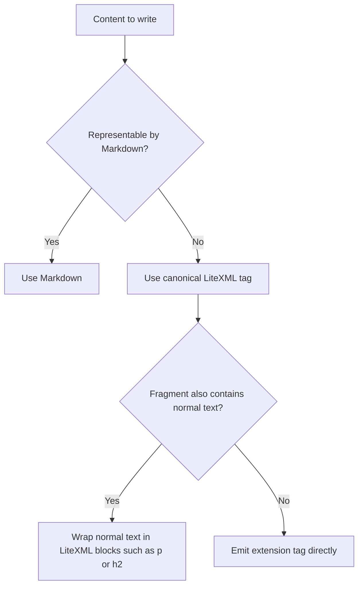

# Markdown Flavor LiteXML

Markdown Flavor LiteXML 是 Haklex 面向 AI Agent 的 Markdown 扩展书写规则。它保留 Markdown 作为普通文本的默认形态；当内容需要表达 Markdown 没有原生语义的 Haklex Node 时，使用 LiteXML tag 描述该节点。

## Authoring Contract

| Situation                                     | Required form                                                                                                                                           |
| --------------------------------------------- | ------------------------------------------------------------------------------------------------------------------------------------------------------- |
| Pure CommonMark content                       | Write normal Markdown.                                                                                                                                  |
| Haklex extension node is required             | Write the canonical LiteXML tag.                                                                                                                        |
| A fragment contains any LiteXML extension tag | Write the whole pasted fragment as LiteXML-compatible text. Do not expect `# heading` or `**bold**` inside that fragment to be interpreted as Markdown. |
| A block node needs stable identity            | Add `id="..."`; it maps to `blockId`.                                                                                                                   |
| A node has no meaningful body                 | Use a self-closing tag.                                                                                                                                 |

## Syntax Rules

- Tag names are lowercase and may contain `-`, for example `<nested-doc>` and `<code-snippet>`.
- Use the canonical tag names only. Do not emit old compact aliases such as `<linkcard>`, `<nesteddoc>`, or `<codesnippet>`.
- Code block uses `<codeblock>`, not `<code-block>`.
- Attribute values must be quoted.
- Text content must escape XML-sensitive characters as needed: `&amp;`, `&lt;`, `&gt;`, `&quot;`.
- Opaque JSON or drawing snapshots should be wrapped in CDATA when used as element body.
- Unknown tags are parsed as passthrough containers; they do not create custom nodes.

## Decision Flow



## Built-In Structural Tags

These tags are available when a LiteXML fragment needs regular document structure around extension nodes.

| Meaning         | LiteXML                                                                     |
| --------------- | --------------------------------------------------------------------------- |
| Paragraph       | `<p>Text</p>`                                                               |
| Heading         | `<h1>Title</h1>` through `<h6>Title</h6>`                                   |
| Quote           | `<blockquote><p>Quoted text</p></blockquote>`                               |
| Horizontal rule | `<hr />`                                                                    |
| Bullet list     | `<ul><li><p>Item</p></li></ul>`                                             |
| Ordered list    | `<ol start="1"><li><p>Item</p></li></ol>`                                   |
| Task list       | `<ul type="check"><li checked="true"><p>Done</p></li></ul>`                 |
| Link            | `<a href="https://example.com">Example</a>`                                 |
| Table           | `<table><tr><th><p>Head</p></th></tr><tr><td><p>Cell</p></td></tr></table>` |
| Line break      | `<br />`                                                                    |

## Inline Formatting Tags

| Format      | LiteXML                                                      |
| ----------- | ------------------------------------------------------------ |
| Bold        | `<b>text</b>` or `<strong>text</strong>`                     |
| Italic      | `<i>text</i>` or `<em>text</em>`                             |
| Strike      | `<s>text</s>`, `<del>text</del>`, or `<strike>text</strike>` |
| Underline   | `<u>text</u>`                                                |
| Inline code | `<code>text</code>`                                          |
| Subscript   | `<sub>text</sub>`                                            |
| Superscript | `<sup>text</sup>`                                            |
| Highlight   | `<mark>text</mark>`                                          |

## Haklex Extension Tags

| Node               | LiteXML rule                                                                                                                                                                                                                                                                             | Example                                                                                                                                                                                |
| ------------------ | ---------------------------------------------------------------------------------------------------------------------------------------------------------------------------------------------------------------------------------------------------------------------------------------- | -------------------------------------------------------------------------------------------------------------------------------------------------------------------------------------- |
| Image              | `` with `src`; optional `alt`, `width`, `height`, `caption`, `thumbhash`, `accent`, mutually exclusive `display-width` (integer 10–100, percent of content column) / `fixed-width` (px) / `fixed-height` (px), `layout` (`align-left`, `align-right`, `float-left`, `float-right`). | ``                                                                                               |
| Video              | `<video>` with `src`; optional `poster`, `width`, `height`.                                                                                                                                                                                                                              | `<video src="/clip.mp4" poster="/thumb.jpg" />`                                                                                                                                        |
| Link card          | `<link-card>` with `url`; optional `source`, `title`, `description`, `favicon`, `image`.                                                                                                                                                                                                 | `<link-card url="https://example.com" title="Example" />`                                                                                                                              |
| Embed              | `<embed>` with `url`; optional `source`.                                                                                                                                                                                                                                                 | `<embed url="https://youtube.com/watch?v=..." source="youtube" />`                                                                                                                     |
| Code block         | `<codeblock>` with optional `lang`.                                                                                                                                                                                                                                                      | `<codeblock lang="ts">const x = 1;</codeblock>`                                                                                                                                        |
| Mermaid            | `<mermaid>` with diagram text.                                                                                                                                                                                                                                                           | `<mermaid>flowchart LR&#10;A --> B</mermaid>`                                                                                                                                          |
| Inline math        | `<math>` without `display="block"`; optional `color`.                                                                                                                                                                                                                                    | `<math>E=mc^2</math>`                                                                                                                                                                  |
| Block math         | `<math display="block">`.                                                                                                                                                                                                                                                                | `<math display="block">\\int_0^1 x^2 dx</math>`                                                                                                                                        |
| Alert quote        | `<alert>` with optional `type`; body is nested LiteXML content.                                                                                                                                                                                                                          | `<alert type="warning"><p>Check this.</p></alert>`                                                                                                                                     |
| Banner             | `<banner>` with optional `type`; body is nested LiteXML content.                                                                                                                                                                                                                         | `<banner type="tip"><p>Tip body.</p></banner>`                                                                                                                                         |
| Nested document    | `<nested-doc>`; body is nested LiteXML content.                                                                                                                                                                                                                                          | `<nested-doc><p>Nested body.</p></nested-doc>`                                                                                                                                         |
| Details            | `<details>` with optional `summary` and `open`.                                                                                                                                                                                                                                          | `<details summary="More" open="true"><p>Body.</p></details>`                                                                                                                           |
| Spoiler            | `<spoiler>` with inline children.                                                                                                                                                                                                                                                        | `<spoiler>Hidden text</spoiler>`                                                                                                                                                       |
| Ruby               | `<ruby>` with `rt` reading.                                                                                                                                                                                                                                                              | `<ruby rt="haklex">Haklex</ruby>`                                                                                                                                                      |
| Mention            | `<mention>` with `platform` and `handle`; body is display name.                                                                                                                                                                                                                          | `<mention platform="github" handle="innei">Innei</mention>`                                                                                                                            |
| Tag                | `<tag>` with text body.                                                                                                                                                                                                                                                                  | `<tag>AI</tag>`                                                                                                                                                                        |
| Comment            | `<comment>` with text body.                                                                                                                                                                                                                                                              | `<comment>Review note</comment>`                                                                                                                                                       |
| Footnote reference | `<footnote>` with `ref`.                                                                                                                                                                                                                                                                 | `<footnote ref="1" />`                                                                                                                                                                 |
| Footnote section   | `<footnote-section>` containing `<def ref="...">`.                                                                                                                                                                                                                                       | `<footnote-section><def ref="1">Definition</def></footnote-section>`                                                                                                                   |
| Gallery            | `<gallery>` with optional `layout`; children are ``.                                                                                                                                                                                                                                | `<gallery layout="grid"></gallery>`                                                                                                                        |
| Excalidraw         | `<excalidraw>` with CDATA snapshot or `snapshot` attribute.                                                                                                                                                                                                                              | `<excalidraw><![CDATA[{"elements":[]}]]></excalidraw>`                                                                                                                                 |
| Dynamic component  | `<dynamic>` with `url`; optional `initial-height`; props JSON in CDATA.                                                                                                                                                                                                                  | `<dynamic url="https://widgets.example.com/quiz@1.0.0.mjs" initial-height="272"><![CDATA[{"question":"..."}]]></dynamic>`                                                              |
| Grid               | `<grid>` with optional `cols` and `gap`; children are `<cell>`.                                                                                                                                                                                                                          | `<grid cols="2" gap="16px"><cell><p>A</p></cell><cell><p>B</p></cell></grid>`                                                                                                          |
| Agent diff         | `<agent-diff>` with optional `op` and `entry`.                                                                                                                                                                                                                                           | `<agent-diff op="insert" entry="diff-1" />`                                                                                                                                            |
| Code snippet       | `<code-snippet>` containing `<file name="..." lang="...">`.                                                                                                                                                                                                                              | `<code-snippet><file name="index.ts" lang="ts">export {}</file></code-snippet>`                                                                                                        |
| Chat               | `<chat>` containing `<participants>` and `<messages>`.                                                                                                                                                                                                                                   | `<chat variant="user-agent"><participants><participant id="u1" kind="user" name="User" /></participants><messages><message id="m1" participant="u1">Hello</message></messages></chat>` |
| Poll               | `<poll>` containing one `<question>` and one or more `<option>`.                                                                                                                                                                                                                         | `<poll mode="single"><question>Pick one</question><option>A</option><option>B</option></poll>`                                                                                         |

## Nested Content Rules

| Parent tag       | Child content rule                                                                             |
| ---------------- | ---------------------------------------------------------------------------------------------- |
| `<alert>`        | Use LiteXML block content, usually `<p>...</p>`.                                               |
| `<banner>`       | Use LiteXML block content, usually `<p>...</p>`.                                               |
| `<nested-doc>`   | Use LiteXML block content. This is the canonical way to create a NestedDoc node.               |
| `<details>`      | Use child nodes directly after the `summary` attribute.                                        |
| `<grid>`         | Use one `<cell>` per grid cell; each cell contains LiteXML block content.                      |
| `<gallery>`      | Use only child `` tags for gallery images.                                                |
| `<code-snippet>` | Use one `<file>` per file. The file body is raw code text.                                     |
| `<chat>`         | Use `<participants>` with `<participant>` children and `<messages>` with `<message>` children. |
| `<poll>`         | Use one `<question>` and multiple `<option>` tags.                                             |

## Canonical Examples

### NestedDoc

```xml
<nested-doc id="doc-section-1">
  <h3>Nested section</h3>
  <p>This content is stored inside a nested document node.</p>
</nested-doc>
```

### Mixed Extension Fragment

```xml
<doc>
  <h2>Research note</h2>
  <p>Use LiteXML blocks when this fragment contains extension nodes.</p>
  <link-card url="https://example.com" title="Reference" />
  <poll mode="multiple" show-results="after-vote">
    <question>Which references are useful?</question>
    <option>Primary source</option>
    <option>Implementation source</option>
  </poll>
</doc>
```

### Code Snippet

```xml
<code-snippet id="snippet-1">
  <file name="index.ts" lang="ts">export const answer = 42;</file>
  <file name="usage.ts" lang="ts">console.log(answer);</file>
</code-snippet>
```

## Import Notes

- The editor detects LiteXML by known tag names in `text/plain` paste content and imports the matching text through the default LiteXML registry.
- Extension nodes must still be registered in the target editor runtime. If a node class is absent, the serialized node cannot be materialized by Lexical.
- `poll-id`, poll option `id`, chat participant `id`, and chat message `id` are optional for fresh content; the importer generates IDs where supported.
