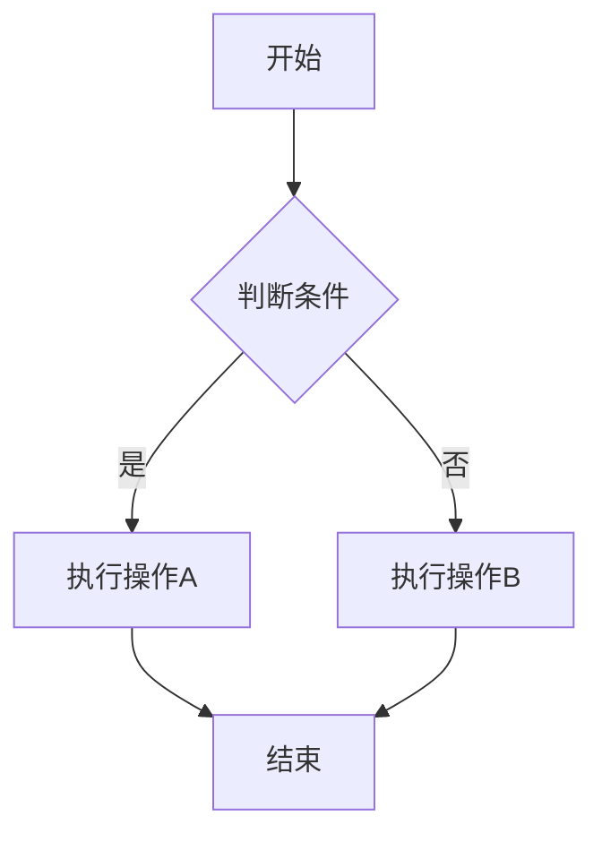
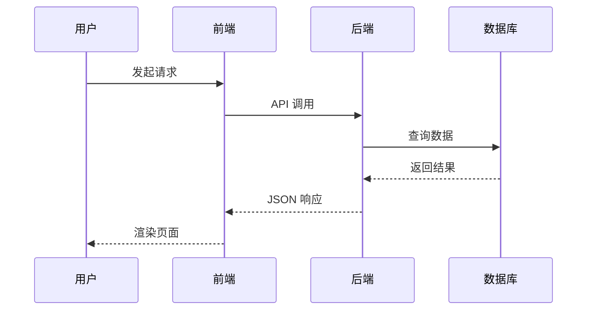
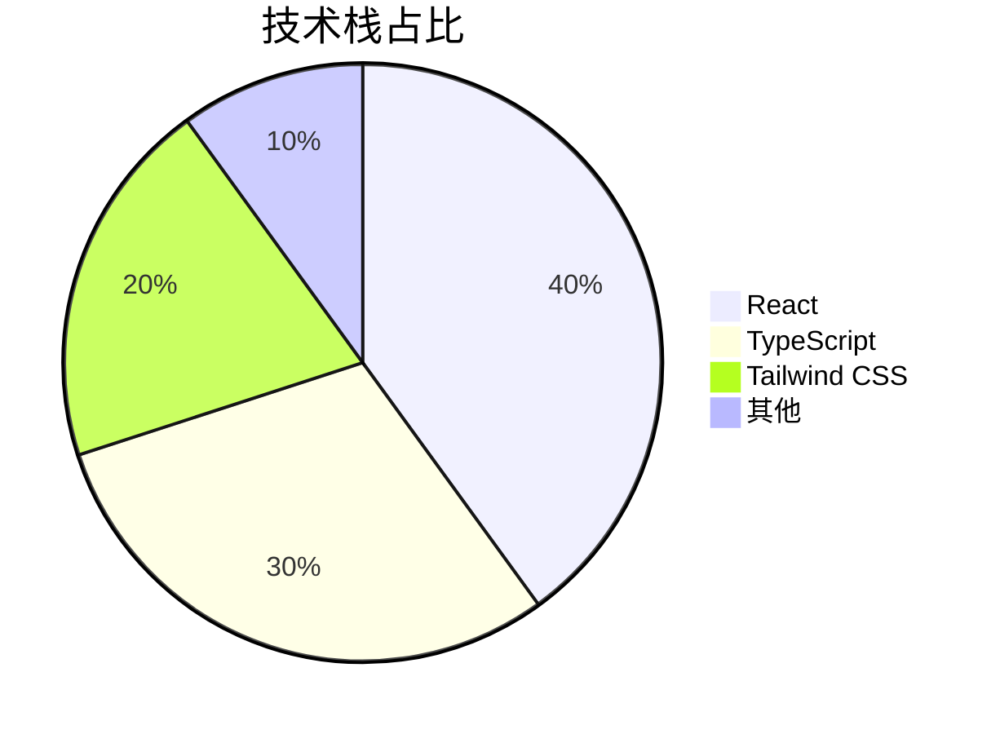
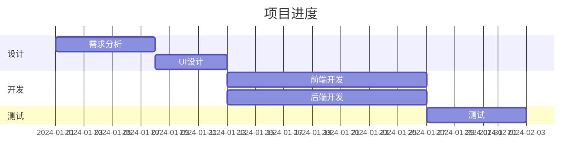

# Shiroi Markdown 渲染测试

## 基础语法

### 标题层级

# 一级标题
## 二级标题
### 三级标题
#### 四级标题
##### 五级标题
###### 六级标题

### 文本样式

这是**粗体文本**，这是*斜体文本*，这是***粗斜体***。

这是~~删除线~~文本。

这是 ==高亮标记== 文本。

这是 ++插入文本++ 效果。

这是 ||剧透文本，鼠标悬停显示|| 效果。

### 引用

> 这是一段引用文本
> 
> 可以有多行

### 分割线

---

***

___

---

## 列表

### 无序列表

- 项目一
  - 子项目 1.1
  - 子项目 1.2
    - 子子项目
- 项目二
- 项目三

### 有序列表

1. 第一步
2. 第二步
   1. 步骤 2.1
   2. 步骤 2.2
3. 第三步

### GFM 任务列表

- [ ] 待办事项 1
- [x] 已完成事项 2
- [ ] 待办事项 3
- [x] 已完成事项 4

---

## 代码

### 行内代码

这是 `inline code` 行内代码示例。

使用 `npm install` 安装依赖。

### 代码块

```javascript
// JavaScript 代码高亮
function greet(name) {
  console.log(`Hello, ${name}!`);
  return {
    message: 'Welcome to Shiroi',
    timestamp: Date.now()
  };
}

greet('World');
```

```typescript
// TypeScript 代码高亮
interface User {
  id: number;
  name: string;
  email?: string;
}

const createUser = (data: Partial<User>): User => ({
  id: Date.now(),
  name: 'Anonymous',
  ...data
});
```

```python
# Python 代码高亮
def fibonacci(n: int) -> list[int]:
    """生成斐波那契数列"""
    if n <= 0:
        return []
    fib = [0, 1]
    for i in range(2, n):
        fib.append(fib[i-1] + fib[i-2])
    return fib[:n]

print(fibonacci(10))
```

```css
/* CSS 代码高亮 */
.container {
  display: flex;
  justify-content: center;
  align-items: center;
  background: linear-gradient(135deg, #667eea 0%, #764ba2 100%);
}
```

```bash
# Shell 命令
npm install
pnpm dev
docker compose up -d
```

```json
{
  "name": "shiroi",
  "version": "1.0.0",
  "dependencies": {
    "next": "^16.0.0",
    "react": "^19.0.0"
  }
}
```

---

## 表格

| 功能 | 支持情况 | 备注 |
|------|:--------:|------|
| Markdown 基础语法 | ✓ | 完全支持 |
| GFM 扩展 | ✓ | 任务列表、表格等 |
| 数学公式 | ✓ | KaTeX 渲染 |
| 代码高亮 | ✓ | Shiki 引擎 |
| 自定义组件 | ✓ | React 组件嵌入 |

| 左对齐 | 居中对齐 | 右对齐 |
|:-------|:--------:|-------:|
| 内容 | 内容 | 内容 |
| 较长的内容 | 较长的内容 | 较长的内容 |

---

## 数学公式 (KaTeX)

### 行内公式

爱因斯坦质能方程 $ E = mc^2 $ 是物理学中最著名的公式。

勾股定理表示为 $ c = \pm\sqrt{a^2 + b^2} $ 。

二次方程求根公式是 $ x = \frac{-b \pm \sqrt{b^2-4ac}}{2a} $ 。

也可以不带空格：勾股定理 $c = \pm\sqrt{a^2 + b^2}$ 和多项式 $P(x) = a_nx^n+a_{n-1}x^{n-1} + \dots + a_1x + a_0$ 。

### 块级公式

$$
\int_{-\infty}^{\infty} e^{-x^2} dx = \sqrt{\pi}
$$

$$
P(x) = a_nx^n + a_{n-1}x^{n-1} + \dots + a_1x + a_0
$$

$$
\sum_{i=1}^{n} i = \frac{n(n+1)}{2}
$$

$$
\begin{pmatrix}
a & b \\
c & d
\end{pmatrix}
\begin{pmatrix}
x \\
y
\end{pmatrix}
=
\begin{pmatrix}
ax + by \\
cx + dy
\end{pmatrix}
$$

---

## 图片

### 基础图片


### 带标题的图片


---

## 链接

### 普通链接

[访问 GitHub](https://github.com)

[Shiroi 项目](https://github.com/Innei/Shiro)

### 自动链接

<https://github.com/Innei>

https://github.com/Innei/Shiro

---

## 富链接卡片 (自动解析)

### GitHub 仓库

https://github.com/Innei/Shiro

### GitHub Commit

https://github.com/vuejs/vitepress/commit/71eb11f72e60706a546b756dc3fd72d06e2ae4e2

### GitHub PR

https://github.com/Innei/Shiro/pull/129

### GitHub 文件预览

https://github.com/Innei/Shiro/blob/108d4c3e927e1c9c9304e41a0631f91958477d9f/src/providers/root/modal-stack-provider.tsx

### Twitter/X

https://twitter.com/zhizijun/status/1649822091234148352

### YouTube

https://www.youtube.com/watch?v=N93cTbtLCIM

### GitHub Gist

https://gist.github.com/Innei/94b3e8f078d29e1820813a24a3d8b04e

### CodeSandbox

https://codesandbox.io/s/framer-motion-layoutroot-prop-forked-p39g96

### 站内文章链接

如果链接指向本站的文章，会自动渲染为卡片形式：

https://www.lxink.cn/posts/share/seedflow

---

## LinkCard 组件

<LinkCard source="gh" id="mx-space/core">

<LinkCard source="gh" id="Innei/Shiro">

<LinkCard source="gh-commit" id="mx-space/kami/commit/e1eee4136c21ab03ab5690e17025777984c362a0">

---

## 更多 LinkCard 类型

### Arxiv 论文

https://arxiv.org/abs/2309.16889

### Bangumi 番剧

https://bgm.tv/subject/424883

### LeetCode 题目

https://leetcode.cn/problems/two-sum

### 网易云音乐

https://music.163.com/#/song?id=1901371647

### QQ 音乐

https://y.qq.com/n/ryqq/songDetail/003aAYrm3GE0Ac

### Bilibili 视频

https://www.bilibili.com/video/BV1GJ411x7h7

### TMDB 影视 (需开启功能)

https://www.themoviedb.org/movie/550-fight-club

---

## @ 提及

[Innei]{GH@Innei}

[52Lxcloud]{TG@52Lxcloud}

支持的平台：
- GitHub: `{GH@用户名}`
- Twitter: `{TW@用户名}`  
- Telegram: `{TG@用户名}`

---

## GitHub 风格 Alerts

> [!NOTE]
> 这是一条提示信息，用户在浏览内容时应该了解的有用信息。

<div />

> [!TIP]
> 这是一条小技巧，帮助用户更好或更轻松地完成任务。

<div />

> [!IMPORTANT]
> 这是重要信息，用户需要了解才能实现目标。

<div />

> [!WARNING]
> 这是警告信息，需要用户立即注意以避免问题。

<div />

> [!CAUTION]
> 这是危险提示，告知用户某些操作的风险或负面后果。

---

## Container 容器语法

### Banner 提示框

::: info
这是一条信息提示，使用 `info` 类型。
:::

::: success
操作成功！这是一条成功提示。
:::

::: warning
请注意！这是一条警告提示。
:::

::: error
出错了！这是一条错误提示。
:::

::: note
这是一条笔记/备注信息。
:::

### 自定义 Banner

::: banner {warn}
这是使用 banner 语法的警告框，支持 **Markdown** 格式。
:::

::: banner {success}
恭喜你完成了所有步骤！
:::

---

## 图片画廊

::: gallery


:::

---

## Grid 网格布局

### 普通网格

::: grid {cols=3,gap=8}

**卡片一**

这是第一个网格项

**卡片二**

这是第二个网格项

**卡片三**

这是第三个网格项

:::

### 图片网格

::: grid {cols=2,rows=2,gap=8,type=images}


:::

### 3x3 图片网格

::: grid {cols=3,rows=3,gap=4,type=images}


:::

---

## Masonry 瀑布流

::: masonry {gap=8}


:::

---

## Tabs 标签页

<Tabs>
<tab label="JavaScript">

```javascript
console.log('Hello from JavaScript!');
const sum = (a, b) => a + b;
```

</tab>
<tab label="Python">

```python
print('Hello from Python!')
def sum(a, b):
    return a + b
```

</tab>
<tab label="Rust">

```rust
fn main() {
    println!("Hello from Rust!");
}

fn sum(a: i32, b: i32) -> i32 {
    a + b
}
```

</tab>
</Tabs>

---

## 折叠内容 (Details)

<details>
<summary>点击展开查看更多内容</summary>

这里是被折叠的内容。

可以包含任何 Markdown 格式：

- 列表项 1
- 列表项 2

```javascript
console.log('折叠内容中的代码');
```

</details>

<details>
<summary>另一个折叠块</summary>

| 表头1 | 表头2 |
|-------|-------|
| 内容1 | 内容2 |

</details>

---

## 视频嵌入

<video src="https://xcimg.szwego.com/pvod/f71fe4b2/124790f5-c9f8-4123-a94e-a5ea7034fc26.mp4" />

---

## Mermaid 图表









---

## Excalidraw 手绘图

```excalidraw
{"type":"excalidraw/clipboard","elements":[{"type":"rectangle","version":14,"versionNonce":1361369853,"isDeleted":false,"id":"_PSpf6pLwkWIJubC_tf9D","fillStyle":"solid","strokeWidth":2,"strokeStyle":"solid","roughness":1,"opacity":100,"angle":0,"x":545.0390625,"y":387.296875,"strokeColor":"#1e1e1e","backgroundColor":"transparent","width":177.53515625,"height":138.328125,"seed":1495751197,"groupIds":[],"frameId":null,"roundness":{"type":3},"boundElements":[],"updated":1706954302946,"link":null,"locked":false}],"files":{}}
```

---

## 远程 React 组件

```component
import=https://cdn.jsdelivr.net/npm/@innei/react-cdn-components@0.0.7/dist/components/Firework.js
name=MDX.Firework
height=25
```

### 带 Shadow DOM 的组件
#### 部分原因已注释预览
<!-- Shadow DOM 组件会尝试读取跨域 CSS 的 cssRules，导致控制台报错
```component shadow with-styles
import=https://cdn.jsdelivr.net/npm/@innei/react-cdn-components@0.0.33/dist/components/ShadowDOMTest.js
name=MDX.ShadowDOMTest
height=100
``` -->

---

## 脚注

这是一段带有脚注的文本[^1]，还有另一个脚注[^2]。

[^1]: 这是第一个脚注的内容。
[^2]: 这是第二个脚注的内容，可以包含更多信息。

---

## HTML 标签支持

<kbd>Ctrl</kbd> + <kbd>C</kbd> 复制

<kbd>Ctrl</kbd> + <kbd>V</kbd> 粘贴

<mark>这是使用 HTML mark 标签的高亮</mark>

<abbr title="Hyper Text Markup Language">HTML</abbr> 是一种标记语言。

<ins>这是插入的文本</ins>

<del>这是删除的文本</del>

<small>这是小号文本</small>

<sup>上标文本</sup> 和 <sub>下标文本</sub>

---

## Tag 标签

<tag>标签1</tag>
<tag>标签2</tag>
<tag>React</tag>
<tag>TypeScript</tag>

---

## 特殊字符转义

\*这不是斜体\*

\`这不是代码\`

\[这不是链接\](url)

---

## 总结

以上就是 Shiroi 博客系统支持的所有 Markdown 渲染功能测试。包括：

1. 基础 Markdown 语法（标题、粗体、斜体、删除线）
2. GFM 扩展（表格、任务列表）
3. 代码高亮（Shiki 引擎，支持多种语言）
4. 数学公式（KaTeX，行内和块级）
5. 图片与画廊（Gallery、Grid、Masonry）
6. 富链接卡片自动解析：
   - GitHub 仓库/Commit/PR/文件预览
   - Twitter/X 推文嵌入
   - YouTube 视频嵌入
   - GitHub Gist 嵌入
   - CodeSandbox 嵌入
   - Bilibili 视频嵌入
   - Arxiv 论文
   - Bangumi 番剧
   - LeetCode 题目
   - 网易云/QQ 音乐
   - TMDB 影视
   - 站内文章
7. LinkCard 组件（手动指定类型）
8. Container 容器（Banner、Grid、Gallery、Masonry）
9. Tabs 标签页
10. 折叠内容（Details）
11. Mermaid 图表（流程图、时序图、饼图、甘特图）
12. Excalidraw 手绘图
13. 远程 React 组件嵌入
14. GitHub 风格 Alerts（NOTE、TIP、IMPORTANT、WARNING、CAUTION）
15. @ 提及（GitHub/Twitter/Telegram）
16. 剧透文本（||spoiler||）
17. 高亮标记（==mark==）
18. 插入文本（++insert++）
19. 脚注
20. 视频嵌入
21. HTML 标签支持（kbd、sup、sub、mark、abbr 等）
22. Tag 标签组件

---

*最后更新：2026-01-11*